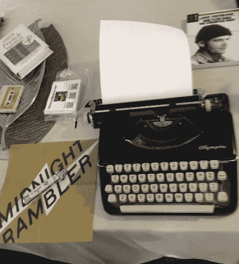

# 做一个音乐家兼作家真他妈的糟糕，所以我要去学 JavaScript

> 原文：<https://medium.com/hackernoon/being-a-musician-writer-fucking-sucks-so-im-going-to-learn-javascript-8e02ed2cf382>

坐下，系好安全带，学点东西。

# 高中 C++

这位老师是一名足球蔻驰，拥有数学博士学位，在我所在的高中管理计算机系，在我们上 C++编程课的第一天，他大声提出了挑战，用的是 Borland，我很确定:

> **如果你能在图形模式下获得文本字符输入，你在这门课上就会自动获得 A，因为没有交叉。**

几乎是一个完美的挑战，因为把它放在那里会让像我、西福蒂和威尔逊这样的人有兴趣更加努力地学习，看看这是否可能。图形模式是第八章左右。一年前，我和另一位老师从 QBASIC 来到这里，带着满满的干劲，我、西福蒂和威尔逊挤在一旁。我们能成功吗？呃，也许吧。

在我们三个人之间，我们找到了将文本输入到图形模式的途径。这本身就是一个项目。我不认为 Shifty 或 Wilson 会反对，但这是我的想法，我们可以编程一个[刽子手](https://en.wikipedia.org/wiki/Hangman_(game))的游戏，并在屏幕的右上角使用一个映射的键盘，这样一个人可以用鼠标在映射的区域点击一个字母——因为键盘在图形模式下不做输入，这是老师赌博无法克服的。我们做到了。给他看，让他做压力测试。

看着一个非常成功的人信口开河，不得不自食其果，我知道这也会发生在我身上。我的吉他技术是一流的，我可以像第二天性一样在键盘上流动。所有这些天赋都让我在宏大的计划中一事无成。2 张专辑，10 个 EPs，4 个故事片和 2 个电视试播剧本。所有这些工作，大部分都需要改进才能商业化…而我又在哪里结束了呢？

F ***说到收回时间就像金钱一样无处可去。***

# 推荐 JavaScript

在与一些严肃的评论家朋友交谈后，他们重新点燃了我的理解，即代码和软件设计是一项非常有创造性的工作。他们非常同情我对音乐和写作的热情，但能看到我脸上被击败的皱纹。对话的结果是利用我的创作冲动，我对制作和建造东西的热爱作为学习 JavaScript 的脚手架。

这是一种被推荐的语言，因为它可以在移动设备、网络应用程序上工作，并为承包工作打开了大门。所以，是的，在我的世界里，成为一名音乐家和作家是一件艰难的事情——付出努力，为某件事努力，没有遗憾。意识到将软件开发作为一个全新的可能性领域是非常愚蠢的。我想和约翰·卡马克一起工作。我必须从某个地方开始。

> [黑客中午](http://bit.ly/Hackernoon)是黑客如何开始他们的下午。我们是 [@AMI](http://bit.ly/atAMIatAMI) 家庭的一员。我们现在[接受投稿](http://bit.ly/hackernoonsubmission)，并乐意[讨论广告&赞助](mailto:partners@amipublications.com)机会。
> 
> 如果你喜欢这个故事，我们推荐你阅读我们的[最新科技故事](http://bit.ly/hackernoonlatestt)和[趋势科技故事](https://hackernoon.com/trending)。直到下一次，不要把世界的现实想当然！

