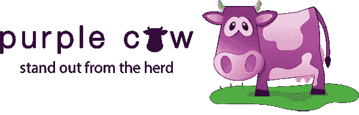

# 如何脱颖而出

> 原文：<https://medium.com/hackernoon/being-safe-gets-you-less-dates-and-less-success-in-general-b80373c32b92>

[Image from here](https://www.pexels.com/photo/adult-art-conceptual-dark-278312/)

## 为什么安全是你为个人成功所能做的最糟糕的事情

## “死亡一千迈”

这段引文来自 OkCupid 的联合创始人克里斯蒂安·鲁德尔所著的《数据时代》一书中的一个章节标题。这些书是关于他从交友网站上收集的有见地的数据。在那一章中，他描述了在约会世界中，大胆比安全更好。

除了约会，安全对于商业和产品来说也是一个糟糕的策略。

这个故事中的所有例子都会引出一个观点。

本质上，在我们当前的世界中，有太多的选择。靠安全并试图吸引尽可能多的人是不可能成功的。

要想获得成功，最好是脱颖而出，吸引一小群忠实的观众。

## 案例一

安全让你约会更少

OkCupid 的网站曾经有一个 5 星的评级系统。在那一章中，他分析了拥有大约 3 颗星评级的女性收到的信息。换句话说，他分析了处于“平均”位置的女性收到的信息。

这一组女性的不同之处在于她们评分的差异。

假设有 100 个人投票。如果 100 个男人都给了一个女人 3 分，那么这个女人可以得到 3 分。如果 50 个男人给她 1 分，而另外 50 个给她 5 分，她也可以得到 3 分。有 50 个 1 和 50 个 5 的女人比有 100 个 3 的女人有更高的方差。

你认为哪个女人(一个有 100 张 3 的还是一个有 50 张 1 和 50 张 5 的)收到的信息更多？

OkCupid 的数据显示，方差与收到的消息数高度相关。因此，对于相同外表吸引力的女性来说，两极分化的人更受关注。

高度两极分化会让你得到更多的信息；事实上，**比**多 70%。

**这意味着，一个评价很低、方差很大的女性(第 20 百分位)和一个方差很小的女性(第 70 百分位)被搭讪的几率差不多。**

换句话说，拥有一种出众的品质比平庸和安全要好。是的，有些人可能会看着你的约会资料说“绝对不会”，但是会有其他人给你完全相同的质量打 5 分。不要害怕做你勇敢无畏的自己。

> “做你自己，勇敢面对。”-克里斯蒂娜·鲁德尔，数据分析。

或者，正如塞思·戈丁所说，不要害怕成为**“紫牛”**

塞思·戈丁是他的畅销书《紫牛》的作者。这本书主要是关于企业或产品的营销。然而，这些经验也可以应用到生活的方方面面。

[Image from here](http://www.purplecowagency.com/wp-content/uploads/2014/01/purple-cow-logo.png)

在他的书中，他描述了在这个后电视和后大众营销时代，获得成功的唯一途径是卓越，即成为一只紫色的牛。

不是每个人都喜欢紫牛，有些人会觉得它令人厌恶。然而，紫色的牛比棕色的牛有更好的机会被注意和被关注。

> 做一头棕色的牛是安全的，它不会让你有任何进展。

## 案例二

*安全让你的顾客更少*

《紫色奶牛》包含了许多成功培育出紫色奶牛并获得巨大成功的案例研究。一个例子是 T4 芯片康利 T5。

奇普·康利是一位美国酒店经营者和企业家。他的第一家酒店位于旧金山的田德隆区。对于不熟悉的人来说，田德隆是旧金山最糟糕的街区。

他是如何让他的第一家酒店凤凰酒店成功的？

他重新设计了它，使之具有时髦和时髦的氛围。他邀请崭露头角的摇滚明星留下来。他的计划成功了，他创造了一些非凡的东西:*“旧金山市中心的一家摇滚汽车旅馆。”*

我最近在巴塞罗那度假。打开谷歌地图，寻找酒店，至少可以说是势不可挡。附近有几十家，价格也在我们想要的范围内。他们看起来都很体面。

我和男朋友最终选择了酒店 Praktik 面包店，因为它在酒店内部有一家面包店。这是我们选择它而不是附近其他酒店的唯一原因。(我们都有吃货)。

Praktik 面包房酒店创造了一头紫色的奶牛。任何被糕点吸引的人都会自然而然地被它吸引。

## 其他示例

西南航空、星巴克、宜家和塔吉特都是通过与众不同获得成功的成功公司的例子:通过创造一只紫色的奶牛。

西南航空和宜家通过在定价方面击败竞争对手，创造了一只紫色的牛。他们重新定义了游戏规则。

塔吉特和星巴克设计他们的策略是为了迎合专业人士:有多余可支配收入的人。

说到底，平安就等于平凡。如果你很平凡，你就不平凡；你并不出众。如果你不出众，你将一事无成。无论产品是你自己(比如约会)还是你的公司，都是如此。

> 记住，最好有很多“是”,很多“否”,但很少“咩”。

# 如果你喜欢这个故事，给我一些掌声！:)