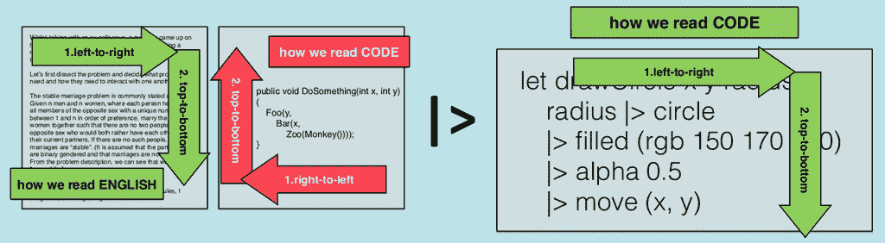
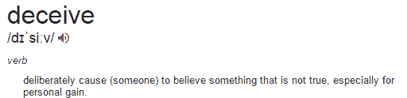
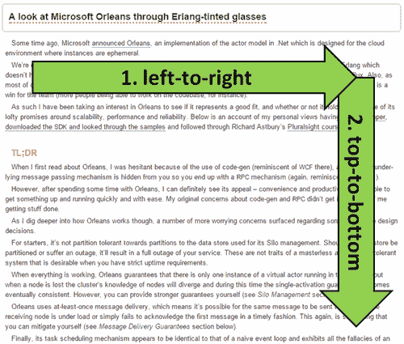
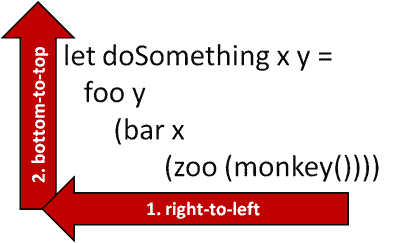
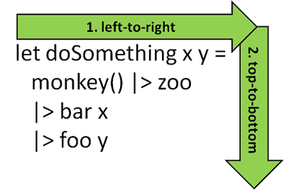

# 用 F#在视觉上诚实

> 原文：<https://medium.com/hackernoon/being-visually-honest-with-f-d22208bda3c>

## F#的 pipes 操作器为什么这么牛逼



在 2014 年的 Build Stuff 上， [Kevlin Henney](https://twitter.com/KevlinHenney) 在他的[“许多程序员的七个无效编码习惯”](http://buildstuff14.sched.org/event/2fd0c626d039b5298e119141bead7153#.VIPO-ousV8E)演讲中，描述了在代码中缺乏**视觉诚实**的情况，例如:

```
public int howNotToLayoutMethodHeader(int firstArgument,
    string secondArgument)
```

关于视觉诚实的含义，他引用了丹尼尔·希金博瑟姆优秀的[Clean Up Your mass](http://www.visualmess.com/)网站上的一些话:

> *回答“什么是干净的设计？”最简洁地说:一个干净的设计是一个支持视觉思维的设计，因此人们可以用最少的有意识的努力来满足他们的信息需求*
> 
> 你通过安排设计元素的相互关系来传达信息。查看你的设计的人会立刻理解这些信息，即使不是有意识的
> 
> 如果视觉关系明显而准确，这很好，但如果不是这样，你的观众会感到困惑。他们必须仔细检查你的作品，在不同的部分之间来来回回，以确保他们理解。

这些引语谈论的是信息的布局，以便它们的视觉关系是明显和准确的。

所以如果你用这样一种方式来布局你的方法参数，它们的视觉关系是不准确的，而且你是有目的地这么做的，那么你实际上是不诚实的。



我坐在那里，终于明白了为什么 [F# pipes](http://theburningmonk.com/2011/09/fsharp-pipe-forward-and-pipe-backward/) 这么牛逼。我一直知道它会使代码更干净、更可读，这很直观，但我一直无法找到合适的词来解释为什么——能够用最少的有意识的努力来理解一些东西的麻烦在于，你的有意识的头脑无法解释它是如何理解它的。

不再是了，现在我终于明白了。

当我们阅读一篇普通的英语文章时，我们从左到右，然后从上到下阅读。这种惯例控制着我们阅读时接收到的信息流，所以当我们为人们展示信息时，我们按照从左到右，然后从上到下的顺序展示。



但是代码呢？

当涉及到编写嵌套函数调用时，不知何故这种信息流被颠倒了！



借助 F#的管道(顺便说一下，Elm 和 Elixir 都采用了这种管道)，我们终于设法恢复了一些理智，并以一种与我们消费任何其他文本信息的方式相匹配的方式呈现了函数调用序列。



就在你眼前的视觉诚实！

## 链接

*   [收拾残局——每个人的视觉设计指南](http://www.visualmess.com/)
*   【2014 年 NDC 奥斯陆—主题演讲“这是一个写/读网络”的要点
*   【2014 年 NDC 奥斯陆——从“开发者思维的职业重启”中获得的启示
*   【Theo Schlossnagle 关于可扩展互联网架构的演讲要点
*   [摘自 Hewitt、Meijer 和 Szyperski 关于演员模型的谈话](http://theburningmonk.com/2012/09/takeaways-from-hewitt-meijer-and-szyperskis-talk-on-the-actor-model/)
*   [Gael Fraiteur 多线程演讲的要点](http://theburningmonk.com/2012/06/takeaways-from-gael-fraiteurs-multithreading-talk/)

[](http://bit.ly/HackernoonFB)[](https://goo.gl/k7XYbx)[](https://goo.gl/4ofytp)

> [黑客中午](http://bit.ly/Hackernoon)是黑客如何开始他们的下午。我们是 AMI 家庭的一员。我们现在[接受投稿](http://bit.ly/hackernoonsubmission)并乐意[讨论广告&赞助](mailto:partners@amipublications.com)机会。
> 
> 如果你喜欢这个故事，我们推荐你阅读我们的[最新科技故事](http://bit.ly/hackernoonlatestt)和[趋势科技故事](https://hackernoon.com/trending)。直到下一次，不要把世界的现实想当然！

