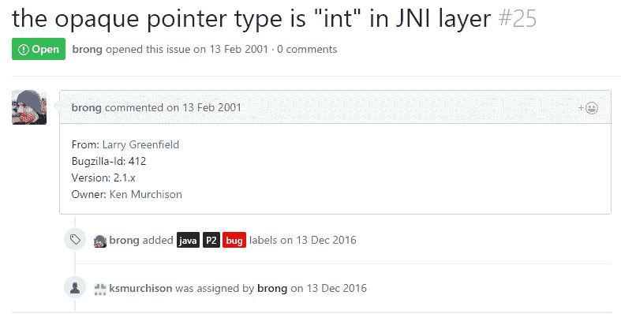
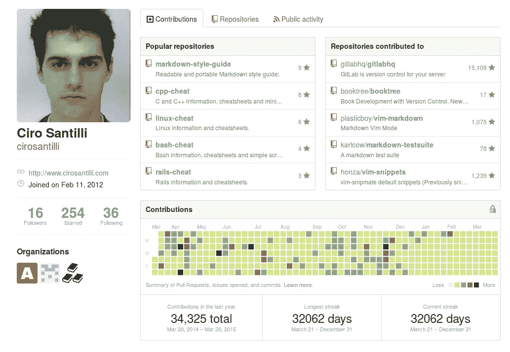
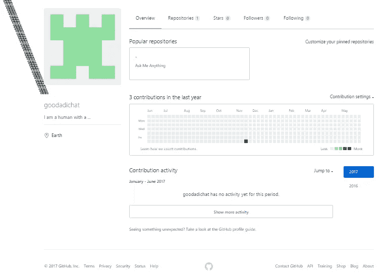
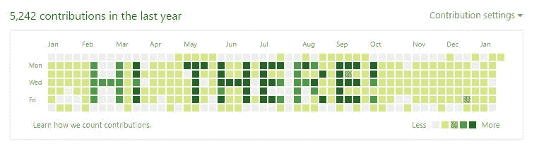

# 信不信由你:GitHub 版

> 原文：<https://medium.com/hackernoon/believe-it-or-not-github-edition-90e61a1bdf4b>

在协作社交网络上进行开发，比如 [GitHub](https://hackernoon.com/tagged/github) 可能很有成效，但同时也可能很神秘。以下是一些关于 GitHub 的有趣事实。

# 在使用 12 年 Git 的 9 年 GitHub 中发现 16 年前的问题。

发现了一个甚至在 GitHub 建立或 Git 发布之前就已经形成的问题。看一看这里的

> “听起来像我和我爸的关系。”Reddit 上的 Xirious

[](https://github.com/AdiChat/Repository-Hunter)

16 year-old issue

# 一个在 GitHub 上连续作案 100 年的人。

Ciro Santilli，一个谦逊的人，已经在 GitHub 上坚持了 100 多年。不幸的是，他的贡献没有被其他人很好地理解，GitHub 决定隐藏他的贡献。看看他的简介[这里](https://github.com/cirosantilli)

[](https://github.com/AdiChat/Repository-Hunter)

Committing for over 100 years

> 在 Ciro Santilli [这里](https://stackoverflow.com/questions/20099235/who-is-the-user-with-the-longest-streak-on-github/27742165#27742165)了解更多关于这方面的信息。

# 您可以让 Linus Torvalds 提交到您的 GitHub 存储库

一般来说，你可以代表任何人做出承诺，并把它视为对名誉的要求。

诀窍是把你的 git `user.email`改成与你想承诺的那个人的 GitHub 账户关联的同一封邮件。

尝试以下命令:

```
git config — global user.email “*human@youlike.com*”
```

接下来，试着从你的终端在 GitHub 上推送一个 commit，然后尽情享受吧！

看看为什么 Linus Torvalds 不在 GitHub 上提交[这里](https://github.com/torvalds/linux/pull/17)

# 一个丢失了 GitHub 贡献图的人。

西罗·桑蒂利丢失了他的贡献图。看看他神秘的个人资料[这里](https://github.com/cirosantilli)
幸运的是，你可以看看现在使用[资源库猎人](https://github.com/AdiChat/Repository-Hunter/wiki/GitHub-Contribution-graph)的这个特性，他的图形会是什么样子。

[](https://github.com/AdiChat/Repository-Hunter)

Can you help find his graph?

# 无限垂直延伸的用户名。

用户名也可以垂直无限延伸。看看他神秘的简介[这里](https://github.com/goodadichat)

[](https://github.com/AdiChat/Repository-Hunter)

He/ She, certainly, has a tall name.

# 你可以在你出生前的某一天做出承诺！

尝试以下命令:`git commit --date="Sat Jan 01 10:00 2000 +0100"`提交日期为 2000 年 1 月 1 日的数据。

# **GitHub 贡献图中的模式**

通常，你会在贡献图中发现美丽的图案，这似乎是坚持不懈努力的结果。事实上，由于上述事实，它可以通过自动化生产。



“Hi there”

# GitHub，Inc .最初被称为 Logical Awesome LLC

查看目前的逻辑真棒有限责任公司网站[这里](http://logicalawesome.com/)

[](https://github.com/AdiChat/Repository-Hunter)

Logical Awesome LLC

> 在 GitHub 的[资源库猎人](https://github.com/AdiChat/Repository-Hunter)上还有很多其他有趣的事实。
> 
> 事实上，GitHub 是一个神秘的网络。

[](http://bit.ly/HackernoonFB)[](https://goo.gl/k7XYbx)[](https://goo.gl/4ofytp)

> [黑客中午](http://bit.ly/Hackernoon)是黑客如何开始他们的下午。我们是 [@AMI](http://bit.ly/atAMIatAMI) 家庭的一员。我们现在[接受投稿](http://bit.ly/hackernoonsubmission)并乐意[讨论广告&赞助](mailto:partners@amipublications.com)机会。
> 
> 如果你喜欢这个故事，我们推荐你阅读我们的[最新科技故事](http://bit.ly/hackernoonlatestt)和[趋势科技故事](https://hackernoon.com/trending)。直到下一次，不要把世界的现实想当然！

