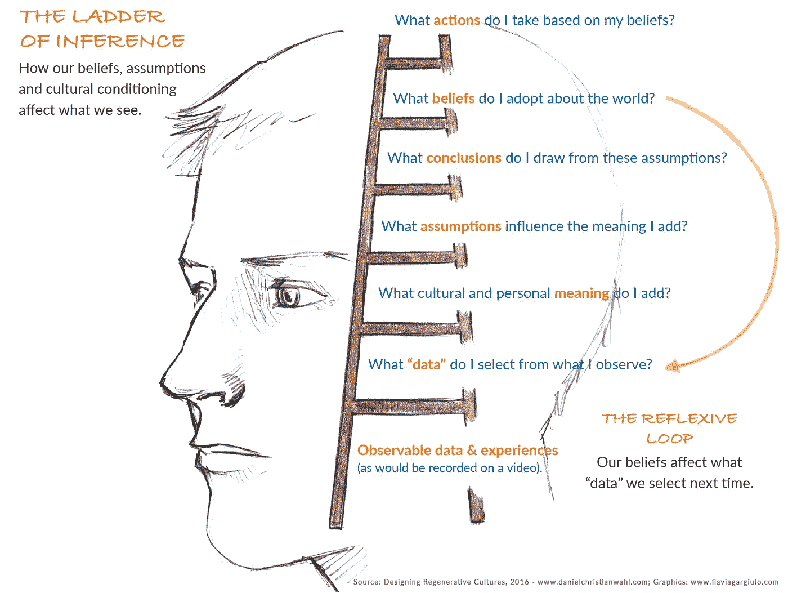

# 眼见为实，眼见为实

> 原文：<https://medium.com/hackernoon/believing-is-seeing-and-seeing-is-believing-cb1e116cbe0e>

在任何让我们学会如何以不同的方式思考的过程中，关键的第一步是从质疑我们自己的假设和我们使用的心理模型开始。

我们认为什么是理所当然的？

**为了得出我们的结论，我们在解释什么“事实”,为什么？**

**我们使用的心智模型和隐喻是如何影响我们对所面临情况的理解的？**

大多数人认为感知是睁开眼睛看到外面的世界的简单行为——一个由清晰可见的事实组成的世界，这些事实构成了“现实”。事实并非如此。神经科学家和量子物理学家一致认为，每一个感知行为也包含一个概念行为。观察者和他或她的观察方法会影响被观察的事物。现实以不同的方式出现，这取决于我们采用的思维方式和观察方式，以及我们用来理解我们所观察到的事物的思维模式。

想象一下，你是一名人类学家，遇到了一个隐藏在世界偏远角落的部落，遇到了迄今为止还没有接触过现代化的人。部落成员不会看到你携带的设备，如你的相机、手机或你可能戴的眼镜，就像你或我会看到这些物品一样。例如，眼镜可能只是“坐在你鼻子上的奇怪的东西”。它们可能被解释为一种装饰品，表明你在部落中的社会地位。

我们使用的词汇、心智模型和世界观充当着“组织思想”的角色，帮助我们构建我们所看到和关注的东西。这些心智模型塑造了我们看待系统和过程的方式。我们经常把地图和领土搞混。甚至系统视图本身也只是一张地图——一种根据我们如何定义“有问题的系统”来更清楚地查看关系和交互的方式。在现实世界中，一切事物都是相互联系和相互作用的，边界消失在相遇和交换的地方，就像从另一个方面分离出改造整体的一个方面一样联合起来。

我们大多数人都会遇到这样的情况，我们发现自己在如何评估特定情况或解释他人的特定反应方面与他人意见不一。如果你花时间去关注并明确人们在解释给定情况的过程中所应用的基本假设和心理模型，这样的冲突可以更容易地解决。至少，我们可以“求同存异”,接受不同的观点或解释，这取决于我们用来解释特定情况的核心信念、世界观和价值体系。在[第二章](/@designforsustainability/the-three-horizons-of-innovation-and-culture-change-d9681b0e0b0f)中介绍的[三个地平线](/@designforsustainability/the-three-horizons-of-innovation-and-culture-change-d9681b0e0b0f)方法提供了一种做这件事的方法。

许多调解和调解冲突的过程都是基于减缓我们从观察跳到解释和结论的过程，使我们意识到，即使在最初的观察中，我们已经对我们选择注意的东西有所选择。这种选择受到我们主导的世界观的影响，也就是我们生活的叙事。

像非暴力沟通这样的调解技巧会让冲突双方回到他们所观察到的，他们的感受，以及他们对当前情况的需求。如果我们能够让人们首先就某一特定情况下的某种程度的“共识现实”达成一致，那么让他们意识到自己的核心信念和假设，以及这些信念和假设如何引导他们以不同的方式解释或判断这种情况，就会容易得多。

能够质疑我们自己的假设，并关注我们如何思考和解释情况，对于任何处于领导地位的人，以及任何希望共同创造再生文化的人来说，都是一项至关重要的技能。

推理的*阶梯*是一个模型，它让我们关注我们如何思考，如何创造和强化假设和信念。该模型由哈佛大学教授克瑞斯·阿吉里斯首先提出，它强调了我们将对给定情况的评估与该情况的假设“事实”相混淆的倾向。该模型说明了我们的假设如何塑造我们看待世界的方式，以及我们如何根据我们的假设得出关于特定情况的结论。图 5 说明了信念和假设是如何对我们选择关注的事物产生重要影响的。它提供了一系列问题，我们可以问自己，以更好地意识到这一过程。

Figure 5: The Ladder of Inference [This is an excerpt of a subchapter from [Designing Regenerative Cultures](http://www.triarchypress.net/designing-regenerative-cultures.html),published by Triarchy Press, 2016.]

*推理阶梯*以一种简化的方式解释了我们从眼前可观察到的事实中选择某些数据。然后，我们给这些经历赋予意义，这反过来影响我们做出的假设，以及我们如何得出某些结论，这些结论塑造了我们对世界的信念。这些信念指导我们如何应对世界上的情况和行动。最重要的是，推理的阶梯强调了存在一个经常被忽视的“反身循环”，通过这个循环，我们基于过去的经验和文化条件形成的信念实际上影响了我们首先选择关注的事实。我们占主导地位的信仰体系和世界观严重影响着我们选择忽略哪些替代的——可能是重要的——事实或解释。

通过更多地意识到我们在阶梯上所走的不同步骤，我们可以质疑自己和他人的假设、结论和信念。这里有一个问题列表，可以用来引导个人或团体通过他们自己的推理过程并达成行动建议。他们邀请我们将“推理阶梯”应用于我们自己和他人的观点:

**我的推理基于哪些可观察到的事实和经验，还有其他事实需要考虑吗？**

**为什么我选择了某些数据，却认为其他数据不太相关？**

我采用的基本假设是什么，它们有效吗？(我基于什么基本假设来判断它们的有效性？)

**什么样的信念支撑着我的观点，这些信念如何影响我的观察和数据选择？**

**我为什么提议遵循这一行动方案，我们应该/可以考虑哪些替代方案或补充行动？**

在一个面临分歧的群体中经历这样一个有意识地质疑不同观点的过程可能不会完全解决冲突，但它肯定会有助于更好地理解不同的观点。这种对多种观点的进一步理解可以帮助我们对问题形成更系统的理解，这反过来可能提供一个机会来发现共同点(共同的需求、价值观和信仰)，这可以帮助我们以更具包容性和参与性的方式在这些问题上取得进展。面对未知和不确定性，它可能会帮助我们更明智地行动。

在我自己促进和参与这种“更深入的提问”过程的经验中，简单地提出这种问题来弄清楚不同的观点和假设可以帮助我们打开一个通向解决最初被认为是不可调和的冲突的大门。它允许人们在包括多个“问题”的更广阔的整体系统视角的背景下看到他们自己的“问题”。仅仅是被倾听、被重视和被认可，就能产生一种妥协的意愿，即通过合作努力认可和解决他人的需求以及整个系统的健康、福祉和复原力。这是迈向再生文化的重要一步。

【这是节选自 Triarchy 出版社 2016 年出版的[设计再生文化](http://www.triarchypress.net/designing-regenerative-cultures.html)中的一个分章节。]

> [黑客中午](http://bit.ly/Hackernoon)是黑客如何开始他们的下午。我们是 [@AMI](http://bit.ly/atAMIatAMI) 家庭的一员。我们现在[接受投稿](http://bit.ly/hackernoonsubmission)并乐意[讨论广告&赞助](mailto:partners@amipublications.com)机会。
> 
> 如果你喜欢这个故事，我们推荐你阅读我们的[最新科技故事](http://bit.ly/hackernoonlatestt)和[趋势科技故事](https://hackernoon.com/trending)。直到下一次，不要把世界的现实想当然！

