# Beme 的历史

> 原文：<https://medium.com/hackernoon/bemes-history-85f3719c7ed0>

## 在应用程序关闭后，和我一起经历它的历史。

Beme 在 11 月宣布他们**将在 1 月下旬关闭应用**。2016 年 6 月，经过漫长的测试期后，他们推出了 1.0 版本。但是他们的故事开始于大约两年前。我从一开始就使用 Beme，想向你展示这段时间里发生了什么变化。

Beme introduced by the Founder Casey Neistat

# 我最喜欢的应用之一

Beme 很快成为**我最喜欢的分享应用**之一。考虑到这款应用正与脸书、Snapchat 或 Instagram 等服务展开直接竞争，这并不容易实现。而这些侧重于自我宣传和良好的(批准的)内容等方面。Beme 感觉很不一样。

> 其他应用程序更注重自我宣传，Beme 感觉非常不同。

对于我这个电影人来说，**一个纯粹分享视频内容的平台**是一件大事。竞争对手在过去几年推出了视频功能，但这并没有成为他们的核心理念。Beme 只做这个，而且做得很棒。

# 发动

Beme 于 2016 年夏天上线，支持 iOS。当然，我必须尝试一下。我是我国首批使用这款新应用的人之一。

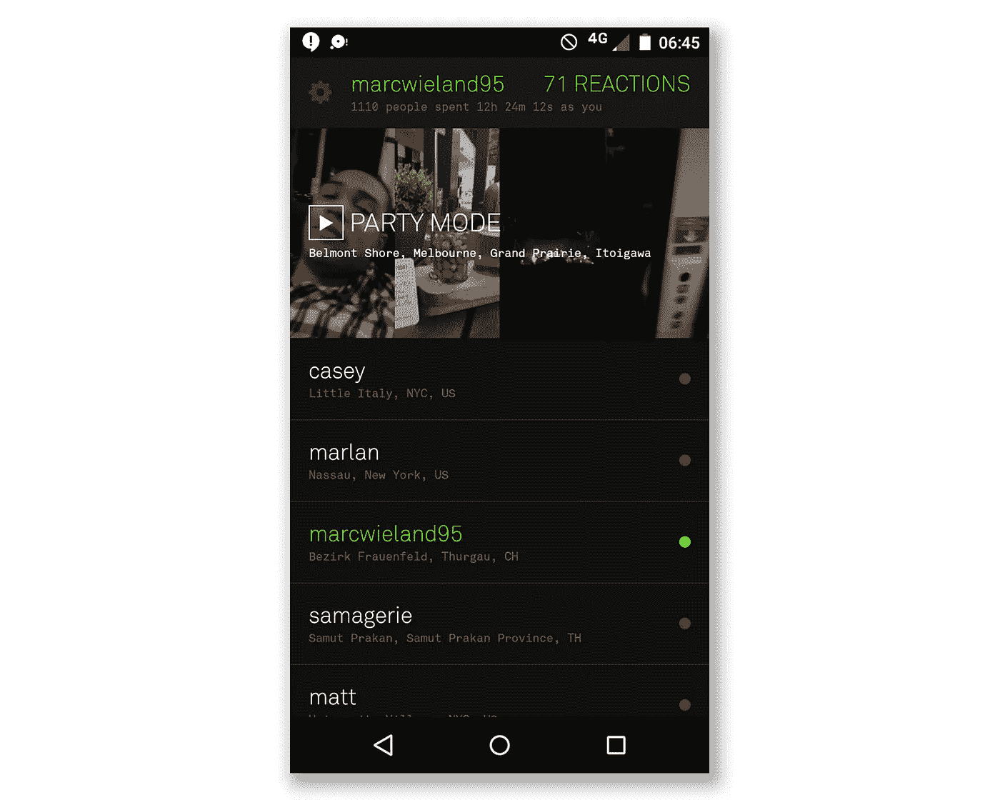

The interface in a beta version (late 2015)

后来，我非常热衷于分享我在部队的日常生活。通过分享我的日常生活，我可以吸引很多人。在我参军的 4 个月里，我在 Instagram 上的粉丝数量翻了一番。我是“有趣的人”栏目的特辑。

> 我分享了我在部队的日常生活，可以吸引很多人

知道很多人在看我的 Beme，让我更容易坚持一个有规律的时间表。但是到了某个时候，观众觉得渐渐淡去了。它似乎不再生长了。

# 重新引入—稳定版 1.0

Beme 从一开始就是作为测试版推出的。半年多后，他们推出了第一个稳定版本。他们试图修复在测试阶段发现的所有错误。“重新启动”后，Beme 得到了一点推动。但令人遗憾的是，这种推动过了一段时间就消失了。

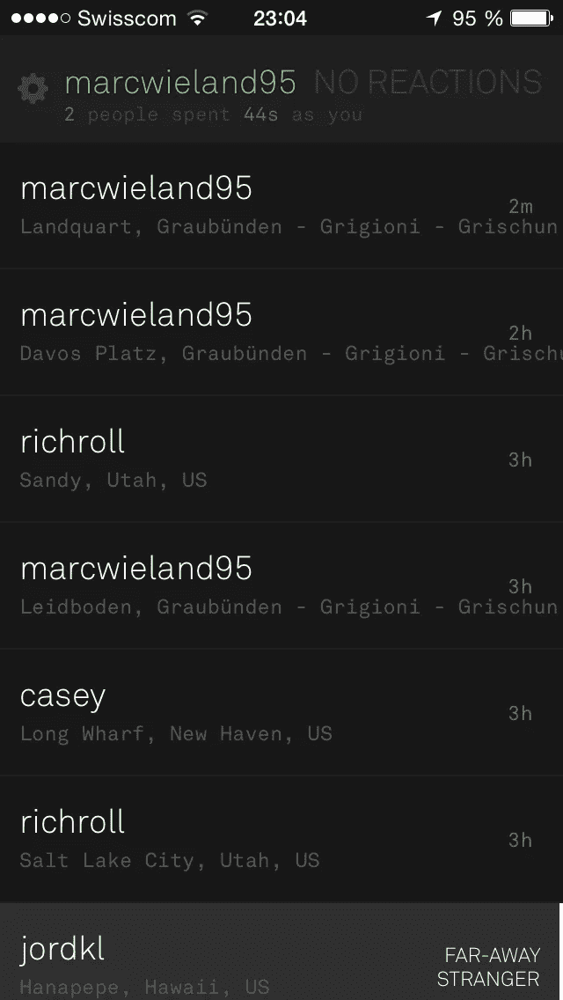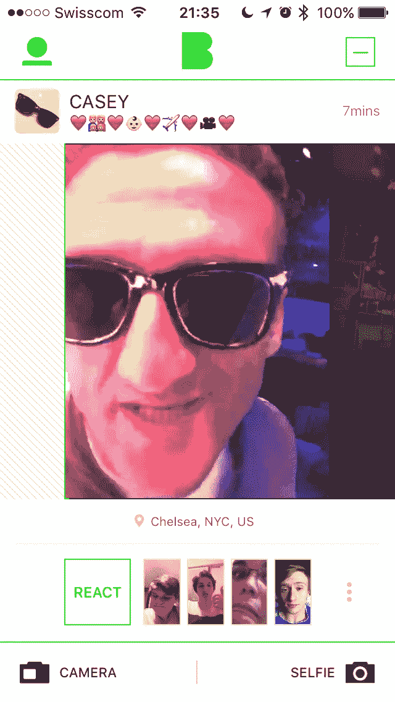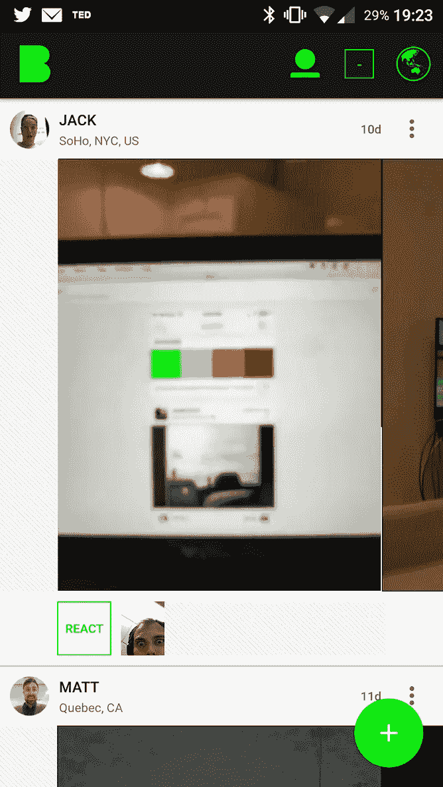

# 活下来不容易

我的意思是，Beme 直接与 Snapchat 或 Instagram 等巨头竞争。对于一支 12 人的队伍来说，这场战斗很难取胜。知道了这一点，Beme 做得很好。但这还不够。

> Instagram Story 最后死了

在某些时候，Beme 并不经常使用。“著名”的人很少分享。站台上不再有**交战**。在我看来，这只是一个时间问题，直到我收到像 Beme 关闭的消息。至少，在 Instagram Story 推出后，这种参与度再次下降。我自己探索了其他应用程序，以类似的方式分享。

# 特征

## 分享精彩瞬间，不要错过

**Beme 只是在红外传感器被覆盖的时候进行记录。**这可以通过将手机贴在身上或靠在墙上来实现。因此，您在录制时无法看到您的屏幕。这个功能**指引着人们分享**的方式，以及他们如何彻底体验这个应用。在我看来是好的。所有用户都可以**分享他们的时刻，而不会错过现实生活中的任何时刻。**有了 Beme，这完全成为可能。此功能还增加了更多方便的行为:

*   我可以分享而不被别人看到。我有点**匿名分享**。
*   发布太**容易了。只要盖上屏幕，松开就差不多了。该应用程序将在几秒钟内处理上传。**

> 看手机的时候不要错过任何东西。**分享真实生活中不遗漏的瞬间。**

## 分享视频

Beme 是围绕**分享视频和只分享视频**的理念建立的。静止是不可能的。那时候，在最开始，这是一个非常新的体验。如今，大多数社交媒体平台都允许视频内容。这有不同的原因，其中一个最大的原因是现在可以通过移动网络向用户发送视频内容(更大的文件)。然而，Beme 上的视频从未以高分辨率发布。

## 反应

没有互动的社交媒体不算社交，不存在，对吧？**评论、投票或者喜欢都是我们知道的特征**。Beme 引入了一个叫做“反应”的特性。到目前为止，我个人从未见过类似的东西，我会怀念的。有了反应，任何人都能以一种不受审查、真实而快速的方式做出反应。观看视频时，你可以发送一张你的正面摄像头拍摄的照片，它总是指向你。后来还引入了视频反应。

脸书添加了一些表情符号来代表更多可供选择的心情。虽然我们仍然受到 5 个表情符号的限制，但这是一个很大的进步。当脸书推出他们的新功能时，Beme 仍然处于领先地位。一张自拍照包含的表情符号不止一个，而且速度更快。

> 一张图片讲述的不仅仅是一堆表情符号

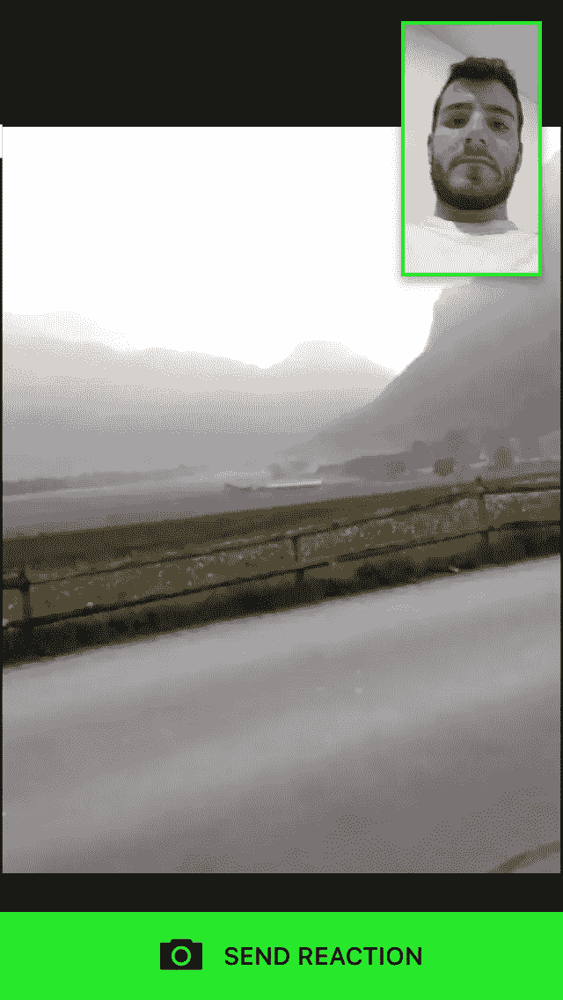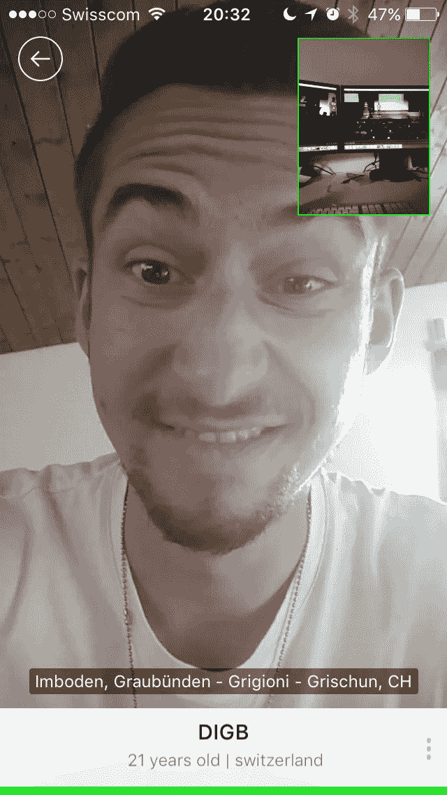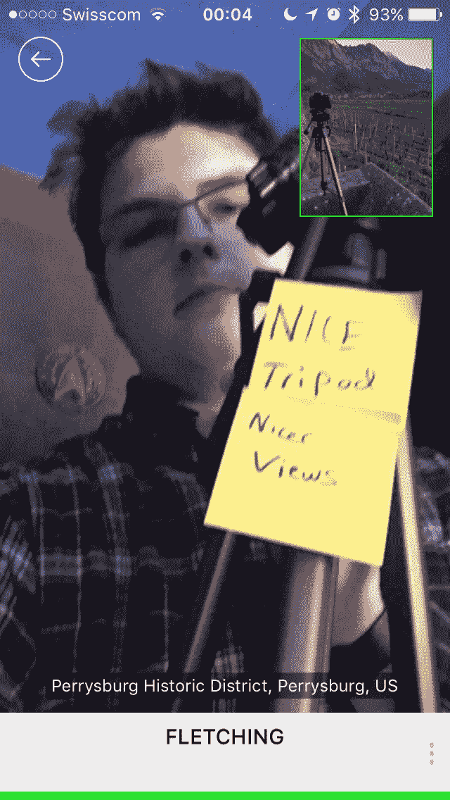

Reactions like this aren’t possible in another way and they make me happy

## 自拍模式

在最开始的时候，它只能在覆盖手机红外传感器的情况下进行录制。后来，在版本 1 中，他们引入了在应用程序中按下录制按钮的可能性。同时，他们还**增加了自拍模式**。从这一点上来说，有可能使用手机的前置摄像头。当 Beme **坚持其理念**时，屏幕在录制时变黑了。在录制时，**不可能看到自己**或你所指的对象。

对我来说，这是一件大事。我不喜欢今天的这种自拍心态。Instagram 尤其是 Snapchat 支持并强制这些。

> 我不喜欢今天的这种自拍心态。

# 用户界面

用户界面经历了一个非常艰难的转变。起初，这个应用程序在设计上并不是很好。暗中带绿，不是我们习惯的现代外观。但至少它很平，很特别。

后来，他们在设计上做了很多调整，将应用程序变成了一个明亮、干净的界面。

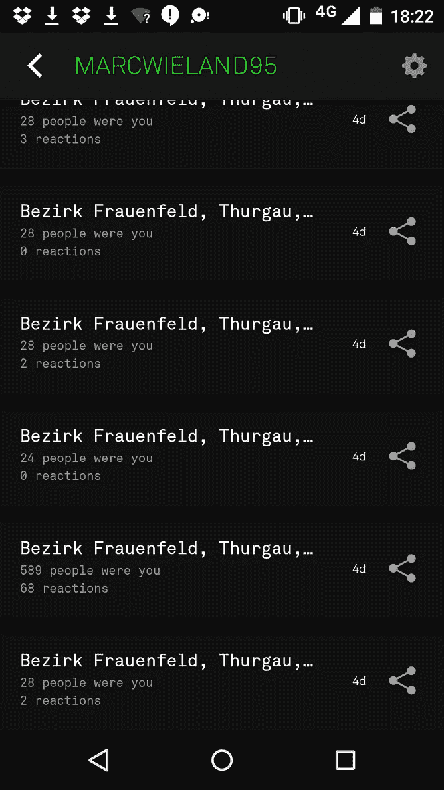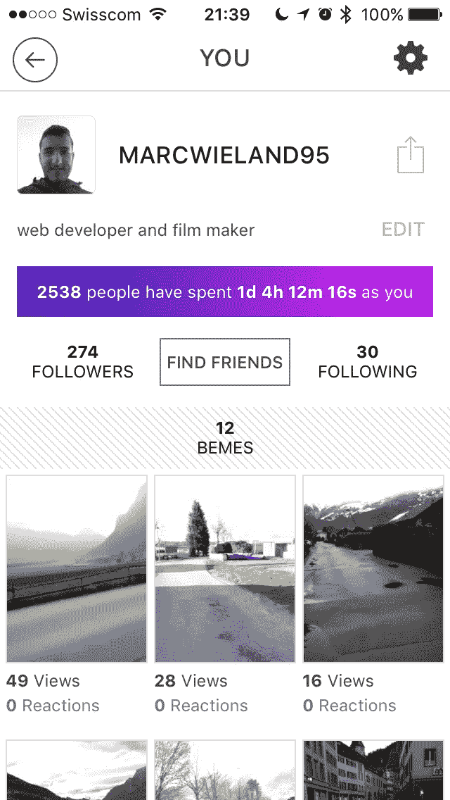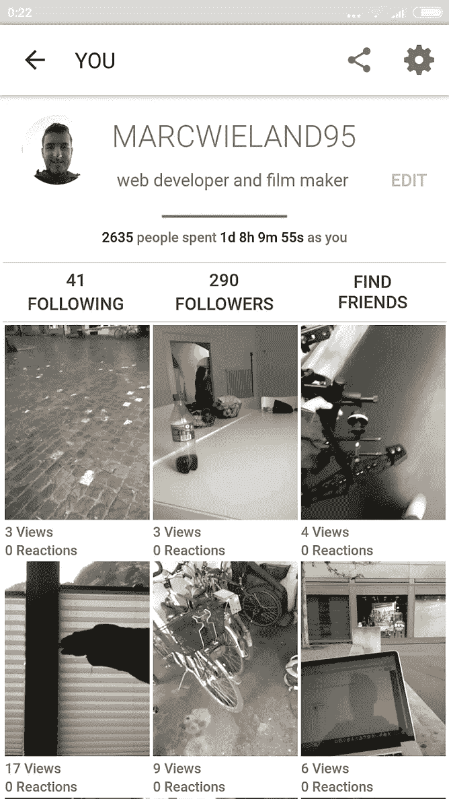

UI transition between the very beginning to the end

# 告别总是很难

2016 年晚些时候，我收到消息称 [Casey Neistat](https://medium.com/u/cb3bf029673b?source=post_page-----85f3719c7ed0--------------------------------) 和 [Matt Hackett](https://medium.com/u/8b081f07fa77?source=post_page-----85f3719c7ed0--------------------------------) 的公司被 CNN 收购。晚上晚些时候，我还收到一封邮件，告诉我 Beme 将被关闭。这是收购的直接结果。他们买下了整个 Beme 班来创造一些惊人的东西。他们的目标是让千禧一代接触 CNN 新闻服务。

# 越来越有趣了

旧的时尚媒体需要一场革命。我相信 Casey Neistat 和他的团队是最合适的人选。他们的目标是在社交媒体和传统媒体之间架起一座桥梁。虽然凯西对这两个领域都非常了解，但他有能力推动新事物的发展。虽然前 beme 团队中的少数开发人员有能力创建令人惊叹的软件。

> 旧的时尚媒体需要一场革命。

在宣布之前的几个月，整个团队都在试验不同的技术和软件。一个例子是为美国 2016 年大选推出的应用程序([出口民调](https://exitpoll.live/))。它们也可以和虚拟现实一起玩。

# 这个队的未来看起来很美好

CNN 的收购不仅仅是运气。这是该公司众多解决方案中的一个。试图给我更多的压力会非常困难，而且不值得。

团队的未来看起来很有趣，我也很想看看他们会创造什么。据 CNN 报道，我们将在 2017 年夏天看到它。媒体公司给了 Beme 团队很大的推动力。他们作为一个孤立的公司存在，并将**获得充分的创作自由。**

**Beme 团队将面临新的不同的挑战**。我希望他们能在未来几年真正有所成就。这次他们有一个大玩家在后面。

# 凯西的博客

凯西大约一年半前开始他的视频博客。就在他和商业伙伴马特(Matt)创办 Beme 之前，马特是 Tumblr 的一名工程师。

我非常确定这个 **vlog 是即将到来的应用的一个营销工具**。正如我们所知，这个频道表现很好。在某个时候，Beme 逐渐消失，Casey 在日常视频中更加专注于娱乐。

> 凯西的视频博客起初是 Beme 的营销工具

无论 vlogs 最初的论点是市场还是个人驱动的决定， **Casey 重新发明了 vlog 场景**。这年头大家都在做 vlog。看他的博客非常有趣。

> 看博客变成了一种习惯

这变成了我个人的一种习惯。我几乎每天晚上睡觉前都看凯西的视频。其他手表系列，我更喜欢看 vlogs。他们有一定的优势。它们更短，给我的个人生活增加了更多的价值，同时也是一种娱乐。

> 其他手表系列，我更喜欢看 vlogs。

# 概述

使用 Beme 的最后一年半非常棒。我能够以一种未经过滤的快速方式**分享我的生活内容**。由于红外传感器的功能，大多数内容都是以第一人称视角(POV)拍摄的。

> 大多数内容以第一人称视角(POV)拍摄

遗憾的是，这款应用从未成功过。对我个人来说，**这个应用是成功的**。我在 Beme 上的粉丝比在其他社交媒体平台上的多。我每天都在大量使用 Beme。使用 Instagram 比使用 Beme 花费更多的时间，同时创建更少的内容。

> 我能够以一种未经过滤的快速方式分享我的生活内容。

我会非常积极地记住这个应用程序，并希望其他应用程序能够实现 Beme 介绍的一些功能。

> 我希望其他应用程序将实现我介绍的一些功能。

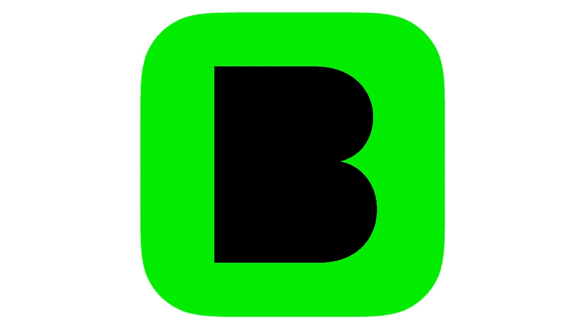

## 推荐文章:

 [## Beme 正在关闭，但我们的工作才刚刚开始

### 为什么我为加入 CNN 而自豪

medium.com](/@mhkt/beme-is-shutting-down-but-our-work-is-just-starting-3d4636b37c32) 

—
***马克·维兰德*** *WordPress。前端开发。UX。电影摄影。风景摄影。延时录像。*

[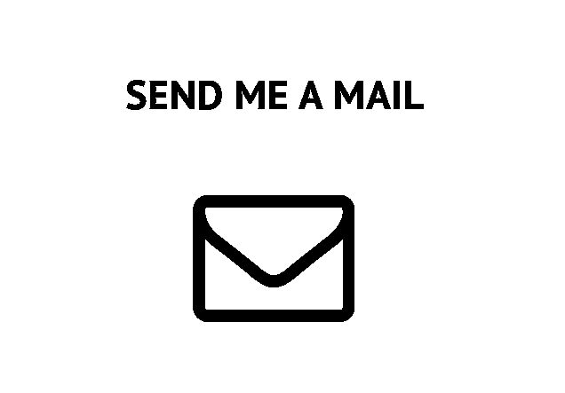](mailto:mail@marcwieland.name)[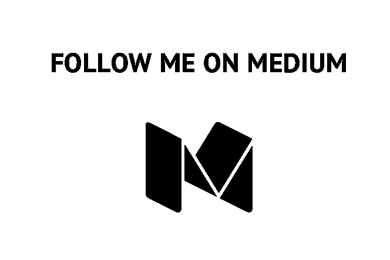](https://medium.com/@marcwieland95)[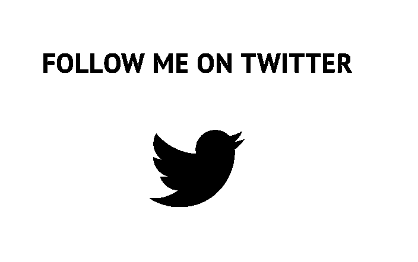](https://twitter.com/marcwieland95)

> [黑客中午](http://bit.ly/Hackernoon)是黑客如何开始他们的下午。我们是 [@AMI](http://bit.ly/atAMIatAMI) 家庭的一员。我们现在[接受投稿](http://bit.ly/hackernoonsubmission)，并乐意[讨论广告&赞助](mailto:partners@amipublications.com)机会。
> 
> 如果你喜欢这个故事，我们推荐你阅读我们的[最新科技故事](http://bit.ly/hackernoonlatestt)和[趋势科技故事](https://hackernoon.com/trending)。直到下一次，不要把世界的现实想当然！

