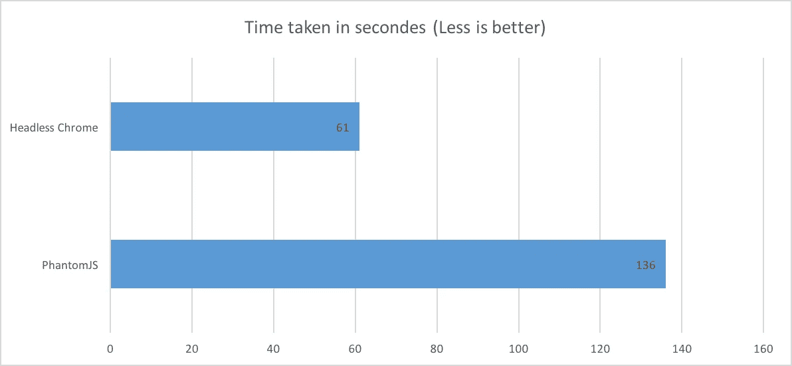

# 无头 Chrome vs PhantomJS 基准测试

> 原文：<https://medium.com/hackernoon/benchmark-headless-chrome-vs-phantomjs-e7f44c6956c>

在 [SERP API](https://serpapi.com) ，能够最快地提供真实的结果是日常关注的问题。然而，运行完整的浏览器是一项昂贵的任务，找到最佳解决方案并不容易。

当需要自动化的[浏览器](https://hackernoon.com/tagged/browser)时，趋势似乎越来越倾向于使用无头 Chrome 而不是 PhantomJS。传言称 [Chrome](https://hackernoon.com/tagged/chrome) 的新无头模式比 [PhantomJS](https://hackernoon.com/tagged/phantomjs) 更快，占用内存更少。不幸的是，我找不到任何基准来支持或反驳这种说法。所以，我们就这么做吧！

我们将使用 Ruby Selenium WebDrivers 来运行 PhantomJS 和 Headless Chrome。如果你使用其他驱动程序，结果可能会稍有不同，但是我们认为绝大部分的费用是浏览器本身而不是库包装。

基准测试加载 Rails 缺省页面的 1000 倍，并检查完整性。我已经在我的 2017 年 MacBook (1.4 GHz 和 16 GB 的 Ram)上运行过了，使用的是 Ruby 2.3.3p222、Chrome 60.0.3112.113 和 PhantomJS 2.1.1。

结果如下:



正如你所看到的，与 PhantomJS 相比，Headless Chrome 的运行速度快了 55%,而消耗的内存却少了 38%。当再次运行基准测试时，无头的 Chrome 似乎在性能上更加稳定，并且似乎是这里的大赢家。

这里主要基准逻辑的源代码:

```
URL_TO_TEST = "http://localhost:3000"
TEXT_TO_VERIFY_PROPER_LOAD = "Yay! You’re on Rails!"
BENCHMARK_ITERATIONS = 1000

namespace :benchmark do

  task :phantomjs do
    puts "== Starting PhantomJS Driver =="
    driver = Selenium::WebDriver.for :phantomjs
    puts "Benchmarking (#{BENCHMARK_ITERATIONS} times):"
    time = Benchmark.measure do
      BENCHMARK_ITERATIONS.times do 
        driver.navigate.to URL_TO_TEST
        unless driver.find_element(tag_name: "body").text.include? TEXT_TO_VERIFY_PROPER_LOAD
          raise "Page Not Properly Loaded"
        end
        print '.'
      end
    end
    puts "\nTime taken: #{time}"
    puts "== Quitting PhantomJS Driver =="
    driver.quit
  end

  task :headless_chrome do
    puts "== Starting Headless Chrome Driver =="
    headless_chrome_capabilities = Selenium::WebDriver::Remote::Capabilities.chrome(chromeOptions: { args: [ "--headless" ]})
    driver = Selenium::WebDriver.for :chrome, desired_capabilities: headless_chrome_capabilities
    puts "Benchmarking (#{BENCHMARK_ITERATIONS} times):"
    time = Benchmark.measure do
      BENCHMARK_ITERATIONS.times do 
        driver.navigate.to URL_TO_TEST
        unless driver.find_element(tag_name: "body").text.include? TEXT_TO_VERIFY_PROPER_LOAD
          raise "Page Not Properly Loaded"
        end
        print '.'
      end
    end
    puts "\nTime taken: #{time}"
    puts "== Quitting Headless Chrome Driver =="
    driver.quit
  end

end
```

在 GitHub 上:[https://GitHub . com/hartator/benchmark-headless-chrome-vs-phantomjs/blob/master/lib/tasks/benchmark . rake](https://github.com/hartator/benchmark-headless-chrome-vs-phantomjs/blob/master/lib/tasks/benchmark.rake)

完整 GitHub 如果要自己运行或者修改基准代码:[https://GitHub . com/hartator/benchmark-headless-chrome-vs-phantomjs](https://github.com/hartator/benchmark-headless-chrome-vs-phantomjs)