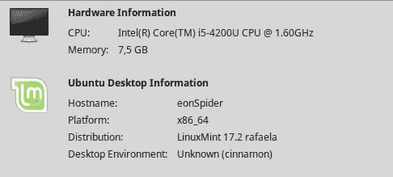
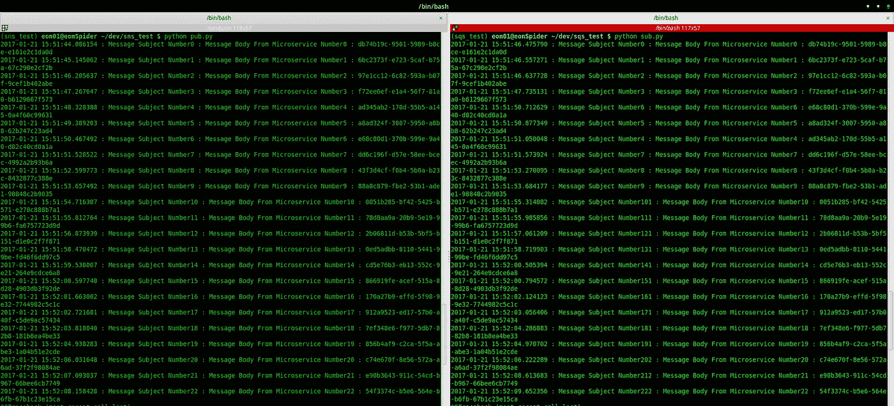
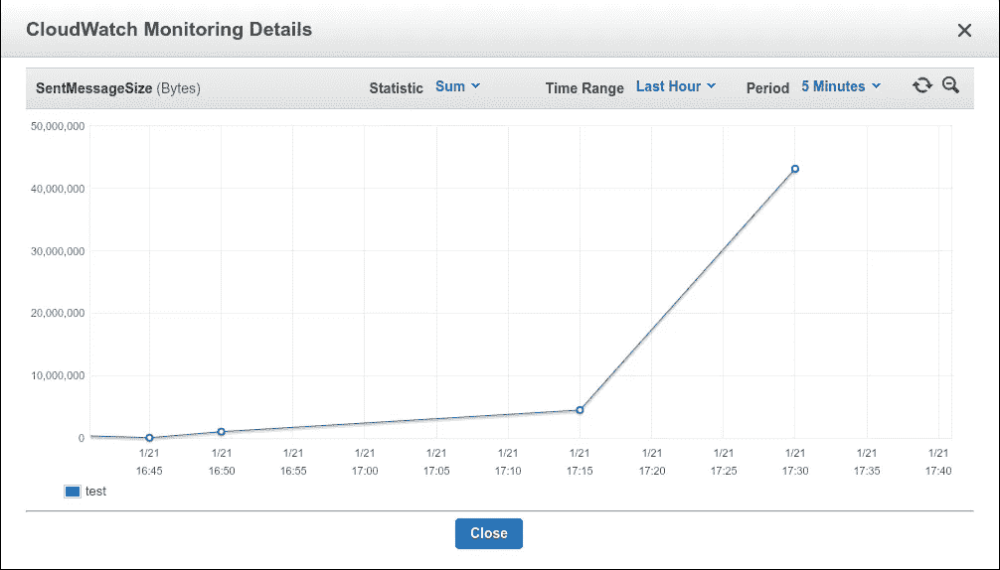
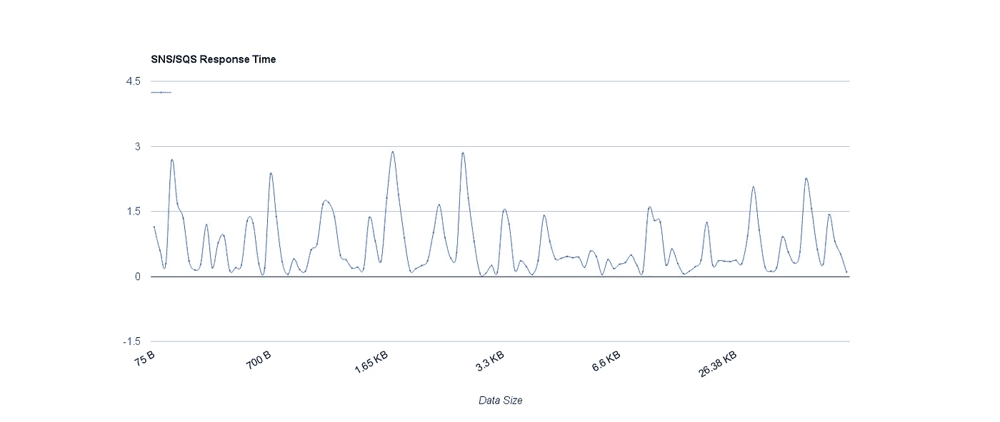
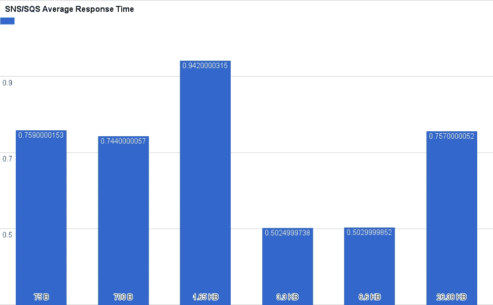
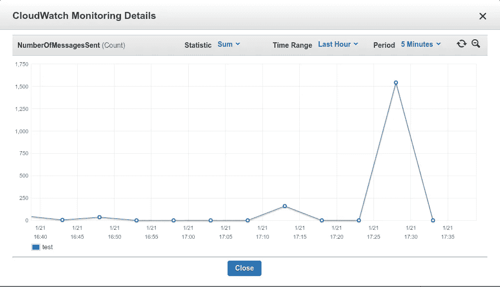

# 微服务架构中进程间通信的亚马逊社交网络和 SQS 基准测试

> 原文：<https://medium.com/hackernoon/benchmarking-amazon-sns-sqs-for-inter-process-communication-in-a-microservice-architecture-de0dfa8d6ac6>

## 放弃

此内容是我们在线课程/培训的一部分/灵感来源。在 2019 年黑色星期五期间，我们对这些材料提供高达 80%的折扣。

您可以在这里享受您的[折扣。](http://bf.eralabs.io)

[](http://bf.eralabs.io)

T 这是我撰写的一系列**实用**帖子的第一部分**，旨在帮助开发者和架构师理解和构建微服务。**

我在同样的背景下写了其他的故事，比如这些链接:

*   [微服务从开发到生产使用 Docker，Docker 组成& Docker 群](/@eon01/microservices-from-development-to-production-using-docker-docker-compose-docker-swarm-3cf37f97706b)
*   [利用 Docker 1.12、AWS EFS 和 Swarm 模式实现简单的 Docker 编排](/@eon01/easy-docker-orchestration-with-docker-1-12-aws-efs-and-the-swarm-mode-87d51b6d5ad2#.59os1v6fd)

注意，我在这个例子中使用了 Python、SNS 和 SQS。

这篇博文中使用了亚马逊社交网站和 SQS，因为它们易于配置，但你可能会找到几个开源的替代品。

该基准测试中的结果是相对于我使用的互联网连接和我的笔记本电脑性能而言的。

我的连接带宽是 9.73 Mbps 下载/11.09 Mbps 上传。


我有 4 个 CPU 和 7.5 GB 的内存:



# 亚马逊简单通知服务

这是一个完全托管的推送通知服务，可以让您发送单个消息或将消息分散给大量收件人。社交网络可以用来向移动设备用户、电子邮件收件人发送推送通知，或者向其他服务发送消息(比如 SQS)。

# 亚马逊简单队列服务

QS 是一个完全管理的消息队列服务。亚马逊 SQS 用于传输任何数量的数据，而不会丢失消息。亚马逊 SQS 可以充当 FIFO 队列(先进先出)。

# Unix 理念和基于微服务的软件

我相信微服务正在改变我们对软件和 DevOps 的看法。我并不是说它是你所有问题的解决方案，但是在一起工作的程序之间共享堆栈的复杂性(Unix 哲学)可以解决许多问题。

使用 Docker 或 rkt 和编排工具(Swarm、K8S)向您的微服务架构添加容器化层..)将真正简化从开发到运营的整个流程，并帮助您管理网络，提高堆栈性能、可扩展性和自我修复能力..

我和你们中的许多人一样，采用每个容器一个流程的理念。这也是我为这个教程所考虑的，所以进程间通信和微服务容器一样；每个微服务运行一个独立的进程，做好一件事，并与其他进程通信(Unix 哲学)。

道格·麦克洛伊在 1978 年的《贝尔系统技术杂志》中记录了 UNIX 的基本原理:

1.  让每个程序做好一件事。要做一项新的工作，就要重新构建，而不是通过添加新的“特性”使旧的程序变得复杂。
2.  期望每个程序的输出成为另一个未知程序的输入。不要用无关的信息混淆输出。避免严格的列或二进制输入格式。不要坚持交互输入。
3.  设计和构建软件，甚至是操作系统，尽早试用，最好在几周内。不要犹豫，扔掉笨拙的部分，重建它们。
4.  优先使用工具，而不是不熟练的帮助来减轻编程任务，即使你不得不绕道去构建工具，并期望在用完后扔掉一些工具。

根据经验，我相信在开发软件的同时牢记 Unix 哲学原理将会为您避免很多麻烦。

> 别忘了检查我的培训[实用 AWS](http://practicalaws.com)

[](http://practicalaws.com)

# 基于消息的微服务的通用架构

正如你可以看到一个发布者向 SNS 发送一个预先选定的主题，在它的作用下，SNS 发送一个消息到一个订阅的 SQS 队列。


A Simplified Architecture

在本教程中，我们将使用 Python 和 Boto 编写一个原型。

# 构建发布者

从创建一个虚拟环境并安装 Boto(亚马逊网络服务的 Python 接口)开始

```
virtualenv sns_testcd sns_testpip install boto
```

这是发布者代码:

```
import boto.sns, time, json, logging
from datetime import datetimelogging.basicConfig(filename="sns-publish.log", level=logging.DEBUG)# Connect to SNS
c = boto.sns.connect_to_region("eu-west-1")sns_topic_arn = "arn:aws:sns:eu-west-1:953414735923:test"# Send 100 messages
for x in range(100): body = "Message Body From Microservice Number" + str(x)
    subject = "Message Subject Number" + str(x) publication = c.publish(sns_topic_arn, body, subject=subject + str(x))# Choosing what we want to print to the terminal
m = json.loads(json.dumps(publication, ensure_ascii=False))message_id = m["PublishResponse"]["PublishResult"]["MessageId"]print str(datetime.now()) + " : " + subject + " : " + body + " : " + message_id
 time.sleep(5)
```

这段代码将打印发送的消息 id 和时间。

# 构建消费者

从创建一个虚拟环境并安装 Boto(亚马逊网络服务的 Python 接口)开始

```
virtualenv sqs_testcd sqs_testpip install boto
```

这是原型代码:

```
import boto.sqs, time, json
from datetime import datetime# Connect to SQS
conn = boto.sqs.connect_to_region(
               "eu-west-1", aws_access_key_id='xxxxxx',
                aws_secret_access_key='xxxxxx')# Choose the used queue
queue = conn.get_queue('test')# While true read the queue, if the program reads everything then it will wait (pass)while 1:
    try:
        result_set = queue.get_messages()message = result_set[0]
        message_body = message.get_body()
        m = json.loads(message_body) subject = m["Subject"][:-1]
        body = m["Message"]
        message_id = m["MessageId"] print str(datetime.now()) + " : " + subject + " : " + body + " : " + message_id conn.delete_message(queue, message) except IndexError:
        pass
```

该代码将打印接收到的消息 id 和时间。

# 测试我们的原型

我将我的终端分成两个窗口，首先启动订阅者脚本，然后是发布者:



# SNS+SQS 有多快？

在中，为了查看文本消息的传输需要多长时间，我们将在两个脚本中使用时间戳。这是简化的流程图:

> 发布者-> SNS -> SQS ->订阅者

我们正在发送一条差不多 75B 的消息(目前是一条小消息，只是为了测试)。

为了更精确和更好地测量响应时间，我修改了两个程序:

**pub.py**

```
import boto.sns, time, json, logging
from datetime import datetimelogging.basicConfig(filename="sns-publish.log", level=logging.DEBUG)
c = boto.sns.connect_to_region("eu-west-1")
sns_topic_arn = "arn:aws:sns:eu-west-1:953414735923:test"for x in range(100):
    body = "Message Body From Microservice Number" + str(x)
    subject = "Message Subject Number" + str(x)
    publication = c.publish(sns_topic_arn, body, subject=subject + str(x))
    print str(time.time()) time.sleep(1)
```

**sub py**

```
import boto.sqs, time, json
from datetime import datetimeconn = boto.sqs.connect_to_region("eu-west-1", aws_access_key_id='xxxxxxxxxxx', aws_secret_access_key='xxxx')
queue = conn.get_queue('test')x = 0while 1:
    try:       
        result_set = queue.get_messages()
        if result_set != []:
            print str(time.time()))
            x += 1
        message = result_set[0]       
        conn.delete_message(queue, message)
    except IndexError:
        pass
```

计算接收时间和发送时间之间的差值(作为发送数据大小的函数)。

对于每种尺寸，每次发送 20 个串行请求。

以下是从社交网站发送到 SQS 的不同数据大小:

*   75B
*   700B
*   1.65KB
*   3.3KB
*   6.6KB
*   26.38KB

SQS 收到的消息不会与发送的数据相同，因为其他数据和元数据也与一起发送。



Sent Message Size Read By SQS

我在 26.38KB 停止了基准测试，因为有一个限制:

> 有了亚马逊社交网络和亚马逊 SQS，你现在有能力发送最大 **256KB** (262，144 字节)的大型有效载荷消息。要发送大的有效负载(64KB 和 256 kb**之间的消息)，必须使用支持 AWS Signature Version 4 (SigV4)签名的 AWS SDK。**



SNS->SQS Response Time In Function Of Sent Data Size

如果数据量增加，响应时间不会改变，这是一件好事。

让我们看看平均响应时间与数据大小的函数关系:



对于合理的数据大小，将数据发送到 SNS 并将其发送到 SQS 的过程+我的 Python 程序读取数据的时间在 0.5 到 0.9 秒之间。

在这个基准测试中，发送了将近 1000 条消息，我注意到所有的消息都被传递了，没有丢失消息。



Number Of Sent Messages

# 多个地区的社交网络/SQS

从我的互联网连接和笔记本电脑配置来看，速度取决于你如何管理你的社交网络/SQS 地区。(我一直用巴黎的都柏林地区。)

使用该消息堆栈优化微服务之间(或发布者和订阅者之间)的消息传输的方法之一是将您的微服务和 SNS/SQS 保持在同一区域。

如果出版商不在同一个地区(假设你有多个出版商，一个在亚洲，另一个在非洲，第三个在美国)，这里最好的办法是在不同的地区创建多个社交网络/SQS。

# 连接更深

Mmicro services 正在改变我们制作软件的方式，但它的缺点之一是网络部分有时会很复杂，消息传递会直接受到网络问题的影响。使用 SNS/SQS 和发布/订阅模型似乎是创建跨服务消息中间件的一个好的解决方案。我使用的发布者/订阅者脚本并没有真正针对负载和速度进行优化，但它们可能是最基本的形式。

如果你对这篇文章产生了共鸣，请加入成千上万来自世界各地的热情的 DevOps 工程师、开发人员和 IT 专家，订阅 [DevOpsLinks](http://devopslinks.com) 。

> 别忘了查看我的培训[实用 AWS](http://practicalaws.com)

[](http://practicalaws.com)

你可以在[推特](https://twitter.com/eon01)、 [Clarity](https://clarity.fm/aymenelamri/) 或者我的[网站](http://aymenlamri.com)上找到我，你也可以查看我的书: [SaltStack For DevOps](http://saltstackfordevops.com) 、&无痛码头。


如果你喜欢这篇文章，请推荐并分享给你的追随者。