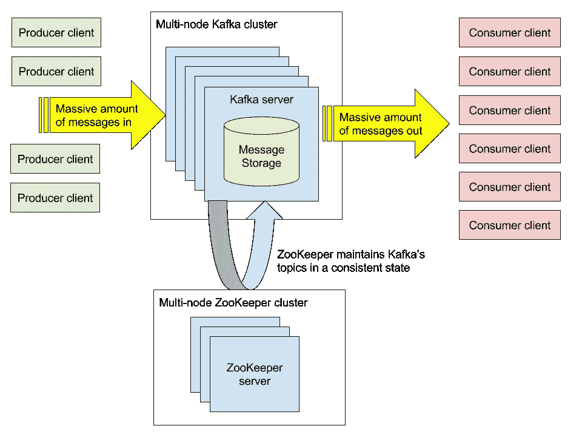
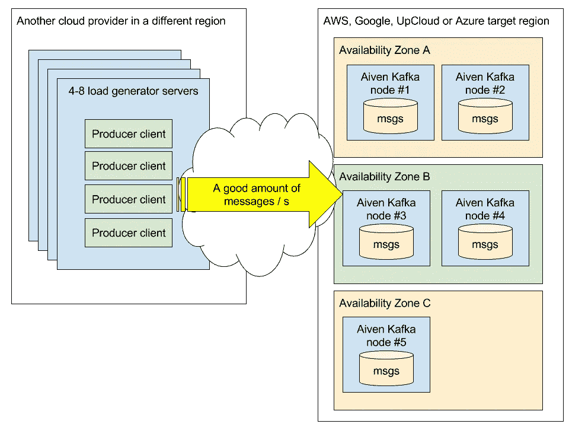
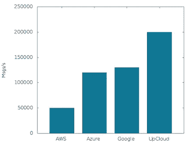
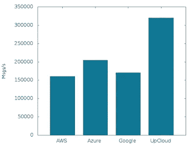
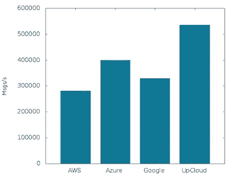

# Kafka 性能基准测试第 1 部分:写吞吐量

> 原文：<https://medium.com/hackernoon/benchmarking-kafka-performance-part-1-write-throughput-7c7a76ab7db1>

[*要获取我们最新的基准测试，请在此处查看我们 2019 年的更新*](https://aiven.io/blog/benchmarking-kafka-write-throughput-performance-2019-update/)

我们提供完全托管的 Kafka 服务已经有一段时间了，我们经常被问及在选定的云上，您可以通过给定的服务计划层传输多少消息。因此，这里有一个我们进行的基准测试，让您大致了解 Apache Kafka 在公共云中的表现。

# 卡夫卡是什么？

Apache Kafka 是一个*高性能开源流处理平台*，用于实时收集和处理大量消息。它使您能够实时、大规模地接受流数据，如网站点击流、事件、交易或其他遥测数据，并将其提供给下游的流处理应用。Kafka 是为可伸缩性和容错性而分布式构建的。添加更多水平节点来应对不断增长的负载相当简单，当节点出现故障时，多个节点上的数据自动复制可以保持可用性。

卡夫卡中的基本概念是**生产者**和**消费者**。

**生成器**是一个应用程序，它生成数据，但只是将数据提供给其他应用程序。

**生产者**应用程序的一个例子可以是一个产生“页面点击”的 web 服务器，该“页面点击”告知何时从哪个 IP 地址访问了一个网页，该网页是什么，以及 web 服务器呈现该网页需要多长时间。

在**消费者**方，可能有多个系统对同一页面命中数据流感兴趣:

*   一个时间序列数据库，用于绘制一段时间内的页面点击总数
*   报告应用程序收集所访问页面的摘要，并将它们发送到数据仓库数据库系统
*   试图发现异常访问模式的 DDoS 检测系统
*   一种速率限制监视器，对来自特定源地址的命中次数进行计数
*   诸如此类…

Kafka 非常适合这类应用程序:它提供了一种快速、安全地将数据从生产应用程序手中取出的方法。一旦制作人把信息写给卡夫卡，它就可以确定自己的那部分工作已经完成了。producer 应用程序不需要知道数据是如何被哪些应用程序使用的，它只是将数据存储在 Kafka 中，然后继续运行。

在消费者方面，Kafka 的一个强大特性是它允许多个消费者阅读相同的信息。在上面的 web 页面点击示例中，每个消费者应用程序都有自己的数据读取指针，它们可以按照自己的速度处理消息，而不会给生产者应用程序带来任何性能问题或延迟。

大致是这样的:



动物园管理员集群是保持卡夫卡健康运行的关键部分。它维护了卡夫卡的元数据，最重要的是，卡夫卡节点之间关于谁在做什么的共识。

# 艾文·卡夫卡式服务

Aiven Kafka 是一个基于 Apache Kafka 技术的完全托管服务。我们的目标是尽可能简单地使用 Kafka 集群，尽可能减少操作工作量。我们为您处理 Kafka 和 Zookeeper 的设置和操作，因此您可以专注于增值应用程序逻辑，而不是基础架构维护。Aiven Kafka 服务可以在几分钟内启动，我们将确保它们在任何时候都保持可操作、性能良好、最新和安全。节点会自动平均分布在可用的可用区域中，以最大限度地降低丢失任何区域的影响。

Aiven Kafka 在**亚马逊网络服务**、**微软 Azure** 、**谷歌云平台**、 **UpCloud** 和 **DigitalOcean** 中可用，共覆盖 53 个云区域。在这次性能比较中，我们对除 DigitalOcean 之外的所有产品进行了基准测试，在 digital ocean 中，我们的 Kafka 产品受到可用计划的限制。

这些测试中使用的每个 Kafka 服务都是 Aiven 提供的常规服务，其默认设置没有改变。

# 基准设置

在这第一篇 Kafka 基准测试文章中，我们开始估算不同云中不同 Aiven Kafka 计划层的最大*写入吞吐率*。我们希望使用典型的客户消息大小和标准工具来产生负载。我们还希望通过网络从单独的系统生成负载，以确保负载尽可能模拟实际的客户工作负载。

测试设置的高级视图，一个具有五个节点的 Aiven Kafka 服务，均匀分布在可用区域中:



我们在测试中选择了 512 字节的消息大小。根据我们的经验，最典型的负载之一是 JSON 编码的消息，大小在 100 字节到 10 千字节之间。

在这些测试中，我们使用单个主题，其分区计数与每个 Aiven 计划层的节点计数相匹配。对于更复杂的主题/分区设置，Aiven 主动平衡分区的位置，试图实现分区的“完美”分布。在这个测试中，每个节点只有一个分区，所以这很简单。在本测试中，我们将复制因子设置为一(1)，这意味着每条消息只驻留在一个 Kafka 节点上。
T3【阿帕奇】所用的卡夫卡版本是 0.10.1.1。

对于负载生成，我们从提供的示例中选择使用 [librdkafka](https://github.com/edenhill/librdkafka) 和 [rdkafka_performance](https://github.com/edenhill/librdkafka/blob/master/examples/rdkafka_performance.c) 。我们在很大程度上使用默认设置，但将单个请求超时提高到 60 秒，因为我们预计 Kafka 代理将处于极端负载下，请求处理将比正常负载水平下花费更长的时间。此外，由于 Aiven Kafka 服务仅通过加密的 TLS 连接提供，因此我们包括了这些服务的配置，即所需的证书和密钥。

librdkafka 默认最大批量为 10000 条消息，或者每个请求的最大请求大小为一百万字节，以最先满足的为准。在这些测试中，我们没有使用压缩。

道具配置:

```
metadata.broker.list=target-kafka.benchmark.aivencloud.com:10947
security.protocol=ssl
ssl.key.location=client.key
ssl.certificate.location=client.crt
ssl.ca.location=ca.crt
request.timeout.ms=60000
```

我们在不同于正被测试的云提供商的多个虚拟机上运行了几个 rdkafka_performance 实例。因此，所有的测试负载都是通过节点的公共网络接口来自互联网。我们不断增加实例的数量，直到我们能够找到每个计划的饱和点和最大消息速率。

每个 rdkafka_performance 实例都是在命令行上使用以下命令启动的:

```
rdkafka_performance -P -s 512 -t target-topic -X file=producer.props
```

# 基准测试结果

第一组测试在 Aiven Kafka Business-4 计划上运行，这是一个三节点集群，是我们许多客户的共同起点。该计划中的每个节点都有 4gb 的 RAM、一个 CPU 内核和 200 的磁盘，在集群中提供总共 600 的原始 Kafka 存储容量。

写入性能(3 个节点@ 4 GB RAM，1 个 CPU，每个 200 GB 磁盘):



在 UpCloud 上，我们达到了每秒 20 万条消息。Azure 和谷歌的计划达到每秒 120，000 和 130，000 条消息的饱和，亚马逊的部署达到每秒 50，000 条消息。

表演相当不错。由于可用的节点类型，Amazon 上的性能有点落后于其他产品，我们将在未来寻找优化的方法。正如您将在下一张图中看到的更大计划的测试，AWS 的性能已经与其他提供商更加一致。

接下来，我们使用 Business-8 计划测试了三个节点集群，但具有更大的底层实例。该计划的节点具有 8gb 的 RAM、两个 CPU 核心和每个节点 400 的磁盘，也就是说，与 Business-4 计划相比，所有主要资源都增加了一倍。这个测试显示了 Kafka 如何随着资源的增加而纵向扩展。

写性能(3 个节点@ 8 GB RAM，2 个 CPU，每个 400 GB 磁盘):



我们看到性能有了很好的提高，UpCloud 每秒 320，000 条消息，Azure 每秒 205，000 条，Google 每秒 170，000 条，AWS 每秒 160，000 条。

在最后一个测试中，我们想验证卡夫卡的横向缩放有多好。在这个测试中，我们从业务计划层进入高级层，将节点数量从三个增加到五个，同时保持节点规格不变。此外，测试设置也进行了更新，以便在这个测试中使用五个分区(而不是三个)。

写入性能(5 个节点@ 8 GB RAM，2 个 CPU，每个 400 GB 磁盘):



对于 Kafka 来说，这里的结果是可靠的:节点数量增加了三分之二，写性能直接提高了三分之二。厉害！

up cloud 上的 Aiven Kafka Premium-8 每秒处理 53.5 万条消息，Azure 40 万条，Google 33 万条，亚马逊 28 万条消息/秒。

# 基准结论

Apache Kafka 的性能与我们预期的一样好，并且随着资源的增加和集群规模的增大而很好地扩展。我们欢迎您使用 Aiven 对自己的工作负载进行基准测试，并分享您的结果。

我们利用 Kafka 作为 Aiven 中的消息代理，并将其作为传输所有遥测指标和日志的媒介。我们对我们的技术选择很满意，可以推荐 Apache Kafka 来处理各种流数据。

在[https://aiven.io/kafka](https://aiven.io/kafka)找到更多关于艾文·卡夫卡的信息。

[](http://bit.ly/HackernoonFB)[](https://goo.gl/k7XYbx)[](https://goo.gl/4ofytp)

> [黑客中午](http://bit.ly/Hackernoon)是黑客如何开始他们的下午。我们是 AMI 家庭的一员。我们现在[接受投稿](http://bit.ly/hackernoonsubmission)并乐意[讨论广告&赞助](mailto:partners@amipublications.com)机会。
> 
> 如果你喜欢这个故事，我们推荐你阅读我们的[最新科技故事](http://bit.ly/hackernoonlatestt)和[趋势科技故事](https://hackernoon.com/trending)。直到下一次，不要把世界的现实想当然！

