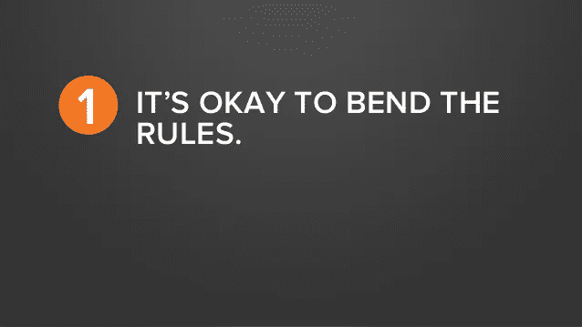

# 如果需要，打破一些规则！

> 原文：<https://medium.com/hackernoon/bend-the-rules-if-needed-break-some-85eaeca3115b>

规则是为了被打破而写的吗？嗯，我不完全相信。但是，你应该永远遵守规则吗？肯定没有。

> 用传奇艺术家巴勃罗·毕加索的话说，“像专业人士一样学习规则，这样你就能像艺术家一样打破它们。”

Quote by Oscar Wilde (slide from Hubspot presentation)

为什么要写规则？规则是严格的指导方针，确保我们做出正确的决定，做正确的事情。规则的问题在于，它们总是有条件的，并且受限于有限的条件集。我们周围出现的情况可能不属于这些情况。

规则是由一个或几个人写的。他们写下他们认为正确的东西，着眼于当地的最大值(根据数学，意味着在他们有限的可见性中寻找最好的)。时代在变，环境在变，规则可能不会变。(就像无人驾驶汽车的讨论一样，[应该为无人驾驶汽车上路制定一套全新的道路法规](https://news.usc.edu/85249/ask-the-experts-whats-next-for-driverless-cars/))。

在某些情况下，这是不成文的规则或习俗或传统，或者这是它的工作方式。我所说的违反规则，并不是指违反法律，或者欺骗或欺诈。变通规则意味着当你确信自己做得对的时候，你不会担心规则或人们试图执行规则，而是完成实际的工作。

最近我参与组织了一个活动，其他一些组织者想请一位演讲者来参加一个会议“T2 企业家的软技能”，这位演讲者在他的 T4 生涯中一直是一位企业人士(我应该补充一下，这是一个非常好的职业企业生涯)。我完全反对。在这里说“不”不是一种规范。它给我带来了几个标签，包括#不尊重他人。因为这个和这样的几个原因，我后来遇到了相当多的问题。我在乎吗？绝对不行。既然我知道随之而来的问题，我还会做同样的事情吗？绝对是的。当我知道我想的/做的是对的。见鬼，我不在乎别人对它的看法。我不相信仅仅因为这是公约就应该继续下去。

> 每当你遇到规则/规范/习俗/传统时，想想为什么会是这样？

你明白为什么吗？如果没有，问为什么？你得到一个好答案了吗？如果你不确定，那么最好不要打破任何东西(因为你应该确切地知道你在做什么)。如果你知道这是不对的，而你的逻辑给了你一种不同的方式去做，那就站出来用正确的方式去做。请注意，你可能是一个人。但是要改变世界的运作方式，你不需要一百万人。你需要一个人的坚定信念。

如果不是规则，不是规范，也不是习俗，那是什么？我们怎么知道什么是对的？答案是——你的智慧、你的价值观和你的道德观。相信自己，坚持立场。我一直觉得，不管是规则、习惯，还是我们得到的建议，我们都必须在其上放置逻辑过滤器，进行多层次的筛选。选择那些让你信服的，留下其他的。这样，至少你拥有自己的生活，而不是别人的书面规则！

Barry 的 Ted 演讲是一个很好的参考。看这里。