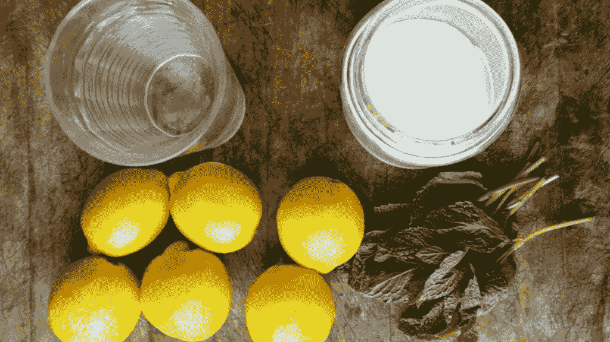
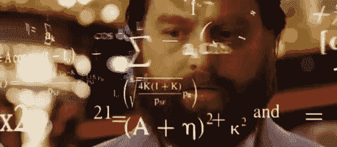
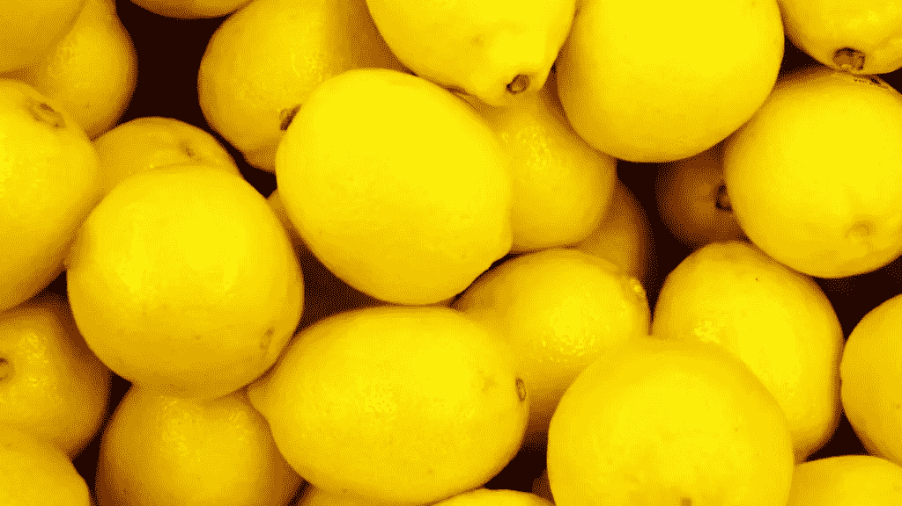

# 如何制作柠檬水

> 原文：<https://medium.com/hackernoon/beneath-this-mask-is-data-part-1-or-how-to-make-lemonade-3dab92d0621e>


> “在这个面具后面不仅仅是血肉之躯。在这个面具下有一个想法……而想法是防弹的。”——阿兰·穆尔《复仇的 V》中的 V

代码作为一种语言的想法是如此美妙的概念。它是比特……它们在“真实”世界中不存在，然而计算机却能很好地理解这种“0”和“1”的抽象交响乐。一台电脑可能是你的智能手机，个人电脑，智能手表或任何其他电子设备是一台愚蠢的机器，潜在的代码是智能。它不是作为硬件(cpu，微处理器，无论你想叫它什么)而存在的大脑，代码是大脑的一组详细指令。

# **如何制作柠檬水**



如果我让你做柠檬水，你可能会这么做；

```
**Step 1:** Go to the fridge.**Step 2:** Get lemons and cold water.**Step 3:** If there is no cold water, open the freezer and get ice.**Step 4:** Get an empty glass.**Step 5:** Squeeze the lemon in the glass, pour cold water or water and ice.**Step 6:** Add sugar to taste. Some of you may want salt too.. that’s gross.**Step 7:** Lemonade is ready....
```

## …

## 简单吧？

## 不要！

```
What you are probably doing is this;**Step 1:** Recognizing whether you are in the house, what a house means, the concept of 3 Dimensional space.**Step 2:** Recalling the concept of a lemon, that it is citrus in nature, a generic shape of the lemon, acceptable coloration, where it might be located in the house.**Step 3:** Knowing/guessing that it is in the fridge because a fridge is a device that increases the shelf life of products and recalling having kept lemons in the fridge sometime last week (this would involve knowing the concept of time… that is a separate discussion).**Step 4:** Locating the position of the fridge.**Step 5:** Moving towards the fridge. This involves a lot of obstacle tackling learnt during childhood.**Step 6:** Recalling how a fridge looks generally.**Step 7:** Looking at the handle of the fridge.**Step 8:** Recalling from memory the concept of a handle, maybe a lever.**Step 9:** Recalling how to grip the handle.**Step 10:** Gripping the handle firmly.**Step 11:** Applying force.………(We haven’t even found lemons yet!)
```

每一步都可以进一步分解成一组详细的指令，这些指令可能会填满整个库。这难道不会让你想知道人类的大脑有多复杂，以及这一切感觉起来有多轻松吗？下次你看柠檬的时候，你可能会想赞美人类的大脑。这可能会更详细，但你现在明白了。对于机器人/计算机来说，制作柠檬水是一项极其困难的任务。



我们中的一些人通过一丝不苟地输入这些指令(或者有时制作一个机器人来写这些细节)，将这种智能吸收到计算机中。这套指令在计算机术语中被称为“算法”。这很难，而且在很多方面非常令人满足。知道如何编码确实是一种超能力，我想获得它。在下一篇文章中会有更多的介绍。



When life gives you lemons… think about it.

附:这是[柠檬水](http://www.simplyrecipes.com/recipes/perfect_lemonade/)的配方。