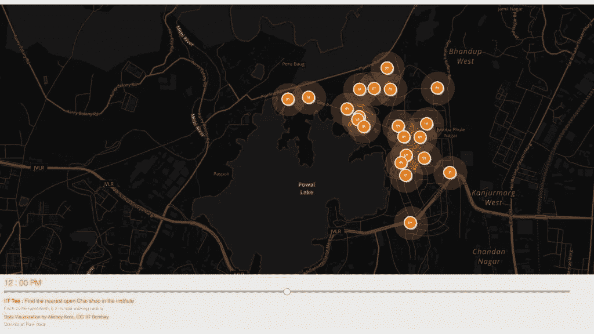
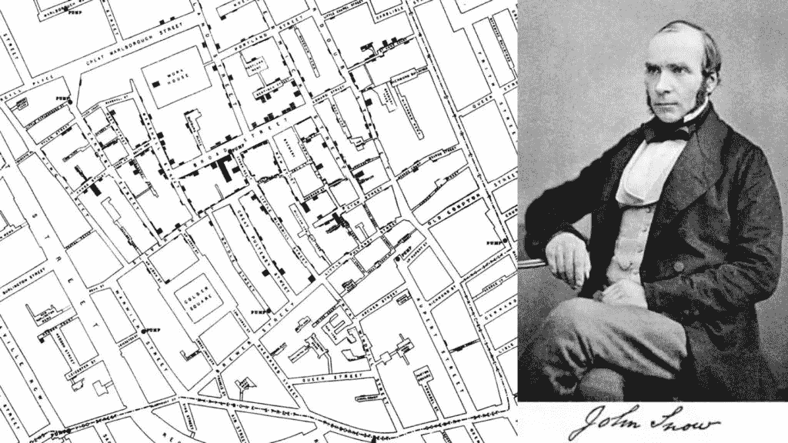

# 开放数据库的兴起

> 原文：<https://medium.com/hackernoon/beneath-this-mask-is-data-part-4-or-rise-of-the-open-data-ards-67be41b42132>

> “这是你最后的机会。在这之后，就没有回头路了。你吃了蓝色药丸——故事结束，你在床上醒来，相信你想相信的一切。你服用红色药丸——你待在仙境，我让你看看兔子洞有多深。记住:我提供的都是事实。仅此而已。”——在《黑客帝国》中，墨菲斯对尼奥

尽管开放数据，尤其是开放政府数据的概念已经存在很长时间了；这个想法大约在 2009 年开始流行。随着美国、英国、加拿大、新西兰等国政府宣布了许多开放公共信息的举措，开放政府数据开始成为主流。印度政府也在[网站](http://www.data.gov.in/)上发布了一些数据，作为开放政府数据倡议的一部分。这些数据集实际上非常大，它们的价值在于如何以多种方式重用和重新组合。

丹麦一名女子建造了 [findtoilet.dk](http://findtoilet.dk) ，展示了丹麦所有的公共厕所。所以膀胱有问题的人可以相信自己多出门。印度热带气象研究所创建了一项名为 [SAFAR-air](http://safar.tropmet.res.in/) 的服务(我不是这里 UI 的忠实粉丝)，显示城市的空气质量(你也可以看看 [OpenAQ](https://openaq.org/) )。在纽约，你可以很容易地找到可以遛狗的地方，以及使用同一个公园的其他人。“Round”是一个应用程序，让你找到去一个地方时要走的最美的路线，而不是最短的距离。像英国的“mapumental”和德国的“mapnificent”这样的服务可以让你找到住的地方，考虑到你上班的时间、房价和一个地区的美丽程度。所有这些应用都利用了开放数据。

## **如何成功打开数据**

发布开放数据在很大程度上被认为是政府等大数据收集者和聚合者的领域，以及像谷歌、脸书等大型组织的领域。然而，这并不是故事的全部。甚至个人也可以为这个庞大的开放数据池做出贡献，供其他人在他们的项目中重新组合和重用。

Here is an example of open data released by an individual. I mapped all the tea stalls in the IIT Bombay campus and created a [simple application](http://akshaykore.github.io/iittea/) to know which shops are open during what times of the day. The data collected for the application was released openly as a [CSV file](http://akshaykore.github.io/iittea/data.csv).

数据的开放性意味着任何人都可以出于任何目的自由使用这些数据，而不受版权、专利和其他控制机制的任何限制。廉价和方便地获取这些数据对于以新的方式使用这些数据至关重要。发布开放数据时可以遵循一些经验法则:

1.  保持简单:提供的数据应该是机器可读的。最常见的机器可读格式是表格数据结构，如 CSV，CSV 广泛流行的格式，如 JSON、geoJSON 等。发布开放数据时，请远离 pdf 或 Word 文件，因为这些文件很难解析。
2.  **快速移动:**不断更新和输入新数据非常重要。已有的数据应该数字化。
3.  **务实一点:**不可能任何时候都有准确的数据。有时候足够好就足够好了。更多的数据往往胜过准确的数据。现在给出原始数据比六个月后给出完美数据要好。拥抱混乱。这并不意味着数据应该明显不正确或错误，但是它需要为不准确提供空间。完美是一种不存在的状态。

通过互联网上的下载或其他方式提供廉价和方便的访问应该是开放数据提供商的首要任务。轻微的不准确是可以原谅的，发布数据的决定取决于数据提供商的判断力。

## **安全性怎么样**

提供廉价和容易的数据访问使大量的个人能够以聪明的方式使用它。这对政府本身有很大的价值。有了现成的数据，人们会问更少的问题(或更多但重要的问题)，这反过来会提高效率并降低成本。然而，还应考虑到，并非所有数据都可以公开，而且在提供与国家安全等相关的敏感数据方面总会有例外。

然而，并非所有的数据都是这种性质的，会有支持者出于安全考虑反对开放任何公共数据。但是，我相信坏人无论如何都会拿到数据的，通过公开或者封闭的手段。世界上好人比坏人多，对数据保密对我们来说弊大于利。目标是让物种向前发展，在信息时代，数据是催化剂。

很难想象使用和重用开放数据的全部潜力。可能性是无穷无尽的；就像约翰·斯诺博士(不是《权力的游戏》中的)如何利用英格兰地图和霍乱受害者的位置来寻找 19 世纪初霍乱爆发的原因。这导致人们发现霍乱是一种水传播疾病。现在有很多机会，比以往任何时候都多，因为数据是如此丰富。

Dr.John Snow and the famous cholera outbreak map

许多开放数据集非常大，对于人类来说，手动筛选数据并产生洞察力是困难的，在许多情况下是不可能的。这些数据集很容易包含超过 10 亿个数据点，并被广泛用于制定与我们生活相关的重要决策。我们现在甚至给它起了个名字。

**请看大数据！**

[未完待续……](http://akor.in/blog/on-big-data/)

# 页（page 的缩写）S

本文是系列文章的第四部分。以下是之前帖子的链接:

*   [面具下是数据—第一部分(或如何制作柠檬水)](http://akor.in/blog/beneath-this-mask-is-data-part-1/)
*   [面具下是数据—第二部分(或学习编码)](http://akor.in/blog/beneath-this-mask-is-data-part-2/)
*   [面具下面是数据—第 3 部分(或展示我的东西)](http://akor.in/blog/beneath-this-mask-is-data-part-3/)

# 参考

*   [开放数据手册](http://opendatahandbook.org/)
*   [大数据——肯尼斯·库基尔和维克托·迈尔·舍恩伯格](https://amzn.to/2zomSEc)
*   [展望信息—爱德华·塔夫特](https://amzn.to/2zu87zW)

There is no spoon