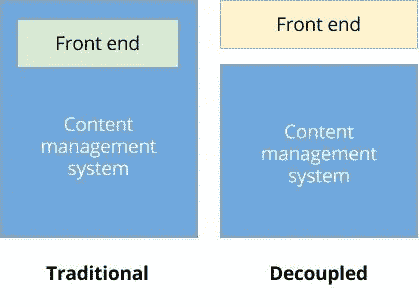
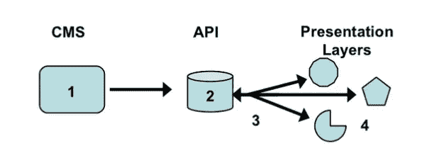
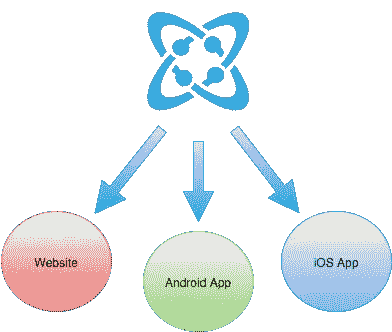

# 分离式 CMS 架构的优势

> 原文：<https://medium.com/hackernoon/benefits-of-a-decoupled-cms-architecture-6bc77b06961e>

内容和代码之间的关系已经接近尾声。该分手了。随着通过应用向消费者提供新的交互体验，面向消费者的表示层不再像过去那样从内容编辑器层中移除。内容编辑比以往任何时候都有更多的自由来规划和管理内容，因为它将呈现给最终消费者。

现代框架和编程语言允许您灵活地构建内容管理体系。我们在[宇宙堆栈](https://cosmicjs.com/)中写下自己的。内容编辑者可以在不影响其 HTML 和 CSS 在前端的可视化呈现的情况下布局其内容的方法称为“解耦”。

当由 Javascript 的小内容金块: [**JSON**](https://cosmicjs.com/) (JavaScript 对象符号)交付时，通过 [CMS API](https://cosmicjs.com/) 实现内容与代码的解耦。JSON 是一种轻量级的数据交换格式。对人类来说，读和写很容易。机器很容易解析生成。

# 传统与分离的 CMS 架构

传统的 CMS 系统，如 WordPress，将所有的前端 HTML / CSS 与内容管理系统和后端放在一个盒子里，这样内容编辑就可以在这个盒子里完成所有的工作。这听起来已经注定失败了，不是吗？为什么把王国的钥匙交给只负责一两件物品的人？

CMS API 不仅有助于提高内容发布的速度和便利性，还能保持应用程序的整体完整性。早期的分离系统仍然假设开发人员在 PHP 内工作，这只能解决一半的问题，因为新的现代框架和语言进一步促进了应用程序内轻量级的交互接触点。

# 一个 API，多个应用程序

宇宙 JS 已经解决了这个问题。 [Cosmic JS](https://cosmicjs.com/) 是一个 API 第一的基于云的内容管理平台，使管理应用程序和内容变得容易。与 [Cosmic JS](https://cosmicjs.com/) 的秘密在于，它将内容从代码中分离出来，以获得[分离的 CMS](https://cosmicjs.com/) 体验，但是 [CMS API](https://cosmicjs.com/) 可以插入任何互联网连接的应用程序，不管编程语言是什么。

[内容交付 API](https://cosmicjs.com/) 允许你一次编写，随处交付。当支持移动应用程序的 API 也支持您的网站时，可以节省开发人员的时间并满足项目的预算。

# 一次编写，随处交付

[Cosmic JS](https://cosmicjs.com/) 不仅向您的应用提供全球内容，还可以托管部署的应用、存储媒体和内容、向内容贡献者授予用户权限，并通过本地化和 Webhooks 等功能实现高级内容分发和团队管理。

使用 [Cosmic JS](https://cosmicjs.com/) 在全球范围内编辑、存储、管理和交付内容。通过让内容独立于您的代码发布，收回对内容的控制。脱钩，知道更好的事情在前方。

如果你还没有，那就从[报名](https://cosmicjs.com/signup)参加[宇宙 JS](https://cosmicjs.com/) 开始吧。如果你对 [Cosmic JS API](https://cosmicjs.com/) 有任何疑问，请在 [Twitter](https://twitter.com/cosmic_js) 或 [Slack](https://cosmicjs.com/community) 上联系创始人。

[卡森·吉本斯](https://twitter.com/carsoncgibbons)是[宇宙 JS](https://cosmicjs.com/) 的联合创始人& CMO，宇宙 JS 是一个 API 第一的基于云的[内容管理平台](https://cosmicjs.com/)，它将内容从代码中分离出来，允许开发人员用他们想要的任何编程语言构建流畅的应用程序和网站。

> [黑客中午](http://bit.ly/Hackernoon)是黑客如何开始他们的下午。我们是 [@AMI](http://bit.ly/atAMIatAMI) 家庭的一员。我们现在[接受投稿](http://bit.ly/hackernoonsubmission)并乐意[讨论广告&赞助](mailto:partners@amipublications.com)机会。
> 
> 如果你喜欢这个故事，我们推荐你阅读我们的[最新科技故事](http://bit.ly/hackernoonlatestt)和[趋势科技故事](https://hackernoon.com/trending)。直到下一次，不要把世界的现实想当然！

