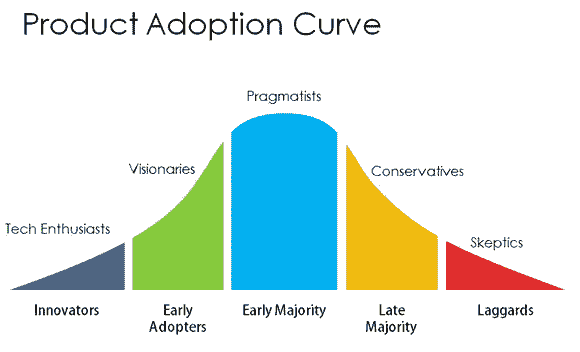

# 在产品采用方面成为创新者的好处

> 原文：<https://medium.com/hackernoon/benefits-of-being-an-innovator-in-product-adoption-e849f01ec10>

我希望你们大多数人都熟悉这条曲线。对于那些不知道的人来说，这是产品采用曲线。它显示了随着时间的推移，不同的消费者是如何采用一种产品的。

你可能是某些产品的创新者，并且已经享受到了好处。但是，也许你没有意识到。例如:使用 medium 的创新者不必为自定义域名付费。对他们来说还是免费的。只有那些想要自定义域名的人现在必须付费。

伟大的公司认为创新者的成功是他们的。就好像他们和你的公司有股份一样。

考虑电子设备。你知道聪明的创新者能拿回他们的钱吗？就好像他们没有为产品支付任何费用。有时，他们为产品赚的钱比他们的投资多五到十倍。

像 youtube 上的产品评论这样的事情是正常的。有时会做出疯狂的事情，比如破坏 Macbook 或者用 AK-74 射击 T2 的 Iphone。你可能会认为这些人疯了。但是没有注意到他们的浏览次数。这可以兑换成钱。

我的观点不是你破坏小工具。但是作为早期的创新者，你是一个明星。曲线的后半部分想听听你的意见。正如我前面提到的，你会得到很多免费或便宜的额外津贴，而这些都是迟到的大多数人必须支付的。

所以，今天为什么不尝试一些新的东西呢？

> [黑客中午](http://bit.ly/Hackernoon)是黑客如何开始他们的下午。我们是 [@AMI](http://bit.ly/atAMIatAMI) 家庭的一员。我们现在[接受投稿](http://bit.ly/hackernoonsubmission)并乐意[讨论广告&赞助](mailto:partners@amipublications.com)机会。
> 
> 如果你喜欢这个故事，我们推荐你阅读我们的[最新科技故事](http://bit.ly/hackernoonlatestt)和[趋势科技故事](https://hackernoon.com/trending)。直到下一次，不要把世界的现实想当然！

