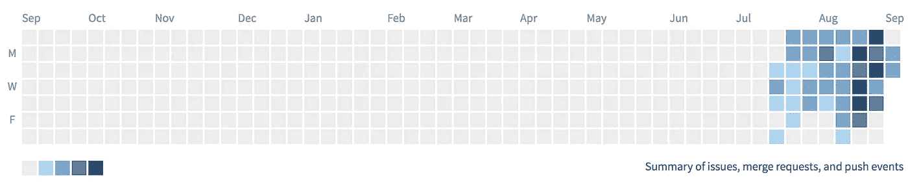
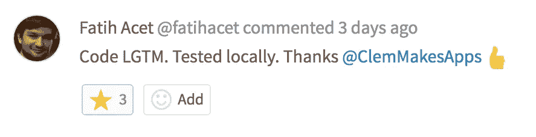

# 贡献于开源的好处

> 原文：<https://medium.com/hackernoon/benefits-of-contributing-to-open-source-2c97b6f529e9>

上个月，我第一次开始定期为开放源代码( [GitLab](https://gitlab.com/) )投稿。到目前为止，这是一个爆炸，我强烈推荐它！为开源做贡献有很多好处，但这些好处似乎还没有被充分讨论。所以，我决定花点时间分享一些我发现对 GitLab 有贡献的好处。

My contribution graph ([https://gitlab.com/u/ClemMakesApps](https://gitlab.com/u/ClemMakesApps))

# 贡献帮助你学习

我最初为 GitLab 做贡献的动机之一是提高我的前端技能。我在前端开发方面有着坚实的基础，但在很多方面我仍然想学习和成长。起初这很有挑战性，因为 GitLab 的堆栈使用了很多我不熟悉的工具和语言，但是随着时间的推移，我能够识别错误并创建有效的解决方案。

> 对开源做出贡献时，最有价值的学习时刻之一是合并请求审查过程。

在您提交了一份包含 bug 修复的合并请求后，开源项目的核心团队会进行审查，并提供建议和评论。这是一个学习最佳实践和练习交流思想过程的极好方法。核心团队赞赏您修复 bug 的努力(这为他们节省了处理其他关键项目的时间)，您也从他们那里获得了自由学习的机会！这是一个双赢的局面！

# 贡献是有趣的

另一个我没有想到的对开源做出贡献的方面是它会有多有趣。每次我的合并请求被合并，我都被要求做更多的事情。每次有人感谢我的贡献，激励我增加在社区中的参与。这是因为我觉得我的贡献正在产生影响。

Positive reinforcement works!

去年，我曾短暂工作过，创办了一家专注于非营利筹款的初创公司，我对慈善事业和贡献开源之间的相似之处着迷。我会证明他们的情感动机几乎是一样的。

总的来说，激励人们付出的情感驱动力是渴望有所作为。为开放源码做贡献(尤其是在大型项目中)也是为了在技术社区产生影响。

非营利组织试图专注于为他们的志愿者和捐赠者建立多个反馈回路，这样他们的一次性参与转化为定期参与。这在慈善事业中至关重要，也是许多开源项目不足的领域。

这方面的乐趣会因项目而异，但总的来说，根据我的经验，我会说 GitLab 在这方面做得比平均水平高。评审员定期对社区的贡献表示感谢，团队也在每个月的发布会上表彰了一位有价值的贡献者。

The prestigious golden fork for Most Valuable Person (MVP) and yes, I did win it for the most recent release (8.11)

# 贡献建立声誉

贡献的另一个好处是它建立了你的声誉/专业网络。这与参与非营利组织或聚会的方式相同。随着你的贡献，你建立了一个声誉和网络效应，在社区中被认为是一个伟大的开发者和优秀的沟通者。

虽然你可以将你的开源贡献作为公司和招聘人员的额外简历，但你也可以利用社区来帮助你获得更多的职业机会。[有人说 85%的工作都是通过社交网络完成的！](https://www.linkedin.com/pulse/new-survey-reveals-85-all-jobs-filled-via-networking-lou-adler)

# 结论

我希望你能看到为开源做贡献的一些好处，我希望这能让你思考一下。对于所有经常捐款的人，感谢你们所有的辛勤工作和铺平道路！也感谢 GitLab 的友好社区，他们花时间来审查我的问题和合并请求(@ [smcgivern](https://gitlab.com/u/smcgivern) ，[康纳·谢伊](https://medium.com/u/cee8890d6c15?source=post_page-----2c97b6f529e9--------------------------------)，@ [法蒂哈塞特](https://twitter.com/fatihacet)，@ [杰克考德斯](https://twitter.com/jakecodes)，@ [安娜贝尔·邓斯通](https://gitlab.com/u/annabeldunstone)，[卢克·贝内特](https://medium.com/u/67907ede5f9d?source=post_page-----2c97b6f529e9--------------------------------)，[菲尔·休斯](https://medium.com/u/b58f8d9dc2b4?source=post_page-----2c97b6f529e9--------------------------------))

> [黑客中午](http://bit.ly/Hackernoon)是黑客如何开始他们的下午。我们是 T21 家庭的一员。我们现在[接受投稿](http://bit.ly/hackernoonsubmission)并乐意[讨论广告&赞助](mailto:partners@amipublications.com)机会。
> 
> 如果您喜欢这个故事，我们建议您阅读我们的最新科技故事和[趋势科技故事](https://hackernoon.com/trending)。直到下一次，不要把现实世界视为理所当然！

