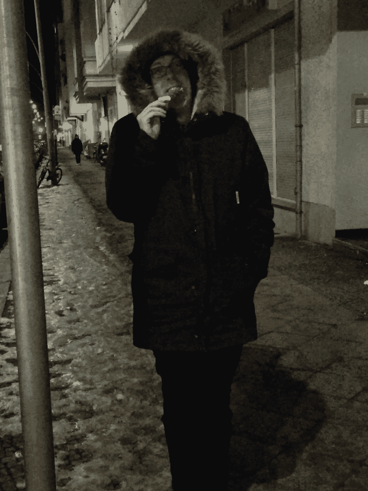
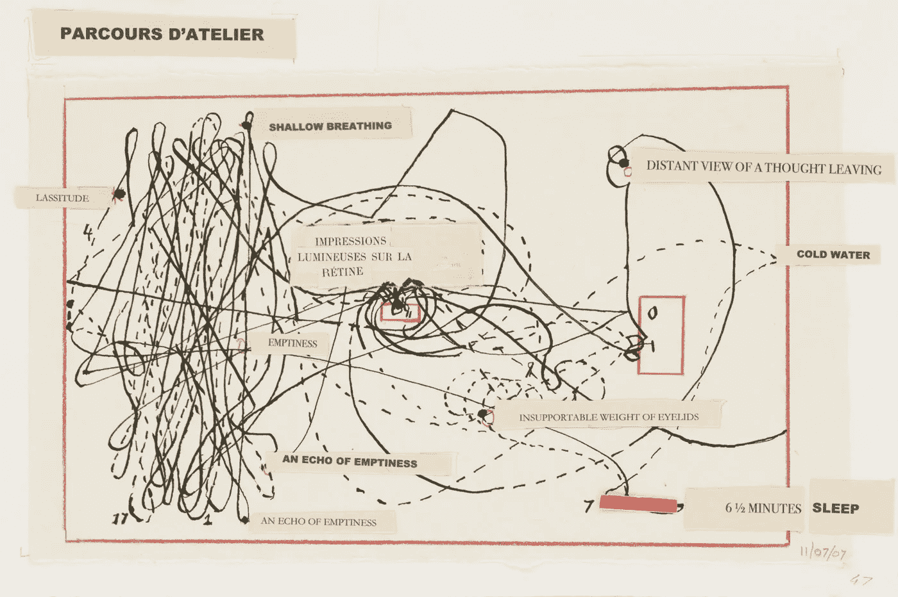

# 柏林的冬天，艺术展览和海底电缆

> 原文：<https://medium.com/hackernoon/berlin-winter-art-exhibitions-and-submarine-cables-ff46933cf5af>

## 播客

所有每周的微博都附有播客，点击这里订阅**或点击这里收听单集。**

## *天气*

*首先，本周初天气寒冷。连续几天，气温低至零下 11 度，高至零下 5 度。我知道对于你们中的一些人来说，在更北的攀登中，这只不过是在伦敦生活过，那里的大部分时间天气一般，墨尔本的最冷温度大约是 0 度，对我来说，这是我经历过的最冷的一次。*

*作为一个白痴，我决定在-7 骑自行车，并感受到了从未有过的感觉。作为一名冬季自行车骑手，我已经习惯了失去手指和脚趾的感觉，但感觉不到大腿，这是一种新的体验。*

*很像极热，一切都开始慢慢分崩离析，尤其是下雪的时候。我感到沮丧的是，我再也不能骑车了，当然，公共交通又拥挤又潮湿。我一直不明白为什么人们如此喜欢雪。我的意思是，开始的时候很好，但一天后，当它开始半融化，变成雪泥并冻结时，真的很恶心和危险。我也总是很生气，当议会清理冰雪的道路，却不关心人行道或自行车道，难道我们不够有价值吗？:(*

*无论如何，这一切让我意识到，我再也不能忍受欧洲的冬天了，明年我将在其他地方度过。20 度左右是生活的方式，宝贝。*

**

*I still felt like Ice-Cream*

## *画廊和博物馆*

*由于天气和社会活动刚刚开始，我在本周早些时候趁机参观了一些画廊和博物馆。我将逐一讨论他们的想法和意见。*

*波提切利文艺复兴
这是柏林的一个大型展览[，将于一月底结束，所以我想是时候去看看了。在与典型的令人困惑的德国售票系统谈判之后，我很快进入了画廊，画廊里忙得不可开交。展览从介绍波提切利的作品开始，通过他影响的作品来解释，这是很多的。展览中涵盖他自己作品的部分较小，也很有趣，因为它表明，正如那个时候常见的那样，艺术家们并不总是在他们的作品上签名，专家们只是猜测什么才是波提切利的作品。我也一直觉得这个概念很有趣，许多作品并不总是由艺术家自己制作，而是由一个团队制作。我一直着迷于我们现在认为的“高雅艺术”可能曾经只是主流的“大规模制造”的作品。我也喜欢阅读那些曾经得宠、失宠、现在又得宠的创意人士的故事。这表明我们所有人都有希望。](http://www.botticelli-renaissance.de/einfuehrung)*

*你可能知道也可能不知道，很多年前，我在一个名为 [Art Brut](https://en.wikipedia.org/wiki/Art_Brut) 的英国独立乐队里弹吉他。嗯，这个名字来源于 Jean Dubuffet 的艺术运动，所以看这个展览的机会太诱人了。这是一个小型展览，但我发现这件艺术品很鼓舞人心，因为它让我觉得，如果我有什么艺术作品想表达，我就可以表达，我如何表达并不重要，信息才是最重要的。这是我已经熟悉的东西，我一直是大卫·施莱格里的粉丝，他和我风格相似，但是有时候你需要一个提醒来再次鼓励你。观看这个空间的作品灵感来自展览。*

***从霍克尼到霍尔拜因——柏林的沃斯收藏馆**
[这个展览](http://www.berlinerfestspiele.de/en/aktuell/festivals/gropiusbau/programm_mgb/mgb15_hockney_holbein/ausstellung_hockney_holbein/veranstaltungsdetail_mgb15_hockney_holbein_114202.php)已经结束，我利用周一下午最后一次免费入场的机会快速参观了一下。这是一个杰出的收藏，有我最喜欢的一些艺术家，比如蒙克、毕加索等等。在一个空间里，灵感的经典艺术家和作品的剪切量是惊人的。励志。*

## *海底电缆*

**

*William Kentridge’s Parcours d’Atelier*

*这是一个奇怪的切线，但在前两次展览中，我也突然进入了同样好的'[双视觉](http://doublevision-berlin.de) ['](http://doublevision-berlin.de)') ，并遇到了[威廉姆·肯特里奇的工作室](http://doublevision-berlin.de/werke/william-kentridge-parcours-datelier-2007)，这让我想到了网络地图。我的祖父在他的工作生涯中与海底电缆有关，这让我们想要研究这个保持互联网功能的阴暗的水下世界。submarinecablemap.com 站点是世界各地电缆的交互式地图，我的祖父帮助铺设了英国和北美之间的 TAT-1。对于那些有兴趣了解更多这个话题的人，这里有一个维基百科页面和一篇很好的(我知道这很令人惊讶)每日邮报的文章。*

## *会面*

*本周是 2016 年的第一周，柏林的聚会又开始了，我参加了一个关于建立大型技术团队的普通讲座，看了一些 T4 不错的诗歌，听说了柏林最奇怪的地区之一的黑客，在柏林 Ruby 用户群发表了演讲，喝了很多精酿啤酒。我现在很累了。*

## *我这周写的其他地方*

*   *[将筹码商店变成棋盘游戏](http://gregariousmammal.com/turning-chip-shop-into-a-board-game/)*
*   *[下一个全栈语言？完美的服务器端 Swift】](http://www.sitepoint.com/server-side-swift-with-perfect/)*
*   *[爱沙尼亚:在东方、西方和世界之间](http://thenextweb.com/insider/2016/01/08/estonia-between-east-west-and-the-world)*

******

> *[黑客中午](http://bit.ly/Hackernoon)是黑客如何开始他们的下午。我们是 T21 家庭的一员。我们现在[接受投稿](http://bit.ly/hackernoonsubmission)并乐意[讨论广告&赞助](mailto:partners@amipublications.com)机会。*
> 
> *如果你喜欢这个故事，我们推荐你阅读我们的[最新科技故事](http://bit.ly/hackernoonlatestt)和[趋势科技故事](https://hackernoon.com/trending)。直到下一次，不要把世界的现实想当然！*

**