# 2017 年最佳免费 WordPress WooCommerce 主题

> 原文：<https://medium.com/hackernoon/best-free-wordpress-woocommerce-themes-2017-adc83032f048>

*本帖最初发表于* [*learnwoo*](http://learnwoo.com/best-free-wordpress-woocommerce-themes/) *。*

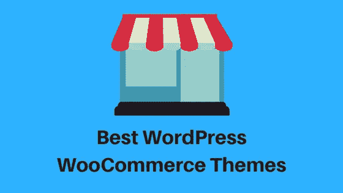

作为一个内容管理系统，WordPress 非常受欢迎。这种受欢迎程度也反映在大量运行在 WordPress-WooCommerce 上的电子商务商店中。在网上生意的成功中起作用的最重要的方面之一可能是网站的外观和感觉。您为网站选择的主题决定了您向潜在客户展示产品的效果。

# 如何选择主题？

选择主题可能是一个简单而复杂的过程。WordPress 知识库中有相当多的主题可用。然而，为您的商店找到合适的产品是一件具有挑战性的事情。在最终确定主题之前，你需要确保你仔细考虑了很多与你的商店相关的因素。

让我们先来看看一些很棒的免费 WordPress WooCommerce 主题。

# [店面](https://woocommerce.com/storefront/)

当你考虑与 WooCommerce 的兼容性时，没有什么比 Storefront 更好的了。这款软件由创建 WooCommerce 的同一批人开发，提供了与 WooCommerce 及其扩展的无缝兼容性，以及卓越的特性。你可能永远不用担心你的主题和插件(你已经在用了)之间的冲突。这种方式可以避免你的网站和业务大幅放缓。

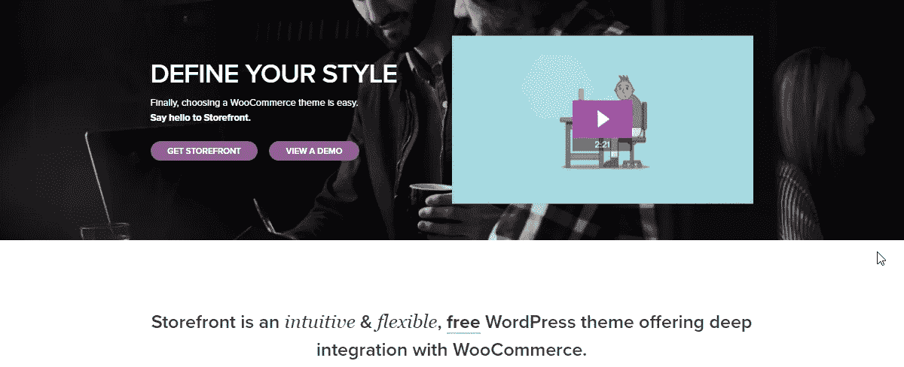

店面是直观和灵活的，并有一个移动友好的布局。它使用嵌套网格系统和模式标记为您的商店提供更好的搜索引擎优化结果。如果你想给你的商店增加一些独特性，Storefront 有许多子主题，你可以用来定制。这里有一篇文章，你可以参考[了解更多关于儿童主题](http://learnwoo.com/woocommerce-create-activate-child-theme/)。

Storefront 的基本结构简单而整洁。但是，如果您想要添加特性和功能，您可以使用几个扩展来管理它们。您可以找到各种单独的扩展和一个将许多功能打包在一起的 Storefront Bundle。下面的截图显示了商店页面与 Storefront 的外观:

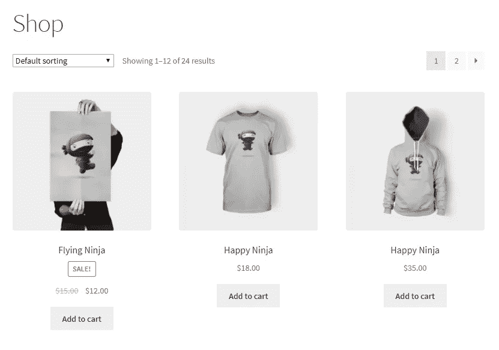

# [赫斯缇雅](https://themeisle.com/themes/hestia/)

赫斯缇雅是 WordPress 主题目录中最受欢迎的主题之一。它拥有超过 30，000 个活跃安装，在 WordPress 社区中享有很高的声誉。凭借犀利的设计和明智的功能，这款手机很容易就抓住了用户的心。WooCommerce 集成非常容易，你不需要大量的编码技能来设置它。

在赫斯缇雅的帮助下，你可以根据自己的喜好定制自己的网站。实时调整色调、设计细节和布局，并立即看到变化。自定义背景可与赫斯缇雅没有任何额外的插件的帮助-从视频，图像或媒体滑块选择。巨型菜单是另一个可以帮助你重新排列和组织子菜单的功能。赫斯缇雅确保快速加载时间，它可以在几秒钟内设置和配置。随着搜索引擎优化友好的结构，它也是翻译就绪，并提供 RTL 语言支持。

以下是赫斯缇雅的店铺页面截图:

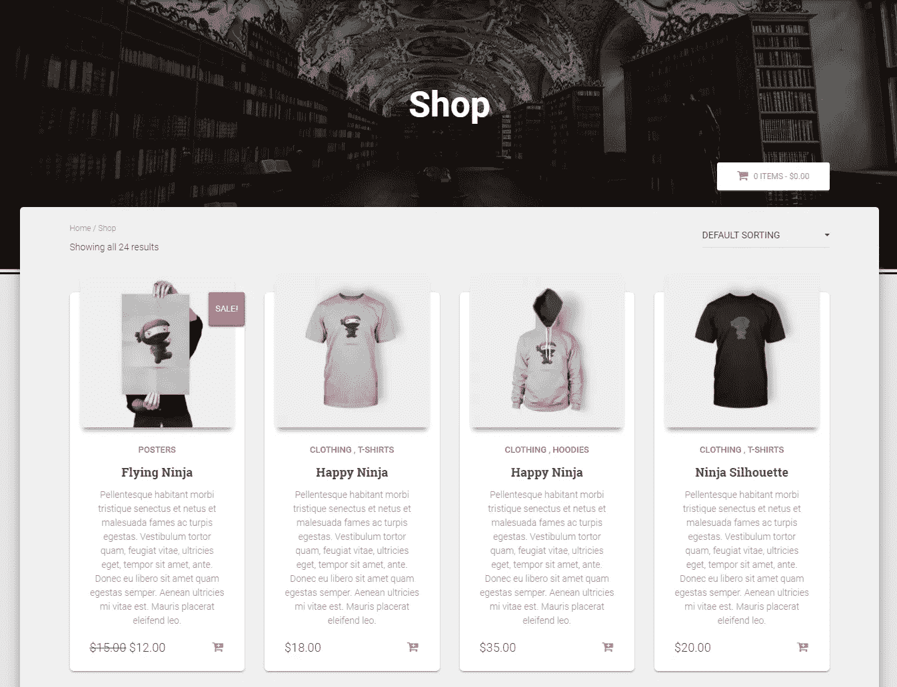

你将得到未来的主题更新，只需点击一下，如果你需要任何帮助，有很好的支持可以依靠。此外，他们有大量的文档、论坛和视频教程。

# [泽里夫建兴](https://themeisle.com/themes/zerif-lite/)

Zerif Lite 拥有超过 100，000 个活跃安装，在 WordPress 主题目录中非常受欢迎。一个简单的以用户为中心的设计是这个主题区别于其他主题的地方，根据那些使用过这个主题的人。快速的 WooCommerce 集成是这个主题的一个明显优势。

类似于赫斯缇雅，这也有一个现场定制，快速设置和自定义背景。这是搜索引擎友好和翻译准备。它还能确保您的商店快速装货。正如所料，你会得到这个主题的即时更新和快速支持。文档和视频教程在设置主题时肯定会有帮助。请看下面 WooCommerce 虚拟产品的商店页面:

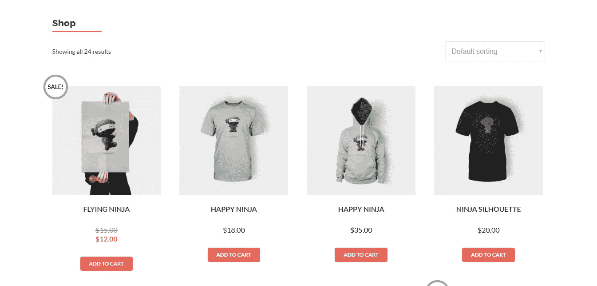

# [身材匀称](https://colorlib.com/wp/themes/shapely/)

Shapely 被定义为强大和多功能的，在 WordPress 社区中很受欢迎，有超过 20，000 个活跃安装。凭借广泛的定制选项，这款产品以出众的设计屹立不倒。优质的手感和图形的巧妙运用无疑为 Shapely 增添了某种魅力。

以下是商店页面的截图:

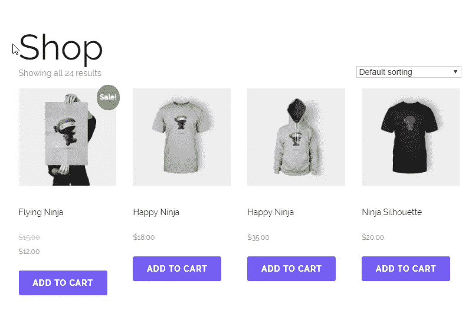

您会发现许多小部件为组织内容提供了惊人的灵活性。这一主题及其响应迅速、移动友好的设计兼容一系列常用插件，如 Jetpack、Yoast SEO、Gravity Forms 等。单页布局对商业网站特别有用。丰富的文档和可靠的支持无疑为这个主题增加了价值。

# [购物岛](https://themeisle.com/themes/shop-isle/)

在免费的 WordPress WooCommerce 主题列表中，ShopIsle 很容易就找到了自己的位置。极简主义的优雅是这个主题的标志性特征，适合从电子产品到设计师服装的一系列 WooCommerce 商店。灵活性，基于 bootstrap 的响应式设计，以及与一系列 WordPress 插件的兼容性也是这个主题所追求的特性。

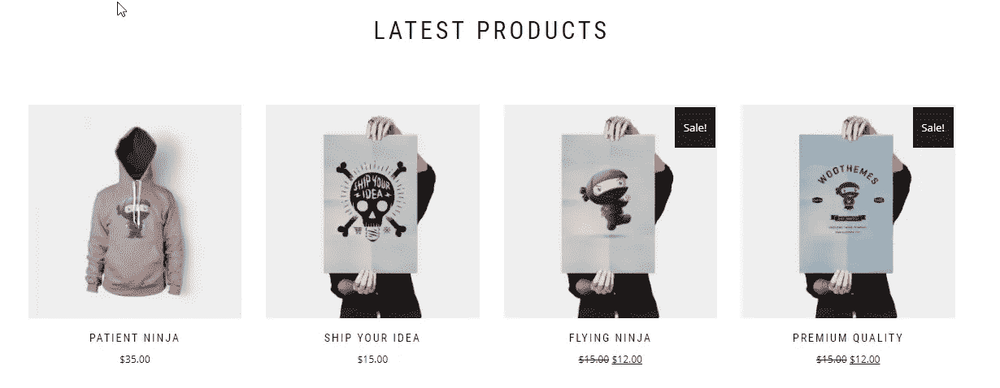

该配置考虑了从基本计算机知识到开发人员的所有类型的用户。易于编辑的代码和简单的主题选项布局有助于以最小的努力实现这一点。ShopIsle 兼容所有流行的浏览器，并支持 WPML 翻译。

与 Contact Form 7 的轻松集成确保了与目标受众的无缝沟通，完美无瑕的“关于我们”部分也为您的网站增添了特色。

# [制造](https://thethemefoundry.com/wordpress-themes/make/)

令人敬畏的定制选项帮助这个插件成为市场上最好的免费 WordPress WooCommerce 插件之一。强大的拖放功能甚至允许最少计算机知识的人出色地定制他们的站点。您可以控制页面布局选项和所有页面上的侧栏显示等方面。响应式设计使您的商店移动和平板电脑友好。与 WooCommerce 的整合也很顺利。以下是商店页面的截图:

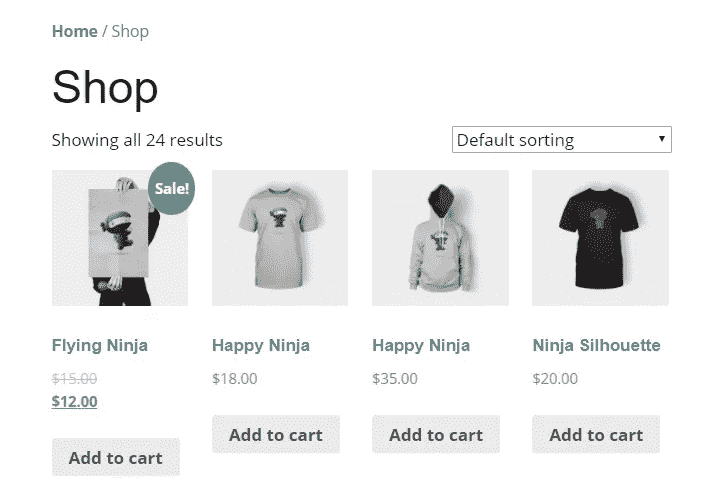

如果你想让你的 WooCommerce 商店脱颖而出，同时又能反映出你的签名风格，那么“make”就是你要走的路。

# [闪光灯](https://themegrill.com/themes/flash/)

Flash 非常灵活多样，你可以安装它来创建任何类型的网站。随着 WooCommerce 整合速度惊人，这个主题将真正支持你的商店，没有其他的。它通过 Flash Toolkit 和 SiteOrigin 的页面构建器插件保持了高度以用户为中心的设计和结构。授权超过 10000 个网站，这个主题的受欢迎程度与日俱增。

激活后，商店页面立即准备就绪，产品系列准备出售，演示产品截图如下:

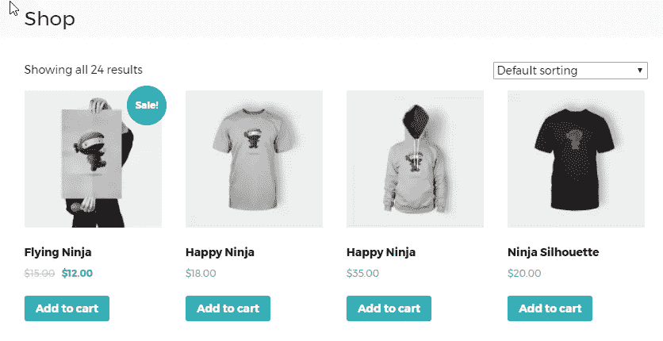

超过六个小部件区域增加了使用这个主题定制你的站点的潜力。主题是翻译就绪，并优化了巨大的速度和性能。它与主流浏览器兼容，遵循了搜索引擎优化友好结构的所有最佳实践。主题显然是移动和社交媒体友好。可靠的支持和良好的文档使这个主题成为 WordPress 主题目录中最好的主题之一。

# [宽敞](https://themegrill.com/themes/spacious/)

在 WordPress-WooCommerce 社区中非常受欢迎，spatial 有多种页面布局、模板、博客显示类型、窗口小部件区域和定制窗口小部件，专注于最高级的 WordPress 体验。

该主题拥有一个响应式的设计，并已准备好翻译。商业模板是一个独特的功能，它专注于为你的商店带来专业的吸引力。根据您的设计选择，有一个选择框或宽布局的选项。惊人的支持和结构良好的文档完善了这个拥有超过 70000 次活跃安装的多功能主题的健康本质。

当添加虚拟产品进行演示时，商店页面很快就准备好了。

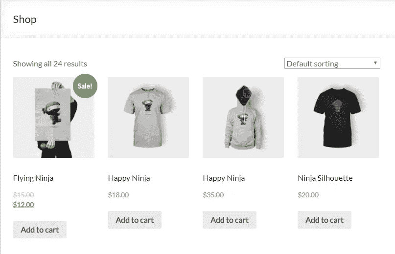

# [Illdy](https://colorlib.com/wp/themes/illdy/)

各种类型的企业可以使用 Illdy 建立自己的网站。实时定制提供每个人，包括设计新手，尝试在网站建设中使用这个主题。甚至还有额外的定制选项。全屏英雄形象有助于突出你的业务最重要的一点是这个主题的一个独特方面。

像大多数其他受欢迎的 WordPress 主题一样，Illdy 也为许多 WordPress 插件提供了完美的支持，如 Jetpack、iThemes、Contact Form 7 等。无限的颜色选择和基于矢量的图标提供了很大的创作空间，同时使用这个主题来设置你的网站。

bootstrap 框架提供了响应性设计和改进的移动友好性。正如所料，良好的客户支持和高质量的文件有助于这个主题的整体感觉良好的因素。超过 20000 次的活跃安装无疑反映了这一主题的日益流行。

设计明智的 Illdy 确实提供了一些令人惊喜的圆滑和时尚的视觉质量。以下是虚拟产品的截图:

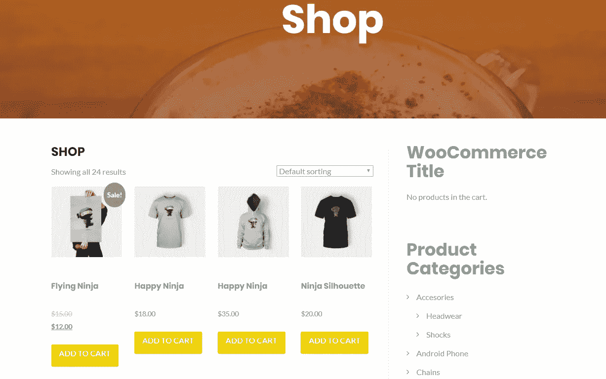

# [反应灵敏](https://cyberchimps.com/responsive-theme/)

说到受欢迎程度，Responsive 在 WordPress 主题目录中一直高居榜首。有超过 80000 个活跃安装，只有很少的主题胜过这个。有了流体网格系统，这个可以毫不费力地转换成任何显示。无论是在桌面、移动还是平板电脑上，您的客户都可以通过这一主题获得高效的用户体验。

功能列表勾选了所有正确的框——流畅的 WooCommerce 集成、SEO 友好、翻译就绪、浏览器兼容性、RTL 语言支持等等。干净的框架和整洁的布局也使它适合儿童主题。和列表中的大多数插件一样，Responsive 也提供了可靠的支持和高质量的文档。

没花多少时间就在店铺页面排好了产品，截图如下:

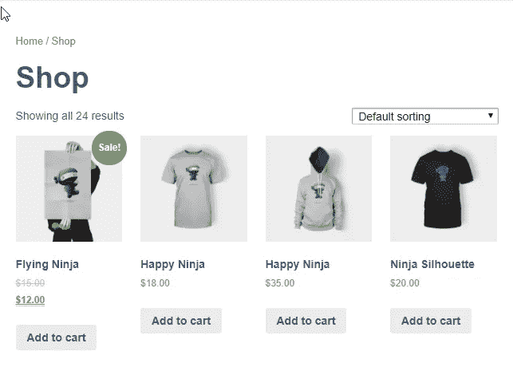

# 选择主题前需要考虑哪些因素？

当谈到电子商务网站时，网站所有者的关注点与信息网站或博客略有不同。让我们来看几个:

# 免费还是高级？

购买高级主题的一个显著优势是售后支持。作为高级客户，您可以从开发人员那里获得及时的更新。这是一个重要的方面，因为 WordPress 和 WooCommerce 一直在更新。另一个重要的是支持；你面临一个主题的问题，高级开发人员将随时准备帮助你。这是你支付额外费用购买一个主题时得到的保证。此外，优质主题确实为你的网站提供了卓越的质量和原创性；这肯定会帮助你的网站在市场中脱颖而出。另一件事是网站安全，一个可靠的主题开发者肯定会把安全放在首位。

显然，选择一个高级插件有很多好处。但是 WordPress 主题目录也有丰富的免费插件可供选择。如果你正处于一个阶段，你不想要一个主题形式的额外的财务承诺，你绝对可以选择一个免费的主题。WordPress 知识库中的许多免费主题展示了高质量和漂亮的特性。选择免费或高级主题是你需要根据你的商业立场来决定的事情。然而，任何主题都应该满足以下基本方面。

# 产品焦点

对于一个 WooCommerce 网站来说，在大多数情况下，首要考虑的是如何有效地向潜在客户展示产品。正确的 WordPress WooCommerce 主题应该更明确地关注这个方面。从 WordPress 主题列表中，你应该列出符合这个标准的候选主题。一旦完成，根据你销售的产品类型，你可以进一步缩短列表以找到合适的产品。

# 设计质量

正确的设计更多的是实用性，而不是美观。对于电子商务网站来说尤其如此。即使你的主题在视觉美感方面符合所有的要求，如果客户对你的网站感到困惑，那么整个要点就错过了。简单、直接的导航和可预测的用户界面在电子商务网站中是绝对必要的。

# 视觉吸引力

尽管视觉吸引力不是 WooCommerce 网站最重要的方面，但你不能完全忽视它。你选择的主题应该有合适的美学控制来呈现一个赏心悦目的网站。一个干净整洁的布局应该会激发潜在客户在你的网站上花更多的时间，并最终购买。你选择的主题对保证你店铺的视觉质量起着非常重要的作用。

# 响应式设计

您的潜在客户通过大量设备访问您的网站。研究不断指出，未来几天移动电子商务将快速增长。在选择主题时，你显然需要考虑到这一点。然而，一个令人欣慰的事实是，大多数 WordPress 主题开发者都非常重视响应式设计。不过，“手机友好”应该作为一个重要的标准列入你的清单。

# 灵活布局

电子商务网站的主要焦点显然是产品。然而，每一页都有很大的市场潜力。一个好的主题应该提供必要的灵活性，这样你就可以有策略地放置边栏、横幅等。例如，您可以根据对用户行为的分析输入，创新地定位您的追加销售和交叉销售。主题应该能够处理在你的网站上突出季节性促销和特色产品的需求。

# 与其他插件的兼容性

众所周知，WordPress WooCommerce 商店经常使用大量的第三方插件。你的商店的一些基本功能可能依赖于这些插件。你的主题至少应该能够支持你在网站上使用的重要插件。大多数主题开发者测试他们的主题与社区中领先的 WordPress 插件的兼容性。然而，通过与主题开发者的支持人员交流来确保这一点是一个好主意。

# 多语言支持

随着电子商务越来越受欢迎，人们发现在国际上做生意变得容易多了。你必须考虑来自不同语言的客户。正确的主题应该提供对多种语言的无缝支持。

# 社交媒体整合

当今商业战略的另一个不可避免的方面是社交媒体整合。作为一个电子商务店主，你应该能够在 facebook 上轻松分享你的最新产品。或者你可能想给在他们的圈子里分享你的产品的顾客提供奖励。你的主题应该为这一切的发生提供良好的社会媒体整合。

# 总结想法

选择正确的 WordPress WooCommerce 主题不仅仅是视觉感知和外观美学的问题。它更多的是关于主题如何有助于你的网站的预期功能。当你的网站是一个网上商店时，它是以用户为中心的设计，在潜在客户中建立信任的能力是至关重要的。我们相信上面列出的主题是你目前可以得到的一些最高评级的主题。如果你有什么要补充的，欢迎评论或联系我们。