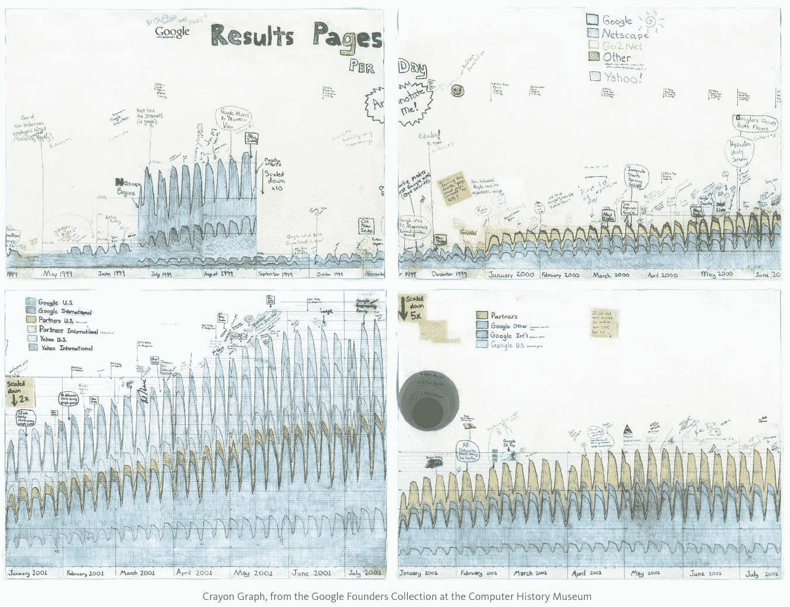

# 贝琪苦涩地咬了一口更好的比特币

> 原文：<https://medium.com/hackernoon/betsy-bitterly-bit-a-better-bitcoin-266d3f8d53f2>

## 本周其他 32 个顶级科技故事

多好的一周啊！我们的头条新闻由各种有才华的重量级人物、顶级开发者、新创始人、成长型黑客、风险资本家和比特币梦想家发布。

享受这份来自 [Hacker Noon](http://hackernoon.com) 的顶级科技故事精选列表。我们正努力在中午为您提供最好的黑客 sh*t。

*此外，如果您 6 月 20 日在旧金山地区，* [*使用折扣代码“@ami”获得我们就职活动*](https://www.eventbrite.com/e/inaugural-hacker-noon-party-tickets-34596684615) *的附赠票。*

## [@a16z 的 AI 剧本](http://aiplaybook.a16z.com/)

💾 [**将 AI 加入你的手机 App**](https://hackernoon.com/adding-ai-to-your-mobile-app-840f1c45d7ba) **作者** [**安德森·霍洛维茨**](https://medium.com/u/df45fd4a749d?source=post_page-----266d3f8d53f2--------------------------------)合伙人 [**弗兰克·陈**](https://medium.com/u/232fcbb483c?source=post_page-----266d3f8d53f2--------------------------------)

💾 [**赋予你的软件 AI 超能力**](https://hackernoon.com/giving-your-software-ai-superpowers-1baedbb71419) **由** [**安德森·霍洛维茨**](https://medium.com/u/df45fd4a749d?source=post_page-----266d3f8d53f2--------------------------------) **合伙人** [**弗兰克·陈**](https://medium.com/u/232fcbb483c?source=post_page-----266d3f8d53f2--------------------------------)

💾 [**机器学习的方式**](https://hackernoon.com/ways-in-which-machines-learn-b1824464dd5f)**by**[**Andre essen Horowitz**](https://medium.com/u/df45fd4a749d?source=post_page-----266d3f8d53f2--------------------------------)**搭档**[**Frank Chen**](https://medium.com/u/232fcbb483c?source=post_page-----266d3f8d53f2--------------------------------)

## 贝琪狠狠地咬了一口更好的[比特币](http://hackernoon.com/tagged/bitcoin)

💾 [**妙招你**](https://hackernoon.com/coup-you-a99d67477f31)**by**[**beauty on**](https://medium.com/u/e6958b5742d2?source=post_page-----266d3f8d53f2--------------------------------)**，谁的推特简历上写着“** [**比特币就是**](https://hackernoon.com/@beautyon_) **。这就足够了。”**

💾 [**不要用区块链，除非你需要**](https://hackernoon.com/dont-use-a-blockchain-unless-you-need-to-bc063d0f9a80) **作者** [**阿利斯泰尔·罗氏**](https://medium.com/u/5a238820f061?source=post_page-----266d3f8d53f2--------------------------------) **，他写了 2017 年科技博客的伟大线索之一**

## 机器人

💾 [**我如何为电报制作了一个食物识别机器人，为什么它没有未来(还没有)**](https://hackernoon.com/how-i-made-a-food-recognizing-bot-for-telegram-and-why-it-doesnt-have-a-future-yet-c97d9c6e249b) **作者:22 岁吃快餐的 js/ruby 编程小伙**[**Artem barbynahra**](https://medium.com/u/6767367a1381?source=post_page-----266d3f8d53f2--------------------------------)

💾 [**如何用 Node.js 打造脸书 Bot App**](https://hackernoon.com/how-to-build-a-facebook-bot-app-using-node-js-74629d4243ec)**作者 CEO &宇宙 js 联合创始人** [**托尼·斯皮罗**](https://medium.com/u/f65dbbc79b6?source=post_page-----266d3f8d53f2--------------------------------)

## 冷外联

[**完美的冷邮件**](https://hackernoon.com/the-perfect-cold-email-eab1ddcc10dd) **作者** [**乔丹宁**](https://medium.com/u/44177f8b0abf?source=post_page-----266d3f8d53f2--------------------------------) **引用** [**山姆奥特曼**](https://medium.com/u/22acd7905c72?source=post_page-----266d3f8d53f2--------------------------------) **。**

## 创建入站链接

[**口袋妖怪 Go 和一个反向链接策略如何帮助我们公司冲击黄金**](https://hackernoon.com/how-pokemon-go-and-a-backlinking-strategy-helped-our-company-strike-gold-41bc9ae947e6) **由 AppInstitute 市场经理**[**nabe ENA Mali**](https://medium.com/u/6c6f187d2af6?source=post_page-----266d3f8d53f2--------------------------------)

## 娱乐

💾[**VR 有前途吗？**](https://hackernoon.com/when-will-the-future-42c1419533bb) **由 VR 在线社区** [**锤子&獠牙**](https://medium.com/u/655d3ac28c4f?source=post_page-----266d3f8d53f2--------------------------------)

## 科技独角兽如何建立… &持之以恒

💾[**(pin)追踪数据**](https://hackernoon.com/applications-of-pin-trace-data-3b9e6dc2744b) **应用** [**Pinterest 工程**](https://medium.com/u/ef81ef829bcb?source=post_page-----266d3f8d53f2--------------------------------)

💾 [**保存创新文化:谷歌创始人收藏来到计算机历史博物馆**](https://hackernoon.com/this-is-going-to-be-huge-google-founders-collection-comes-to-chm-27356256731f) **由** [**计算机历史博物馆**](https://medium.com/u/de2302dabfe4?source=post_page-----266d3f8d53f2--------------------------------)

## 很容易以 90 美分的价格卖出美钞

💾 [**不要被 GMV**](https://hackernoon.com/dont-get-seduced-by-gmv-39be653dde9a) **所诱惑** [**方正集体**](https://medium.com/u/f49435c6fa9?source=post_page-----266d3f8d53f2--------------------------------)

## [Javascript](https://hackernoon.com/javascript/home) 详情

**💾** [**如何用摩卡测试 JavaScript 基础知识**](https://hackernoon.com/how-to-test-javascript-with-mocha-the-basics-80132324752e) **波士顿全栈 Web 开发者** [**布兰登·莫雷利**](https://medium.com/u/e9031892baf5?source=post_page-----266d3f8d53f2--------------------------------)

💾 [**回调到底是个什么鬼？**](https://hackernoon.com/javascript-what-the-heck-is-a-callback-aba4da2deced) **由波士顿全栈网站开发者** [**布兰登莫雷利**](https://medium.com/u/e9031892baf5?source=post_page-----266d3f8d53f2--------------------------------)

**💾** [**究竟什么是立即调用的函数表达式？**](https://hackernoon.com/javascript-what-the-heck-is-an-immediately-invoked-function-expression-a0ed32b66c18) **由波士顿全栈网站开发者** [**布兰登莫雷利**](https://medium.com/u/e9031892baf5?source=post_page-----266d3f8d53f2--------------------------------)

## 学习编码快速课程

**💾** [**用 10 行 Python 代码**](https://hackernoon.com/build-a-naive-article-spell-checker-in-10-lines-of-python-code-b325a67f2c3)**[**【AMR】**](https://medium.com/u/bee33e964a63?source=post_page-----266d3f8d53f2--------------------------------)**构建一个幼稚的文章拼写检查器，谁是随机性、不确定性、异常性的朋友！****

## **为[脸书](http://hackernoon.com/tagged/facebook)工作后的生活**

**💾 [**软件工程师→ SaaS 创始人**](https://hackernoon.com/software-engineer-to-saas-founder-c16154013e12) **由精明的 CEO** [**安德鲁·拉斯姆森**](https://medium.com/u/5fde1fe8bca3?source=post_page-----266d3f8d53f2--------------------------------)**

## **[产品管理寿命](https://hackernoon.com/product-management-life/home)**

**💾 [**敏捷没吃作业……**](https://hackernoon.com/agile-didnt-eat-your-homework-269cece92274)**由 Zendesk 高级产品经理** [**约翰·卡特勒**](https://medium.com/u/4c3f4fe11e6b?source=post_page-----266d3f8d53f2--------------------------------)**

**💾 [**【非特性】工作的价值**](https://hackernoon.com/the-value-of-non-feature-work-70572c6d1c8d) **由 Zendesk 高级产品经理**[**John Cutler**](https://medium.com/u/4c3f4fe11e6b?source=post_page-----266d3f8d53f2--------------------------------)**

## **反应，反应，反应**

**💾 [**我们改进 React 原生 app 的 5 种方式**](https://hackernoon.com/5-ways-we-improved-our-react-native-app-2704d5098b20) **由年轻、斗志昂扬、充满渴望的开发者**[**Lorenzo Sciandra**](https://medium.com/u/b25eae7ad28?source=post_page-----266d3f8d53f2--------------------------------)**

**💾 [**一个对 TODOs 做出反应的例子，由编码教育家**](https://hackernoon.com/a-react-todos-example-explained-6df53cdebed1) [**解释了**](https://medium.com/u/c64c4b529a5d?source=post_page-----266d3f8d53f2--------------------------------) **萨梅尔布纳****

**💾 [**如何制作 React Native flat list**](https://hackernoon.com/how-to-animate-the-items-of-a-react-native-flatlist-32c8cbf7ea3d)**by 老师&创始人** [**斯潘塞**](https://medium.com/u/1ec17560bf99?source=post_page-----266d3f8d53f2--------------------------------)**

**💾 [**【让反应再快】系列**](https://hackernoon.com/@edelstein) **作者 LogRocket JS 创始人&前谷歌人** [**本·埃德尔斯坦**](https://medium.com/u/761b6ecc0758?source=post_page-----266d3f8d53f2--------------------------------)**

## **[自动驾驶汽车](http://hackernoon.com/tagged/self-driving-cars)**

**💾如果一个人在(优步/特斯拉/Waymo)无人驾驶汽车中丧生，谁该负责？ **由** [**色艺 Fabode**](https://medium.com/u/e502edf967bf?source=post_page-----266d3f8d53f2--------------------------------)**

## **团队建设课程**

**💾 [**你能不:一个关于前端编码的咆哮采访**](https://hackernoon.com/could-you-not-a-rant-about-front-end-coding-interviews-9f12c1a06e9a) **由**开发者，漫画艺术家&资深 [**克里斯汀娜尤因**](https://medium.com/u/e342e8c60df8?source=post_page-----266d3f8d53f2--------------------------------)**

**💾 [**为了一个包容的文化，试着少工作**](https://hackernoon.com/for-inclusive-culture-maybe-less-is-more-87b663662cea) **由**软件人；分号爱好者 [**有钱的阿姆斯特朗**](https://medium.com/u/47b9fdb02c02?source=post_page-----266d3f8d53f2--------------------------------)**

**💾 [**去做文化添加，不做文化契合**](https://hackernoon.com/go-for-culture-add-not-culture-fit-84de44022496) **由代工集团总经理** [**布拉德菲尔德**](https://medium.com/u/65d8116a012c?source=post_page-----266d3f8d53f2--------------------------------)**

**💾 [**风暴执行:团队生产力的 4 个阶段**](https://hackernoon.com/storm-to-perform-the-4-stages-of-team-productivity-b47370c5ab17) **通过可视化协作工具** [**Trello**](https://medium.com/u/fb5dd2d116a1?source=post_page-----266d3f8d53f2--------------------------------)**

## **值得一试的三种新工具**

**💾 [**用 mini.css**](https://hackernoon.com/designing-a-simple-web-page-with-mini-css-f455e9f6403b) **设计一个简单的网页由方正& web 开发者**[**Angelos Chalaris**](https://medium.com/u/7c825470e7a3?source=post_page-----266d3f8d53f2--------------------------------)**。****

****💾** **由** [**安卓**](http://hackernoon.com/tagged/android) **工程师** [**塞瓦斯蒂亚诺**](https://medium.com/u/3eb295440d60?source=post_page-----266d3f8d53f2--------------------------------)**

****💾** [**你想了解的 Chrome DevTool 新功能(灯塔)**](https://hackernoon.com/the-new-chrome-devtool-feature-you-want-to-know-about-c0d2371151d6) **由全栈 Web 开发者** [**Dor Moshe**](https://medium.com/u/6107923b20dc?source=post_page-----266d3f8d53f2--------------------------------)**

## **加速[深度学习](http://hackernoon.com/tagged/deep-learning)**

**💾 [**六月更新，下集**](https://hackernoon.com/up-to-speed-on-deep-learning-june-update-part-2-b4942c6812ad) **由** [**请求创业**](https://medium.com/u/c2ff4585803c?source=post_page-----266d3f8d53f2--------------------------------)**

## **科技与文学、单口喜剧相遇的地方**

**💾[**Kafka 和消息队列**](https://hackernoon.com/a-super-quick-comparison-between-kafka-and-message-queues-e69742d855a8) **之间的超级快速比较，由**全栈 JS 开发者& PluralSight 作者**[**Hendrik Swanepoel**](https://medium.com/u/305c26ca4517?source=post_page-----266d3f8d53f2--------------------------------)****

****💾 [**为什么创业像单口喜剧**](https://hackernoon.com/why-entrepreneurship-is-like-stand-up-comedy-9227bb3d46af) **由产品发烧友&创业者** [**希瓦尔·古普塔**](https://medium.com/u/1b56910b667d?source=post_page-----266d3f8d53f2--------------------------------)****

## ****机器人会取代我的工作吗？****

****[**从创意到 4 周 400 万浏览量**](https://hackernoon.com/from-idea-to-4m-page-views-in-4-weeks-622aa194787d) **由** [**产品猎奇**](https://medium.com/u/b8b4445269d0?source=post_page-----266d3f8d53f2--------------------------------) **年度人物** [**穆巴拉克**](https://medium.com/u/fb152e626d90?source=post_page-----266d3f8d53f2--------------------------------)****

## ****营销预算只有 0 美元左右…****

****[**下面是 Fam 应用如何在 10 天内获得 1024786 次下载的**](https://hackernoon.com/how-fam-got-1-024-786-users-in-10-days-with-0-ish-in-marketing-243aa81c972f) **由** [**佛朗哥·尤迪奇亚尼**](https://medium.com/u/e4b97540e80b?source=post_page-----266d3f8d53f2--------------------------------)****

********

****直到下一次，不要把世界的现实想当然，****

****[大卫·斯穆克](https://medium.com/u/7f91547ce9c9?source=post_page-----266d3f8d53f2--------------------------------)，[黑客中午](http://hackernoon.com)(对[阿米](https://medium.com/u/1fedc8fffada?source=post_page-----266d3f8d53f2--------------------------------))****

*******附言*** *下面是我在 Caycon.com 做的一个* [*采访:成功是意志的函数&时机*](https://hackernoon.com/success-is-a-function-of-will-and-timing-said-amis-david-smooke-22673fb56ae8) *。*****

*******P.P.S.*** *如果您在旧金山地区，6 月 20 日，* [*使用折扣代码“@ami”获得我们就职活动的补充票*](https://www.eventbrite.com/e/inaugural-hacker-noon-party-tickets-34596684615) *。*****