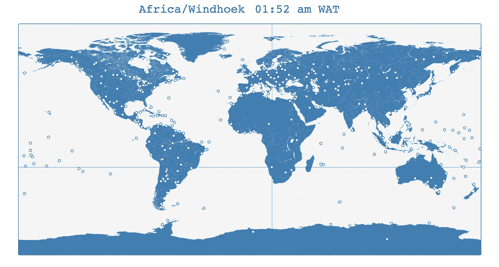
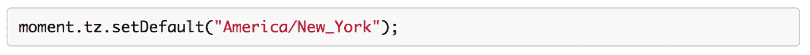
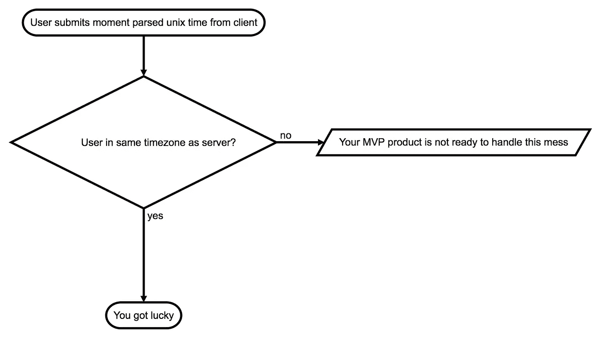

# 更好地了解一个模块:时刻时区

> 原文：<https://medium.com/hackernoon/better-know-a-module-moment-timezone-e7da940b9586>

Image from [Loic Djim](https://unsplash.com/@loic)

几年来，我一直在思考快速繁殖的外星白蚁物种 npm 模块的困境。众所周知，这个社区创造了模块创建、采用和最终放弃的记录。

面对快速的变化，坚持那些永恒的东西是人类的反应。为了表彰真正有用的工具，我认为我应该对我在每个项目中使用的工具**给予一些赞扬。**

这些是重型工具，简单的工具，吸引很少竞争的工具，因为它们是同类中最好的。这些项目致力于语义版本化，他们编写(和更新)开发人员文档，他们编写单元测试。

最重要的是，这些工具处理了一个复杂而又棘手的问题。在最好的情况下，他们把你的问题归结为一个简单的步骤。在最坏的情况下，它们提供了一个为混乱世界的严酷条件而设计的一致的 80/20 解决方案。

在去年的[左垫灾难](https://www.theregister.co.uk/2016/03/23/npm_left_pad_chaos/)之后，我不能说像[时刻时区](https://momentjs.com/timezone/)这样的好的、深思熟虑的模块足够了。

# 时刻时区

由 Tim Wood 在 2012 年创建的 Moment Timezone 是对他早期的 Moment.js 库的有益补充，大多数 Javacript 开发者对这个库都很熟悉。

对于 Moment.js，没有什么可抱怨的。对于 JavaScript 中令人困惑且有限的日期和时间处理，它是一个明智、健壮且维护良好的替代品。该项目是如此的一致和周到，我像一个本地模块一样应用它。没有它我从不离开我的家。

Moment Timezone 主要扩展 Moment.js 库来处理时区相关的操作和转换。

**其他快速事实**

*   Github[上的 32 个贡献者](https://github.com/moment/moment-timezone)
*   31 个版本
*   维持一个活跃的问题委员会
*   有一个很棒的文档页面[这里](https://momentjs.com/timezone/docs/)
*   在的文档页面[上运行实时时区测试！](https://momentjs.com/timezone/tests/)
*   有一个非常酷的交互式时区可视化，如下所示:

# 开发者设置

如果您想了解一两件关于项目寿命的事情，请查阅开发人员文档。Moment Timezone 通过了我的测试，它提供了简单而全面的文档解释:

1.  开发人员的依赖性
2.  运行测试
3.  编译健壮时区数据
4.  贡献新区域
5.  针对新时区或现有时区的构建测试

强调测试对于执行复杂多样转换的库来说至关重要。小的时区错误可能会被忽视，你只能想象它对各种应用程序(金融、政府、医疗管理、通信、赌博等)的连锁反应。

开发人员环境利用 Grunt 进行构建和测试。虽然 Grunt 现在看起来已经过时了。在这一点上，我建议进一步投票支持图书馆:

创造者和贡献者更关心过程的稳定性，而不是闪亮物体综合症。

下面简单介绍一下入门是多么简单:

# MVP 用例

如果你今天没有学到别的，那就学这个。

**大多数最小可行产品不需要处理时区的复杂性。**

对于 Moment Timezone 来说，最有用的一种情况是设置默认的应用程序范围。我在我的每一个 web 或节点项目中都这样做(或有所变化):

在浏览器应用程序中，您可以在任何版本的 init 文件中进行设置。对于 express 应用程序，我建议主 js 文件也是如此。

默认时区将使您摆脱主要基于用户机器(客户端)或服务器时区(服务器端)的不同时区所带来的混乱。

我在**没有**时区时遇到的最大问题是可变的客户端和服务器时间。流程是这样的:

我更喜欢**设置它然后忘记它**的方法。如果我的 MVP 目标是纽约的酒吧，并列出他们的欢乐时光，我可以在所有应用程序上默认我的时区为美国/纽约。混乱解除！

除此之外，默认时区为您提供了时区转换的基准。如果您的应用程序恰好需要多个时区，没有更可靠的方法来快速获得您需要的转换。

# 但是等等！还有更多…

Moment Timezone 和 Moment.js 有很多我没有接触过的更高级的特性。我的用例相当普通。最多，我倾向于处理美国时区和快速的一次性转换。然而，这正是图书馆的魅力所在。

查看[文档页面](https://momentjs.com/timezone/)，不要忘记享受构建东西的乐趣。