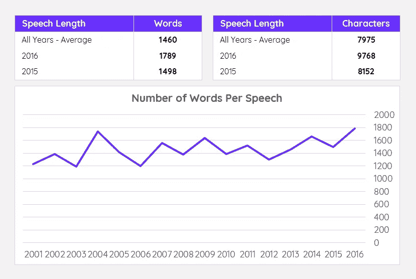
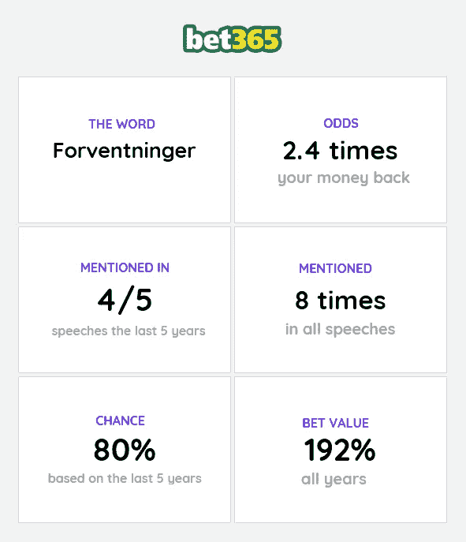
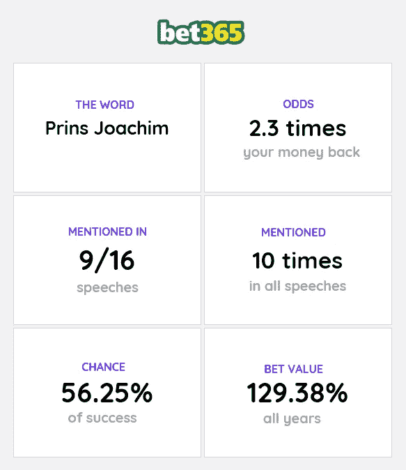

# 押注新年致辞——数据与传统的完美结合

> 原文：<https://medium.com/hackernoon/betting-on-the-new-year-address-the-perfect-mix-of-data-traditions-765af93f504d>

从我记事起，我就看着丹麦女王坐在丹麦人民面前发表新年致辞。许多人认为在除夕观看她的演讲是一种传统。它提供了一个很好的机会来聚集朋友，手里拿着一杯香槟回忆过去的一年。在这篇文章中，我将谈谈我自己在新年演讲上下注的传统，并向你提供我最好的下注建议。

# 数据的故事

近年来，各种博彩公司已经开始提供对演讲的投注可能性。这给我提供了一个机会，让我的演讲更加精彩。博彩公司都就演讲中是否会提到某个特定的词打赌。

在快速评估了可用的赌注后，我认为很难判断一个赌注是否有任何重大价值。我和一个朋友一起，决定把每一篇公开发表的演讲都编入目录。这包括找到所有的演讲，创建一个单词计数器，随后创建一个 Excel 表，用来保存[数据](https://hackernoon.com/tagged/data)和来自不同博彩公司的赌注。

这个数据每年都在发展，我们现在有演讲中提到的 100 多个单词的详细数据。这些数据包括一个词在每次演讲中被提及的次数，一个词被提及的总次数以及更多关于演讲的一般数据。虽然第一次收集数据很费时间，但现在只需要在每次演讲后进行少量更新。

我们创造了一组简单的关键数字来显示每年演讲长度的变化。

Descriptive Statistics of the speeches

Excerpt of the data (the number of times a word is mentioned every year)

# 最佳赌注— 2017 年

现在到了真正重要的部分。**我们推荐什么赌注？**

通常我们喜欢高回报的赌注，因为价值更高。我们找到了回报较低的赌注，但它并没有提供相同数额的赌注价值。

# 第一个建议

第一个赌注是我们今年最喜欢的赌注之一。它与另一个建议略有不同，因为这个建议的下注值仅依赖于过去 5 年。如果我们看总的年数，它没有太大的下注价值。然而，在有限的时间范围内，这似乎是一个很大的赌注。你可以看到下面的关键论点。

# 第二个建议

女王有特定的方式来称呼皇室成员。第二个赌注是她的儿子(王子)，在演讲中经常被点名。你可以在下面的方框中看到赌注的关键论点。

有了这些建议，我在新年致辞中给出了我的可靠赌注。还有其他多种具有合理下注价值的下注，但我们选择了这些，因为它们的回报更高。

请注意，这些建议仅是我的个人意见，随着新年致辞的临近，这些值可能会经常变化。此外，分析主要基于统计数据。全年发生的事件没有考虑在内。

你可以在丹麦王室的网站上找到他们所有的演讲，并创建你自己的分析:【http://kongehuset.dk/taler

你可以在不同的网站上找到赌注。下注 Bet365 的直接链接在这里:【https://goo.gl/Eu43Hh 

如果它不能直接带你去下注，去**特价**类别，在丹麦下面找。

如果您需要更多信息，请随时联系我们。我很乐意看看我是否能为你找到一个好的赌注。

祝好运和新年快乐！