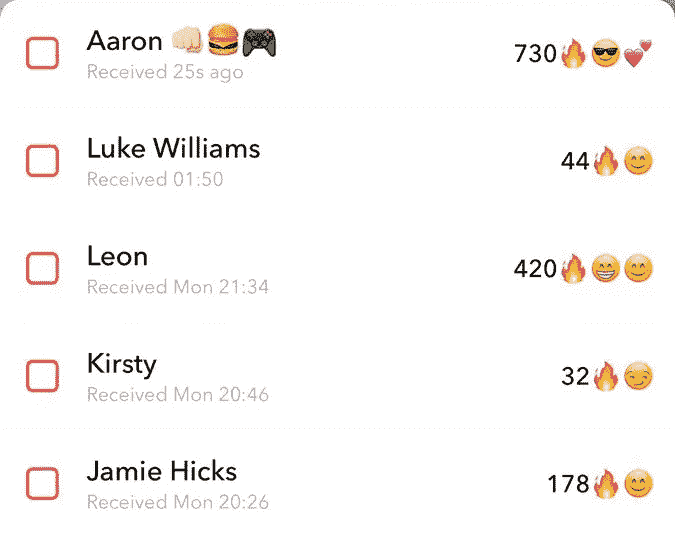
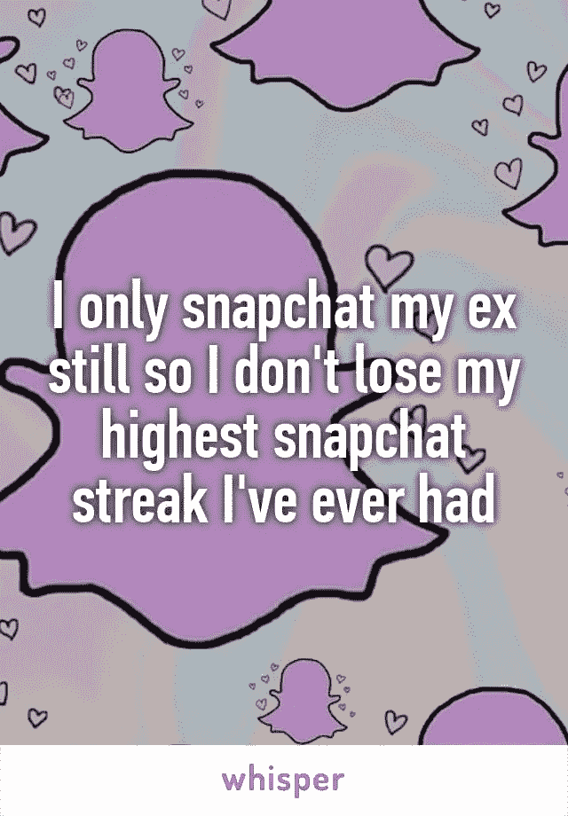
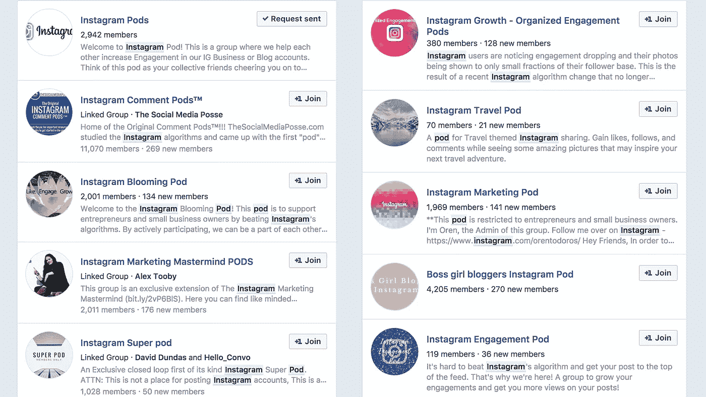
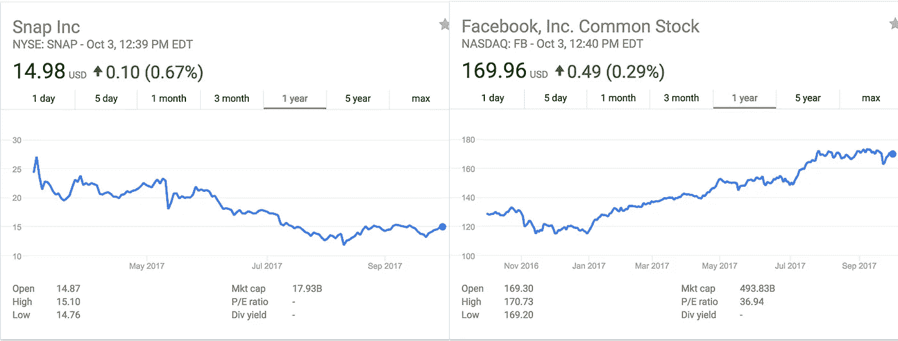

# 在机器人和 Z 世代之间，新的 Instagram 和 Snapchat 使用指标毫无意义

> 原文：<https://medium.com/hackernoon/between-bots-gen-z-the-new-instagram-and-snapchat-usage-metrics-are-meaningless-8c329a343874>

## 快照条纹

你知道什么是快照，对吧？

以防你不知道，这里有一整页 Snapchat 的 Q &来解释 Z 世代/青少年日常使用 Snap 的大部分是什么样子的。

用户名右边的这些数字让彼此知道他们已经连续来回发送了多少张照片，对于年轻人来说，这意味着一切。

这是关于年轻用户的事情，他们收集条纹就像一扇渴望好风的窗户，他们并没有像你想象的那样抓拍。

例如，也许你正在看你的朋友日的故事，里面充满了他们切下热奶酪牛排的照片，同时烧掉他们的脸，或者在某个随机的 7-11 停车场进行的思乐冰 slurp-down 大脑冷冻挑战的视频。

太好玩了！

Snapchat 就是这么回事！

它是用来捕捉生活中那些无脚本的时刻，并与你的朋友分享，或用作你的主要 messenger 应用程序，因为你认为所有其他的都比它狗屎！

但是年轻一代更关心的是无论如何都要保持连胜。

因此，他们发送的不是有趣、即兴的图像和视频，也不是在短信中进行对话，而是写着“streak”的空白照片。更好的是，有些人甚至不花时间写条纹，只是在一张模糊的地毯上画 4 条线。

前女友？

去他妈的。必须保持这样的连胜，因为这是你有过的最高纪录，所以只要坚持下去，直到她堵住你的屁股。然后截图。

## 伟大的内容💯🙌🤘

Instagram 一直试图“控制”他们在过去一年中一直存在的机器人问题。

他们成功地谋杀了[国会](https://instagress.com/)，但仍有更多人留下最明显的废话模糊的评论，甚至[第二次日期更新](https://soundcloud.com/live955pdx/sets/brooke-jubals-second-date)听起来更现实。

关于使用数量的另一个问题是 Instagram Pods。

你可以在脸书各地找到这些团体，有许多不同的角度和内容类型。

它们是这样工作的:

你要求加入，对于他们中的一些人来说，在被批准之前，必须通过新脸书小组的问卷调查，这给了 mods 一种夸大的错觉。一旦在小组中有一个预定的时间，一天多次，其中一个主持人将宣布这是去的时间！

在特定的时间，小组中的每个人都会在 Instagram 上放一个图片链接作为评论，每个人都会喜欢这些帖子。一旦你这样做了，你就会喜欢帖子链接，这样无论是谁发帖，都知道你已经尽了你的职责，弯下腰把它塞进了他们的屁股里。

每种类型的参与都有单独的时间，所以有些可能是为了点赞，有些可能是为了评论。

## 现在什么他妈的被认为是用法？

所以问题就变成了，什么才算真正的用法？是在人们使用应用程序时，还是在任何时候，只要有人在内部记录的任何东西上轻轻一点，就可以使用应用程序？

如果我在街上随便走到一个人面前，用一加仑浓度为 2%的牛奶直接猛击他的眉心，这算不算 DAU 乳品公司的指标？

随着 Instagram 的日活用户数在一年内跃升至 2 亿，月活用户数达到 8 亿，大部分重点都放在了故事如何帮助他们达到这样的增长率上。另一方面，自 Snap Maps 推出以来，Snapchat 为“我们的故事”贡献的[内容量增长了 30%。](http://www.businessinsider.com/instagram-on-track-to-top-snapchats-new-user-sign-ups-2017-9)

2017 年 8 月，Instagram 在全球范围内获得了 62%的新用户注册，而 Snapchat 则获得了 38%。这两个增长数字听起来都不错，但 Snapchat 继续在市场上停滞不前，而 Instagram 在监护权之战中的赢家脸书继续增长，主要是因为广告收入。

Snapchat 面临的另一个问题是，除了让年轻群体互相发信息或来回发送消息之外，品牌对该平台的广告兴趣大幅下降。

这在很大程度上依赖于品牌本身，以及他们“我们比用户更了解他们自己”的态度。

尽管 Snapchat 已经采取措施改善他们的自助广告平台，但 2017 年的年度广告收入看起来将达到约[7.74 亿美元](https://www.emarketer.com/Article/eMarketer-Lowers-Snapchats-Ad-Revenue-Forecast-2017/1016554)。

与 Instagram 相比，insta gram 的广告服务直接内置于脸书广告管理器中，可以访问所有联盟网站，今年广告总额超过 30 亿美元，到 2019 年将超过 60 亿美元。

## 这里有一堆不真实的数字

Instagram: 8 亿 MAU & 5 亿 DAU

Snapchat: 3 亿 MAU & 173 DAU

请记住，这显然是 700 万张模糊的地毯照片，无论何时有人将脸砸向手机，或者有风意外吹向你的屏幕。

这两个平台仍在努力证明谁的鸡巴最大，而实际上只有两个男人和一个 78 岁的邻居女士在看。

分析太棒了。