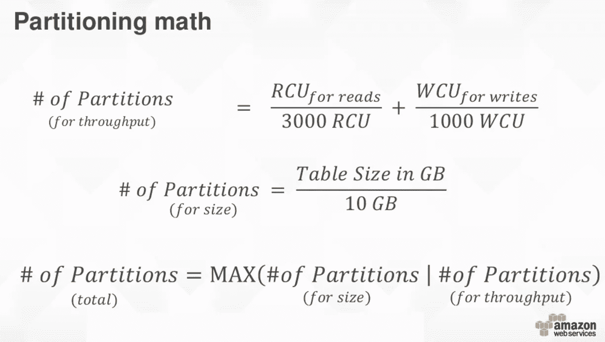
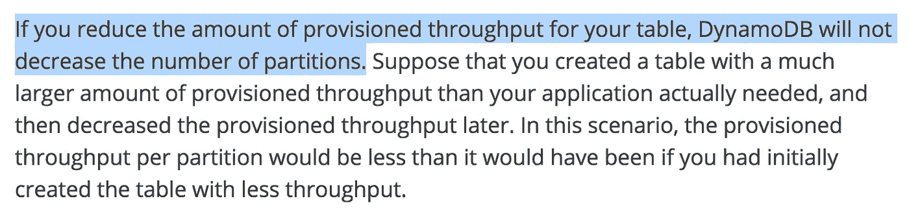

# 当心由于过度扩展而导致的 DynamoDB 吞吐量的稀释

> 原文：<https://medium.com/hackernoon/beware-of-dilution-of-dynamodb-throughput-due-to-excessive-scaling-4df51063edae>

**2020 年 1 月 26 日更新:自从写这篇文章以来，吞吐量稀释的问题已经通过 DynamoDB 的** [**自适应能力**](https://docs.aws.amazon.com/amazondynamodb/latest/developerguide/bp-partition-key-design.html#bp-partition-key-partitions-adaptive) **特性得到了解决，该特性就是实时应用的******。****

**DynamoDB 表中的分区数量会随着负载或存储大小的增加而增加，但永远不会减少。**

**DynamoDB 非常棒，但正如我在 3 家不同的公司——Gamesys、JUST EAT 和现在的 Space Ape Games——看到的这个特殊问题，我认为这是更多人应该注意的行为。**

**感谢 AWS，他们经常在 DynamoDB Deep Dive 会议上讨论计算分区数量的公式。**

****

**the no. of partitions in a DynamoDB table is determined by read unit, write unit and total storage size**

**然而，他们经常忘记提到，当您减少吞吐量单位时，DynamoDB 不会减少分区的数量。在冗长的[最佳实践](http://docs.aws.amazon.com/amazondynamodb/latest/developerguide/GuidelinesForTables.html)指南中，这是一个严重不足的关键细节。**

****

**考虑以下场景:**

*   **您提高了表的吞吐量，因为流量突然激增，或者您需要额外的吞吐量来运行昂贵的扫描**
*   **额外的吞吐量导致 DynamoDB 增加了分区的数量**
*   **您将吞吐量调低到以前的水平，但是现在您会注意到，即使您没有超过表中提供的吞吐量，一些请求也会受到抑制**

**发生这种情况是因为由于分区数量的增加，每个分区的读写吞吐量单位比以前少了。这意味着在每个分区上超过读/写吞吐量的可能性更高(即使您仍然处于表的总吞吐量限制之下)。**

**当这种吞吐量稀释发生时，您可以:**

1.  **迁移到新表**
2.  **指定更高的表级吞吐量，将每个分区的吞吐量提高到以前的水平**

**考虑到表迁移的困难，大多数人会选择选项 2，这就是为什么尽管每秒消耗接近 200 个写单元，但 JUST EAT 最终得到一个具有 3000 多个写吞吐量单元的表。**

**总之，你应该**在为了应对暂时的需求而大规模扩展 DynamoDB 表之前仔细考虑一下，这可能会带来长期的成本影响。****

**喜欢你正在读的东西吗？查看我的视频课程 [**生产就绪无服务器**](https://bit.ly/prod-ready-serverless) ，学习如何在生产中运行无服务器应用。**

**我们将讨论的主题包括:**

*   **使用 API 网关和 Cognito 进行身份验证和授权**
*   **在本地测试和运行功能**
*   **项目组织策略**
*   **CI/CD**
*   **集中伐木**
*   **监视**
*   **X 射线分布式跟踪**
*   **跟踪相关 id**
*   **性能和成本优化**
*   **错误处理**
*   **配置管理**
*   **金丝雀部署**
*   **VPC**
*   **安全**
*   **Lambda、Kinesis 和 API 网关的最佳实践**

**并包括在最近的 AWS re:Invent 大会上宣布的所有最新变化！**

** [## 生产就绪无服务器

### 看到了。动手吧。学着点！生产就绪无服务器:运营最佳实践向您介绍领先的模式和…

bit.ly](https://bit.ly/prod-ready-serverless)**