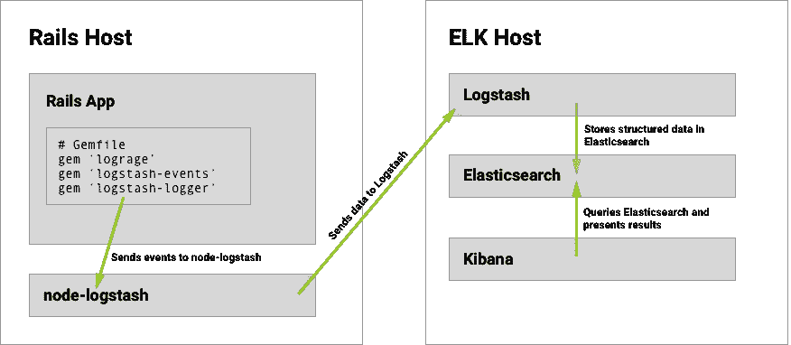
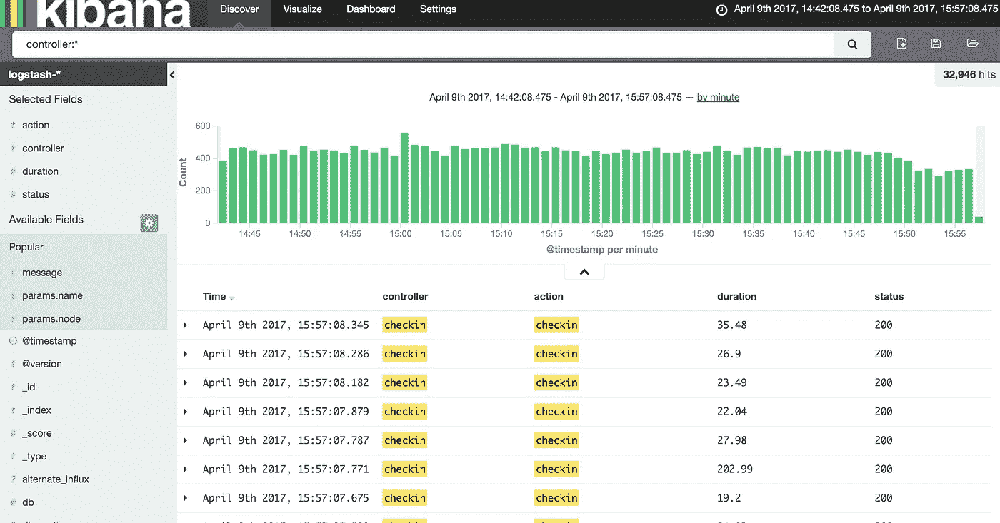
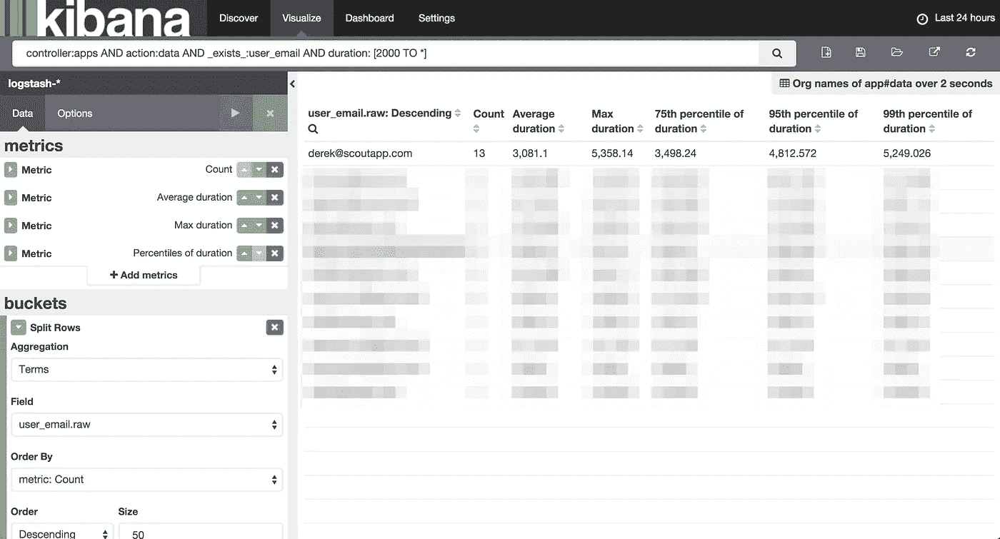

# 超越“尾巴”:用 Logstash+Kibana 增强你的侦查技能

> 原文：<https://medium.com/hackernoon/beyond-tail-f-powering-up-your-sleuthing-skills-with-logstash-kibana-978cbf00754a>


在《夏洛克》的每一集里，都有这样一个场景，我们的同名角色迅速将错综复杂、看似无关的观察分解成一个清晰的分析。就像夏洛克一样，您可能已经陷入了一个看似无法追踪的错误、异常或性能问题的深渊。

通常，它们看起来像这样:

1.  这款应用只针对一部分客户
2.  该应用程序仅在一天中的特定时间运行缓慢
3.  只有一个数据库碎片特别慢
4.  只有一个应用程序主机遇到问题

通过`tail`、`awk`、`grep`等方式挖掘日志。寻找线索是一项单调乏味且经常徒劳无功的工作。幸运的是，有一种方法可以快速解决夏洛克式权威的复杂问题:基巴纳和麋鹿群的其他成员。

让我们为一个 Rails 应用程序设置一个调查超级平台。

# Rails / Kibana 堆栈概述

我们将利用几个开源的外部服务来处理和可视化我们的数据:Logstash、Elasticsearch 和 Kibana。在我们的 Rails 应用程序中，我们需要以 Logstash 兼容的格式记录数据。最后，我们需要将数据发送到 Logstash。



让我们来分解这些部分。

## 麋鹿栈

我们将把我们的日志数据发送到 [**Logstash**](https://www.elastic.co/products/logstash) 。Logstash 将从我们的 Rails 日志中提取数据(控制器动作、响应时间、主机名、IP 地址等等)并存储在 Elasticsearch 中。

我们将使用 [**Kibana**](https://www.elastic.co/products/kibana) 来查询和可视化存储在 Elasticsearch 中的日志数据。

**elastic search、Logstash 和 Kibana 合称为 ELK 堆栈。**这些服务应该安装在专用的主机上:处理和查询事件数据是资源密集型的。

在 [Scout](https://scoutapp.com) 中，我们使用了一个 AWS m4.xlarge 来托管 ELK 堆栈。这为我们提供了 7 天的日志，每月 215 美元。

对于一个小组织来说，215 美元不是一笔小数目。然而，我们将很快看到基巴纳如何用`tail -f`、`awk`和`grep`不能的方式追踪问题。

> 无耻的推广:想要一个没有移动部件的调查平台？我正在帮助开发一个平易近人的，托管的基巴纳替代方案。[**报名提前获取**](https://apm.scoutapp.com/explorer) 。

## Rails 应用依赖

我们将安装三个 gem 来以 Logstash 兼容的格式记录事件。

**宝石#1:** `[**Lograge**](https://github.com/roidrage/lograge)`。Lograge 允许我们缩减默认 Rails 日志记录器生成的大量行，将单个请求记录到一行中:

```
method=GET path=/jobs/833552.json format=json controller=JobsController  action=show status=200 duration=58.33 view=40.43 db=15.26
```

Lograge 支持多种输出格式，其中一种是 Logstash。下面是单个请求在 Logstash 格式中的样子:

要将 Logstash 格式用于 Lograge，请安装 **gem #2:** `**logstash-event**`。

最后，**宝石#3:** `[**logstash-logger**](https://github.com/dwbutler/logstash-logger)`。这让我们可以用 Logstash 兼容的格式记录每条消息。由它们自己，`lograge` + `logstash-event`只以 Logstash 格式记录*请求事件*。

## Rails 主机

最后，我们需要将记录的数据发送到 Logstash。我们将使用`[node-logstash](https://github.com/bpaquet/node-logstash)`来做到这一点。`node-logstash`是一个 NodeJS 服务，需要安装在运行我们的 Rails 应用程序的每台主机上。

[这里有一个 node-logstash 配置文件的例子](https://gist.github.com/itsderek23/1afa70fd9b6dc396832567a4c284edc7)。

# 配置

## 麋鹿栈

我们将重点讨论 Rails 配置和设置 ELK 部件。这方面有很多教程。

## Lograge 和 Logstash gem 配置

将以下内容添加到您的`Gemfile`中:

通过`config/initializers/lograge.rb`文件配置 Lograge:

还有最后一步:对于生产，以 Logstash 格式记录所有内容。这对开发来说不是必需的。修改`config/environments/production.rb`:

# 让我们想象一下

我们的普通日志文件已经升级为灵活、可查询的结构化格式。访问 Kibana，您会在侧边栏中看到一系列事件和可能的过滤器:



以下是一些方便的搜索查询:

# 添加自定义字段

默认配置本身是有用的，但是真正的力量来自自定义字段。我们可以记录与每个请求相关的用户、公司、数据库碎片等。基本上，任何影响性能的东西都不能从 Lograge 发送的默认数据中解析出来。

以下是我们如何通过两个部分@ [侦察](https://scoutapp.com):

## 1.在线程局部变量中累积字段

我们通过一个`before_filter`来累积重要的字段以存储在一个线程局部变量中。下面是我们存储当前用户的方式:

## 2.订阅“流程 _ 操作.操作 _ 控制器”事件

这些事件是在 Rails 完成服务请求时发送的。我们订阅这些，添加在处理请求时收集的附加字段。

[见**订阅源**见](https://gist.github.com/itsderek23/72f0d0ddf1d2ed3d906ba1c9e859ff9f)。

# Kibana:按字段分组

我们向前迈进了一步，仅仅是运行查询和查看计数。然而，当您试图了解应用程序行为的构成时，查看匹配事件的列表并没有多大帮助。例如，哪些用户看到的 1 秒+响应时间最多？

我们可以通过 Kibana 的 Visualize 特性并通过`user_email`进行聚合来实现:



# 摘要:不仅仅是一个开发工具

在这一点上，您应该对 Kibana 提高您的检测技能的方式感到兴奋:关注关键客户的体验，主机的响应时间，确保试用用户不会遇到异常，等等。

简而言之，Kibana breaks 让你有能力将一个复杂的问题分解成一系列简单的观察结果。就像夏洛克一样。

> 无耻推广#2:想要一个没有工作的调查平台？我正在通过一个简单的 gem 安装帮助开发一个平易近人的 Kibana 替代方案。[**报名提前接入**](https://apm.scoutapp.com/explorer) 。

[](http://bit.ly/HackernoonFB)[](https://goo.gl/k7XYbx)[](https://goo.gl/4ofytp)

> [黑客中午](http://bit.ly/Hackernoon)是黑客如何开始他们的下午。我们是阿妹家庭的一员。我们现在[接受投稿](http://bit.ly/hackernoonsubmission)并乐意[讨论广告&赞助](mailto:partners@amipublications.com)的机会。
> 
> 如果你喜欢这个故事，我们推荐你阅读我们的[最新科技故事](http://bit.ly/hackernoonlatestt)和[趋势科技故事](https://hackernoon.com/trending)。直到下一次，不要把世界的现实想当然！

