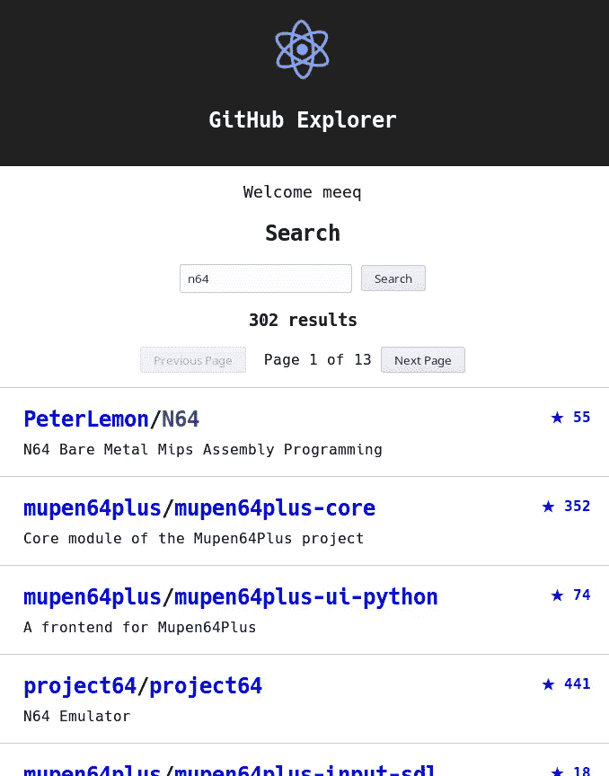

# 使用 React.js、Relay 和 GraphQL 进行双向光标分页

> 原文：<https://medium.com/hackernoon/bi-directional-cursor-pagination-with-react-js-relay-and-graphql-dc4ad6f9cbb0>

根据期望的用户体验和底层 API 的形式，分页有许多不同的风格。[graph QL](https://hackernoon.com/tagged/graphql)API，如 [GitHub](https://developer.github.com/early-access/graphql/) 实现了[中继光标连接规范](https://facebook.github.io/relay/graphql/connections.htm)来标准化大型结果集的分页和切片。这种方法非常适合无限滚动，但也可以用于带有下一页/上一页按钮的“窗口”分页。



An example of bi-directional windowed paging using the GitHub GraphQL API

游标连接通过传入下列查询参数对之一来工作:

## 前向窗口分页

`first`是一个非零正整数，描述从结果集的前端返回的最大结果数。在向后分页期间，该值必须为 null。

`after`是一个不透明的光标类型值，由连接的`[pageInfo](https://developer.github.com/early-access/graphql/object/pageinfo/)`对象的`endCursor`字段提供。对于第一页，该值将为 null。在向后分页期间，该值必须为 null。

## 向后窗口分页

`last`是一个非零正整数，描述从结果集尾部返回的最大结果数。在向前分页期间，该值必须为 null。

`before`是一个不透明的光标类型值，由连接的`[pageInfo](https://developer.github.com/early-access/graphql/object/pageinfo/)`对象的`startCursor`字段提供。在向前分页期间，该值必须为 null。

## GraphQL 查询片段示例

```
Relay.QL`
  fragment on Query {
    search(query: $q, type: REPOSITORY,
           first: $first, after: $after,
           last: $last, before: $before) {
      repositoryCount
      pageInfo {
        startCursor
        endCursor
      }
      edges {
        node {
          ... on Repository {
            id
            name
            url
          }
        }
      }
    }
  }
`
```

`repositoryCount`字段用于计算结果页面的总数。`[pageInfo](https://developer.github.com/early-access/graphql/object/pageinfo/)`用于填充`before` / `after`光标参数。`[edges](https://developer.github.com/early-access/graphql/object/searchresultitemedge)`包含了`[node](https://developer.github.com/early-access/graphql/union/searchresultitem/)`联合类型里面的搜索结果。我们使用`type`参数将结果限制为仅包含`[repository](https://developer.github.com/early-access/graphql/object/repository/)`类型的节点。

使用来自该查询的数据，应用程序可以计算页面总数，并跟踪我们当前所在的页面。页数是结果总数除以每页结果数的四舍五入结果。

要查看下一页，使用当前页面的`endCursor`字段作为`after`参数，使用页面大小作为`first`参数来运行查询。要返回一个页面，使用当前页面的`startCursor`字段作为`before`参数，使用页面大小作为`last`参数来运行查询。

## 将分页逻辑封装在 React 组件中

```
class Search extends Component {
```

为了通过[中继容器](https://facebook.github.io/relay/docs/guides-containers.html)传播查询结果，我们需要创建一个[反应组件](https://facebook.github.io/react/docs/react-component.html)来处理、操作和显示数据。

```
 constructor(props) {
    super(props); this.state = {
      q: "",
      pageSize: 25,
      pageCursor: 1,
      pageCount: 1
    }; this.handleQueryChange = this.handleQueryChange.bind(this);
    this.handleSearch = this.handleSearch.bind(this);
    this.handlePrevPage = this.handlePrevPage.bind(this);
    this.handleNextPage = this.handleNextPage.bind(this);
  }
```

`constructor`主要是样板文件，带有一些初始状态和函数绑定，以确保组件在回调期间是函数上下文。

```
 handleQueryChange(e) {
    this.setState({
      q: e.target.value
    });
  }
```

`handleQueryChange`由<输入> `onChange`回调调用，以基于用户输入更新搜索查询。在提交表单之前，实际的搜索不会发生。

```
 handleSearch(e) {
    this.props.relay.setVariables({
      q: this.state.q,
      first: this.state.pageSize,
      after: null,
      last: null,
      before: null
    });
    this.isNewSearchQuery = true;
    e && e.preventDefault(); // Stop form action
  }
```

`handleSearch`由<表单> `onSubmit`回调调用，通过更新中继查询中的变量来执行搜索。当查询值改变时，`componentWillReceiveProps`使用`isNewSearchQuery`标志作为重置页码和页数的提示。

```
 componentWillReceiveProps(nextProps) {
    if (this.isNewSearchQuery) {
      let repoCount = nextProps.query.search.repositoryCount;
      let reposPerPage = this.state.pageSize
      this.setState({
        pageCursor: 1,
        pageCount: Math.ceil(repoCount / reposPerPage)
      });
      this.isNewSearchQuery = false;
    }
  }
```

`[componentWillReceiveProps](https://facebook.github.io/react/docs/react-component.html#componentwillreceiveprops)`是一个 React 组件钩子，在查询结果返回时被调用。从这里，我们可以检查是否设置了`isNewSearchQuery`标志，并将页面光标重置到开头，并重新计算页数。当结果总数在分页过程中变化不大时，这种模式最有效。

```
 handlePrevPage() {
    if (this.state.pageCursor > 1) {
      let pageCursor = this.state.pageCursor - 1;
      this.props.relay.setVariables({
        last: this.state.pageSize,
        before: this.props.query.search.pageInfo.startCursor,
        first: null,
        after: null
      }, ({ ready, done }) => {
        if (ready && done) {
          this.setState({ pageCursor });
        }
      });
    }
  } handleNextPage() {
    if (this.state.pageCursor < this.state.pageCount) {
      let pageCursor = this.state.pageCursor + 1;
      this.props.relay.setVariables({
        first: this.state.pageSize,
        after: this.props.query.search.pageInfo.endCursor,
        last: null,
        before: null
      }, ({ ready, done }) => {
        if (ready && done) {
          this.setState({ pageCursor });
        }
      });
    }
  }
```

`handlePrevPage`和`handleNextPage`基于分页状态执行边界检查，然后使用当前结果`[pageInfo](https://developer.github.com/early-access/graphql/object/pageinfo/)`更新中继查询变量。直到新的查询通过利用可选的`[setVariables](https://facebook.github.io/relay/docs/api-reference-relay-container.html#setvariables)`的`onReadyStateChange`参数完成，实际的页码才更新。

```
 render() {
    let { search } = this.props.query;
    let { pageCursor, pageCount } = this.state;
    let isPrevPageDisabled = (pageCursor === 1);
    let isNextPageDisabled = (pageCursor === pageCount);
    return (
      <div>
        <h2>Search</h2> <form onSubmit={this.handleSearch}>
          <input placeholder="Repository name" type="text" value={this.state.q} onChange={this.handleQueryChange} />
          &nbsp;
          <button type="submit">Search</button>
        </form> <h3>{search.repositoryCount} results</h3> <button onClick={this.handlePrevPage} disabled={isPrevPageDisabled}>Previous Page</button>
        &nbsp;
        Page {pageCursor} of {pageCount}
        &nbsp;
        <button onClick={this.handleNextPage} disabled={isNextPageDisabled}>Next Page</button> <ul className="Search-results">
          {search.edges.map(({ node }, index) => (
            <SearchResult key={node.id} repository={node} />
          ))}
        </ul>
      </div>
    );
  }
}
```

`render`为搜索组件创建 DOM，通过`[edges](https://developer.github.com/early-access/graphql/object/searchresultitemedge)`映射连接所有回调并显示结果，并将搜索结果项封装在它们自己的组件中:

```
class SearchResult extends Component {
  render() {
    let repo = this.props.repository;
    let stargazersUrl = repo.url + "/stargazers";
    return (
      <li>
        <h5 className="stargazers"><a href={stargazersUrl}>★ {repo.stargazers.totalCount}</a></h5>
        <h4 className="headline"><a href={repo.owner.url}>{repo.owner.login}</a>/<a href={repo.url}>{repo.name}</a></h4>
        <span className="description">{repo.description}</span>
      </li>
    )
  }
}
```

## 用一个中继容器把它包起来

最后，我们可以基于我们的查询片段和 React 组件创建一个中继容器:

```
Relay.createContainer(Search, {
  initialVariables: {
    q: "",
    first: null,
    last: null,
    before: null,
    after: null
  },
  fragments: {
    query: () => Relay.QL`
      fragment on Query {
        search(query: $q, type: REPOSITORY,
               first: $first, after: $after,
               last: $last, before: $before) {
          repositoryCount
          pageInfo {
            startCursor
            endCursor
          }
          edges {
            node {
              ... on Repository {
                id
                name
                url
                description
                stargazers {
                  totalCount
                }
                owner {
                  login
                  url
                }
              }
            }
          }
        }
      }
    `,
  },
});
```

这个容器可以被传递到一个[中继渲染器](https://facebook.github.io/relay/docs/api-reference-relay-renderer.html)中，或者使用`[getFragment](https://facebook.github.io/relay/docs/api-reference-relay-container.html#getfragment)`静态方法作为父容器内部的子容器。

我希望这对试图理解 GraphQL 分页模型并与 React 和 Relay Classic 集成的初学者有所帮助。我想分享这个，因为在解决这个问题时，我在 GraphQL 中找不到任何双向分页的例子。

感谢阅读。如果你正在寻找一名有经验的 JavaScript 工程师，请在 LinkedIn 上给我发信息[或者在 christopherbonhage.com 的【T4 工作】上给我发邮件](https://www.linkedin.com/in/christopher-bonhage-629612136/)

[](http://bit.ly/HackernoonFB)[](https://goo.gl/k7XYbx)[](https://goo.gl/4ofytp)

> [黑客中午](http://bit.ly/Hackernoon)是黑客如何开始他们的下午。我们是 [@AMI](http://bit.ly/atAMIatAMI) 家庭的一员。我们现在[接受投稿](http://bit.ly/hackernoonsubmission)并乐意[讨论广告&赞助](mailto:partners@amipublications.com)机会。
> 
> 如果你喜欢这个故事，我们推荐你阅读我们的[最新科技故事](http://bit.ly/hackernoonlatestt)和[趋势科技故事](https://hackernoon.com/trending)。直到下一次，不要把世界的现实想当然！

