# AI 翻译:偏见？性别歧视？或者这是应该的方式？

> 原文：<https://medium.com/hackernoon/bias-sexist-or-this-is-the-way-it-should-be-ce1f7c8c683c>

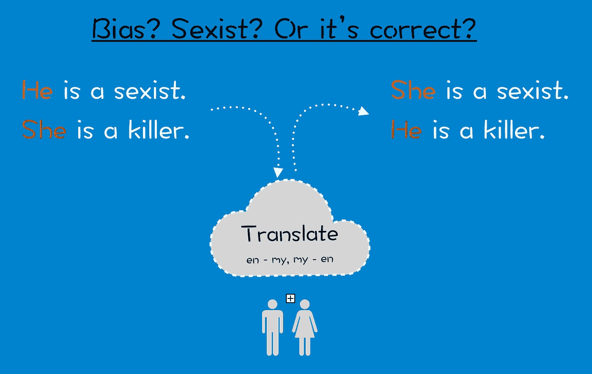

它始于谷歌翻译中的一个关于刻板印象的帖子:

简而言之，当翻译人员([谷歌](https://hackernoon.com/tagged/google) [翻译](https://hackernoon.com/tagged/translate)、微软翻译等)将一个句子从性别中性语言(如土耳其语)翻译成非性别中性语言(如英语)时，它会对性别进行猜测(不是真正的随机猜测，而是事实/训练猜测)。

这种行为引起了我的注意。所以我用马来语和汉语做了几轮测试，因为我是马来西亚华人。🇲🇾马来语是中性语言。汉语是混合的——可能是中性的，也可能不是中性的。

# 测试

这是一个简单的三级测试。在谷歌翻译和微软翻译测试。

## 级别 1:没有提供上下文。

谷歌翻译和微软翻译返回

*   **她**为**护士**
*   **何**为**程序员**

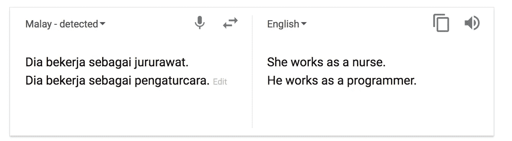

Both Google and Microsoft return same result.

## 第二层:在下面的句子中提供上下文。

与级别 1 的结果相同。

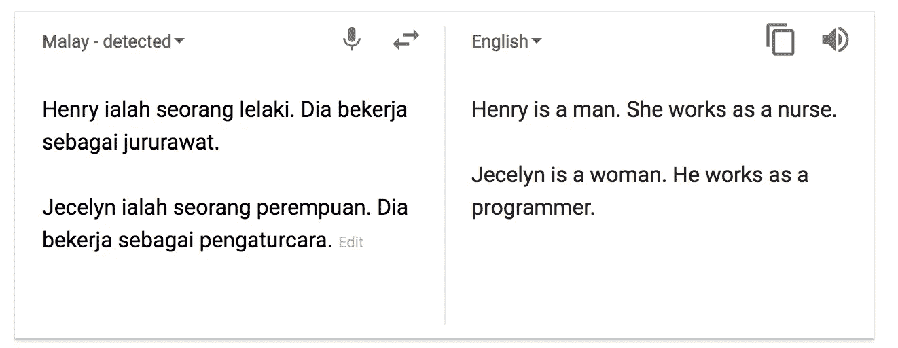

Both Google and Microsoft return same result.

## 第三级:用逗号在同一个句子中提供上下文。

谷歌翻译稍微聪明一点。它正确地翻译了两个句子，而微软翻译器正确地翻译了第一个句子，但坚持认为 Jecelyn 是一个“他”！

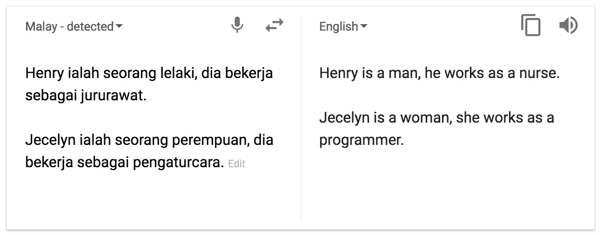

Google translates both sentence correctly

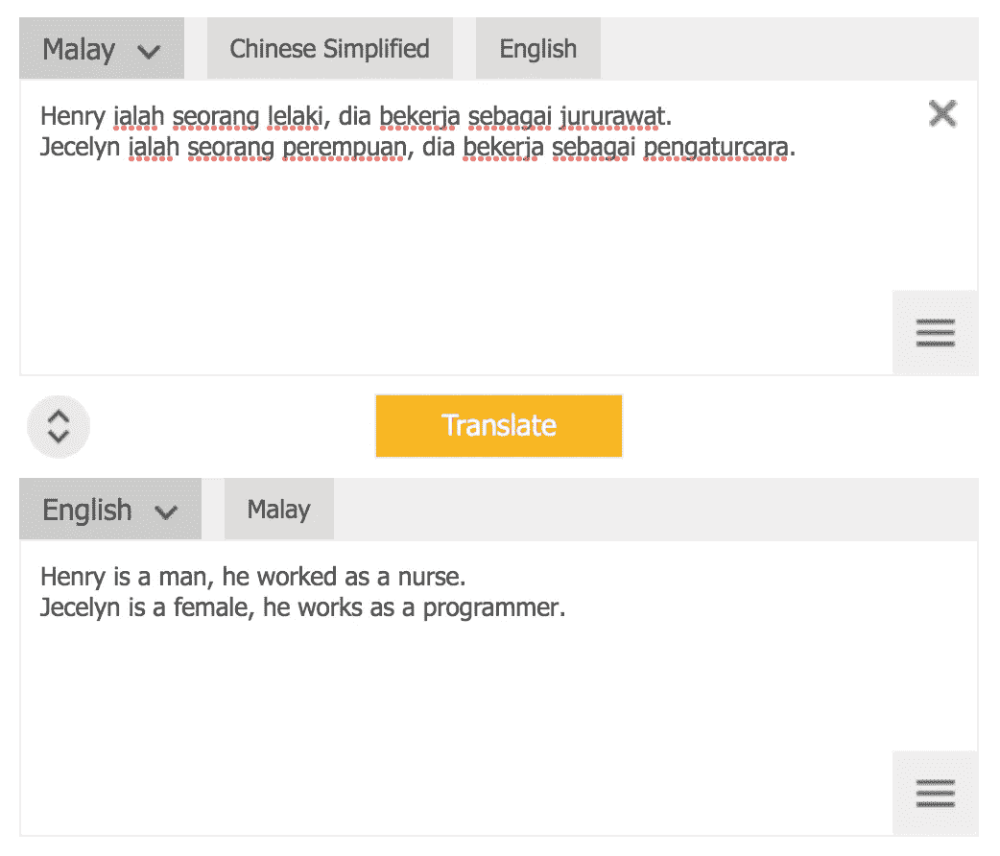

Microsoft translates the first sentence correctly, but it insists Jecelyn is a “he”…

## 用中文测试

In Chinese，the word “他” is gender neutral. It can refer to “he” or “she”. We do have another word — “她” that is referring to female “she”, but that’s not mandatory. If you can read Chinese, you can read the long discussion and history about these two words [here](https://www.zhihu.com/question/21488946).

我用一个简单句测试了同一个句子中的上下文，结果是这样的:

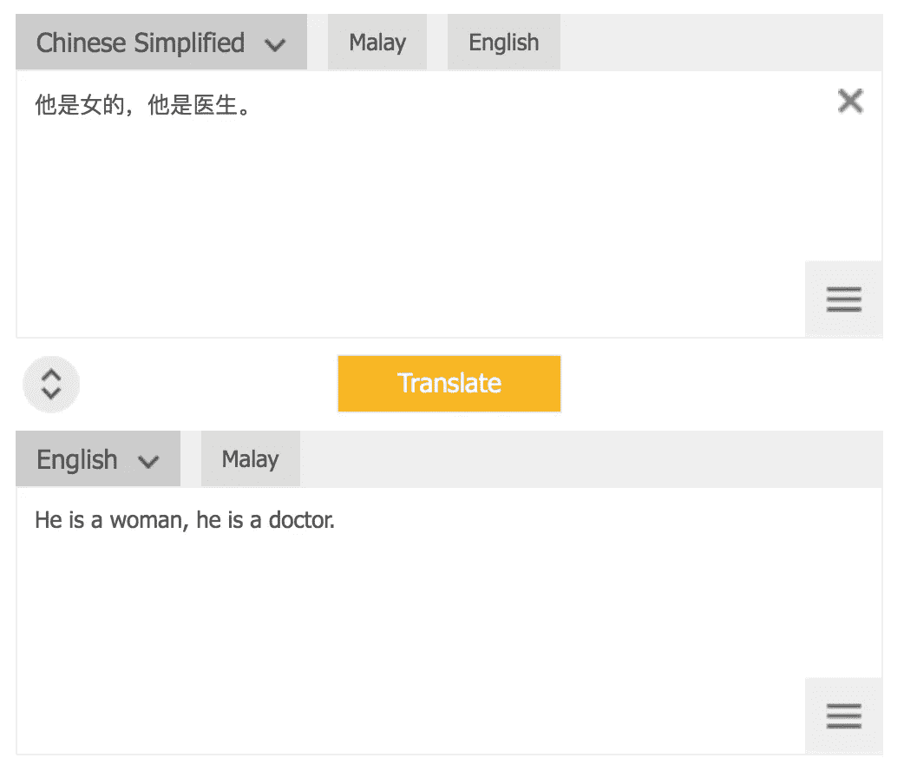

In this case, the translators(both Google and Microsoft) return male, even context is given in same sentence.

If using “他”, the result will consistently return as male, no matter with or without context in the same sentence. Only if I change to use the female specific “她”, the result is correct:

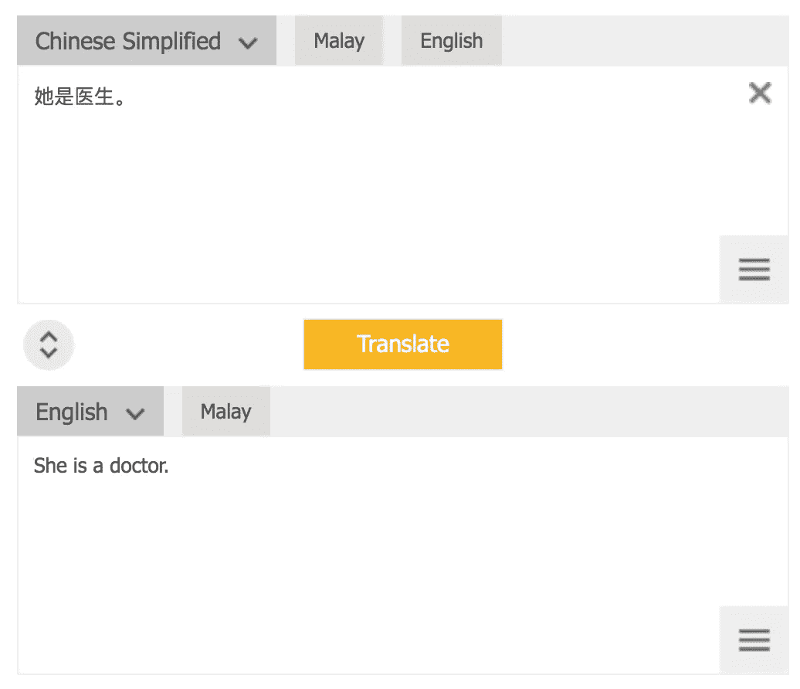

我对医生、教师、科学家、平面设计师等职业进行了上述测试。你可以猜到结果。

# 那又怎样？这是个问题吗？

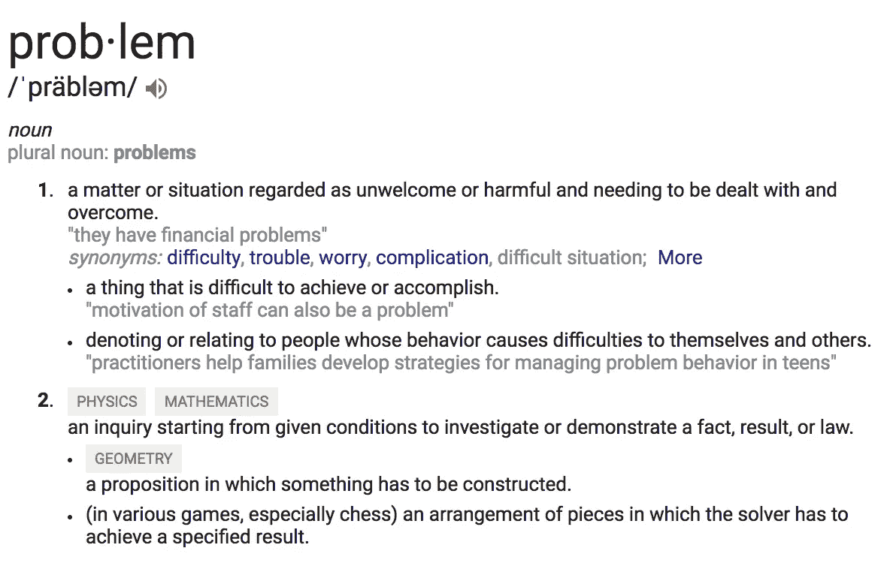

definition of problem

所以问题是:这是个问题吗？人工智能是性别偏见吗？

AI 不是性别偏见。它从数据中学习，被训练和设计来返回结果。它返回了一个基于模型的逻辑结果——我们，人类的设计。

我会说这些翻译在统计上是正确的。根据流行的调查:

*   **程序员**:著名开发者网站——Stack overflow 的[开发者调查结果 2017](https://insights.stackoverflow.com/survey/2017#developer-profile-gender) 显示，参与调查的开发者(程序员)88.8%为男性。

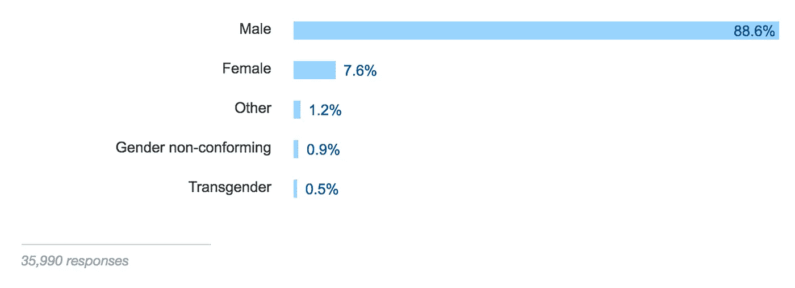

stack overflow

*   护士:网站显示，在 2824641 名注册护士中，男性仅占 9.1%。

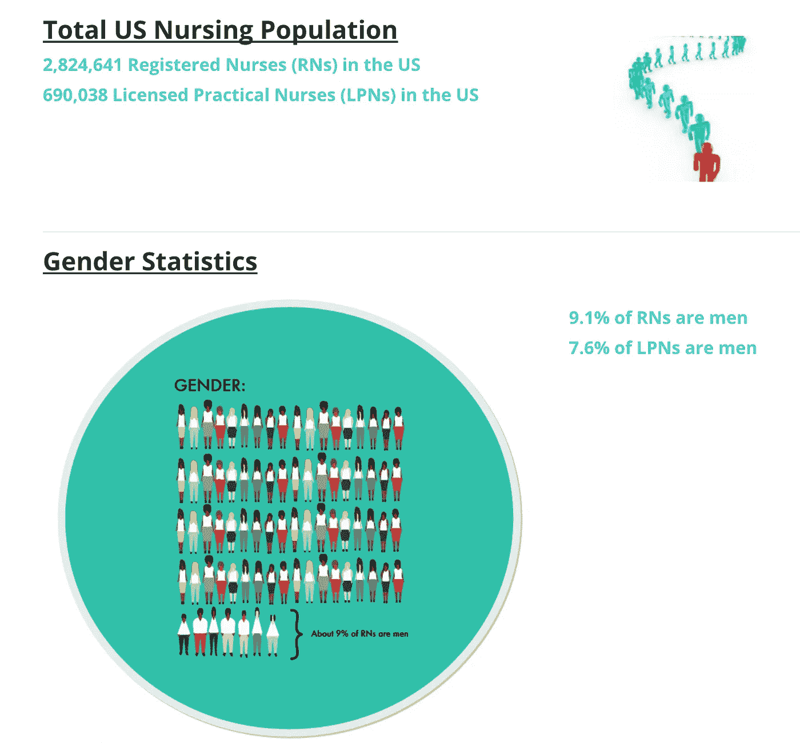

Only 9.1 registered nurses and 7.6% of licensed practical nurses are men.

我们可以说结果**有意义**。说到底，你多久会遇到一个女程序员，连我自己都没有遇到多少女程序员。你可能也不会经常见到男护士。那么，我们能断定翻译是聪明的吗？他们知道他们猜测的概率肯定是正确的！

**没有**。对我来说，这是个问题。这是一个需要改进的领域。

> 统计学上正确不代表就是正确的。

我相信，如果我们不认为这是一个问题，那么这个问题就不会得到解决，也不会有任何改善。

# 为什么我认为这是个问题？

我正在读查尔斯·惠兰的这本[书](https://www.amazon.com/Charles-Wheelan-Statistics-Stripping-Paperback/dp/B01FOD8OBO/ref=pd_lpo_sbs_14_t_1?_encoding=UTF8&psc=1&refRID=HRD80ADJKD9937SZE7ED)(强烈推荐)。这是一本关于统计学的书。

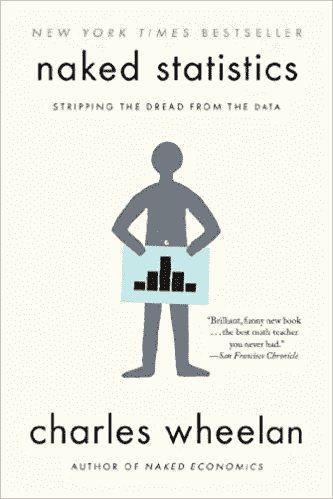

那是一章，他讲了**统计判别**和**理性判别**。

> 他写道，“如果数据告诉我们，我们正确的几率远远大于错误的几率，那么区别对待可以吗？
> 
> 认为性别、年龄、种族、民族、宗教和原籍国不能告诉我们任何与执法有关的事情是幼稚的。但是我们能够或者应该如何处理这些信息是一个哲学和法律问题，而不是一个静态的问题。
> 
> 如果我们可以建立一个模型，在 100 次中正确识别毒品走私者 80 次，那 20%的可怜灵魂会发生什么呢— *因为我们的模型会一遍又一遍地骚扰他们*。
> 
> 对于概率的优雅和预测，没有什么可以替代思考我们正在做的计算以及我们为什么要这样做。
> 
> 我们有时可以做正确的计算，但最终会在危险的方向上犯错误。"

当然，我们现在说的只是翻译，不是刑事。它可能没有毒品走私者的例子那么严重。但是，你想想，如果翻译中的 AI 都这样表现，那其他领域的 AI 呢？

# 如何改善？

说真的，我不知道。我不是人工智能专家，也不是语言专家。我在想一些解决办法，但都不够好，

*   翻译成“它”怎么样？
*   翻译成“他/她”怎么样？
*   再造一个性别中性词“sheh”怎么样？其他语言呢？
*   随机回“他”还是“她”？

> 翻译很难。不仅要考虑语法，还要考虑语境、潜台词、隐含意义、文化怪癖和一百万种其他主观因素，然后将它们转化为代码。

我看到了这篇文章(发表于 2013 年):

[](https://www.fastcompany.com/3010223/google-translates-gender-problem-and-bing-translates-and-systrans) [## 谷歌翻译的性别问题(还有必应翻译的，还有 Systran 的...)

### 谷歌翻译是世界上最受欢迎的网络翻译平台，但一位斯坦福大学的研究人员说它…

www.fastcompany.com](https://www.fastcompany.com/3010223/google-translates-gender-problem-and-bing-translates-and-systrans) 

在那段时间，

翻译这个英语句子

```
Men are men, and men should clean the kitchen
```

去德国，返回

```
Männer sind Männer, und Frauen sollten die Küche sauber
```

意思是“男人就是男人，女人应该打扫厨房。”

翻译现在是固定的。这是一个进步！

随着翻译过程越来越好，我们可能很快就会解决这个“他”，“她”？

[](https://www.newscientist.com/article/2114748-google-translate-ai-invents-its-own-language-to-translate-with/) [## 谷歌翻译人工智能发明了自己的翻译语言

### 谷歌翻译变得越来越智能。在线翻译工具最近开始使用神经网络来翻译…

www.newscientist.com](https://www.newscientist.com/article/2114748-google-translate-ai-invents-its-own-language-to-translate-with/) 

# 次要故事

我和我的朋友进行了一些讨论。这几乎变成了性别/语言战争。

## 语言

我与我的朋友分享 2 级测试结果(上下文在下面的句子中提供)。

我的一个朋友回复了我这条信息:


并发给我 3 级谷歌翻译测试结果(谢谢，我没想到用逗号！)，并提到**我应该用逗号，而不是句号**，因为:

*   如果在两句话里，AI 会混淆上下文。
*   用逗号代替句号在语法上是正确的。

我的观点是，

*   作为一个用户，**我不在乎**AI 是否混淆了上下文。我想要的是得到正确的翻译(如果我使用句号的话就不会得到正确的翻译)。
*   使用**句号在语法上绝对是正确的**。可能在前面的例子中使用逗号更好，但这并不意味着使用句号是错误的(事实也并非如此！).为了进一步证明，让我们把句子扩展到:

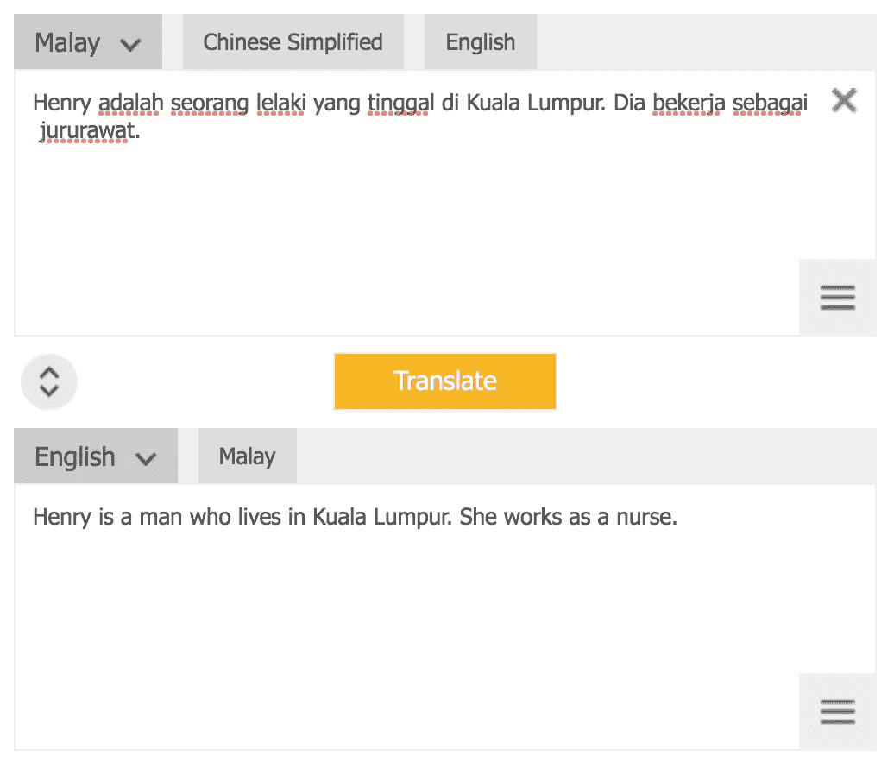

I am pretty sure that this sentence is grammatically correct in Malay, but AI still got it wrong.

*   即使我用逗号连接句子，微软翻译不知何故还是弄错了程序员的部分。我已经看过了。

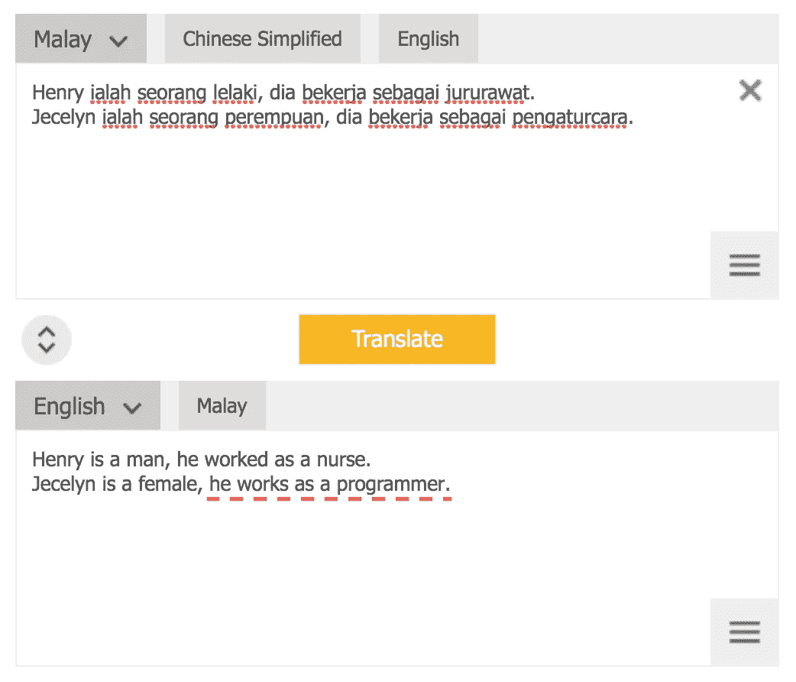

## 性别

在我的《脸书》中分享后。一些人开始讨论性别歧视。以下是一些有趣的信息。

## -消息 1

一个朋友发给我这个，标题是"性别歧视的人工智能，男人不能做胸罩模特？”

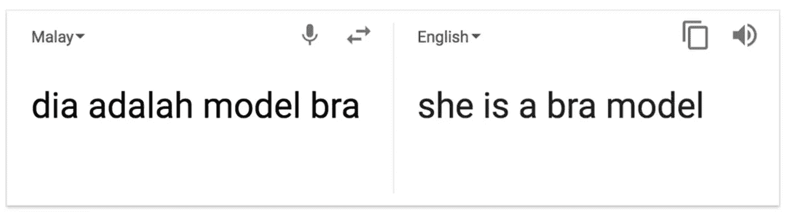

## -信息 2

*“如果 AI 识别出所有男性但实际上有 1 人是跨性别者。这是不是让人工智能变成了性别歧视？”*

## -信息 3

*“大部分老师都是女的，所以翻译都用‘她’，有道理吗？”*

## -信息 4

我是说我认为这是个问题。我的朋友回复道"*这就是问题所在，你把它当成问题了！"*

“几乎”意味着没有战争开始，呵。发动任何战争都不是我感兴趣的事情，也绝对不是我想做的事情。

# 摘要

我想再次强调的是翻译的公正性，我们在设计人工智能、系统、训练模型等时所考虑的因素。

逻辑上静态上正确不代表就是对的。我们需要多样性。尤其是在[艾](http://diversity.ai/)的年代。