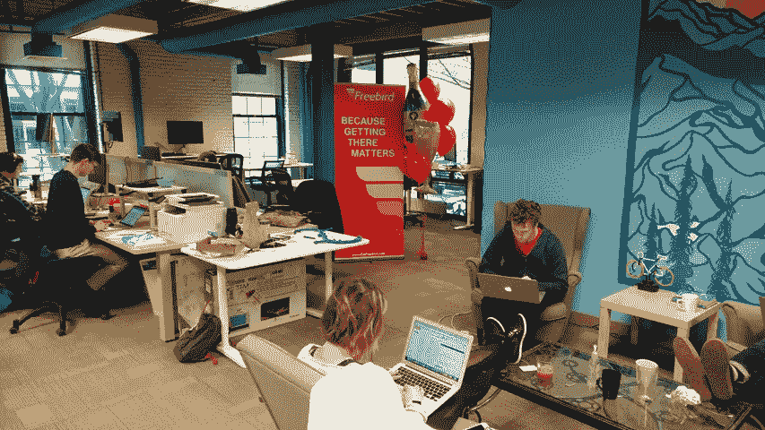
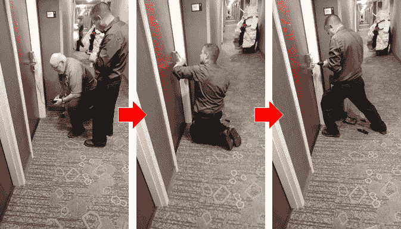
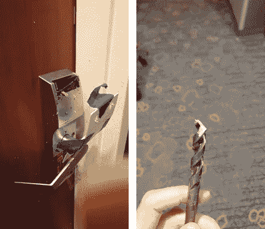
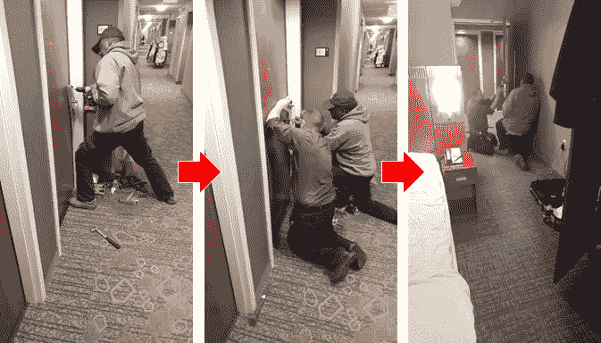

# 重大公告！

> 原文：<https://medium.com/hackernoon/big-announcement-e767648c36a7>

**(以及我是如何被锁在酒店房间外面的)**

在[度过了多么美好的一周啊！我们完成了 500 万美元的](http://www.getfreebird.com)[融资](https://hackernoon.com/tagged/funding)，又签下了六家旅游[管理](https://hackernoon.com/tagged/management)公司作为合作伙伴，并庆祝了一些跨越旅游行业的令人敬畏的媒体报道(如 [Skift](https://skift.com/2017/04/20/flight-disruption-startup-freebird-snares-funding-from-general-catalyst-and-accomplice/) 和 [Tnooz](https://www.tnooz.com/article/freebird-5m-funding/) )以及波士顿当地媒体(如 [BostInno](http://bostinno.streetwise.co/2017/04/19/general-catalyst-accomplice-fund-5m-for-freebird-instant-flight-rebooking/) 和 [Xconomy](http://www.xconomy.com/boston/2017/04/19/freebird-snatches-5m-to-help-business-travelers-take-flight/) )。

但并不是所有的事情都是有趣和游戏。就在我们的重大公告发布时，我的酒店房间钥匙锁停止了工作。维修人员花了两个小时钻/锤/撬开门锁，让我回到房间，拿回我的笔记本电脑。这东西不能瞎编:)

(Left to right) Master key didn’t work, so they busted out the key reader with a screwdriver, and then began drilling.

Unfortunately, the 3/8 drill bit snapped in half and broke off into the keylock.

So they called in reinforcements — on his day off — and after two hours, finally destroyed the door enough to open it.

总的来说，这几天过得既令人满意又令人谦卑。Freebird 只有两岁，但是团队已经完成了这么多。以下是数字:

*   **8 家大型旅行社最近签约成为合作伙伴经销商**，代表其各自公司客户每年超过 60 亿美元的差旅支出。对我们来说，这只是潜在市场的冰山一角。
*   **2 家世界级风投公司(有丰富的旅游经验)**相信我们，并已领投 500 万美元。这实际上是他们对 Freebird 的第二次投资——他们对 Freebird 的总投资现在总计 850 万美元。感谢[通用催化剂](http://generalcatalyst.com/)的乔尔和[帮凶](http://accomplice.co/)的杰夫对你们的持续支持。
*   4 位杰出的旅游业顾问继续提供见解、联系和支持。衷心感谢艾伦、库尔特、米奇和斯科特帮助我们走到今天。
*   **12 名全职员工**并且还在不断增加。我们将积极招聘——查看我们目前在[的招聘信息](https://careers.jobscore.com/careers/freebird)。与这样一个不可思议的团队和一个不可思议的联合创始人 Sam Zimmerman 一起工作真是一种荣幸。

下周，我将参加在纽约市举行的 ACTE 企业旅游会议，与 T4 的企业旅游经理和旅行社讨论 Freebird。如果你也在那里，给我写封短信，我们约个时间见面。

更多详情，请查看我们的 [**网站**](http://www.getfreebird.com) 和 [**编辑部**](http://newsroom.getfreebird.com) 。

祝贺整个免费鸟团队！更多有趣的时光在前方！

最好，
伊森

> [黑客中午](http://bit.ly/Hackernoon)是黑客如何开始他们的下午。我们是这个大家庭的一员。我们现在[正在接受投稿](http://bit.ly/hackernoonsubmission)，并乐意[讨论广告&赞助](mailto:partners@amipublications.com)机会。
> 
> 如果你喜欢这个故事，我们推荐你阅读我们的[最新科技故事](http://bit.ly/hackernoonlatestt)和[趋势科技故事](https://hackernoon.com/trending)。直到下一次，不要把世界的现实想当然！

