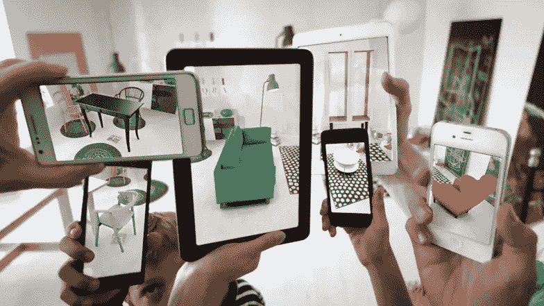

# 大 AR:安卓 vs iOS

> 原文：<https://medium.com/hackernoon/big-ar-android-vs-ios-3a683579eec8>

这是一系列关于增强现实和营销未来的博客文章中的第四篇。如果你错过了前三个大的 AR 帖子，你可以在这里开始****。****

*在当前的移动 AR 世界中，有两个主流平台可以投入时间、金钱和精力:Android 上的谷歌 [Tango 平台](https://get.google.com/tango/)和 iOS 上的苹果 [ARKit 平台](https://developer.apple.com/arkit/)。我们先来看看谷歌的平台。*

*探戈的时间到了。*

*谷歌的 Tango 平台于 2014 年 6 月发布。它允许开发人员利用 Android 开发平台中内置的不同 AR 框架，为开发人员提供了抓住 2020 年代最大趋势之一的机会。*

*考虑到它的家是拥有最大市场份额的移动电话平台，将 Android 扩展到全球超过 20 亿活跃电话用户，Android 有潜力将 Tango 推向更多家庭，而不是苹果的 iphone 围墙花园。但是，有一个问题。*

*Tango 发布于 3 年前，就生产而言，能够运行 AR 平台的 Android 设备数量仍然很少。该平台运行在[多个跟踪空间位置和运动的相机传感器上](/@rtpvr/project-tango-2093353f0def)，允许后端分析正在聚焦的内容以及如何在世界各地最好地放置信息或材料。这种增强现实技术甚至从 2017 年起就不能在手机上运行，因为许多手机制造商并没有在现代手机中优先考虑 AR 技术。这就是为什么谷歌的 Tango 在发布三年后，才慢慢进入消费者的生活。以我们目前的技术，这根本不可行。*

**

*Android Fragmentation — source: DanSkinner.com*

*市场碎片化的问题。*

*随着超过 20 亿台活跃的 Android 设备出现了一个问题:有太多的品牌在开发 Android 手机，如谷歌、三星、一加等，说服每个品牌在其手机中添加增强现实摄像头技术是一项挑战。尤其是当市场正在慢慢复苏，但还没有准备好进入主流市场的时候。由于成本太高，许多开发商也不愿意在有市场之前创造沉浸式体验。*

***但是有解决的办法！**时间到了。*

*随着时间的推移，增强现实技术的成本将会下降，最终，分散的 Android 生态系统中的所有品牌都可以利用增强现实作为卖点。一旦这种情况发生，Tango 将在所有新的 Android 设备上可用，它将成为创新和创意开发者的金矿。*

*要是有什么能加快这个过程就好了。*

***进入 ARKit。***

**

*Apple’s introduction to ARKit*

*苹果在今年 6 月的 WWDC 会议上宣布了 ARKit。这是一个像 Tango 一样的平台，允许开发人员通过 iOS 设备的摄像头直观地利用 AR 感应。ARKit 和 Tango 的区别在于，苹果使用了[机器学习](https://developer.apple.com/machine-learning/)来推动他们在软件方面的所有努力，创造了一种类似 Tango 的体验，可以与当今的 iOS 设备摄像头配合使用。不需要花哨的传感器，这些传感器会将制造手机和获得感兴趣的开发者的成本推高。**这意味着，今年秋天所有能够运行** [**iOS 11 的 iPhone、iPad 和 iPod touch 设备，至少配备一个**](https://www.apple.com/ca/ios/ios-11-preview/) [**A9 处理器**](http://appleinsider.com/articles/17/06/07/arkit-processor-limitations-cuts-compatibility-to-iphone-6s-ipad-pro-and-newer)**(2015 年及以后发布)将能够运行 ARKit 应用。***

*苹果在发布该平台的公告中指出，这将立即推动 iOS 成为世界上最大的增强现实基础，超越所有可以运行 Tango 的设备和移动领域所有较小的计划。鉴于苹果在全球拥有 7 亿部 iPhones，这意味着许多人运行 AR 应用程序就像下载他们感兴趣的应用程序一样简单，这甚至不包括 iPad 和 iPod touch 用户。*

**

*Ikea Augmented Realiy — source : BrandWatch*

***AR 为所有人。***

*苹果的 ARKit 迟早会将 AR 推向大众，为开发者和手机制造商提供一个关注和保持竞争力的理由。这最终将在未来五年内为 Tango 提供繁荣的手段，并将增强现实技术推广到每个移动用户的手中。*

*当我们讨论 AR 时，从长远考虑并考虑当我们拥有智能眼镜或隐形眼镜时我们将如何处理我们的生活是很有趣的，但考虑我们今天在哪里以及我们将如何能够沿着这条道路前进也很重要，在这条道路上，超越竞争最终意味着创建一个为所有人繁荣的平台。*

*Wingnut’s AR demo for iOS’s ARKit.*

**你对哪个平台更感兴趣？你认为苹果会把 AR 推向主流还是谷歌 Tango 的最后一口气会用锦囊妙计把它推到人群的前面？请在评论中告诉我！**

**关注我的* [*推特*](http://twitter.com/kevinmise) *和*[*insta gram*](http://instagram.com/kevinmise)*来跟上未来关于技术状态和我们伟大未来的文章。**

*所做的编辑:调整了 iOS 11 ARKit 设备对 A9 处理器及更高版本设备的要求。谢谢你接住了，艾伯特！*