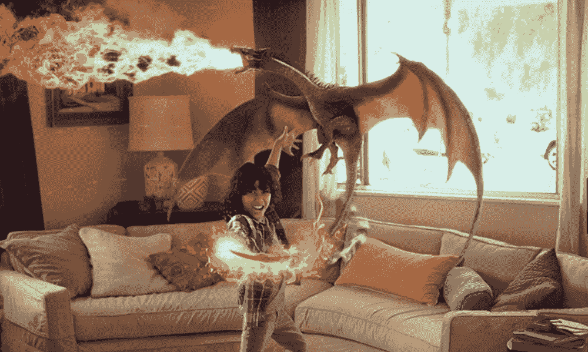
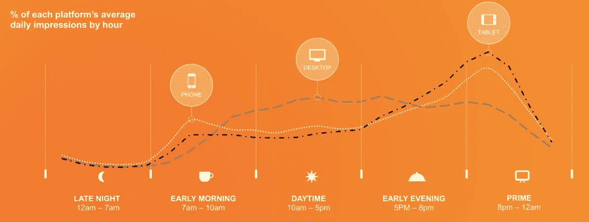
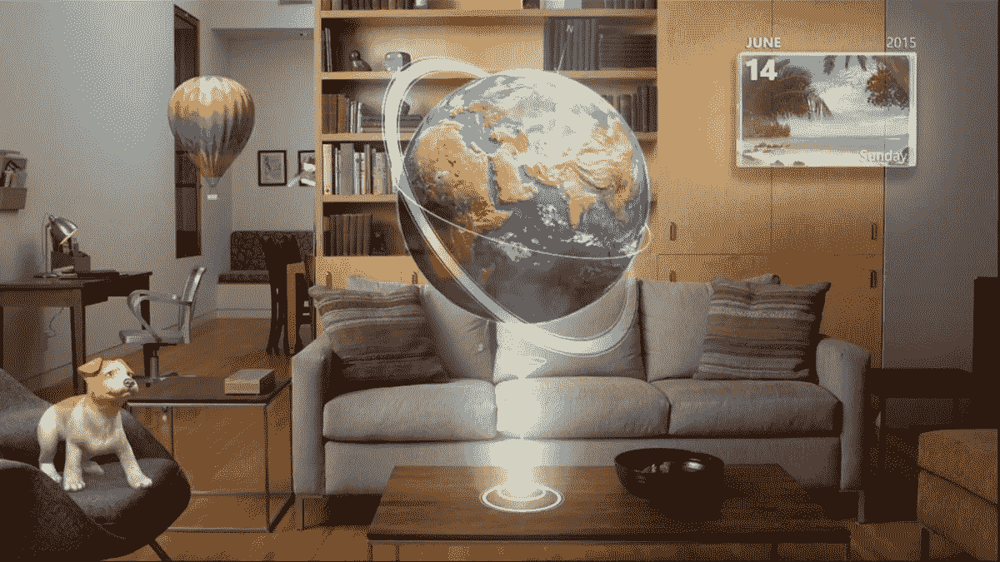
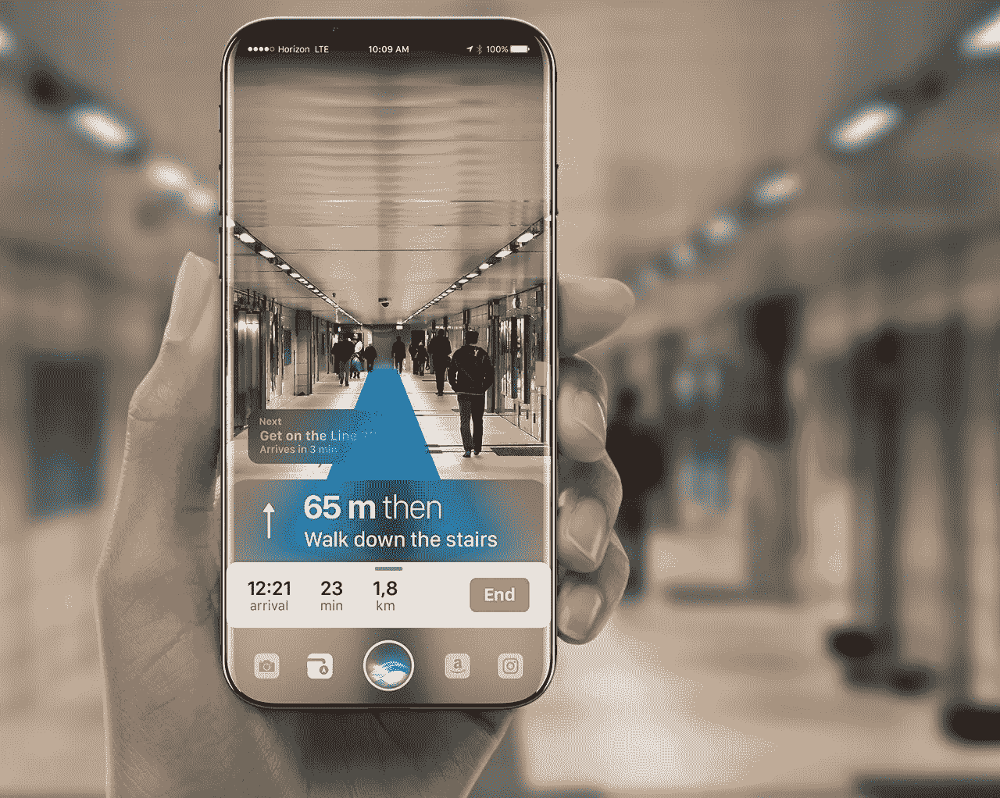
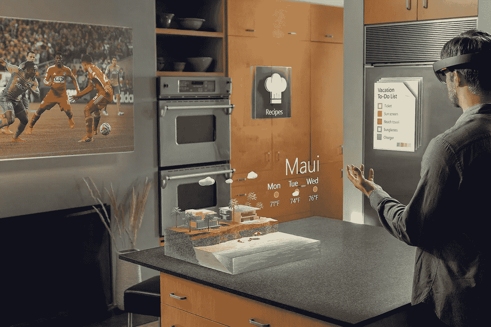

# 大 AR:增强现实的未来

> 原文：<https://medium.com/hackernoon/big-ar-the-future-of-augmented-reality-c91c267b3d9f>

这是一系列关于增强现实及其对消费者和营销人员的影响的博客文章中的最后一篇。如果你错过了前四大 AR 帖子，你可以从这里开始****。****

**

*The future of augmented reality. // Concept shot: Magic Leap.*

*欢迎光临！如果你正在阅读这篇文章，很可能是在移动设备上。你看，越来越多的人倾向于在闲暇时使用智能手机和平板电脑，而不是台式机(见下文)。更有甚者，在工作日，移动设备和桌面设备之间的差距日益缩小。很容易解释手机是如何慢慢进入前沿，主宰我们的大部分屏幕时间的:*它简单，便携，而且只需片刻就可使用*。**如今，您可以在移动设备上获得前所未有的内容。***

**

*Mobile dominates morning and night. // Source: Smart Insights*

*在大型 AR 系列中，我们已经讨论了增强现实*[*在当前状态下对营销人员的影响*](/@kevinmise/big-ar-augmented-reality-and-marketing-24a37f87a1e0)*[*对游戏*](/@kevinmise/big-ar-gaming-marketing-and-you-8d8575fbfc3c) *的影响，以及* [*在两个当前主流移动平台*](https://hackernoon.com/big-ar-android-vs-ios-3a683579eec8) … **上的影响，但我们还没有讨论增强现实的未来**也就是说，一个平台的未来与我们当前作为营销人员、消费者和创作者等的价值观如此一致——优先考虑移动友好、高度个性化和可访问的体验，以至于似乎很明显该平台将很快改变我们体验和与我们的世界互动的方式——甚至比十年前智能手机所做的还要多！***

****

**Microsoft’s vision for the future: the Microsoft holographic.**

# ****你的内容。释放。****

**是的，内容比以往任何时候都更容易获取，但它被限制在一个物理空间内。它永远是封闭的。到您的手机、平板电脑、个人电脑。电视机的长方形盒子(给你们年轻人看的电视)。内容甚至被限制在一本书的页面上。它的知识永远困在同样封闭的、定义明确的书页里，通过渴望学习，它可以许诺解放你的思想。**也就是直到现在。或者很快。****

**我们来做个实验吧！看看你的手机屏幕。或者你的电脑屏幕。或者你的 Kindle 屏幕(我不评判)。不管你从哪里读到的？把目光从文字上移开。句子。瞥见封闭的矩形。现在把它举到你的面前…一团乱麻。但是，实验的前提，是你的内容比以往任何时候都更贴近。想象一下…**

****

**iPhone AR mockup. // Source: Gábor Balogh**

**现在有一个棘手的问题！想象你的屏幕是透明的。你世界的内容。一个不显眼的平台。一张覆盖图。*一个机会。***

# ****设想平台****

**看到可能发生的事情的潜力；我们可以去的地方是，作为营销人员、创造者和技术传播者，我们可以预见一个通用的、全球性平台的未来和潜在结构。有一天，增强现实将被今天使用智能手机的每个儿童和成人使用，通过将手机放在面前，通过概述市场的当前趋势，通过研究哪些公司正在创造未来，你正在投资于走在曲线的前面。这是 AR 营销和创造 AR 体验的无限潜力。**

**我们正处于一个有趣的时代。翻盖手机在 10 年前就已经消亡了，我们可能正在经历屏幕的垂死挣扎——智能手机、平板电脑、个人电脑和电视显示器都可能处于危险之中。**

# **这就是增强现实的未来。今天，在你最喜欢的设备上打开世界和宇宙的[门道的前景或概念可能会在明天成为那个平台的闪耀真理、基石。](https://www.youtube.com/watch?v=371ZQW_Yzck)**

****

**A concept/idea of Holographic’s future. // Source: Augmented.**

**从你的私人助理那里。敬你最喜欢的口袋妖怪。从您的生产力应用程序。到生活方式、实用工具和文件管理器。在你生活的世界上和世界内部，延伸到你的眼睛所能看到的地方。通过[眼镜](https://en.wikipedia.org/wiki/Google_Glass)、[隐形眼镜](https://www.cnet.com/news/sony-patents-contact-lens-that-records-what-you-see/)，甚至可能通过[脑机接口](https://techcrunch.com/2017/04/19/facebook-brain-interface/)，你不再无精打采地看一个屏幕。你终于从屏幕的束缚中解放出来了。**

**那么*谁*能为我们提供这种释放内容的未来？让我们谈谈竞争者。谁在跑着把他们的品牌眼镜和其他设备绑在你的脸上…视网膜上…大脑上？！**

# **老大哥，大水果，还有死亡的大蓝屏**

**是的，这个头衔的确指的是谷歌、苹果和微软。一点阴影都没有。三大巨头最有可能通过向他们的品牌福音传播者群体进行营销，成功创造一种能够迅速触及普通大众的增强体验。瞄准超级粉丝意味着不太需要说服主流意识考虑新技术，因为早期大多数跳上技术潮流的人会紧随技术人员之后。其他公司就不一定了，尤其是最近首次涉足科技领域的初创公司。**

**通过谷歌，我们已经看到了他们在这个领域的创新。[谷歌眼镜](https://en.wikipedia.org/wiki/Google_Glass)非常超前。太超前了，事实上，它吓坏了公众。隐私问题和价格定位扼杀了这款设备。但是看起来[又回来了](http://www.independent.co.uk/life-style/gadgets-and-tech/news/google-glass-2017-update-return-glasses-augmented-reality-tech-a7803546.html)——如果不是，很可能很快就会回来。谷歌在这项研发上花了很多钱，这只会帮助他们结合他们从手机 AR 项目 [Project Tango](https://get.google.com/tango/) 中学到的知识，巩固眼镜 AR 领域的空间。**

**苹果对他们的可穿戴设备保持沉默，但很明显，随着[最近专利的出现](http://mashable.com/2017/07/27/apple-ar-glasses-patent/#y4xVyBjxlmql)和[与卡尔·蔡司](https://thenextweb.com/apple/2017/01/10/apple-might-be-working-on-ar-glasses-with-carl-zeiss/#.tnw_IT9Kihsd)合作及时推出时尚眼镜的传言，他们正在考虑可穿戴 ar 技术。最重要的是，ARKit(苹果的 AR 软件平台)已经在 iOS 11 上推出之前创造了情感体验(见下文)，这意味着我们肯定会在苹果这边看到创造力和创新，特别是当下面的视频仅通过 iPhone 屏幕拍摄时。想象一下，在我们的视野中，我们将带着完整的体验去哪里！**

**A-ha! with ARKit**

**微软已经全力以赴将增强现实打造为移动技术计算的未来。他们甚至为我们结合了虚拟和增强世界，用他们的 [HoloLens](https://en.wikipedia.org/wiki/Microsoft_HoloLens) 耳机和他们未来的 [Windows 混合现实](https://en.wikipedia.org/wiki/Windows_Mixed_Reality)操作系统创造了市场上第一个主流的*混合现实*概念。一旦 AR 中的小型应用和更丰富的体验开始寻求一个有凝聚力的统一用户界面来定义平台，这将变得更加必要。**

**An introduction to Microsoft’s HoloLens**

# ****诡秘:魔法飞跃****

**由 Rony Abovitz 创立的 Magic Leap[估计价值超过](https://www.magicleap.com/)[45 亿美元](https://www.forbes.com/sites/davidewalt/2016/11/02/inside-magic-leap-the-secretive-4-5-billion-startup-changing-computing-forever/#78b9632e4223)，然而他们还没有发布一款产品。这家神秘的初创公司多年来一直在制造轰动，大肆宣传他们的第一款混合现实产品，让投资者到处偷偷瞥一眼和预览。在 AR/MR 圈子里，Magic Leap 已经连续几个月保持了炒作的势头，但它会给产品带来什么？没人知道。但我们确实对这个软件有所了解(见下文)。**

**A demo of Magic Leap, shot through their technology in April 2016**

# ****远见者:Neuralink****

**在意识到人工智能的真正威胁以及它可能会走向何方(见:人类的潜在死亡)后，埃隆马斯克 *(Paypal，Tesla，SpaceX)* 成立了 [Neuralink](https://en.wikipedia.org/wiki/Neuralink) ，这是一家神经科技公司，旨在揭示与人类大脑交流的秘密。通过为患者提供扩展的记忆，这将开始作为对患有退行性大脑疾病(如阿尔茨海默氏症)的人的医疗援助，有一天可能成为人类的解锁输出潜力。想想看:用你的大脑打字([就像之前链接的脸书奋进号](https://techcrunch.com/2017/04/19/facebook-brain-interface/))，或者更好，在增强现实中分享记忆和时刻，而不必把任何东西绑在身上！未来派。如果你对脑机接口可以改变人体的根本方式(不仅仅是 AR/VR 功能)感兴趣，请务必阅读 [Wait 但是 Why’s write up on neural ink 及其对社会的影响](https://waitbutwhy.com/2017/04/neuralink.html)。这本书很长，但所有读者都可以阅读，值得一读。**

**A Futurist summary of Neuralink**

**除了这些高收入、高梦想和高度疯狂的公司，还有无数其他公司正在推动创造创新的 AR 体验，走在潮流的前面。[在](https://www.google.ca/url?sa=t&rct=j&q=&esrc=s&source=web&cd=3&cad=rja&uact=8&ved=0ahUKEwjZm8v0ocnVAhUi5YMKHSaoBbkQqUMIQjAC&url=https%3A%2F%2Fmybroadband.co.za%2Fnews%2Fgadgets%2F223674-neurable-creates-first-brain-computer-interface-for-htc-vive.html&usg=AFQjCNE-Ihez7NjEzwe2BR7HOIgBecduVw) [上](https://www.google.ca/url?sa=t&rct=j&q=&esrc=s&source=newssearch&cd=9&cad=rja&uact=8&ved=0ahUKEwipzsf_ocnVAhUM_IMKHaSYBcUQqQIIRigAMAg&url=http%3A%2F%2Fgameranx.com%2Fupdates%2Fid%2F114738%2Farticle%2Faugmented-reality-app-hidden-secrets-heading-to-kickstarter%2F&usg=AFQjCNGR3iJnNKhmU4t9gd8Oz2NlJZ0MeQ) [，在](https://www.google.ca/url?sa=t&rct=j&q=&esrc=s&source=newssearch&cd=5&cad=rja&uact=8&ved=0ahUKEwipzsf_ocnVAhUM_IMKHaSYBcUQqQIINigAMAQ&url=https%3A%2F%2Fwww.wired.com%2Fstory%2Fdisneys-magic-bench-fixes-ars-biggest-blind-spot%2F&usg=AFQjCNEsEyWsIsl2-8jMi6qrI57DDDKK_Q)上 [。因此，现在是营销人员考虑如何在早期大多数人锁定之前最好地利用这个新兴平台的时候了。作为创新者和技术传播者，我们占据上风:有机会*帮助塑造一个蓬勃发展的行业*，选择进入一个黎明时代，对于我们中最幸运的人来说，有机会*用它创造美好的人类体验*。](https://www.google.ca/url?sa=t&rct=j&q=&esrc=s&source=newssearch&cd=4&cad=rja&uact=8&ved=0ahUKEwipzsf_ocnVAhUM_IMKHaSYBcUQqQIIMSgAMAM&url=https%3A%2F%2F9to5mac.com%2F2017%2F08%2F07%2Faugmented-reality-car-maintenance-genesis%2F&usg=AFQjCNGopqsjm4QN_k93W7xV6J-o251KcQ)**

**我就说到这里吧。这是大 AR 的最后一个帖子。我真的希望这个系列有助于启发你作为消费者和营销人员对增强现实的惊人潜力，并可能在未来几个月开辟一些研究途径。**

**随着技术的进步，这个话题在不断地扩展和发展，甚至与日俱增！因此，我将在其他时间回到增强现实作为一个整体。在我的下一篇文章中，我将具体讨论 *Magic Leap* 以及它如何重振一个正在放缓的行业，因此，如果你对这个神秘的投资者磁铁感兴趣，这将是一本好书。**

**我确实计划回到大 AR，并在这里和那里做一些修改，所以*请*务必让我知道我可以改进的地方，*我如何才能使这份材料更加简洁和方便读者*！欢迎在下面发表评论或在我的[推特](http://twitter.com/kevinmise)上展开讨论！**

****如果你喜欢这个话题，并希望看到更多我的作品，** [**请点击这里注册一个每周简讯综述**](http://bit.ly/kevinmise) **我最好的作品。我写关于未来学、技术、心理健康、生产力等等的文章。****

**梦想远大！**