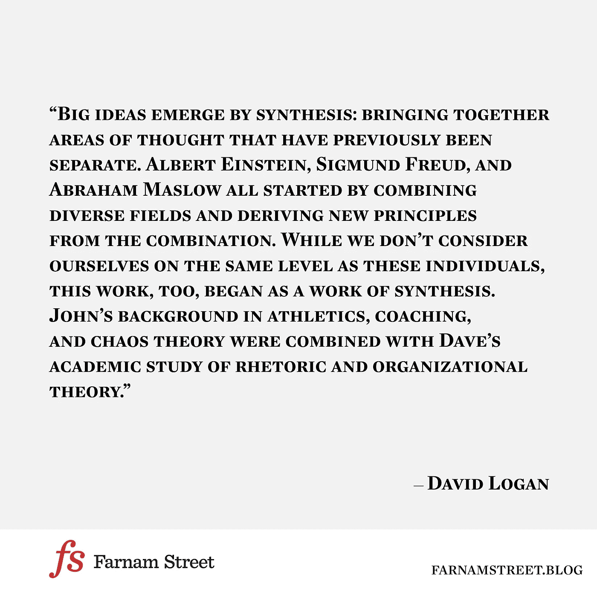

# 伟大的想法通过综合产生

> 原文：<https://medium.com/hackernoon/big-ideas-emerge-by-synthesis-7236b2674995>

那是大卫·罗根在[部落领导](http://geni.us/yINp1)中写的。

在[法南街](https://www.farnamstreetblog.com/)，我们试图将[世界](https://hackernoon.com/tagged/world)的伟大思想，心智模型，结合起来帮助我们做出更好的决定，避免愚蠢，过上更有意义的[生活](https://hackernoon.com/tagged/life)。

**想要探索更多？检查**

*   [爱因斯坦论生产性思维的本质特征](https://www.farnamstreetblog.com/2014/04/einstein-productive-thought-combinatory-creativity/)
*   [塞内卡谈收集想法和组合创造力](https://www.farnamstreetblog.com/2014/07/seneca-on-combinatorial-creativity/)
*   [作为网络知识和组合创造力来源的普通书籍](https://www.farnamstreetblog.com/2014/07/networked-knowledge-and-combinatorial-creativity/)
*   [史蒂夫·乔布斯谈创造力](https://www.farnamstreetblog.com/2014/08/steve-jobs-on-creativity/)

*如果你正在寻找成功的分歧，更聪明而不是更努力地工作，注册* [*我的每周大脑食物文摘*](https://www.farnamstreetblog.com/newsletter/) *。*

*可以跟着谢恩上* [*推特*](https://twitter.com/farnamstreet) *和* [*脸书*](https://www.facebook.com/FarnamStreet/) *。*

> [黑客中午](http://bit.ly/Hackernoon)是黑客如何开始他们的下午。我们是 [@AMI](http://bit.ly/atAMIatAMI) 家庭的一员。我们现在[接受投稿](http://bit.ly/hackernoonsubmission)并乐意[讨论广告&赞助](mailto:partners@amipublications.com)机会。
> 
> 如果你喜欢这个故事，我们推荐你阅读我们的[最新科技故事](http://bit.ly/hackernoonlatestt)和[趋势科技故事](https://hackernoon.com/trending)。直到下一次，不要把世界的现实想当然！

