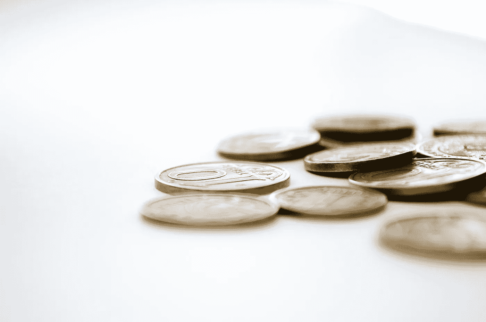

# ico 的最大赢家——种子投资者

> 原文：<https://medium.com/hackernoon/biggest-winners-of-icos-seed-investors-64bc08afb595>

喝着咖啡馆里的热拿铁，享受着海边凉爽的空气，我和一家种子期投资公司的风险合伙人坐在一起。我们讨论了早期投资者的现状。我们很好奇最初的硬币发行(ICO)将会如何发展。还没有人真正知道。ico 会成为种子期投资者遇到的最好的事情吗？

我是天使投资人。在过去两年半的时间里，我投资了 10 家初创公司。其中五家创业公司已经进行了后续融资，这是一件好事。这意味着他们在成长。但是，这也意味着每当公司筹集新一轮资金时，我的股份就会被稀释。当然，公司的整体价值应该是成比例上升的，所以每一轮对所有投资者来说都是有意义的。

我还为我的三项天使投资开辟了另一条道路。三家公司已经完成或正在完成首次公开募股(ICO)。每家公司都在通过 ICO 筹集或打算筹集 1000 万到 2500 万美元。我开始思考 ICO 将如何影响早期股权投资者。

## 种子投资者获得股权

种子期投资者仍然投资成长型初创企业，原因只有一个。他们希望通过首次公开募股(IPO)或收购(财务或战略收购者收购公司)退出。这一直是所有种子投资人的角度。值得一提的是，种子期投资者的投资缺乏流动性。他们不能出售或获取自己的股份。在公司公开退出或出售给收购者之前，他们都是随波逐流。

大多数种子阶段的投资都不会成功。大多数投资都将归零，因为这些公司都是初创公司。如果它们不能生长，就会死亡。种子投资者、天使投资者或风险投资公司的策略是让少数赢家为他们投资组合中的所有输家买单。有机会获得 10 到 100 到 1，000 倍的投资回报(ROI)；种子阶段的投资者正在寻求规避风险。

风险投资的运作方式是成长型公司分阶段获得投资。首先，他们可能有一个种子轮，然后是首轮或风险轮，随后是 B 轮或增长轮，然后是 c 轮，他们甚至可能有 D 轮和 E 轮。每一次新系列筹集资金，以前的股东就会被稀释。总的目标是，随着公司的发展，创造的价值越来越高。最终，即使在每一轮稀释之后，种子阶段的投资者应该会看到他们原始本金投资的数倍回报。在出售(首次公开募股或收购)之前，这是一个“书面回报”。

## ico 生成将资产添加到资产负债表中的令牌

最初的硬币产品或 ICO 是不同的。ICO 为初创公司创造了向潜在员工/开发人员、用户和投资者出售令牌的机会，令牌是一种资产。ICO 生成的令牌是公司资产负债表上的一项资产。所以，它不同于股权。ICO 不会稀释公司的股权，因为它不参与公司结构的这一部分。这意味着，如果代币升值，在 ICO 之后，代币持有者可能会有很好的收益。真正的赢家是 ICO 之前的股东。他们从出售代币中获得了注资的所有好处，而没有任何股权稀释。这是一个有趣的时代，随着我们看到早期公司继续发起 ICO，这将是一个有趣的事实。

## 无股权稀释

想想吧。让它浸泡一下。在 ICO 之前的所有股权投资者都获得了筹集资本以促进公司发展的所有优势，而没有在未来几轮融资中股权被稀释的不利影响。

## 对股东来说，一个不利因素是流动性仍然不足

做风投/天使投资人还是有一个坏处。如果你投资于(私人)股权，那么你的投资是非流动性的。这意味着你卖不出去。它没有市场。这是加密货币/代币宣扬的好处之一——你可以随时在交易所买卖你的硬币。我们这些有股权的人仍必须等待退出，要么 IPO，要么被收购。

## 浏览一个示例

因此，让我们来看一个典型的风险投资中种子期、风险期和成长期的例子，然后再看一个有 ICO 的例子。假设我是一家成长型初创公司的种子投资者，这家新成立的区块链公司名为 ValueA。ValueA 刚刚筹集了一轮种子资金，其投前估值为 500 万美元。我投了 5 万美元的种子基金。就整数而言，我拥有该公司 1%的股份。注资后，现在是 600 万美元。在 12 个月的时间里，它的增长翻了一番，由于增长率的原因，它的估值翻了一倍多。现在，在一轮风险投资中，它价值 1200 万美元。他们筹集了 300 万美元，这使我的股份稀释了 25%。所以，现在我拥有一家价值 1500 万美元的公司 0.75%的股份。我的初始投资已经增长到 11.25 万美元。现在，初创公司 ValueA 在 18 个月内再次增长了 4 倍。它希望以 7500 万美元的投资前估值完成一轮增长。它在 B 轮融资中获得了 2500 万美元，将我的股份稀释了 33%。现在，我拥有一家 1 亿美元公司 0.50%的股份。我的投资现在值 50 万美元。很好，对吧？我的投资获得了 10 倍的回报。

现在，让我们来看一个使用 ICO 进行风险投资的例子。我们将要投资的这家公司是一家名为 ValueB 的新区块链公司。开始是一样的，我投资了 5 万美元购买了该公司 1%的股份(整数)，投资后估值为 600 万美元。它在 ICO(税后)中收入 1000 万美元，因为这是一个非常热门的行业。这可能发生在任何产品制造和任何收入增长建立之前，这与当前的 ICO 格局是一致的。现在，扣除 ICO 后，该公司价值 1600 万美元。以同样的例子为例，它增长了 8 倍(翻倍，然后增长了 4 倍)。现在，它价值 1.28 亿美元。我仍然拥有公司 1%的股份。我的股权在 ICO 轮没有稀释。我的投资价值 128 万美元，这是我投资的 24 倍回报。在高增长和高估值倍数的例子中，差异甚至更大。作为种子投资者，我喜欢 ValueB 的 ICO 以及它对我的回报所做的贡献。

## 超高回报值得吗？

股票投资者会成为 ICO 热潮的最终赢家吗？我们最有可能要等三到七年，才能看到一家刚刚完成 ICO 的公司退出。一个风险是，股权持有人处于休眠状态，缺乏流动性，没有退出事件发生，或延迟退出，因为公司可以继续通过 ICO 筹集资金。

只有时间能证明一切。

狩猎愉快！

________________________________________________________________

*免责声明:以上内容仅代表一种观点，仅供参考。它无意成为投资建议。请自己做作业。*

[***杰克瑞恩***](/@jake_ryan) ***是 Tradecraft Capital 的创始人，创业顾问，天使投资人&投资方面的作家。如果你喜欢这篇文章，请“鼓掌”帮助别人找到它！欲知更多，敬请关注*** [***【脸书】***](https://www.facebook.com/WealthRituals/)*[***碎碎念***](https://twitter.com/TradecraftJake) ***。****