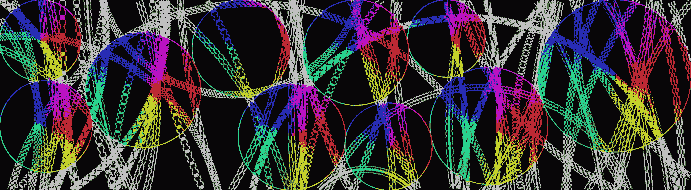
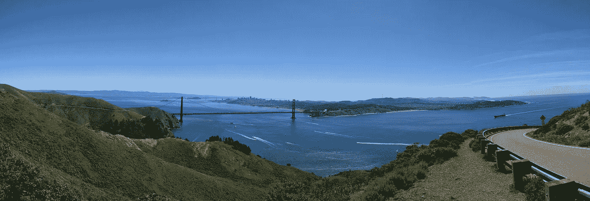
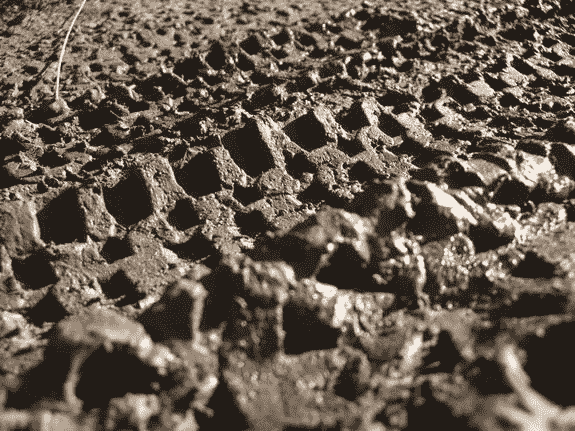
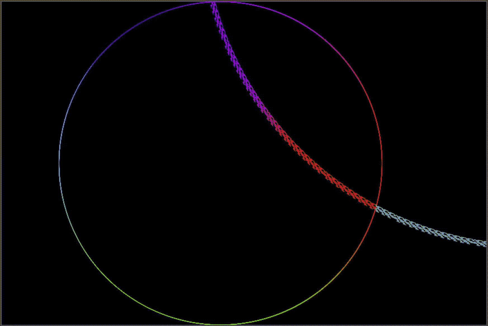
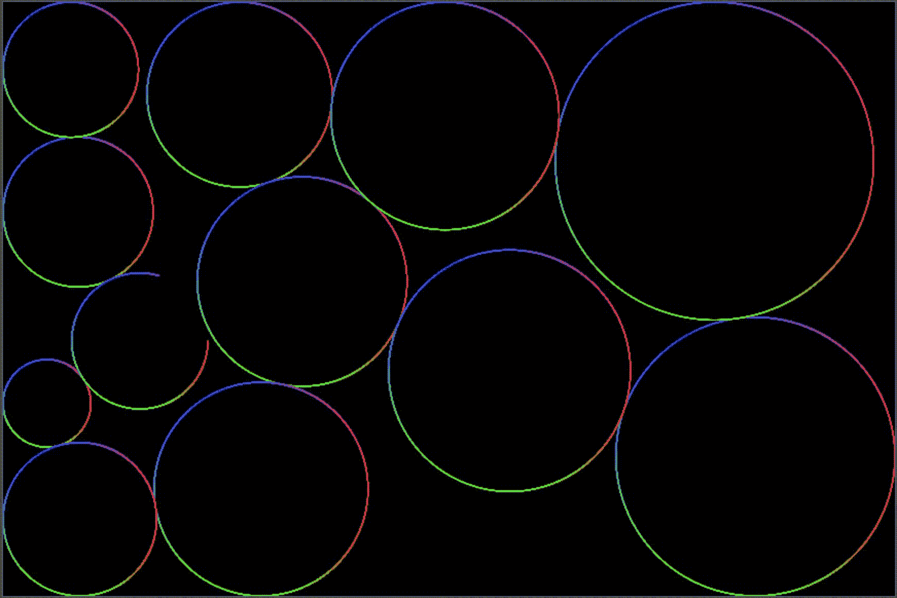

# Bikolor 项目:骑自行车穿越色彩

> 原文：<https://medium.com/hackernoon/bikolor-project-biking-through-colors-9c890a87c8c0>

*一个* [*可视化项目*](http://www.arunkishore.com/art/bikolor/bikolor-project-biking-through-colors.html) *探索自行车轨迹的多彩写照。*

Example image from [Bikolor Project](http://www.arunkishore.com/art/bikolor/bikolor-project-biking-through-colors.html) visualization.

我喜欢骑自行车，尤其是在旧金山湾区。附近有许多适合各种水平的骑车人的风景优美的路线。下面是从我最喜欢的游乐设施之一[鹰山](https://en.wikipedia.org/wiki/Hawk_Hill_(California))看到的[惊人的](https://hackernoon.com/tagged/amazing)景色(当[卡尔](https://en.wikipedia.org/wiki/San_Francisco_fog)不在的时候，就是这样！).

被遗忘的艺术品之一(嗯，至少对我来说)是自行车留在地上的痕迹。精心设计的图案来自各种类型的自行车(公路车、山地车等)。)，自行车轮胎有时会在地上留下一些惊艳的艺术品:

Example photo showing bike track art on the ground. [Source](http://production.tweaktoday.com/users/jonwaghorn/submissions/5001)

然而，这些杰作往往永远消失在泥泞和/或雨水中。所以我决定尝试设计一个可视化的设计，以一种“多彩”的方式重现和保存这些艺术作品。

可视化背后的前提非常简单。想象一下，如果你骑自行车经过一个有隐藏颜色的圆圈，当你骑自行车经过这个圆圈时，颜色就显现出来了。最终结果会是怎样的？这是对这一场景的模拟:

Simulation showing bike tracks over a single color wheel. (Please wait for the animation to load)

在这个模拟中，自行车轮胎可以有六种图案中的一种，为了简化，所有的轨迹都被绘制成圆弧形状，并且每次骑行只绘制一个车轮。一个[色轮](https://en.wikipedia.org/wiki/Color_wheel)被用来在一个圆圈中布置不同的颜色。当自行车移动到色轮的某个部分时，相应的颜色就会暴露出来。

现在，让我们进入下一个阶段，如果有一个这样的彩色轮子和自行车的集合可以一次在它们上面移动，会是什么样子？这是对该场景的模拟:

Simulation showing bike tracks over many color wheels. (Please wait for the animation to load)

***注*** :以上动画使用的是 GIF 格式，没有展示所有的详细步骤。[这里的](http://www.arunkishore.com/art/bikolor/bikolor-project-biking-through-colors.html)是上述动画的网络版，展示了全部细节。

我个人觉得这些模拟和最终图像超级有意思。即使单个的图案、形状和颜色非常简单，但将它们以一种合乎逻辑和自然的方式组合在一起，就会赋予更大的东西以生命。同意/不同意？请在下面留下你的评论。

*喜欢你看到的？请推荐，喜欢，推文和/或分享给你的朋友。我还在*[**Zazzle**](http://www.zazzle.com/collections/bikolor_series-119703481349540512)*把一些我喜欢的设计贴在* [*的海报、t 恤和手机壳上*](http://www.zazzle.com/collections/bikolor_series-119703481349540512) *。希望你喜欢它们！*

# 技术细节

1.  为了构建显示动画效果的 web 应用程序，我使用了 JavaScript、 [HTML5 Canvas](https://en.wikipedia.org/wiki/Canvas_element) 和 [D3.js](https://d3js.org/) 的组合。完整的源代码发布在 GitHub 上。
2.  web 应用程序被设计为从 JSON 文件格式的任意配置文件进行渲染，指定色轮和自行车轨迹的参数。配置文件的一个例子是[，这里是](https://github.com/arkitect7/bikolor/blob/master/data/config.json)。
3.  源代码还包括一个[配套的 web 应用](https://github.com/arkitect7/bikolor/blob/master/bikolor-generator.html)，可用于生成满足特定标准的配置文件(例如分辨率、色轮数量和自行车道数量)。默认生成算法试图最大化色轮的尺寸，同时避免色轮之间的重叠。

> [黑客中午](http://bit.ly/Hackernoon)是黑客如何开始他们的下午。我们是这个家庭的一员。我们现在[接受投稿](http://bit.ly/hackernoonsubmission)并乐意[讨论广告&赞助](mailto:partners@amipublications.com)机会。
> 
> 如果你喜欢这个故事，我们推荐你阅读我们的[最新科技故事](http://bit.ly/hackernoonlatestt)和[趋势科技故事](https://hackernoon.com/trending)。直到下一次，不要把世界的现实想当然！

