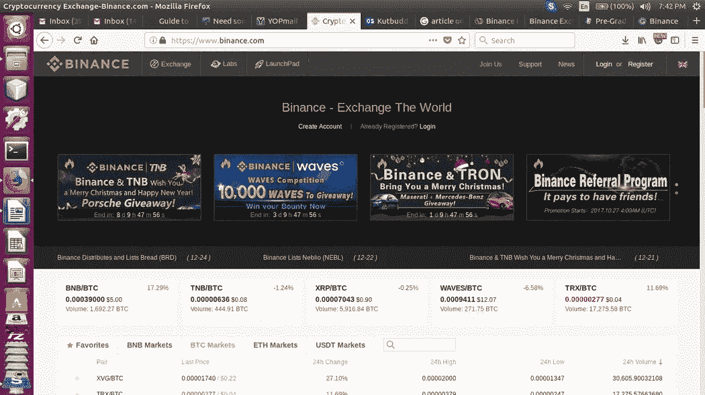
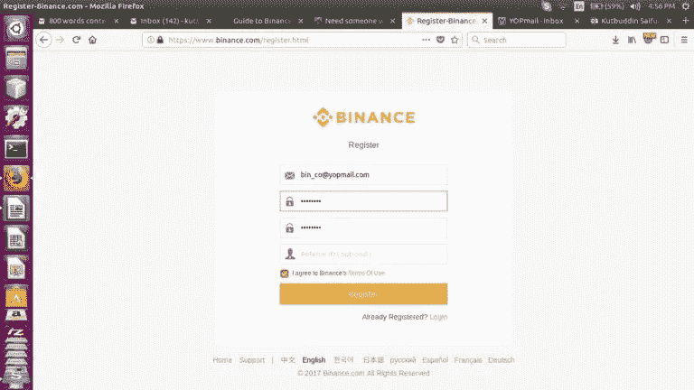
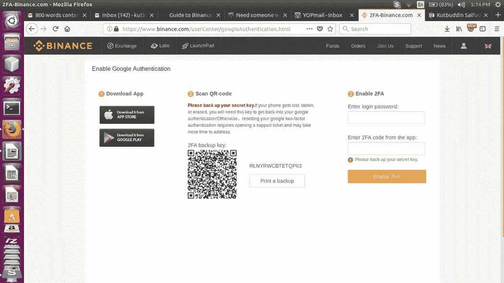
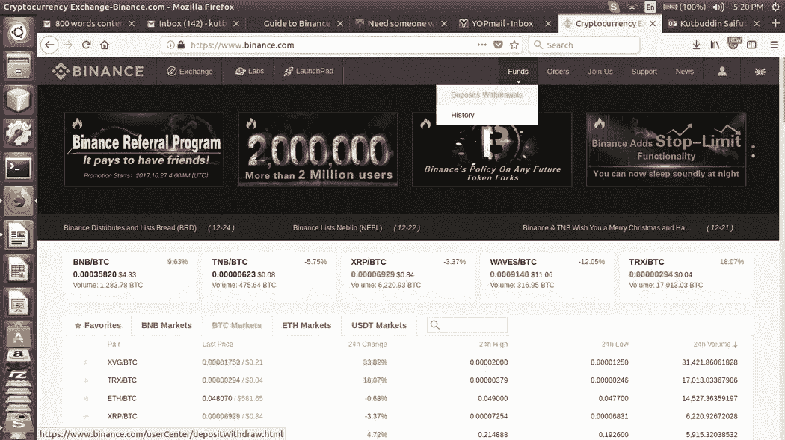
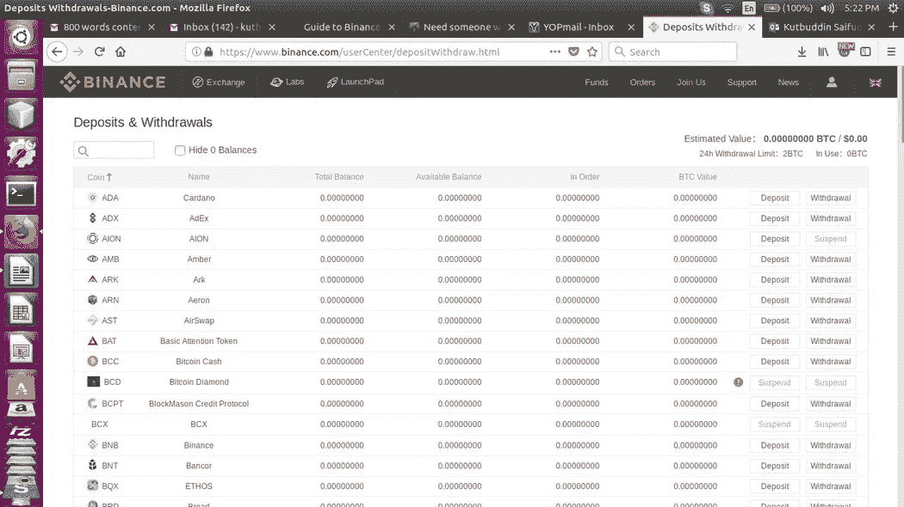
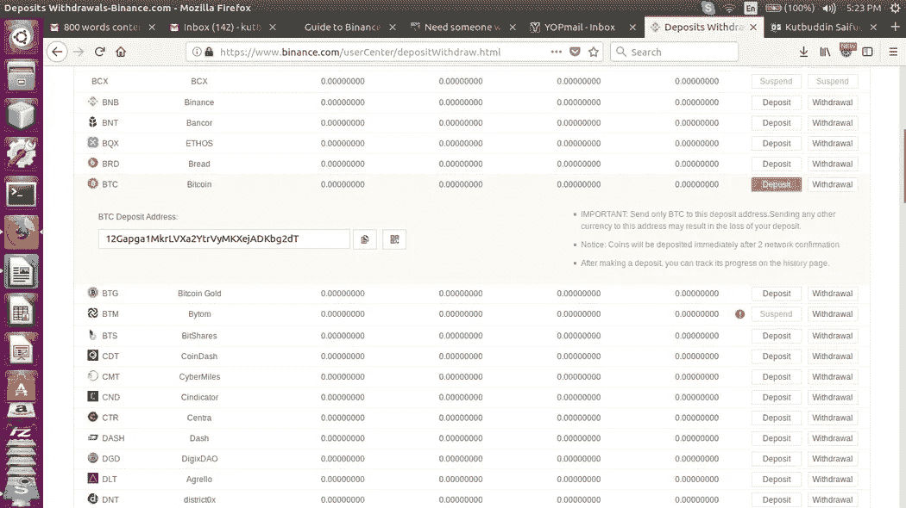
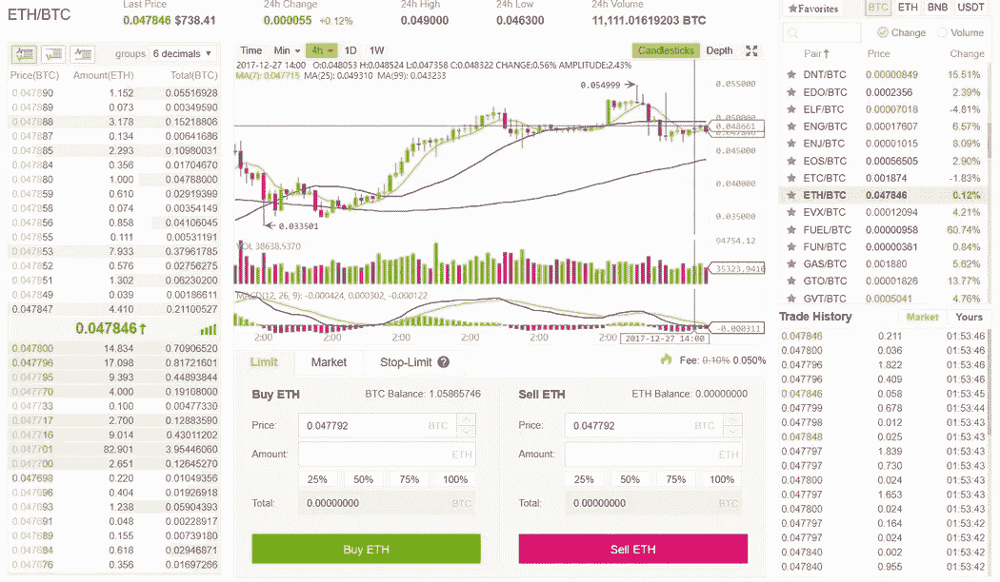

# 币安交易所—初学者指南

> 原文：<https://medium.com/hackernoon/binance-exchange-beginners-guide-703ee876d974>

世界上最大的密码交易所！

撰写本文时，[币安](https://cryptopotato.com/pl/binance1en)是发展最快的加密货币交易交易所。在短短 5 个月的时间里，它已经在加密货币交易所中排名第十。币安变得如此受欢迎是由于一些因素，如多种语言的可用性，非常简洁的用户界面，它还能够以极高的速度处理订单。币安交易所仅可用于交易加密货币，因此，它不可用于任何法定有线存款。

# 我为什么要开一个币安账户？

币安正在以非常快的速度增长，如果它继续增长，它将很快成为世界上最大的交易替代硬币的加密交易所。与其他主要交易所(Poloniex 和 Bittrex)相比，许多新推出的硬币和代币正在币安上市。如果你错过了一些 ico，你可以在币安上找一些。

# 我如何开一个币安交易账户？

# 第一步:去币安网站

[点击此处](https://cryptopotato.com/pl/binance1en)前往币安，该链接将在新窗口中打开，因此您仍可遵循该指南。

将此页面设为书签，因为有许多钓鱼网站与实际网站完全相似。您应该始终检查网站 URL，并检查将验证原始站点的安全证书。

# 步骤 2:完成注册过程

点击网页右上角的“注册”按钮，并提供所有必需的信息。对于密码，请遵循指南并设置一个强密码。最后，重新输入您的密码，然后单击“注册”按钮。检查您的电子邮件帐户收件箱，您将收到一封确认新帐户的电子邮件。

# 步骤 3:启用双因素身份验证(2FA)

当你第一次登录时，会出现一个弹出窗口，要求你启用 2FA，这将有助于提高你的帐户安全性。如果你是 2FA 的新手，你需要下载谷歌认证应用程序，然后扫描二维码(或输入密钥)，以获得 1 分钟的变化代码。

完成这 3 个步骤后，您就完成了帐户设置。

# 第四步:存款

转到“资金”菜单项下的“存款取款”

在主菜单的右上角，您会发现名为“基金”的选项卡在该页面下，选择“存款取款”按钮，将打开以下存款页面:

现在选择你想存入的硬币

你会在那一页找到所有交易硬币的列表。搜索您要存入的硬币，然后按下同一 raw 上相应的“存款”按钮。一旦按下，一个新的专用钱包将被创建(这是一个属于你的币安帐户的钱包)。每个硬币的钱包地址是不同的，请确保您只将特定的硬币存入其钱包，否则会导致资金完全丢失。

现在，将您自己钱包(或交易所)中的硬币发送到新生成的地址:

在这个例子中，我们想要存放比特币。在名为“BTC 存款地址”的字段下，生成的地址就是你需要向其发送比特币的地址。该地址将用于从您的钱包或任何其他交易所向您的币安账户转账。

查看您的历史记录选项:您可以在菜单项“资金”下看到存款(和取款)的历史记录，然后在列表上看到“历史记录”。

# 步骤 5:提取购买或出售交易

在“交换”菜单项下选择“基本交换”。现在从右窗格中选择所需的对。使用搜索栏进行快速导航。

在这个例子中，我们想把比特币换成以太坊。我们首先选择 ETH/BTC 配对市场，然后我们将得到以下结果:

左侧窗格显示订单簿，而在中间，我们看到的是最后的价格。在中间我们可以看到这个图表，在它的正下方，我们可以为 BTC 买卖 ETH。

为了购买(限制):设置所需的价格，选择金额(ETH 单位，或选择您的总比特币的百分比)。然后将自动计算总 BTC(成本)。为 BTC 出售 ETH 将是相同的，但方向相反。

如果你想以市场价格购买，那么从顶部菜单中选择市场。止损是更高级的，让你设置止损或停止购买订单。

[点击此处](https://cryptopotato.com/pl/binance1en)前往币安，该链接将在新窗口中打开，因此您仍可遵循该指南。

# 什么是币安硬币(BNB)，它是用来做什么的？

币安创造了自己的加密硬币，被称为 BNB。它被用作支付交易所费用的可选方法，这些费用包括:交易费——购买或出售硬币的费用、上市费和取款费。

当您使用 BNB 硬币时，您的账户第一年将获得 50%的折扣，第二年 25%，第三年 12.5%，第四年 6.25%。

BNB 代币也用于币安 Launchpad，这是一种投资币安特定 ico 的方式。这些 ICO 将通过 ICO 在币安交易所上市。

币安计划用 20%的利润从公开市场回购 BNB。

*原载于 2017 年 12 月 29 日*[*【cryptopotato.com】*](https://cryptopotato.com/binance-exchange-beginners-guide/)*。*