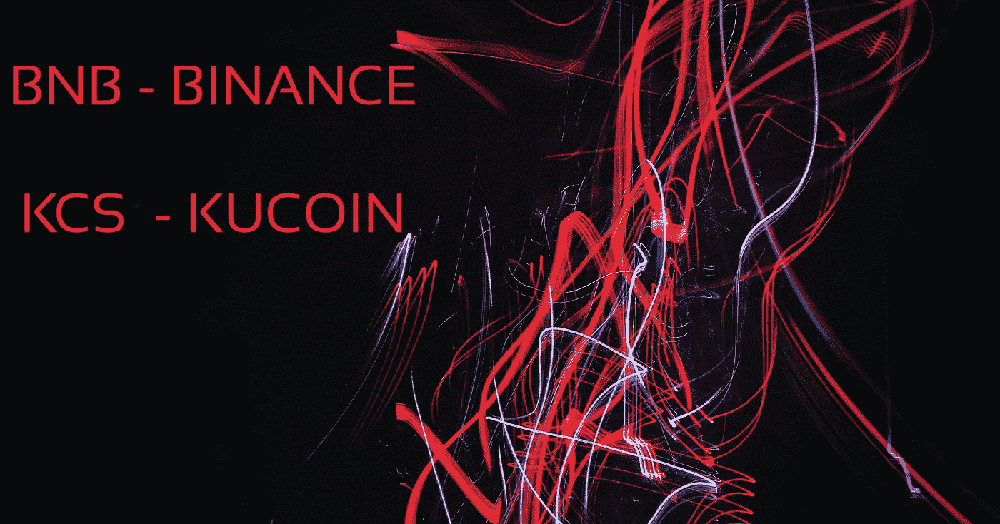
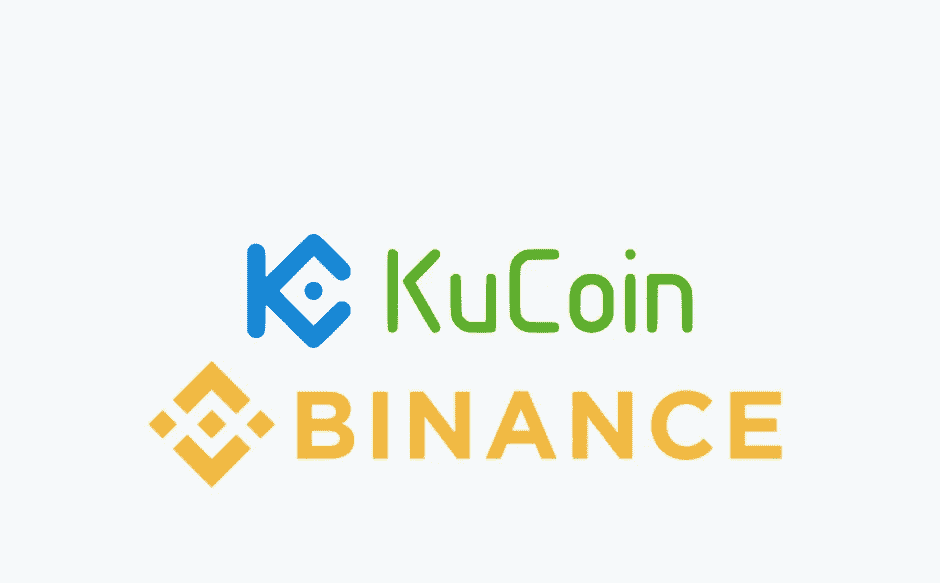
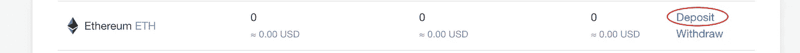
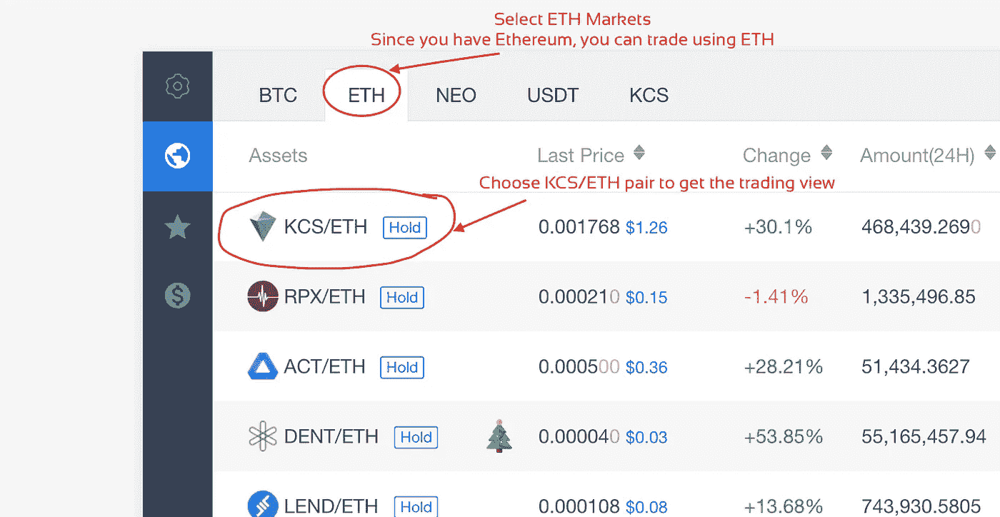
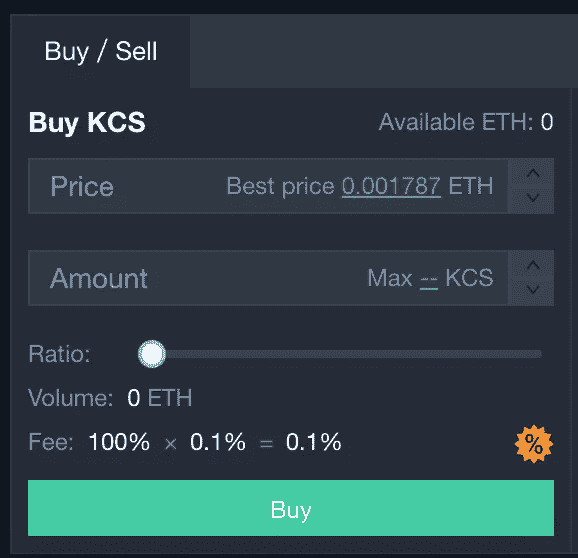

# 支票硬币:KCS BNB 的硬币持有者从加密交易所支付的红利中谋生

> 原文：<https://medium.com/hackernoon/binance-kucoin-bnb-kcs-can-save-you-fees-be-a-good-investment-822d38cffd0>

## 随着交易所的成熟以及用户基础和数量的增加，投资大众交易所的股票/定制代币将如何导致资产价值的增长

当每个人都在试图理解什么是区块链，什么是比特币，以太坊，Ripple 以及突然出现的 IOTA，Cardano 等新的东西时，有一颗隐藏的宝石在那里，它可能是更好的投资。

交易所专用代币——交易所为节省交易费用而提供的硬币或定制代币。我们称它们为 ESTs:)

> 这是一种观察&从少数其他教育来源收集的知识，而不是投资建议。

## [币安的成长](https://www.binance.com/?ref=11705133)

非常年轻的加密货币交易平台名为[币安](https://www.binance.com/?ref=11705133)，几个月前刚刚成立，现在已经成为 24 小时交易量全球最大的加密交易所。这都是因为惊人的营销，新的商业模式和积极的硬币上市。[币安](https://www.binance.com/?ref=11705133)现在有很多硬币，在项目能力方面有更大的潜力，但在 Bittrex、Poloniex 上没有列出。这给了币安很大的优势。

> 这个博客的内容并不打算作为投资建议。这只是一个*如何教程。介绍我的投资组合和使用例子，纯粹作为我所做的记录，并不构成是否应该买入或卖出某种货币的建议。*

除此之外，[币安](https://www.binance.com/?ref=11705133)的另一个重要优势是拥有自己的名为“BNB”的硬币——仅用于支付每笔交易的交易费用。

## 交易费用和 BNB

交易费很痛苦但无法避免！但是，如果交易平台鼓励人们使用 ***自定义令牌*** 而不是您的替代硬币&在您使用此 ***自定义令牌时给予 50%的费用折扣呢？*** 那是*给你的。*

*鉴于这一优势，人们一直在购买 BNB 代币，以避免一半的交易费——根据供求经济学，自发行以来，BNB 的价格已经上涨了 50 倍。*

*因此，如果你是一个聪明的投资者——只买这只 BNB 并持有它，随着平台上交易量的增长，你的资产也会升值。因为币安从一开始就已经证明了它的营销策略和增长方向——我认为它会做得很好。*

**

## *[库科恩](https://www.kucoin.com/#/?r=1R8v3)加紧游戏*

*现在[***ku coin***](https://www.kucoin.com/#/?r=1R8v3)***，*** 另一家交易所推出了非常酷的界面和非常实用的体验，并以自己的令牌更进一步，***——***[***ku coin***](https://www.kucoin.com/#/?r=1R8v3)***股*** 。Kucoin 从每笔交易中收取 0.1%的费用，包括制造商和接受者，总计每笔交易 0.2%的费用(有人卖，有人买)。 ***【大爆炸】报价从***[***KuCoin***](https://www.kucoin.com/#/?r=1R8v3)***是他们支付这笔费用的 50%(每笔交易 0.1%)给 KCS 持有者！****

*这篇[文章](/@osmantoplica/how-kucoin-could-make-you-retire-in-2-years-b934a4ef3ff5)展示了投资 10，000 美元的信封背面的计算。来自币安的 BNB 代币显示了这种定制代币的供求特征，并且,[库币](https://www.kucoin.com/#/?r=1R8v3)交易所的交易量增加也将导致您的红利增加，从而增加持有资产的价值。*

## *如何购买 KCS 股票*

1.  *在比特币基地上注册，购买以太坊(或比特币——但交易费用会很高，而且与以太坊相比，转账时间要长得多)。*
2.  *在 [KuCoin](https://www.kucoin.com/#/?r=1R8v3) Exchange 上将您的以太币转移到您的 ETH 存款地址。*

**

*click on deposit to see your ethereum address and send from coinbase to that address*

*3.选择 KCS/瑞士联邦银行对查看 KCS/瑞士联邦银行交易视图*

**

*4.在 KCS/ETH 对的交易视图的右下角，您会看到买入和卖出框，在这里您可以选择您想要买入的价格，输入您想要买入的 KCS 数量，然后点击买入*

**

*一旦你点击购买，你的订单将被放置。这是一个限价单，所以只要你的指定价格被触及，它就会买入 KCS，你可以在你的余额中看到它们。*

> *本文中使用的数字和金额是出于教育目的，我不指定你应该投资的金额。这是你自己的决定。鉴于加密货币空间的不稳定性，你只能投资你可能会失去的东西。*
> 
> *本博客的内容无意作为**投资建议**。这只是一个*如何操作的教程。S* 我的投资组合和使用的例子，纯粹作为我所做的记录，并不构成是否应该买入或卖出某种货币的建议。在投资之前，你应该总是做自己的研究 **(DYOR)** ，做出自己的决定 **(MYOD)** ，并对风险感到放心。投资不稳定的加密货币包含一个风险因素:这些货币的价格会上下波动(通常以一种看起来不理性的方式)。*