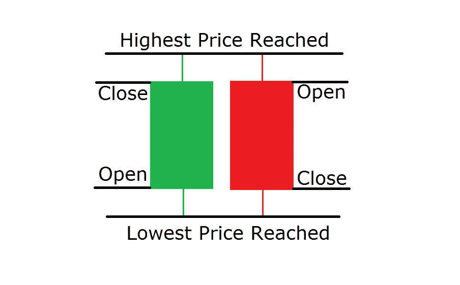
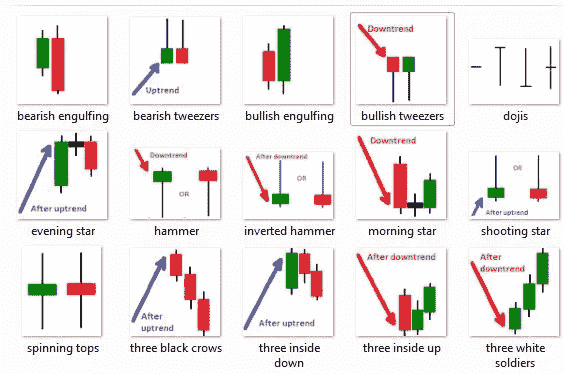
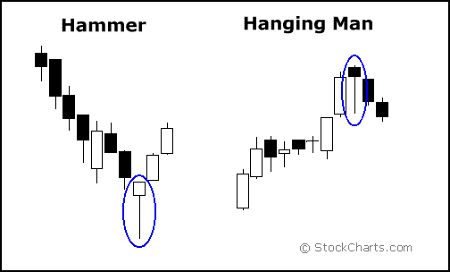
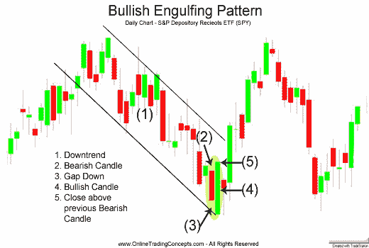
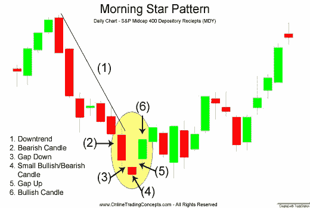
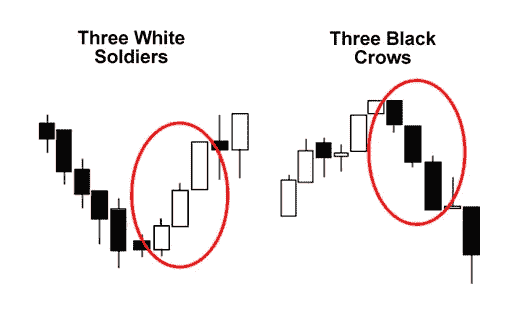
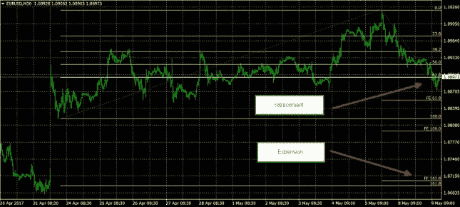
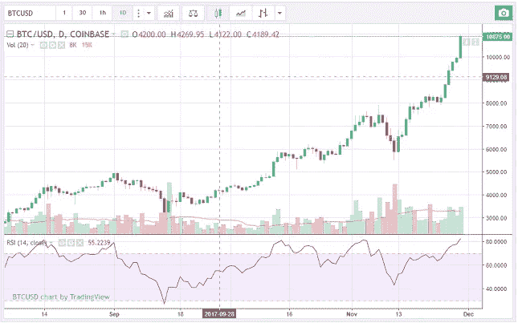
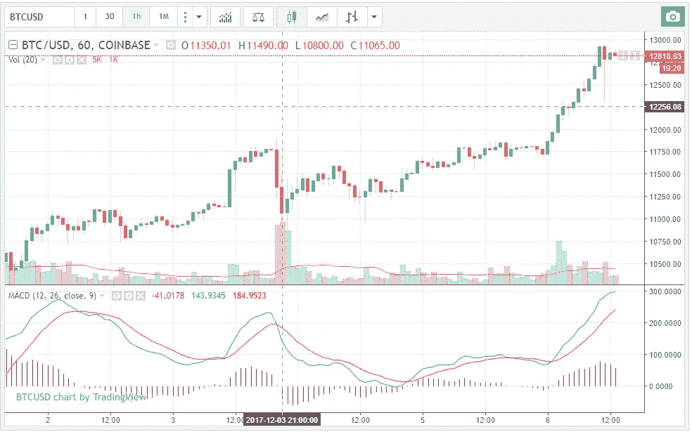
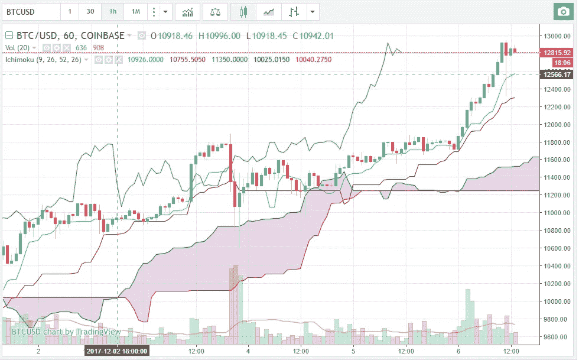

# 比特币和加密高级技术分析

> 原文：<https://medium.com/hackernoon/bitcoin-and-crypto-advanced-technical-analysis-44bc2b552388>

加密货币市场的独特特征使得技术分析和制图成为帮助预测方向、势头、支持和阻力的宝贵工具。

这篇文章简要概述了一些更先进的流行技术分析方法，可用于分析加密货币市场，如[比特币](https://www.fxempire.com/education/article/how-to-buy-bitcoin-453322)。如果你对技术分析不熟悉，请阅读我们为初学者准备的[加密技术分析指南](https://cryptopotato.com/bitcoin-crypto-technical-analysis-beginners/)。

每一种都有自己的特点，鼓励投资者研究每一种，以确定它是否适合他们特定的交易风格和风险承受能力。

# 日本烛台

日本烛台是一种技术分析工具，可能对加密货币交易者有益，因为它们为交易者提供了多个时间框架的关键数据，并转化为单一价格条。

尽管加密货币与传统资产非常不同，但它们仍然以相同的方式绘制，价格行为由开盘价、最高价、最低价和收盘价(OHLC)确定。OHLC 使用烛台来建立模式，一旦完成，预测价格方向。

根据研究和回溯测试，有五种烛台模式表现非常好，可以作为价格方向和动量的前兆。每个烛台模式在周围的价格酒吧的背景下工作，在预测较高或较低的价格。

最准确的烛台模式分为反转和延续两类。蜡烛图反转模式预测价格方向的变化，而连续模式预测当前价格走势的延伸。

Source: Forexadobe

由于加密货币往往有很强的上行倾向，希望使用蜡烛线形态来提高交易技能的交易者应该专注于预测底部或持续上涨趋势的图表模式。

例如，在比特币历史性的牛市反弹期间，投资者应该关注的五种看涨烛台模式被称为锤子、看涨吞没模式、穿刺线、晨星和三个士兵。

锤子是一种看涨反转形态，它标志着一种工具在下跌趋势中接近底部。绞刑者——相反。

Source: Sockcharts.com

多头吞没形态是在下跌趋势中出现的两根蜡烛线的反转形态。贯穿线也出现在下降趋势中:

Source: onlinetradingconcepts

晨星被认为是希望的象征，是低迷时期的新开端。

Source: onlinetradingconcepts

三兵形态通常在一段时间的下跌趋势或价格盘整后出现。

Source: Babypips

# 艾略特波浪分析

[艾略特波浪原理](https://www.fxempire.com/education/article/how-to-trade-using-the-elliot-wave-theory-407627)是一种技术分析形式，加密货币交易者通过识别投资者心理的极端情况、价格的高点和低点以及其他集体因素来分析市场周期和预测市场趋势。

艾略特波浪交易者认为，市场受集体投资者心理或群体心理的影响，它在自然序列中的乐观和悲观之间移动。

这似乎是一个适合加密货币交易者的纪律，因为在这个时候，他们完全由投资者心理驱动，因为除了由于供应有限而积极购买之外，没有真正的潜在基本面支持其价格上涨。

使用艾略特波浪分析成功的关键是得到正确的波浪计数。使用这种技术的交易者认为市场波动是波浪式的，价格行为主要由以下五组波浪驱动:

掌握艾略特波浪分析需要数年时间，但一些加密货币交易员认为他们已经掌握了足够的基础知识，可以将其应用于比特币等市场。

# 斐波那契水平

斐波那契水平是艾略特波浪分析的一个分支。简单地说，这是一种在加密货币市场中寻找可能的[支撑位和阻力位](https://cryptopotato.com/bitcoin-crypto-technical-analysis-beginners/)的方法。

例如，在做出高/低区间后，交易者预计市场将回撤该区间的 38.2%至 61.8%，以建立下一个潜在的买入或卖出机会。两者都是斐波那契水平。

相反，例如，在触底后，交易者会通过运用数学来预测价格的下一次反弹。交易者使用斐波纳契水平来估计趋势长度和趋势修正。

# 随机性和相对强度指数(RSI)

随机指数和相对强弱指数在技术分析领域被称为振荡指标，因为它们在 0 和 100 之间波动。由于超买和超卖的情况，一些加密货币交易者使用它们来确定趋势的强度或预测顶部和底部。由于[比特币价格](https://www.fxempire.com/markets/btc-usd/overview)因其高波动性而经常处于超买或超卖状态，RSI 指标向交易者发出进入或退出某个位置的信号。

它们都是在这样的前提下工作的，价格应该在上涨时接近交易区间的高点，在下跌时接近交易区间的低端。

在长期下跌过程中，振荡指标接近 0，表明底部可能就在附近。在长期上涨过程中，振荡指标接近 100，表明顶部可能就在附近。在附图中，比特币目前处于 81.92 (RSI)，这意味着比特币超买，预计将出现修正。

# MACD 或移动平均线收敛/发散

MACD 被归类为一个指标。它由两个指数移动平均线组成，有助于测量加密货币的动量。

MACD 比较加密货币市场中的短期动量和长期动量，以表明当前动量的方向，而不是价格的方向。

当 MACD 为正时，它表明加密货币的势头是向上的。当 MACD 为负时，情况正好相反。

# 市云

市云是一个指标，它定义了支撑和阻力区域，确定了趋势方向，衡量了势头，并提供了交易信号。“云”是在 6 个月前的均线跨度和 6 个月前的 52 周高点和低点的中点之间形成的。

简而言之，当价格在云之上时，总体趋势是上升的，当价格在云之下时，总体趋势是下降的，当价格在云之内时，总体趋势是持平的。

# 结论

当使用各种技术分析工具交易像[比特币](https://www.fxempire.com/best-brokers/bitcoin)这样的加密货币时，重要的是你要对你试图完成的事情有一个坚定的信念，因为本文中概述的每种技术都有其自身的特点。

例如，如果你是一个趋势交易者，使用趋势指标工具，你可能不想用振荡指标来掩盖你的分析，因为它可能表明市场超买或超卖。换句话说，在将技术工具应用到实际市场之前，先了解它们的特点。在缺乏基本面的情况下，在加密货币，特别是比特币中使用技术分析指标，对每个加密交易者来说都是必不可少的。

# 从高效的技术分析工具开始

[Coinigy](https://cryptopotato.com/to/coinigy2) 在所有交易硬币和加密交换中提供全面的制图服务。您可以点击此[链接](https://cryptopotato.com/to/coinigy2)进行注册，并获得 30 天免费试用。

CoinAnalyze :识别主要加密货币中日本蜡烛图案的优秀网站。

[TradingView](https://cryptopotato.com/pl/tradingview2) :图形和图表服务，类似于 Coinigy，选项稍有变化，UI/UX 更差。但是，嘿，完全免费。

# 还有更多(2018)

[阅读这里](https://cryptopotato.com/bitcoin-and-crypto-advanced-technical-analysis-vol-2/)延续指南，讨论布林线、CCI、旗帜、三角旗等等。

*原载于 2017 年 12 月 6 日*[*cryptopotato.com*](https://cryptopotato.com/bitcoin-crypto-advanced-technical-analysis/)*。*