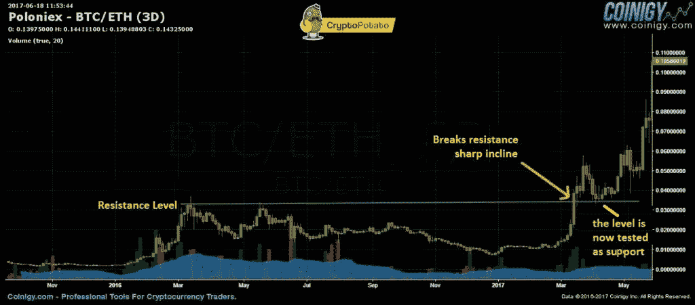
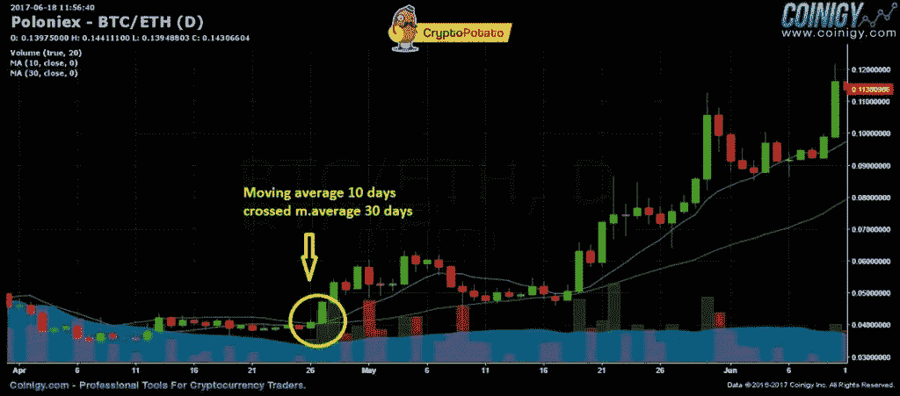
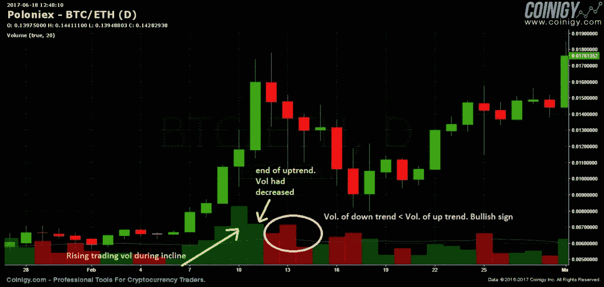

# 面向初学者的比特币和加密技术分析

> 原文：<https://medium.com/hackernoon/bitcoin-and-crypto-technical-analysis-for-beginners-de8248ad2b89>

加密交易员有几种工具来评估加密货币市场。其中之一是技术分析。使用这种方法，交易者可以更好地了解市场情绪，并隔离市场中的重要趋势。这些数据可以用来做出更有根据的预测和更明智的交易。

技术分析通过价格图表和交易量考虑硬币的历史，不管硬币或项目是什么。与技术分析相反，基本面分析更侧重于确定一枚硬币是高估还是低估。

为了更好地理解技术分析，理解技术分析所基于的道氏理论的基本思想是至关重要的:

1.  市场在定价时会考虑一切因素。所有现有的、先前的和即将到来的细节都已经被整合到当前的资产价格中。至于比特币和加密，这将由多个变量组成，如当前、过去和未来的需求，以及影响加密市场的任何法规。现有价格是对当前所有细节的反应，包括对市场上交易的每枚硬币的预期和了解。技术人员解读价格对市场情绪的暗示，对未来价格做出明智的预测。
2.  价格变动不是随机的。相反，他们经常追随长期或短期的趋势。在一个趋势被一个硬币形成后，它很可能会跟随这个趋势去反对它。技术人员试图用技术分析来隔离趋势并从中获利。
3.  “是什么”比“为什么”更重要。技术人员更关注一枚硬币的价格，而不是导致其价格变动的每个变量。尽管多个方面可能会影响硬币的价格向特定方向移动，但技术人员会果断地评估供求关系。
4.  历史往往会重演。可以预测市场心理。当面对相似的刺激时，交易者有时会有相同的反应。

# 趋势线

趋势线，或者硬币移动的典型方向，对加密交易者最有利。也就是说，隔离这些趋势说起来容易做起来难。加密资产可能会大幅波动，观察比特币或加密价格走势图可能会揭示形成线性模式的高点和低点。记住这一点，技术人员知道他们可以忽略波动性，在看到一系列更高的高点时发现上升趋势，反之亦然——当他们看到一系列更低的低点时，他们可以识别下降趋势。

此外，还有横向移动的趋势，在这种情况下，硬币不会向任何方向移动。交易者应该注意趋势有多种形式，包括中期、长期和短期趋势线。

**重要提示**:画这些趋势线的时候一定要**准确**！如何做到完美？当你悬停在[每根蜡烛](https://cryptopotato.com/bitcoin-crypto-advanced-technical-analysis/)上时，你会注意到它的最低价格在顶栏标为“L”(或者最高价格，“H”，如果线的方向是向下的)。现在把线准确地放在那里。接下来，粗略地延长这条线，当它接触趋势线的下一根蜡烛线时，做同样的事情——精确地检查蜡烛线的“L”。现在纠正你的台词。最后一步是使用线的设置自动延伸线——线延伸到所需的一边(可能是右边)。这个解释是针对 [Coinigy](https://cryptopotato.com/to/coinigy) 图表的，但是应该可以很好地用于其他图表应用程序。

# 阻力和支撑位

因为有趋势线，所以也有水平线来表示支撑位和阻力位。通过确定这些级别的值，我们可以得出关于硬币当前供求的结论。在支撑位，似乎有相当数量的交易者愿意购买硬币(大量需求)，即，这些交易者认为货币在该水平的价格较低，因此将寻求在该价格购买。一旦价格接近这个水平，买家的“底线”就形成了。大量的需求通常会阻止下跌，有时甚至会将势头变为上升趋势。阻力水平正好相反——许多卖家耐心等待订单，形成一个大的供应区。每当硬币接近“天花板”时，它就会遇到供给栈并返回。

经常有这样一种情况，在支撑位和阻力位之间进行权衡:在支撑线附近聚集，在阻力位附近卖出。这种机会通常发生在横向运动被确定的时候。

那么在突破阻力位或支撑位时会发生什么呢？这很有可能是一个加强现有趋势的指标。当阻力位变成支撑位，并在突破后不久从上方测试时，趋势得到进一步加强。

注意:假突破发生在突破发生的时候，但是趋势没有改变。因此，我们必须使用更多的指标，如交易量，来确定趋势。

# 移动平均线

为了简化趋势识别，加密货币和一般技术分析的另一个技术分析工具叫做移动平均线。移动平均线是基于一段时间内硬币的平均价格。例如，某一天的移动平均值将根据该日之前 20 个交易日的硬币价格来计算。连接所有均线形成一条线。

认识指数移动平均线(EMA)也很重要，这是一种移动平均线，它在计算中给予过去几天的价格值比过去几天更大的权重。一个例子就是 EMA 15 天最后五个交易日的计算系数会是之前十天的两倍。

在下图中，我们可以看到一个实际的例子:如果 10 天移动平均线穿过 30 天移动平均线，这可能告诉我们一个积极的趋势即将到来。

# 交易额

交易量在识别趋势中起着重要的作用。显著趋势伴随着高交易量，而弱势趋势伴随着低交易量。当一枚硬币下跌时，最好检查伴随下跌的成交量。健康增长的长期趋势伴随着大量的增长和少量的下降。看到交易量随着时间的推移而上升也很重要。如果在上涨期间交易量减少，上涨趋势可能会结束，反之亦然。

# 不仅仅是技术分析

利用技术分析，交易者可以识别趋势和市场情绪，他们也有能力做出更明智的投资决策。但是，有一些要点需要考虑:

技术分析是衡量某些硬币的过去价格和交易量的实用方法。在考虑进场交易时，不建议你只依靠技术分析。尤其是在 crypto 这个经常产生新闻的领域，有对市场产生重大影响的基本面因素(比如法规、ETF 证书、挖矿 hash 等。).技术分析只是忽略而不能预测这些因素，所以建议把技术分析和基本面分析结合起来，做出明智的投资决策。

一个因为基本面原因而决定购买某个硬币的分析师可以得到技术支持，或者找到一个好的技术切入点，从而提高交易的投资回报率。

# 从理论到实施:如何开始并识别趋势？

为了开始，我们需要一个分析工具，可以快速方便地绘制图表。您可以使用加密交易所的现有图表，但它们不提供趋势线，并且只提供部分指标。

[Coinigy](https://cryptopotato.com/to/coinigy) 为所有交易硬币和加密交易提供全面的图表服务。您可以通过这个[链接](https://cryptopotato.com/to/coinigy)进行注册，并获得 30 天的免费试用。

本指南介绍了密码技术分析的基本概念。如果你想进行技术分析，建议你加深这个领域的知识:指标，斐波纳契水平，模式(例如三角形)，等等。在我们接下来的专题文章中，你会读到关于[的 8 个交易技巧](https://cryptopotato.com/8-must-read-tips-trading-bitcoin-altcoins/) crypto。有些触及技术层面。

2017 年 12 月更新:我们最近发布了一个用于加密技术分析的[高级指南](https://cryptopotato.com/bitcoin-crypto-advanced-technical-analysis/)。

*原载于 2017 年 6 月 24 日*[*cryptopotato.com*](https://cryptopotato.com/bitcoin-crypto-technical-analysis-beginners/)*。*