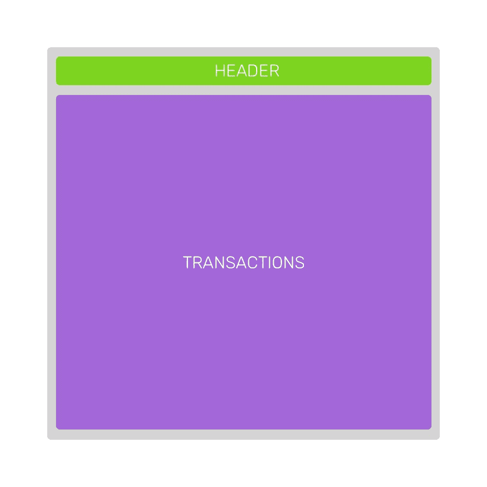
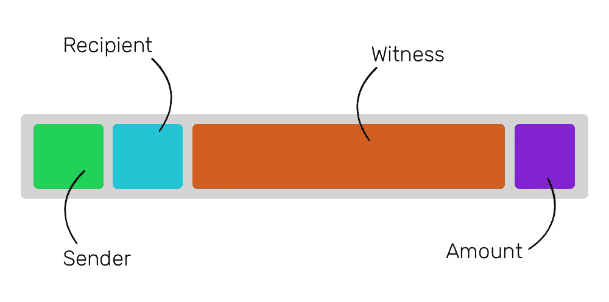
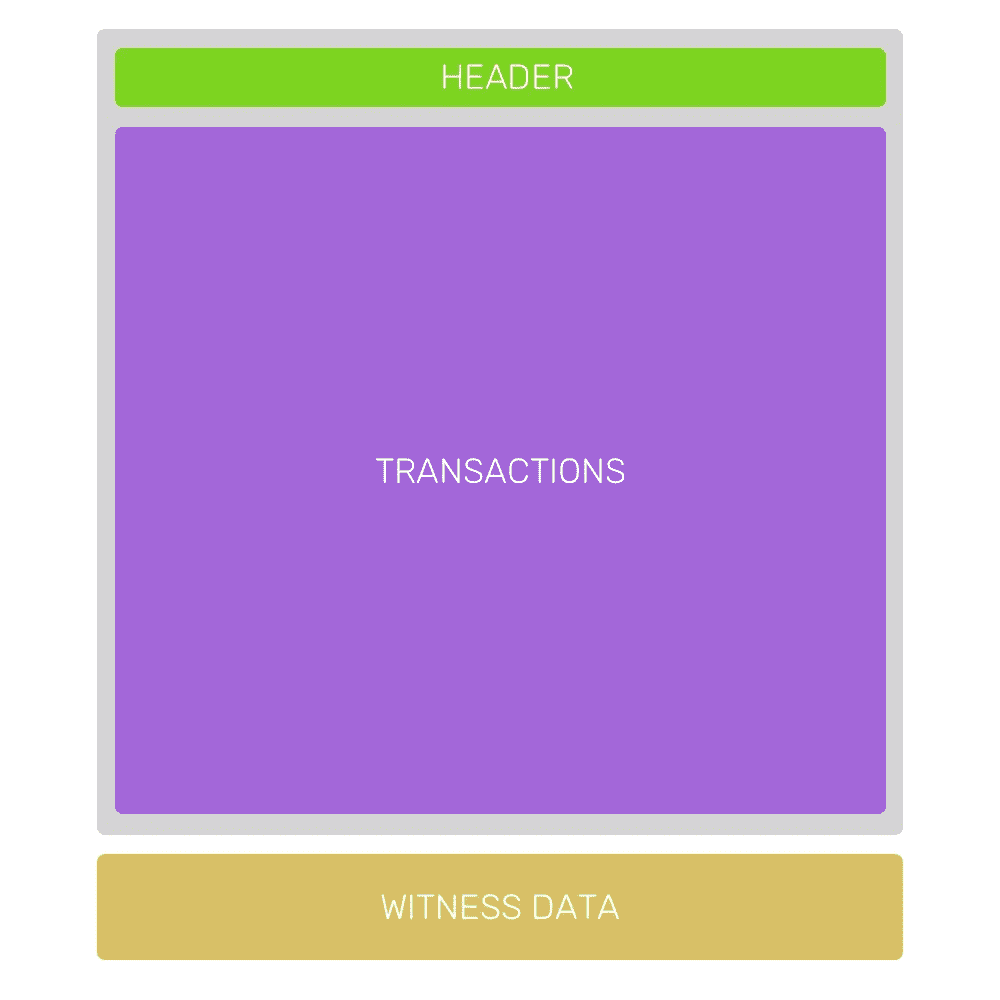
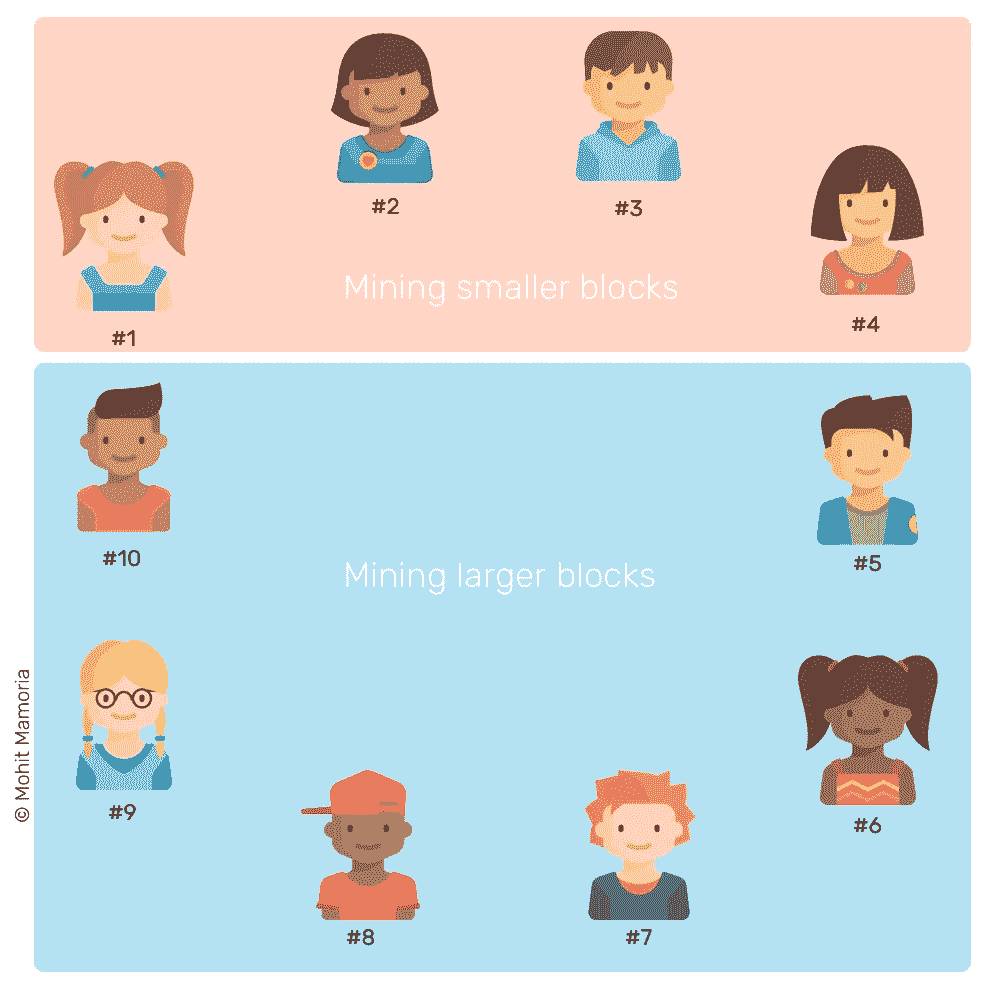
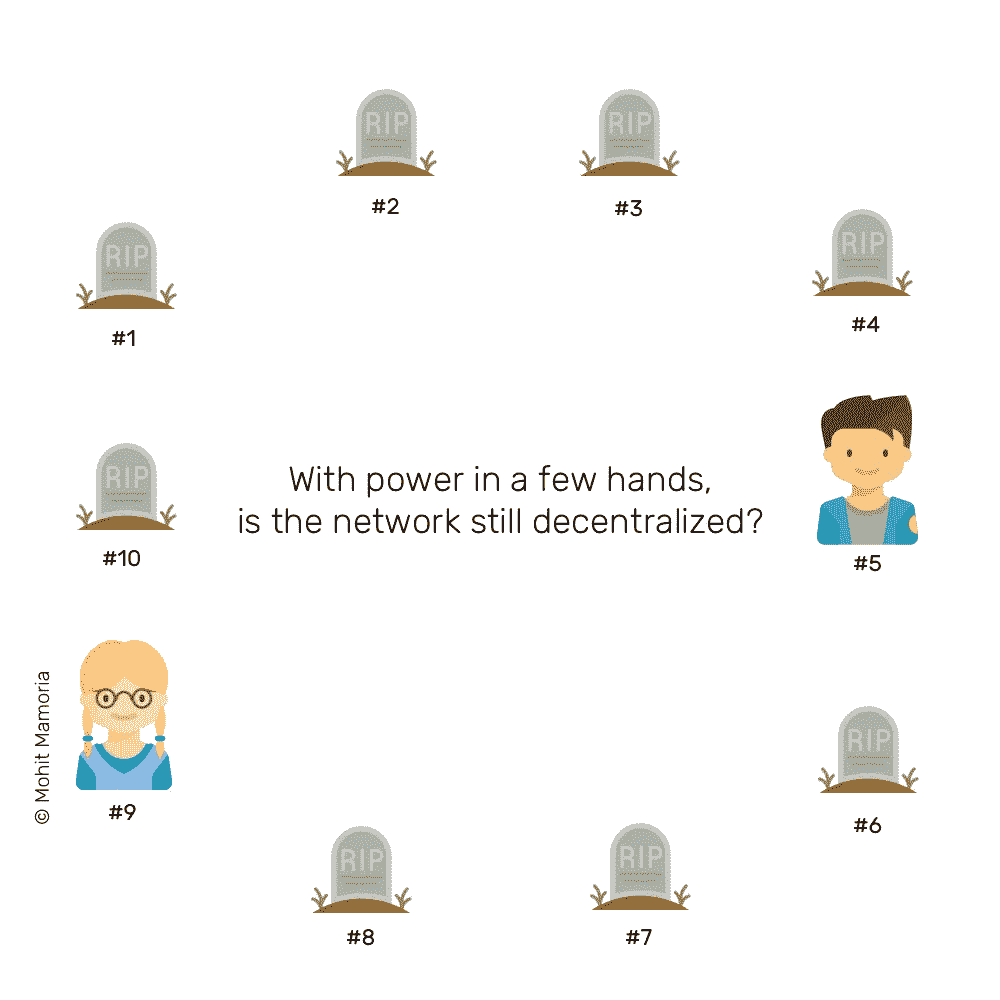
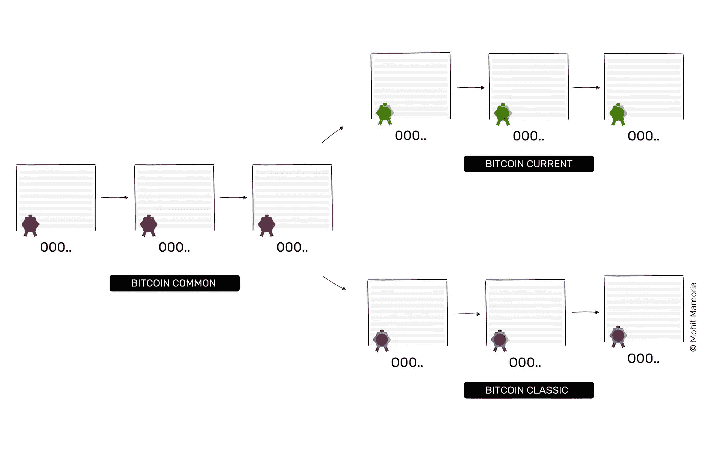

# 为什么比特币会“可能”一分为二？

> 原文：<https://medium.com/hackernoon/bitcoin-august-1-fork-5d8249407f3a>

## 你想了解但又不敢问的关于潜在的八一叉的一切。

[https://themerkle.com/should-you-be-concerned-about-a-bitcoin-chain-split-on-august-1st/](https://themerkle.com/should-you-be-concerned-about-a-bitcoin-chain-split-on-august-1st/)

T **比特币社区**对 8 月 1 日将会发生的事情有很多担忧。加密货币会分裂成两种新货币吗？不会吗？什么是 BIP 91？什么是 BIP 148？SegWit 是什么？

令人难以置信的重要日期就在眼前，但仍有许多未解之谜！

> 顺便说一下，我是每周时事通讯的策展人， [Unmade](https://unmade.email) ，它将一个来自未来的想法发送到你的收件箱。

我整理了这份指南，带你了解整个情况，让你随时了解事态的发展。在撰写本文时，比特币似乎会避免链分裂——目前是。然而，即使看起来对立的政党已经达成了一致的结论，仍然需要做很多事情来避免分裂。

为了理解实际发生了什么，以及为什么比特币社区分裂为两个，最好看一看加密货币的一个基本问题，或者更确切地说，人们如何在如何解决这个问题上产生分歧。

一边是管理比特币开源软件的人。他们就像是保持比特币协议发展的组织/社区。另一边是矿工，他们部署计算机来运行比特币网络(区块链)。要让比特币继续运行，双方都至关重要——一方离不开另一方。为了充分理解这个问题，你需要理解比特币的机制，这就是为什么我试图在本指南中解释比特币链分裂的完整交易。

# 比特币有什么问题？

> “死亡是所有问题的解决办法。没有人——没问题。”—约瑟夫·斯大林

**大多数人认为比特币是一种数字货币**，你可以用它在网上买卖东西。这在技术上是正确的，但这不是比特币的真正价值。

比特币对于日常交易来说并不可行，我们也无法走进星巴克用比特币支付咖啡。但这是为什么呢？对于比特币的制造者来说，将它作为其他货币的真正替代品，从而提高比特币的价值，这难道没有意义吗？

好吧，还没有发生的原因是比特币区块链速度慢且昂贵。它远远没有达到支付技术的标准，因为比特币网络每秒可以处理多达 6 笔交易，而 VISA 网络每秒可以处理超过 1600 笔交易。

公众接受分散式网络的唯一方式是，它是否能像现有的支付网络一样快捷方便。除非发生这种情况，否则比特币将主要被用作储存价值的工具。

# 为什么网速这么慢？

> "我赌的那匹马跑得太慢了，骑师记下了全程日记。"—亨利·扬曼

比特币的网络建立在区块链之上。如果你还没有阅读[理解区块链](https://hackernoon.com/wtf-is-the-blockchain-1da89ba19348)的终极指南，可以把区块链想象成一个包含几页(块)的寄存器，每页包含几笔交易。一旦一个页面被事务填充，就需要在开始在下一个页面记录事务之前将其添加到寄存器中。

在将一个页面(块)添加到寄存器(链)之前，需要进行一些处理，以确保每个人都同意它包含的内容。每个区块的处理过程大约需要 10 分钟。

想象一下，你正在给你的朋友乔发送 1 BTC。该事务看起来会像这样。

**一笔交易包含**关于发送者、接收者、金额和交易费用的信息。

等一下，交易费？是的，你可以支付额外的费用来激励矿工尽快将你的交易加入区块。没有固定的价格，你愿意付多少钱来加速这个过程完全取决于你。

在任何给定的时刻，都有几个事务可以记录在当前页面上。如果您在一天中的任何时间寻找未确认(未决)交易的数量，该数量将总是接近一万个。那时，世界上 99%的人还没有使用加密货币。这个数字很容易超过几百万。

矿工(在区块链网络中工作的计算机)必须决定在当前块中包括哪些可用的事务。为了帮助他们做出决定，他们会查看哪些交易会产生最多的回报，这意味着交易费用最高的交易将首先被包括在内。

如果有足够多的交易比你的交易费用高，那么你的交易将不得不排队等待。等待时间从几分钟到几个小时不等。有时，甚至几天。您支付的交易费越多，您的交易处理得越快。

对于用户来说，使用比特币变得又慢又贵。不完全是“互联网的钱”应该是什么样子。

然而，这促使聪明人提出了一个重要问题:“我们如何扩大比特币区块链的容量？”

有趣的是，有太多聪明人问了这个问题。运行比特币的人(维护人们电脑上运行的开源代码的人)相信一种解决方案，而矿工(在自己的电脑上运行代码的人)相信另一种解决方案。

运行比特币的人提出的解决方案有利于用户，而矿工提出的解决方案有利于他们自己(真让人吃惊！).正是这种分歧导致了 8 月 1 日前后的混乱以及比特币区块链的潜在分裂。我们将在稍后的文章中回到这个话题；我们先来了解一下解决方案。

# 对用户有利的解决方案

> "当金钱被视为解决所有问题的方法时，金钱本身就成了问题."理查德·李约瑟

**运行比特币的人想出了**起源于我们如何在块中存储交易。最初的解决方案是消除石块的延展性，但它有一个积极的副作用:它也增加了区块链的容量。为了更好地理解它，我们需要了解块是什么样子的。

该解决方案在互联网上有几个名字，如赛格维特、BIP 148 和 UASF(用户激活软叉)。

## 街区是什么样子的？

从最简单的角度来看，链中的一个块包含两种类型的数据——标题和事务。

头包含块的元数据，但这与 8 月 1 日的分叉无关。头很小，只占块数据的百分之一。该块的其他 99%的数据由该块中包含的事务组成。

A block on bitcoin blockchain

如果我们更深入地了解单笔交易的组成，我们会发现除了显而易见的东西——如发送者、接收者、金额和交易费用——它还包含一些被称为“签名”或“见证”的东西。签名验证发送者有足够的余额在交易中发送所述数量的比特币。这个特定的数据在开始时只使用一次，但是它几乎占了事务中数据的 65%。

一个块的总允许大小是 1MB，其中大部分都是对该块不重要的数据。这个想法是将签名/见证数据移向一个单独结构中的块的末尾。

这种独立的结构不需要包含在区块链中。如果一个节点(网络中单独参与的计算机)可以，那就太好了。如果不能，没什么大不了的。由于这一特性，它被称为软叉。

一些节点将更新它们的软件并开始在新的块结构上工作，而决定留在遗留软件上的节点将简单地忽略见证部分。这种结构优化允许在一个块中包含更多的事务。

这种解决方案在技术上称为 SegWit，因为它将见证从块结构中分离出来。它对用户有利。

## SegWit 是如何受到用户青睐的？

新结构可以容纳比当前结构多得多的事务。它导致未确认交易之间的竞争被包括在块中。随之而来的是交易费用的下降。交易费是矿商获得的报酬的一部分。随着费用的降低，开采区块的报酬也会降低。不仅如此，这种新结构还被称为闪电网络，它允许小额支付(你在星巴克支付咖啡费用)即时处理，无需任何费用。

反对这种解决方案的主要论点是，这是一个临时的解决方案，最终会实现一个“硬分叉”。而硬叉是矿工的主张。

# 有利于矿工的解决方案

> "政府解决问题的方法通常和问题本身一样糟糕."—米尔顿·弗里德曼

**矿工们提出了一个解决方案，即**将长期扩展网络。他们的提议是像用户提议的那样实现 SegWit (Soft Fork ),除此之外，他们还希望将块的大小从当前的 1MB 增加到 2MB。因此，这个名字——seg wit 2x。

除了被称为 SegWit 2x，矿工的解决方案也被称为 MASF(矿工激活软叉)和 BIP 91。

乍一看，这个解决方案看起来更好。

我几乎能听到你在喊，“网络会更快。耶！”

然而，魔鬼在于细节。如果实施这种解决方案，网络中的每个矿工都必须升级他们的硬件和软件。此解决方案中没有向后兼容性的概念。不会升级的会被网络孤立。所以才叫硬叉。让我们仔细看看。

假设网络中有十个矿工，其中六个决定升级到更大的区块。这六个国家将继续努力使最长的链变得更长，但他们开采的区块将被其余四个仍然认为旧区块大小是正确的国家丢弃。

## SegWit 2x 如何偏向矿工？

矿工喜欢什么？更高的奖励。矿工更喜欢什么？竞争更少。

由于事实上不是每个人都有足够的钱来升级他们的计算能力，以挖掘更大的区块获利，较小的矿工将从网络中消失。这将使网络中的矿商越来越少，从而大大减少竞争。

当中本聪[提出](https://bitcoin.org/bitcoin.pdf)建设去中心化未来的美好想法时，他不仅仅是在理论上，而是在实践中。将权力掌握在少数大型矿商手中违背了比特币存在的基本理念。

如果你问矿工，他们可能会说“我们在经营网络。我们必须有权决定如何经营它。如果我们关闭电脑，离开这里，就不会有比特币了。”

如果他们知道，他们是对的。但是他们也错了。

当他们说如果他们离开就不会有比特币时，他们是对的，但他们错了，因为当他们说只有他们在运营网络时，他们的意图与运营普通银行和政府的人一样。

> *区块链不仅仅是允许金融交易的软件协议。正是这个协议改变了我们人类的基本信仰。*

有了这个协议，就没有主人翁感的位置了。每个人都拥有网络，没有人拥有网络。我们越早接受它，我们就能越早取得真正的进步。

# 每个人都在谈论的分裂到底是什么？

> "欺骗欺骗者是双倍的快乐."—尼依格罗酒店·马基雅维利

**还记得六个**矿工开采的石块被其余四个丢弃的时候吗？让我们看看他们眼中的区块链是什么样的。正在开采较小区块的四名矿工将继续开采他们自己的区块，并将制作他们自己版本的最长链条。

当这种情况发生时，区块链将分裂成两个区块链。一些节点将在一个版本上工作，一些在另一个版本上工作。让我们给生成的区块链贴上这样的标签:

该链的“比特币共有”部分是拆分前的部分。拥有升级电脑的矿工将在该链的“比特币当前”分支工作，而仍在旧区块规模的矿工将形成该链的“比特币经典”分支。

因此，比特币实际上将被一分为二。用户在比特币公共区收集的硬币可以在比特币经典版和比特币当前版上使用。然而，将在比特币 Classic 上交易的硬币将与在比特币 Current 上交易的不同。它们会有不同的数量，不同的价值，不同的采用方式。它们将和任何两种现有的加密货币一样不同。

# 你拥有的比特币会怎么样？

这取决于你把比特币放在哪里。如果它们在你自己的电脑上，你可以使用它们两次——一次在每个区块链上。但如果它们存储在网上钱包里，你的硬币的命运就掌握在他们手中。

每个在线钱包都将有自己的选择，他们希望如何进行区块链分裂。他们可能会将你的硬币转移到区块链的一个版本，或者允许你在两个版本上消费。看情况。

我建议你在 2017 年 8 月 1 日前后几天不要做任何交易。因为叉子，你可能会失去你的比特币。毕竟比特币不过是交易的记录而已。如果你的交易没有被任何一家连锁店记录下来，他们将永远消失。噗。

> "今天一个诗人所能做的就是警告。"—威尔弗雷德·欧文

围绕着 8 月 1 日可能发生的事情有很多混乱。过去几周，市场比以往更加动荡。截至 2017 年 7 月 24 日撰写本文时，几乎所有的矿工都在向 BIP 91(矿工的主张)发出信号。由此看来，比特币似乎将避免 8 月 1 日的拆分，但这仍然不是一个保证。矿工说他们将实施 BIP 91 并不意味着他们一定会。这只是矿工们的意向声明。

为了真正实施 BIP 91，大多数矿工必须在 8 月 1 日之前升级他们所有计算机上的软件。运行更新软件的矿工仍不到 50%。

如果矿工在下周也坚持他们的意图，SegWit 2x 的 SegWit 部分将被激活，2x 部分(将块大小从 1MB 增加到 2MB)将在今年晚些时候上路，这将是一个艰难的分叉。硬分叉过程中可能会发生什么？到时候我会带另一个向导来，让你随时了解情况。

如果还有什么困扰着你，让我们在下面的评论中讨论吧。

—

***关于作者***

*莫希特·马莫里亚是每周时事通讯的策展人，*[***un made***](https://unmade.email)*，将一个来自未来的想法传递到你的收件箱里。*

*故事第一次出现* [*在下网*](https://thenextweb.com/contributors/2017/07/24/ultimate-guide-upcoming-fork-thats-splitting-bitcoin-community/) *。有反馈？我在推特上有空***。还念* [*WTF 是区块链？理解区块链的 3500 字简明英语终极指南。*](https://hackernoon.com/wtf-is-the-blockchain-1da89ba19348)*

## *如果你喜欢这个故事，请💚推荐分享帮别人找！欢迎在下方留言评论！*