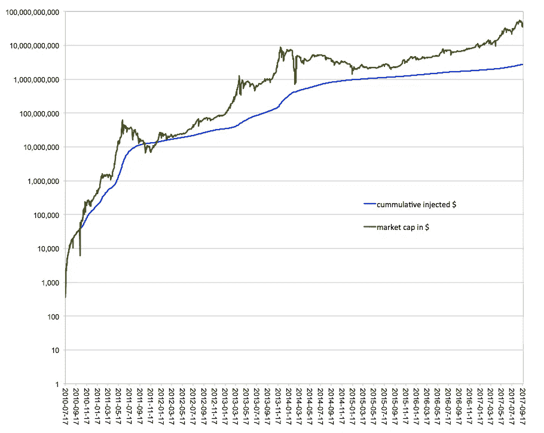

# 比特币:泡沫有多大？

> 原文：<https://medium.com/hackernoon/bitcoin-how-big-is-the-bubble-c83d6539b5fd>

bitcoin.org

[比特币](http://www.bitcoin.org)是泡沫吗？许多帖子认为比特币是一个泡沫，并将其与过去的[荷兰郁金香泡沫](https://www.cnbc.com/2017/07/20/bitcoin-bubble-dwarfs-tulip-mania-from-400-years-ago-elliott-wave.html)和[互联网泡沫](http://www.marketwatch.com/story/heres-how-bitcoin-is-dwarfing-housing-and-dot-com-bubbles-2017-08-30)相比较。一些帖子认为[比特币不是泡沫](https://news.bitcoin.com/is-bitcoin-a-bubble-no-but-things-could-get-wild/)，并列出了加密货币的所有优势和这项新技术的特点。很少有帖子试图抓住比特币的内在价值。作为数学家，我们相信硬数字，而不是主观论点。在这篇文章中，我们提出了一种通过估算投入比特币的金额来量化其内在价值的方法。

# 为什么是比特币？

为什么我们只关注比特币，而现在有一千多种加密货币？
几个原因是

*   比特币的市值最大,占加密货币总市场份额的近 50%
*   大多数时候，你需要比特币来购买其他加密货币

除了[内在价值](http://www.investopedia.com/terms/i/intrinsicvalue.asp)，比特币还有一堆无法量化的主观附加值:

*   去中心化——在你和钱之间不再有中介，不再有集中操作。
*   安全性——你可以将比特币存储在离线电脑/硬盘/USB 上(作为防范黑客的保护措施),并且仍然能够通过签名在线进行交易。
*   透明度—所有交易都在区块链公开发布。
*   进化——开源和公共贡献使得比特币随着当前的需求而进化。
*   可用性—跨境交易 24/7。

对我们数学家来说，特别的附加价值是加密货币市场不受监管。这对机器学习算法来说是一个很大的机会:原始数据是“干净的”(与普通股票相比:没有合并，没有收购，没有股息支付和其他你需要计算的步骤，然后你才能真正看到股价的变化)。

# 市值不是正确的价值评估工具

比特币的价值是多少？对于每一个交易密码货币的人来说，这都是一个热门话题。这个问题不可能回答，因为比特币的价值取决于对新技术的信任和信心。您如何评估信任的价值？我能找到的大多数关于比特币价值的文章都是建立在比特币的市值之上的。

**比特币的市值**(或简称:**市值**)是流通比特币的总量乘以比特币的价格

在撰写本文时，比特币的市值刚刚超过 660 亿美元，高于 [CocaCola 品牌(556 亿美元)](https://www.forbes.com/powerful-brands/list/)。在 2100 万可能开采的比特币中，流通中的比特币数量几乎达到了 80%。

有一些计算*认为，10 年后，比特币的市值将是日均成交量的 10 倍，市值为 1.75 万亿美元。这位分析师认为，10 年后，将有 1700 万比特币在流通，高于目前的 1630 万。如果将潜在的 1700 万比特币供应量除以 1.75 万亿美元的市值估算，那么每枚比特币的价值将略高于 10 万美元。*

仅基于市值的比特币价值存在问题。它只反映了某个特定时刻的价值，而没有提及过去的价格走势。此外，几乎不可能预测未来的市值。

# 与黄金和世界货币的比较

比特币是一种总供应量有固定限额的货币，即[2100 万比特币](https://en.bitcoin.it/wiki/Controlled_supply)。假设挖掘能力保持不变，最后一枚比特币将在 2140 年被挖掘出来。由于这一特性，比特币常被比作黄金。

黄金市场估计有 8.7 万亿美元。如果我们假设[黄金将被比特币](https://howmuch.net/articles/worlds-money-in-perspective)取代，那么一个比特币应该价值~ 41.4 万美元，比目前比特币的价格高出 100 倍。

同样的计算可以用估计有 5.2 万亿美元的[世界货币](https://howmuch.net/articles/worlds-money-in-perspective)来完成。如果我们假设最终比特币将取代所有的法定货币，那么 1 比特币将价值约 24.7 万美元，比比特币的当前价格高出 60 倍。

如果你确实相信比特币会取代货币或黄金，那么肯定有增长空间。然而，这是基于一种信念。如何才能量化一个比特币的价值？

# 计算投入比特币的资金

我们认为我们唯一能估计的价值是投资的金额。至少这会给我们一个比特币内在或基本面价值的下限。

*“****内在价值*** *是公司或资产的实际价值，基于对其真实价值的潜在感知，包括业务的所有方面，包括有形和无形因素。该值可能与* [*当前市值*](http://www.investopedia.com/terms/c/cmv.asp) *相同，也可能不同。此外，内在价值主要用于期权定价，以表明期权的金额。* [Investopedia](http://www.investopedia.com/terms/i/intrinsicvalue.asp#ixzz4tuFG9ssA)

不幸的是，同样在这种情况下，我们不能只从[区块链](http://www.investopedia.com/terms/b/blockchain.asp)中读取投资额。这里有一种方法来估计它们。

我们知道，在[比特币挖掘](https://en.bitcoin.it/wiki/Mining)期间，几个交易被验证并组合成一个块。为此，矿工会得到奖励:12.5 比特币加上交易费。每块比特币的数量每 4 年减半[。](https://en.bitcoin.it/wiki/Controlled_supply)目前是 12.5 比特币，2020 年将是 6.25 比特币。由于交易费与 12.5 比特币相比微不足道，我们在计算中忽略了它们。基本上每个比特币块“花费”12.5 个比特币。如果我们假设，矿工在他们被开采后不久出售开采的比特币，那么我们可以估计 1 块的投入资金。

每个开采区块的投资=(该区块的“成本)*(该区块开采时的比特币价格)

现在，我们对所有开采的区块进行累计求和，并获得比特币区块链的注入/投资金额。

块创建的速率是预先确定的:大约每小时 [6 个块](https://en.bitcoin.it/wiki/Block)。它每两周调整一次，因此在我们的练习中，我们可以假设它是恒定的。也就是说一天内有 144 个街区。请注意，加密市场是全天候不间断运行的。如果我们将每天的区块数乘以每个区块的投资，那么我们就得到每天的投资。

每天的投资=(每个开采区块的投资)*(每天的区块数)

总结比特币生命中的所有日子，我们最终获得比特币链中累计注入的货币。

当然，并非所有被开采的比特币都是在开采后不久就被出售的。因为区块链不包含关于它的信息，我们做一个假设来得到一个估计值。

为了获得每日比特币价格，我们使用 [cryptocompare API](https://www.cryptocompare.com/api/) 和 [Python](https://www.python.org) 。这篇文章很好地描述了如何去做。 [cryptocompare API](https://www.cryptocompare.com/api/) 提供了 2010 年 7 月 17 日的价格。为了获得更早的累计价格，我们咨询了区块链。

预计注入比特币区块链的资金约为 30 亿美元(最终日期为 2017 年 9 月 20 日)。然而，2017 年 9 月 20 日的市值刚刚超过 660 亿美元。对于价格来说，这意味着比特币社区平均为一个比特币支付了大约 200 美元，而当前的价格刚刚超过 4100 美元。

# 泡沫有多大？

比特币是泡沫吗？

正如你所看到的，市值远远大于投入的资金，所以答案可能是:是的，这看起来像一个泡沫。如果我们将市值视为 100%，那么投资的美元大约占 5%。

泡沫有多大？

投资美元和市值之间的差额是 20 倍(2017 年 9 月 20 日)。

下图分别以绿色曲线和蓝色曲线显示了历史市值(美元)和累计注入美元(美元)。横轴代表从 2010 年 7 月 17 日开始的时间，因为数据在 [cryptocompare](https://www.cryptocompare.com/) 可用。纵轴代表对数标度上的美元金额。

如果我们看看一段时间的发展，那么我们会看到，在 2011 年之前，市值和注入的美元是重叠的。然而，从 2011 年开始到现在，市值曲线在注入美元曲线之上，几乎没有例外。这意味着与投资相比，比特币目前可能被高估了。当然，正如我们之前提到的，这只是内在价值的一部分，还有许多我们无法量化的主观附加值。

累积注入美元与市值(以美元计)的对数比例

# 结论

加密货币的技术是非常有前途的，可以应用于许多方面，而不仅仅是金融。比特币能否走向未来仍是个问题。目前，比特币是加密货币的市场领导者。

无论比特币是不是泡沫，事实是它的市值远大于投资金额。如果比特币所有者决定同时出售超过 5%的比特币，加密货币交易所将无法支付。

你认为比特币的真正价值是什么？比特币是泡沫吗？请在评论中告诉我们。