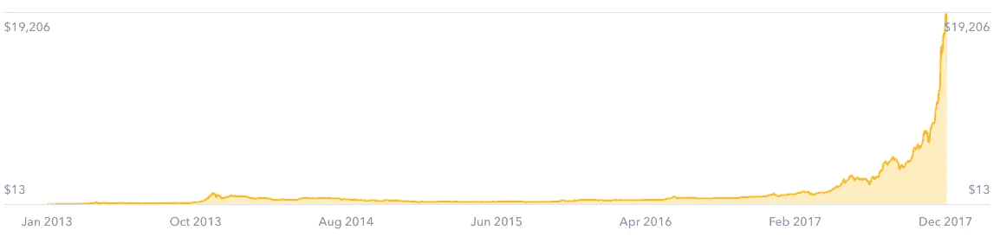
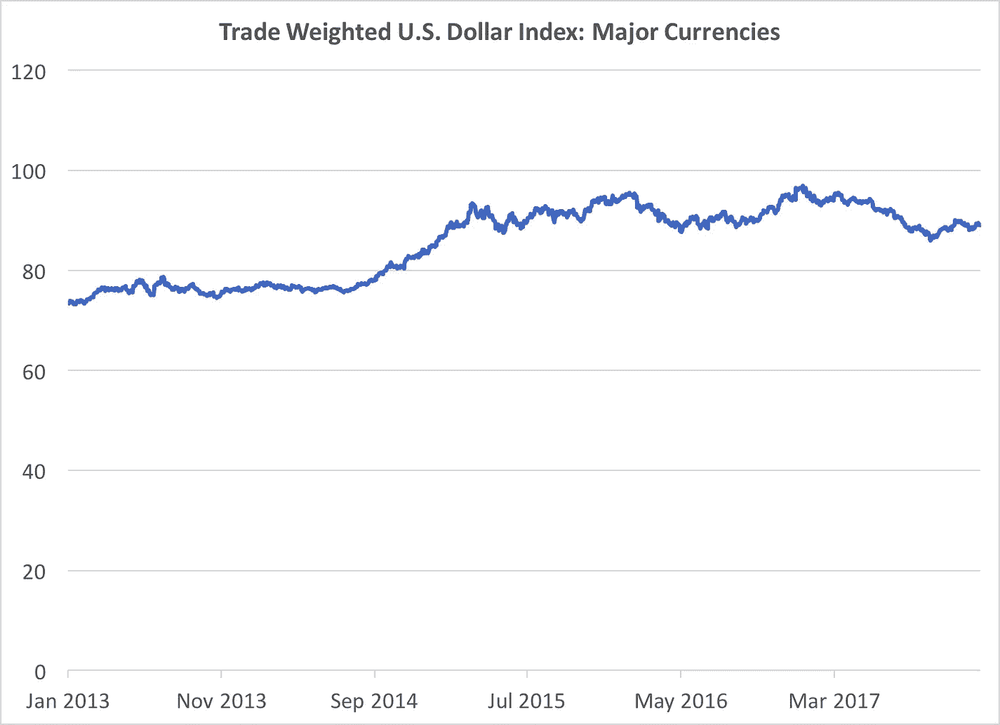
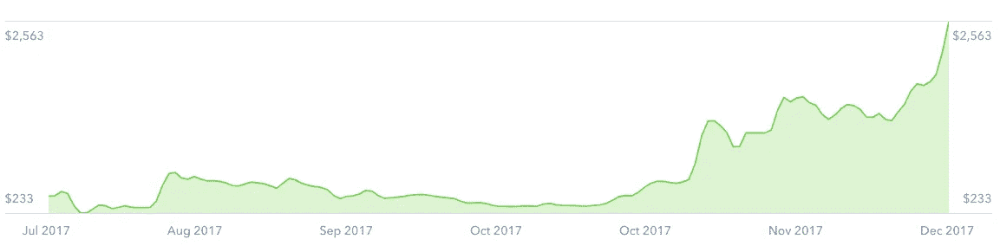

# 比特币是一种可怕的货币，原因可能不是你想的那样

> 原文：<https://medium.com/hackernoon/bitcoin-is-a-terrible-currency-and-not-for-the-reason-you-may-think-80e08f13a3da>

Full disclosure: I have long positions in several cryptocurrencies including BTC and BCC/BCH

许多在线零售商现在接受比特币，有传言称甚至亚马逊明年也可能接受比特币。然而，在可预见的未来，比特币将不会是一种可行的货币，这不是因为围绕交易的规模、速度和成本的问题。是因为宏观经济学 101。

鉴于过去几年比特币价格荒谬/离谱/随心所欲的夸张式升值，它实际上正在经历一个****的超级通缩环境**，只是购买力的增长如此极端和前所未有，我不确定“超级”这个词是否恰当。即使价格在短期内稳定下来——看起来有可能——只要这波牛市仍留在人们的记忆中，而且许多人仍然预测未来价格会进一步上涨，大多数人都会害怕失去购买日常用品的机会。**

**没人想成为 2010 年[用 1 万比特币买了两个披萨的家伙](http://www.businessinsider.com/bitcoin-pizza-10000-100-million-2017-11)。潜在的 FOMO 太强大了。**

**各国央行试图避免像瘟疫一样的通缩，因为它抑制了经济活动，从而延续了更多通缩的恶性循环，即如果你知道明天某种东西会更便宜，你就会等待购买，需求减少会进一步降低价格。相反，银行家们试图将通胀率控制在一个较低且可预测的目标水平。**

## ****说明要点****

**这就是比特币自五年前在比特币基地变得容易获得以来的价值:**

****

**[Source](https://www.coinbase.com/dashboard): Coinbase**

**这是同一时期实际货币的价值:**

****

**[Source](https://fred.stlouisfed.org/series/DTWEXM): Board of Governors of the Federal Reserve System (US)**

**当然，美元比比特币存在的时间更长，不断膨胀的国债总有可能导致未来的恶性通货膨胀(鉴于比特币的总数量有硬性限制，比特币应该不会面临这个问题)。然而，比特币——或任何加密货币——能够作为一种实用货币发挥作用还需要相当长的时间。**

****与此同时，它是一种奇妙的价值储存手段，具有成为一种摩擦最小的数字黄金的真正潜力。****

## **附录**

**比特币现金怎么样，它至少应该解决交易规模、速度和成本方面的问题？嗯，它昨天被添加到比特币基地，价格已经疯了:**

****

**[Source](https://www.coinbase.com/dashboard): Coinbase**

**你打算用它来买比萨饼吗？**