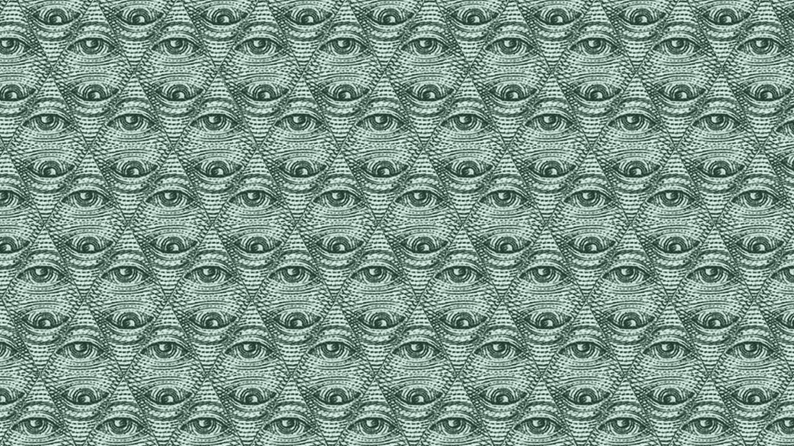

# 比特币不是传销

> 原文：<https://medium.com/hackernoon/bitcoin-is-not-a-pyramid-scheme-d167d0285123>

偶尔会有一篇文章声称比特币是一种传销。但真的是这样吗？当然，这个制度奖励早起的鸟儿，但这真的不公平吗？你越早跳上火车，你冒的风险就越大。时不时会有银行首席执行官或其他一些老古董打出郁金香泡沫牌。比特币的价格曲线看起来就像你对全球错失良机的恐惧所预期的那样。他们都没有认识到比特币是一种完全不同的野兽。如果存在泡沫，它可能会破裂，但正如比特币多次证明的那样，它只会变得更强大、更有弹性。

这是为什么呢？是什么让比特币如此特别？首先，对于加密货币来说，“先发优势”就是一切。不仅仅是因为网络效应，更重要的是，因为 2100 万硬币的限制。这是一个很少有人能篡改的数字，也是任何货币最重要的特征。到目前为止，这也是比特币独有的功能。考虑到这一点，让我们来处理一些数字。现在，每天有 1800 个比特币被创造出来。三年零几个月后，这个数字将会减半。该网络每四年进行一次。与此同时，每天都有超过 10 万名新用户加入比特币生态系统。如果平均分配的话，每个新用户可以得到 0.018 个新的比特币，但事实并非如此。不是很多。除此之外，文章被写出来，t 恤衫被卖出，新闻片段在全世界被广播。也许每年 1350%的增长率并不遥远？你认识用比特币支付月薪的人吗？你知道有谁知道吗？我知道几个。即一些比特币先驱及其党羽。不是很多。这是一个很好的指标，任何一个事实，我们甚至几乎没有触及这个新的财富海洋的表面。只要你控制着你的钥匙，你的比特币就不会消失。除非你卖出，否则你的比特币价格不会下跌。这可能不是一种时尚。美元可能是。

最近，围绕比特币的高收费展开了辩论。例如，游戏平台 Steam 刚刚取消了比特币支付选项。一些人认为这是网络的一个主要缺陷，也是主流采用的最大障碍。那些人似乎是同一类型的人，他们认为一种更好、技术更复杂的加密货币有一天会将比特币从其高位上赶下来，并取代其作为加密之王的地位。我们已经听说这个篡位者硬币有一段时间了。它在哪里？是哪一个？所有人都不明白的是，比特币的价值不是来自其可用性，而是来自其不变性。除非几乎每个人都同意需要做一些事情，否则地球上没有任何实体能够篡改代码库。这种治理模式一次又一次地被证明是非常有价值的。比特币几乎不需要发挥支付网络*的功能就能增值。*

几天前(在我写这篇文章的时候)，闪电协议在比特币主网上测试成功。这是第一个为比特币实施的所谓的第二层扩展解决方案。它将再次戏剧性地改变游戏。如果用户知道自己在做什么，他们将再次能够以最低的费用立即发送交易。在不久的将来，甚至那些不知道自己在做什么的人也会知道。当那一天到来时，即使是可用性的争论也将毫无意义。比特币不是传销。这是一个全球计划。