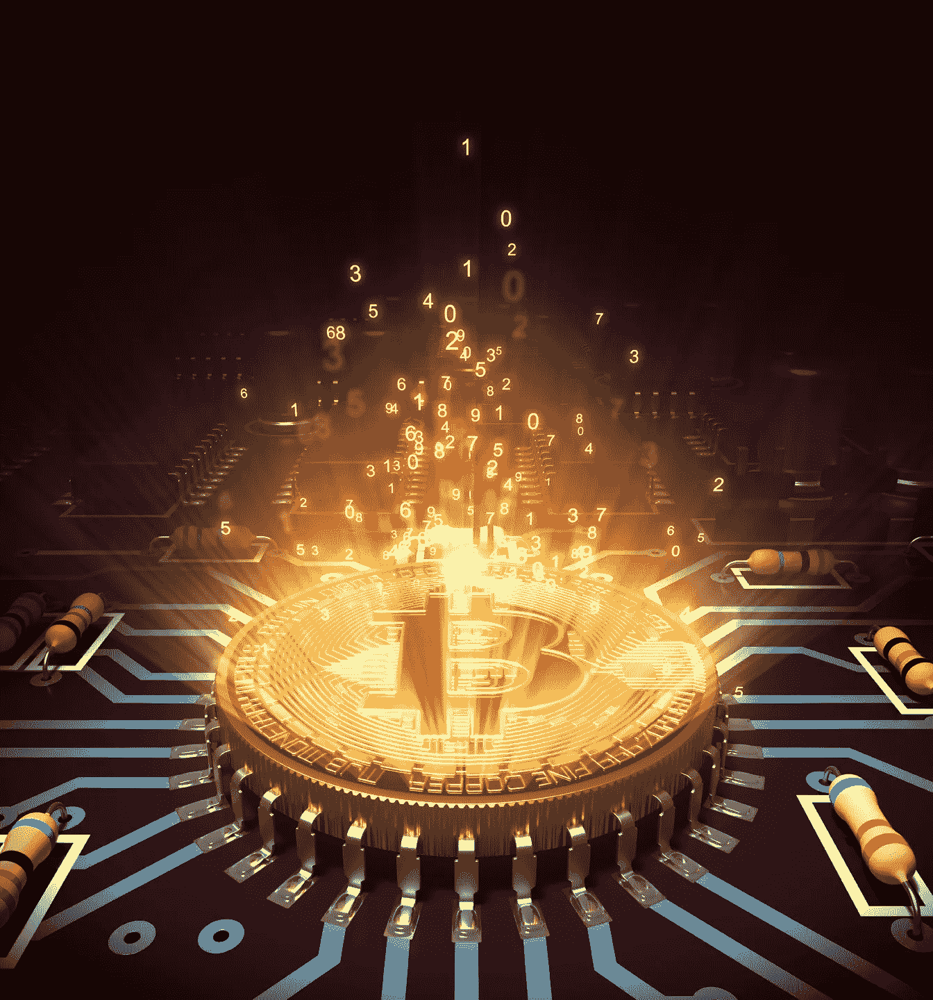
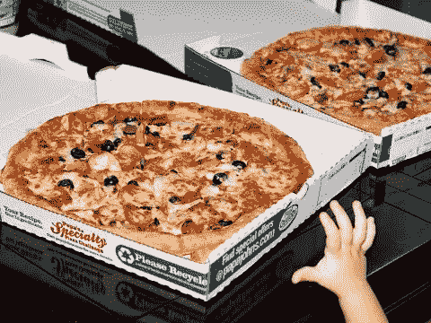
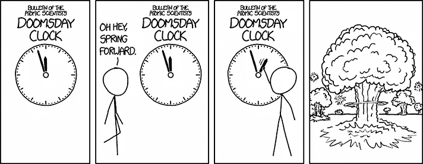
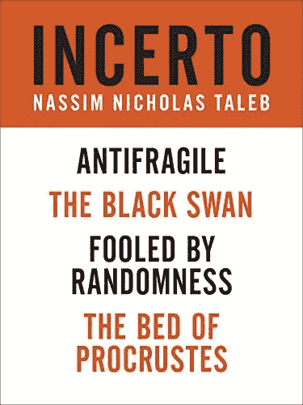
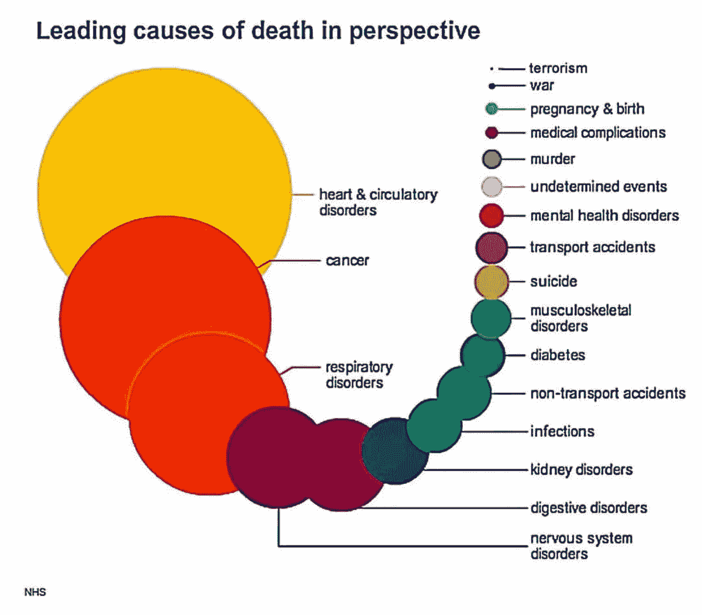

# 比特币是历史上最稳定的价值储存手段

> 原文：<https://medium.com/hackernoon/bitcoin-is-the-most-stable-store-of-value-in-history-1bb22cf8e7ca>

你知道故事是怎么发展的:比特币是狂野的、暴力的、不稳定的。这让 VIX 的旋风日看起来像一首缓慢的华尔兹。你不能相信它。不要把“真钱”放进去，否则妖怪就会得到它。

在 2013 年一篇声名狼藉的热门文章中，中毒的流行经济学家保罗·克鲁格曼写道“[比特币是邪恶的](https://krugman.blogs.nytimes.com/2013/12/28/bitcoin-is-evil/)”以及“完全不清楚为什么比特币应该是一种稳定的价值储存手段。”[著名的未来学家雷·库兹韦尔上周](https://cointelegraph.com/news/ray-kurzweil-embraces-blockchain-technology-cites-instability-in-bitcoin)也说过同样的话:“像美元这样的货币提供了合理的稳定性。比特币没有。从不害羞的亿万富翁马克·库班称比特币是一个即将破裂的大泡沫。

我提到的所有人都非常聪明和成功，然而他们错过了历史上最明显的长期模式之一。

是的，比特币短期内不稳定。

但是长期来看呢？

**坚如磐石。**

不相信我？让我们沿着记忆之路快速漫步。

# 披萨，披萨

每年 5 月 22 日，我们都会庆祝比特币披萨日，以纪念第一次有人说服某人把假钞当成真实世界的有形之物。回到 2010 年，[拉兹洛·汉尼茨用 10000 个比特币换了两个大号、中号披萨](https://en.bitcoin.it/wiki/Laszlo_Hanyecz)。

当时，这 1 万枚比特币的价格是 41 美元。

现在每年都有人根据这个故事写一个变体“[那些披萨现在值多少钱？](http://www.businessinsider.com/bitcoin-pizza-day-passes-2000-20-million-2017-5)“几年前，这 10，000 个比特币价值 700 万美元。如今，它们的价值约为 2700 万美元。再过十年，如果著名的安德森·霍洛维茨风险投资公司克里斯·迪克森是对的，比特币飙升至每枚 10 万美元，那么它们可能价值 10 亿美元。

四千一百万到两千七百万美元。

在*七年*。

那不稳定？

在这么短的时间内，你真的能想到在人类的整个历史中有哪种资产有这么高的投资回报率吗？

我不能。

# 模式识别

那么，为什么其他人只看到了剧烈的波动，而有些人看到了长期的模式呢？

很简单。

我们大脑中的一些认知怪癖阻碍我们看到真实的世界。它们就像我们大脑软件中的 bug。它们已经存在了很长时间，我们认为它们是特征。

它们不是特写。

## 坏消息是

第一，我们天生就有**的消极偏见。我们对坏消息非常敏感。**

****

**Copyright XCD: [https://xkcd.com/1655/](https://xkcd.com/1655/)**

**我们到处都看到威胁和恐怖。末日总是在拐角处。你每天都能在网上看到夸张的回复。如果这项法律通过了，或者这个人被任命了，或者我们不采纳这个或那个政策，那一切都完了。等待我们的只有可怕的崩溃和全球混乱。但是停下来看一看外面。鸟儿还在鸣叫吗？太阳还在天上吗？天真的要塌了吗？**

**这就是为什么当比特币上涨 10 倍时，每个人都关注数月牛市后不可避免的 30%贬值。这毫无意义，但我们还是做了。**

**当我们生活在开阔平原上的部落中时，这种消极偏见对于生存是有用的，但对于处理现代生活来说就不那么有用了。**

****

**偶尔，我们对大灾难性事件的看法是正确的，比如一场世界大战毁灭了这个星球，但大多数情况下，历史是一个平稳的和平模糊的过程。逆向投资大师 Nicholas Taleb 在他的书[Skin the Game/Incerto](http://amzn.to/2tDhp4J):**历史主要是被战争打断的和平，而不是被和平打断的战争****

**问题是，和平不是一个好故事。**

**没有冲突的戏剧是什么？实际上，你不可能写一部没有冲突的小说。人们已经试过了。它不起作用。**

**哦，你也不能在没有冲突的情况下书写历史。因此，历史书充斥着一页又一页的毁灭、政变、大屠杀、谋杀和阴谋。这是莎士比亚和高中历史 101 教科书的内容。**

**唯一的问题是，这只是历史的 5%。**

**有多少次你在新闻中看到一个快乐的故事，一只小狗被救了，有人从着火的大楼里被救了出来，一个无私的善举，然后五分钟后就忘记了，只专注于左翼和右翼之间的持续斗争，债务危机和其他任何你担心的事情？**

**事实是，我们是基于恐惧的生物，这完全扭曲了我们的现实感。**

## **只见树木不见森林**

**第二个认知缺陷是:**

**人类不擅长长期模式识别。**

**我们绝对不擅长这个。我是说，糟透了。我们天生就能看到巨大的、浮华的、直接的威胁。**

**仔细看看这张来自 Reddit 帖子的图表:**

****

**大多数人认为最右边的两个小点，恐怖主义和战争，杀死了绝大多数人。也许在短时间内，像在二战中，但在其余的时间里，甚至不接近。**

**左边的那些大点，心脏病和癌症导致四分之一的人死亡。**

**四分之一！**

****然而，自 911 以来，美国在这两个小点上花费了** [**2 万亿美元**](https://www.thebalance.com/war-on-terror-facts-costs-timeline-3306300) **。****

**想知道我们在打击两个最大的杀手上花了多少钱吗？**

**每年少得可怜的 100 亿美元。**

**我们怎么会花费 100 亿美元来对抗夺走我们 25%生命的东西，而每年花费 2 万亿美元，高达 1250 亿美元来对抗几乎与我们无关的东西呢？哦，这还不包括正常的军费开支。**

**这是因为我们不太擅长评估风险或处理风险。**

**我们很容易发现蛇在草丛中快速移动，但我们完全忽略了在我们一生中慢慢蚕食我们的威胁。**

# **我们脑海中无休止的电影**

**我们认为我们看到了事情的真相，但大多数情况下我们并没有。我们的偏见是为了让我们活着，而不是帮助我们未雨绸缪。**

**我们大多数人只是带着一部电影在脑海中走来走去，我们认为这是真实的，但当你真正推动和刺激这部电影时，它并不像光一样。实际发生的事情和我们认为正在发生的事情之间存在脱节。这种脱节是世界上痛苦、不适、暴力和悲伤的根源。**

****这就是为什么许多人可以面无表情地说，一万单位的资产在七年内从 4100 万美元涨到 2700 万美元是“不稳定的”****

**我们没办法。**

**我们只是天生如此。**

**但事情不一定是这样的。**

**我们所要做的就是退一步，睁开眼睛，看到现实的本来面目，而不是我们想象的样子。**

**感谢阅读。**

**投资愉快。**

**###########################################**

**注意:如果你打算给我发送“稳定”这个词的字面定义，请注意我也有 dictionary.com 和谷歌。请查看“[创意许可](https://en.wikipedia.org/wiki/Artistic_license)的定义**

**###########################################**

**免责声明:做一个大男孩或大女孩，自己决定把辛苦赚来的钱放在哪里。我不是财务顾问，这也不是财务建议，如果我真的需要告诉你这些，那么无论如何最好把你的钱放在口袋里。**

**###########################################**

**如果你和我一样热爱加密空间，那就来吧，加入 [**DecStack，这是一个虚拟的加密货币和分散式应用项目**](http://decstack.com/) 的合作场所，在这里你可以接触多个项目。**永远完全免费**。只是进来和社交，一起工作，分享代码和想法。通过反馈让你的想法更好。寻找新朋友。见见你的新家人。**

**############################################**

**如果你喜欢我的作品**请** [**请赏光访问我的作品第**](https://www.patreon.com/danjeffries) **页，因为这是我们一起改变未来的方式。**帮我脱离母体**我会百倍地回报你的慷慨，把我所有的时间和精力集中在写作、研究和为你和世界提供令人惊叹的内容上**。**

**###########################################**

**如果你喜欢这篇文章，我希望你能拍下来推荐给其他人。之后，请随时将文章通过电子邮件发送给朋友！非常感谢。**

**###########################################**

****

**关于我:我是一名作家、工程师和连续创业者。在过去的二十年中，我涉及了从 Linux 到虚拟化和容器的广泛技术。**

***你可以看看我的最新小说，* [***一部史诗般的中国科幻内战传奇***](http://amzn.to/2gAg249) *中国挣脱了共产主义的枷锁，成为世界上第一个直接民主国家，运行着一个高度先进、人工智能的去中心化应用平台，没有领导人。***

## **当你加入我的读者群，你可以免费得到一本我的第一部小说《蝎子游戏》。读者称之为“神经癌的第一次严重竞争”和“黑色侦探会见约翰尼记忆术。”**

## **你也可以根据书中的想法查看[蝉开源项目](http://iamcicada.com/)，该书概述了如何立即将该技术变为现实，你可以参与其中。**

## **最后，你可以[加入我的私人脸书小组，Nanopunk Posthuman 刺客](https://www.facebook.com/groups/1736763229929363/)，在这里我们讨论所有的科技、科幻、幻想等等。**

************

> **[黑客中午](http://bit.ly/Hackernoon)是黑客如何开始他们的下午。我们是 [@AMI](http://bit.ly/atAMIatAMI) 家庭的一员。我们现在[接受投稿](http://bit.ly/hackernoonsubmission)并乐意[讨论广告&赞助](mailto:partners@amipublications.com)机会。**
> 
> **如果你喜欢这个故事，我们推荐你阅读我们的[最新科技故事](http://bit.ly/hackernoonlatestt)和[趋势科技故事](https://hackernoon.com/trending)。直到下一次，不要把世界的现实想当然！**

****