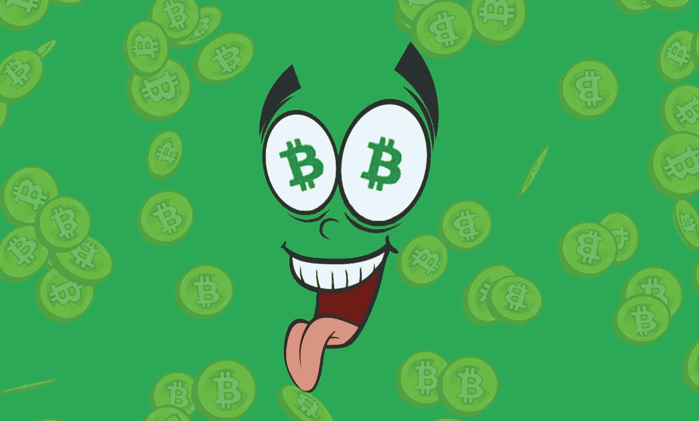
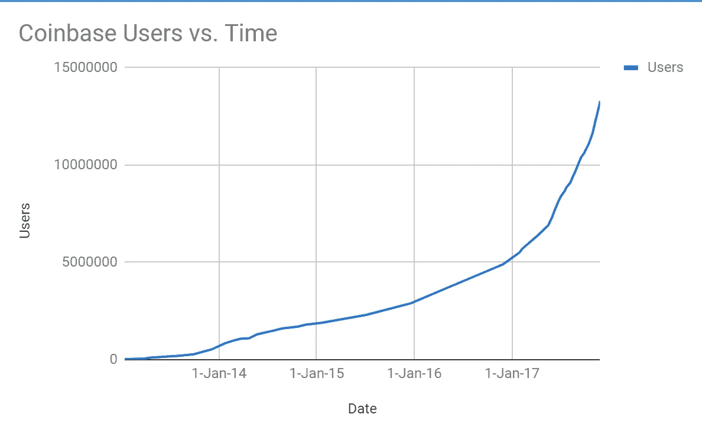
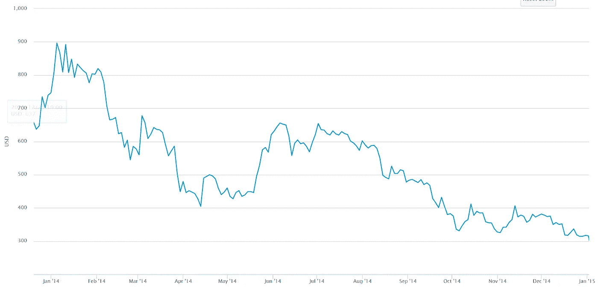
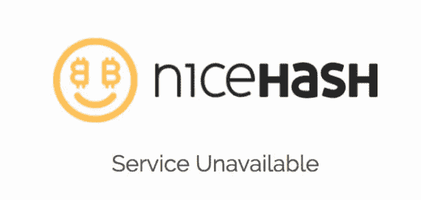
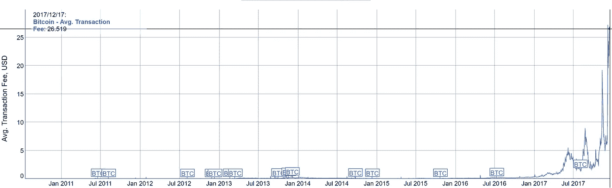
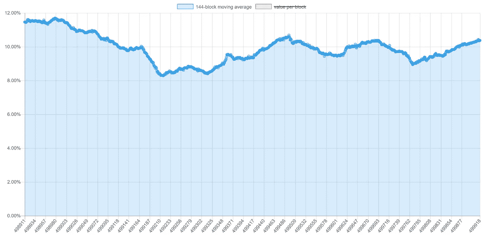

# 比特币的拥有者们，你们现在需要做这两件事

> 原文：<https://medium.com/hackernoon/bitcoin-owners-you-need-to-do-these-two-things-right-now-a73122dd23d4>

source: [newsbtc.com](http://newsbtc.com)

世界已经正式为比特币疯狂，数百万人争相购买。有几件事需要说出来，现在比以往任何时候都更需要。让我们开门见山吧。

# 1.获得比特币的所有权

信任 ***无名小卒。***

这就是比特币游戏的名字。比特币之所以有效，是因为在记录谁有多少硬币或者谁把多少硬币送到哪里的时候，你我都不需要互相信任，或者信任一个中央实体。

这也是因为我们不需要信任一个中央实体，比如银行，来持有我们的硬币。只要你持有比特币的私钥，你的比特币就是你的了。

> [“你的钥匙，你的比特币。不是你的钥匙，不是你的比特币。”](https://www.google.ca/url?sa=t&rct=j&q=&esrc=s&source=web&cd=2&cad=rja&uact=8&ved=0ahUKEwi14IOyp5LYAhUE4IMKHRoHBpYQtwIILDAB&url=https%3A%2F%2Fwww.youtube.com%2Fwatch%3Fv%3Dvt-zXEsJ61U&usg=AOvVaw0xNSyZ7BX-xeK8l9RufsSY)

一次又一次，即使是最资深的比特币持有者也忽视了这句格言，并承受了后果。

毫不奇怪，促进比特币销售的集中式交易所的使用与比特币的增长相吻合，并呈抛物线状增长。随着 exchange 使用的增加，现在比以往任何时候都更需要强调这一信息。

The growth rate of one of world’s most popular Bitcoin exchange grows as Bitcoin’s does, source: [Alistair Milne](https://qz.com/1139524/bitcoin-price-nears-10000-as-coinbase-pulls-in-millions-of-users/)

除了自己向交易所索要数字之外，无法统计有多少使用交易所购买比特币的人将他们的比特币长时间存放在这些交易所。但是，只要这个数字继续上升，这些服务的背后就会有越来越大的目标。对任何一个数不胜数的[加密](https://hackernoon.com/tagged/crypto)交易所的成功攻击的潜在损害(或发薪日，取决于你想如何看待它)也相应增加。

对于那些不知道的人来说，把你的硬币留在交易所并不意味着这些硬币是你的。如果你要求的话，你只是相信交易所会在某个时候把它们给你。您不知道这些交易所部署的安全级别，也不应该相信他们报告的任何安全级别。**你的硬币存储在一个信任最大化的集中实体中，几乎完全违背了使用比特币的目的。**

如果你不相信在交易所保存你的硬币是一个大问题，这里有几个恐怖故事可以帮助你。

时间线从当时世界上最受欢迎的交易所 Mt. Gox 开始。2014 年，它是首批大型加密货币抢劫案之一的目标——850，000 个比特币 **(超过 4%的所有比特币*将*存在)**从 Mt. Gox 被盗。结果，比特币的价格在接下来的一年里开始暴跌。

The fallout from Mt. Gox, signified by the drop in price of Bitcoin over the year

这一事件第一次让人们注意到拥有自己的私钥的重要性。然而，自从以来，集中交易系统已经发生了几起黑客攻击事件，导致数亿美元的损失。似乎没有吸取教训。

最近的一次抢劫发生在两周前。[2017 年 12 月 6 日，矿业市场服务公司 NiceHash 被抢走 4700 多 BTC(撰写本文时价值 8900 万美元)](https://techcrunch.com/2017/12/06/nicehash-hack/)。尽管不是一个交易所，NiceHash 仍然是一个集中的实体，用户被委托持有他们的硬币。这种黑客行为属于较小的一类，但作为一系列无数黑客行为中的最新一起，它证明了这种性质的攻击将永无止境。如果你是一个需要在交易所保存硬币的加密交易者，要知道这是你必须承担的风险。

The new face of [nicehash.com](https://www.nicehash.com/), following the loss of $8.9 million of its users

幸运的是，有一个非常简单的方法可以解决所有这些问题:

**把你的比特币转移到你控制私钥的钱包里**。特别是，确保您使用的钱包生成 12-24 个单词的助记符种子，以便您轻松备份和恢复您的钱包。

除了你通过暴露给恶意软件或透露给恶意演员来泄露你的私钥/种子之外，你可以睡得很好，因为你知道你的硬币是安全的。

但是有一个警告。现在是 2017 年，比特币已经发生了变化，所以你不应该使用任何钱包。

# **2。使用 SegWit 钱包(和交易所)**

如果你不知道，比特币正在增长。它的生长速度很快。几乎比我们见过的任何东西都要快。结果，由于现有的每秒大约 7 个事务或每 10 分钟块大约 2，000 个事务的事务限制，它的网络效应碰壁了。随着越来越多的人竞相确认他们的交易，交易费也以同样疯狂的速度上涨。

The average transaction fee at the moment is $26.52, source: [bitinfocharts.com](https://bitinfocharts.com/comparison/bitcoin-transactionfees.html#3m)

这个问题的初步解决方案在六个月前被部署，名为 **SegWit** 。SegWit 是一个基本的协议升级，它减少了事务的虚拟大小，并允许四倍多的事务适合一个块。

关于比特币交易吞吐量问题和 SegWit 技术功能的完整解释可以在我写的一篇关于它的深入文章中找到[这里](https://medium.freecodecamp.org/future-of-bitcoin-cc6936ba0b99)。

因为交易费用是按字节计算的，而 SegWit 交易的虚拟字节大小较低，如果您现在使用 SegWit 钱包发送 SegWit 交易，**您可以立即节省 30%-40%的交易费用**。

仍然不相信 SegWit 的优势？

如果比特币网络中的每笔交易都是今天的 SegWit 交易，那么区块将包含多达 8000 笔交易，而[的 138000 笔未确认交易积压](https://blockchain.info/unconfirmed-transactions)将立即消失。交易费用将再次几乎不存在。

对你来说更低的费用和更多的批量交易**现在就可以发生**。代码就在每一个升级的比特币节点上，等着被使用。

问题是 SegWit 没有被钱包、服务以及最终的用户所采用。

SegWit adoption is dropping, down to 10%, source: [segwit.party](http://segwit.party/charts/#)

SegWit 是一个可选的协议升级，比特币钱包和服务没有义务实施，尽管它为网络提供了好处。它是以这样一种方式部署的，以防止硬分叉(即社区的一部分潜在的分支)。只要客户没有需求，这些服务就没有动力花费时间和金钱升级到 SegWit。

这绝对符合你的最佳利益，你，比特币霍德勒，**使用赛格维特钱包**。

因为 SegWit 是一个相对低级的变化，围绕它有一些混乱，需要说的是**使用 SegWit 钱包绝对没有缺点，只有显著的网络优势和交易费用的大量节省。**

如果你最喜欢的钱包还没有实现 SegWit，请要求他们这样做。然后，开始使用已经实现 SegWit 的钱包，直到 favourite wallet 这样做。

点击这里可以找到 SegWit 钱包的列表[。为了方便起见，我将很快列出几个最突出的例子。如果你知道任何没有提到的，请在下面评论，这样我就可以把它们添加到列表中！](https://bitcoincore.org/en/segwit_adoption/)

## 硬件钱包

[如果你担心安全问题，这些应该是你的首要任务](https://en.bitcoin.it/wiki/Hardware_wallet)

*   [莱杰纳米 S](https://www.ledgerwallet.com/products/ledger-nano-s)
*   特雷佐
*   [数字位盒](https://digitalbitbox.com)

## 桌面钱包

*   [银金矿](https://electrum.org)
*   [军械库](https://www.bitcoinarmory.com/)

## **iOS 钱包**

*   [Edge (AirBitz 更名)](https://edgesecure.co/)
*   [绿色地址](https://www.google.ca/url?sa=t&rct=j&q=&esrc=s&source=web&cd=1&cad=rja&uact=8&ved=0ahUKEwjx2KDlgZPYAhXi34MKHTSPAnkQFggpMAA&url=https%3A%2F%2Fitunes.apple.com%2Fus%2Fapp%2Fgreenaddress-bitcoin-wallet%2Fid1206035886%3Fmt%3D8&usg=AOvVaw1OfDMsQF2VJa6rLUq2fne6)

## **安卓钱包**

*   [Samourai 钱包](http://samouraiwallet.com)
*   [绿比特](https://play.google.com/store/apps/details?id=com.greenaddress.greenbits_android_wallet&hl=en)
*   [银金矿](https://play.google.com/store/apps/details?id=org.electrum.electrum&hl=en)

如果您的首选钱包不在此列表中，请确保它使用 SegWit。识别 SegWit 钱包的一个简单方法(但不是唯一的方法)是确保接收地址以[**【bc1】**](https://www.google.ca/url?sa=t&rct=j&q=&esrc=s&source=web&cd=2&cad=rja&uact=8&ved=0ahUKEwiUrduBhZPYAhVJ5oMKHX7iD1oQFgg1MAE&url=https%3A%2F%2Fbitcoin.stackexchange.com%2Fquestions%2F62096%2Fgenerating-a-segwit-bc1-address-from-a-brain-wallet&usg=AOvVaw3pqvE2gki47a5BEqH_KfOv)**开头。**

如果你的首选钱包不使用 SegWit，使用一个使用 seg wit 的钱包对你最有利。请记住，您可以立即节省高达 40%的费用。

通过扩展，您还应该努力使用包含 SegWit 的交换。这意味着他们使用 SegWit 交易来处理交易所的交易量。因为交易所进行大量交易，任何使用 SegWit 的交易所都会极大地有利于比特币的网络健康。

谢天谢地，有几个交易所已经合并了 SegWit，这里列出了。应该指出的是，最大的比特币交易所之一比特币基地尚未实施 SegWit。如果你最喜欢的交易所没有使用 SegWit，尽你所能联系他们，要求他们实现它。

通过控制你的比特币，你减少了加密货币领域任何恶意行为者的攻击面。通过使用 SegWit，您不仅可以大大减少您支付的交易费用，还可以帮助减少网络拥塞。

比特币是你自己创造的。这是你真正推动比特币网络积极变革的机会。

**关注我的** [**Twitter**](https://twitter.com/SubhanNadeem19) **和 Medium，如果你将来对这些更深入、更翔实的报道感兴趣的话！**

**一定要👏如果你学到了什么！宣传 SegWit 钱包，让我们都能从更健康的网络☺️中受益**