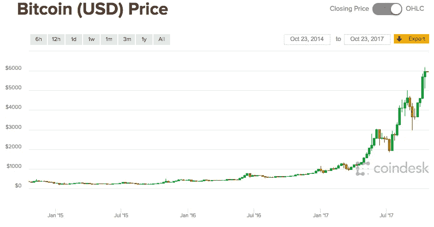
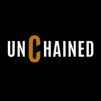
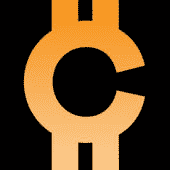
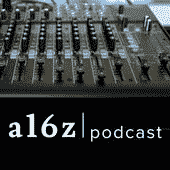
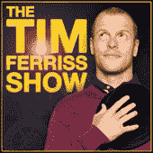

# 适用于初学者的 5 款最佳比特币播客

> 原文：<https://medium.com/hackernoon/bitcoin-podcasts-83f6d6d02bc4>

Bit 已经从默默无闻上升为人们谈论最多的技术之一。过去一年，比特币从每枚 600 美元涨到了 6000 美元，增长了 10 倍。然而，很少有人完全理解底层技术，或者如何抓住它带来的许多机遇。

[https://www.coindesk.com/price/](https://www.coindesk.com/price/)

谢天谢地，许多人已经研究这项新兴技术多年了，他们很乐意免费分享他们的知识。播客是吸收这些知识的好媒体。以下是五个最能帮助我理解该领域技术和投资机会的比特币播客。

# 1.释放

***由福布斯*** 高级编辑劳拉·申主持

[*未被束缚的*](https://www.forbes.com/podcasts/unchained/#1a921f955b4f) 代表了密码货币领域一些最聪明的企业家、技术专家、投资者和思想家。本播客涵盖了商业、技术、初级和高级主题的完美结合。无论您想了解区块链技术的基础知识还是最新款硬盘的含义，本播客都是一项令人惊叹的资源。我对《未被束缚》唯一的反馈是，我希望劳拉每两周出版一次以上的新剧集:)

## 以下是一些让您开始的精彩片段:

*   [如何向普通人解释密码货币和区块链](https://www.forbes.com/sites/laurashin/2017/10/03/how-to-explain-cryptocurrencies-and-blockchains-to-the-average-person/#30b60ddf324d)
*   [比特币基地首位员工为何创办对冲基金](https://www.forbes.com/sites/laurashin/2017/03/07/why-this-hedge-fund-ceo-once-put-most-of-my-meager-life-savings-into-bitcoin/#2159ee34e153)
*   [想分散投资组合吗？试试比特币，比如 ARK 的 Chris Burniske 和比特币基地的亚当·怀特](https://www.forbes.com/sites/laurashin/2016/07/12/want-higher-returns-invest-in-bitcoin-say-arks-chris-burniske-and-coinbases-adam-white/#32e545f14dd2)

# 2.像最好的一样投资——散列能力

***由奥肖内西资产管理公司的投资组合经理帕特里克·奥肖内西主持***

*像最好的一样投资*制作了一个名为 *Hash Power* 的三集音频纪录片系列，通过采访该领域的领导者来探索区块链和加密货币投资的世界。这个播客对于从商业和金融角度理解区块链和比特币等加密货币的意义非常重要。该系列的第二部分介绍了该领域的主要投资者讨论如何对代币进行估值，以及什么可能导致世界上最大的银行和对冲基金开始投资该领域。

## 点击此处查看该系列:

*   [Hash Power——一部关于区块链的纪录片&加密货币](http://investorfieldguide.com/hashpower/)

# 3.硬币掌握

***卡特·托马斯主持，投资人兼营销人***

[*Coin Mastery*](https://www.coinmastery.com/) 非常适合了解最新的加密货币新闻和市场更新。它专注于比特币，但也涵盖了其他一些加密货币。我喜欢听卡特的基本面和技术面分析，对当天最重要的比特币和加密货币新闻的简洁概括，以及对重要投资概念的基本解释。我对这个播客没有任何具体的建议，因为大部分内容都集中在时事上，可能现在与你无关。我建议听听最近的一集，感受一下硬币的掌握。

# 4.a16z 播客

***由顶级风险投资公司 Andreessen Horowitz 主办***

a16z 播客涵盖了科技领域的一系列话题，然而，鉴于区块链可能是目前世界上最令人兴奋的科技，他们已经制作了几集精彩的相关内容。我推荐这个播客来了解基本的区块链技术，它对企业家的潜在应用，以及它可能如何重塑主要市场。

## 查看这些剧集以开始学习:

*   "[加密货币、应用程序币和协议投资](https://a16z.com/2017/04/03/cryptocurrencies-protocols-appcoins/)"
*   "[为什么加密令牌如此重要](https://a16z.com/2017/09/28/cryptocurrencies-networks-tokens/)"

# 5.蒂姆·费里斯秀

***由《4 小时工作制》的作者蒂姆·费里斯主持***

Tim Ferriss 秀不是比特币播客。然而，蒂姆做了一集关于加密货币的节目，太令人惊讶了，我不得不把它列入这个列表。在第 244 集，他采访了计算机科学家、法律学者和密码学家 Nick Szabo 和 AngelList 的首席执行官 Naval Ravikant，Nick Szabo 因撰写关于区块链技术的文章而闻名。这一集涵盖了比特币、以太网、ICOs、加密货币和区块链技术的基础知识，它有可能重塑我们所知的世界。

## 请听这一集:

*   [沉默的加密货币大师——尼克·萨伯](https://tim.blog/2017/06/04/nick-szabo/)

## 【mfishbein.com**如果你喜欢读这篇文章，请在* [*订阅我的邮件简讯。你会从我五年多的写作中得到我最好的文章。*](https://mfishbein.com/)*