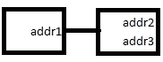
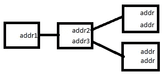
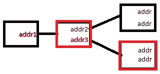
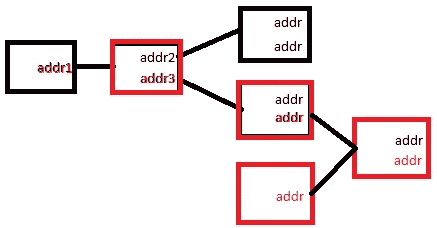
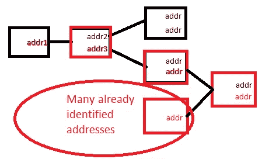
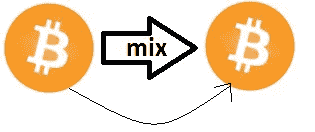

# 2017 年的比特币隐私前景——超越硬币混合、一般准则和研究

> 原文：<https://medium.com/hackernoon/bitcoin-privacy-landscape-in-2017-zero-to-hero-guidelines-and-research-a10d30f1e034>

我在 [TumbleBit](https://hackernoon.com/understanding-tumblebit-part-1-making-the-case-823d786113f3) 上的工作强调了对问题**进行研究的必要性，“什么是最轻重量的钱包实现，而不损害用户的隐私？”**
即使 TumbleBit、JoinMarket 或比特币混合器能够完美地“打破”比特币区块链上的交易链，也不能保证用户不会在其他方面受到威胁，例如检查 P2P 网络。

首先，我会告诉你如何在区块链上保护你的隐私，这样忙碌和懒惰的人就可以停下来了。

如果你不能坚持这些原则，或者不知道如何去做，或者只是对这个话题感兴趣，你应该继续读下去。
接下来，我将向你介绍比特币隐私的三个方面的一些理论。

然后详细阐述我的经验法则。

最后，我开始研究重量最轻的隐私保护钱包的理想结构是什么。

# 区块链隐私的 5 条规则

```
**1\. Be over Tor at all times.****2\. Use a full node.****3\. Operate at all times, in the belief that all your addresses belonging to the same wallet are already linked together by a third party.****4\. Never share networks between your wallets. In other words never use the same IP address with multiple wallets of yours.****5\. Between wallets only move coins by utilizing a mixing technique.**
```

# 要解决的隐私的 3 个方面

## 1.聚类策略

第三方，他们正在分析区块链，试图找到联系，地址属于同一个钱包。我用一个简单的例子来说明它是如何发生的。

假设你是区块链观察者，你在区块链看到两笔交易:



addr1 把所有硬币花到 addr2 和 addr3。此时，我们不知道 addr2 或 addr3 是否与 addr1 在同一个钱包中。还是我们？我们应用的第一个聚类策略是，我们怀疑 addr2 或 addr3 是返回用户钱包的变化。我们不知道哪一个是。为了弄清楚，我们必须看看接下来的交易。



似乎仍然无法确定到底是哪种变化。然而，我们可以看看费用模式，作为我们的下一个聚类策略。我们可能会发现一些交易使用相同的费用计算算法，因此我们可以猜测这些交易可能是由同一个钱包生成的，因此我们可能会发现两个地址属于同一个钱包:



在这种情况下，红色交易使用相同的费用模式，因此 addr1 和 addr3 可能属于同一个钱包。当一个地址没有足够的钱来支付用户想要的交易时，我们可以应用我们的下一个聚类策略。在这种情况下，它的钱包将与另一个交易的输出连接在一起，因此我们可以确定它也属于同一个钱包。



事实上，如果星星排列得很好，我们可以应用其他聚类策略来识别哪个地址是该事务的变更。假设最后一个 TX 的合并输入为 0.5 和 0.7btc，未使用的输出为 1 和 0.2btc。那么我们几乎可以确定具有 0.2btc 的地址是变化的，因此它属于同一个钱包。

更糟糕的是，因为我们可能已经确定了一个事务链和所属地址，所以现在我们只需要连接各个部分:



这就是聚类。对此你能做些什么？使用持有你私钥的服务，而不是你。这样的差异。这些服务不仅会侵犯你的隐私，还会窃取你的信息。如果你用的是真的比特币钱包，你能做什么？目前还不多。我不知道有任何钱包能成功解决这个问题。你可以用 JoinMarket 做每一笔交易。不过，这真的很让人头疼。

在实践中效果如何？我不得不承认我不太清楚。[但是根据尼克·乔纳斯](https://www.youtube.com/watch?v=HScK4pkDNds)的说法，如果与网络分析相结合，它几乎可以完美地工作，那么隐私的第二个维度是什么:

## 2.网络分析

想象一下，你的所有余额都是从 Blockchain.info 或 CoinBase 查询的，交易是通过 block chain . info 或 coin base 广播的。你也可以通过 Tor 连接它们，并伪造你的 KYC。在这种情况下，您完美地解决了网络分析问题，因此除了您的服务提供商之外，没有第三方可以将您的地址连接在一起。又是这样的出入，对吧？服务提供商的信赖可能是隐私的另一个方面，但我们不要把它复杂化。

全节点、特殊目的公司和外来建筑怎么样，比如银金矿？等等，本文的其余部分将是关于这一点的，但在此之前，让我们揭示隐私的第三个维度:

## 3.比特币混合

你可能已经注意到这些维度是相互关联的。混合甚至可以被认为是对抗集群的对策，但是让我们假设你不想混合你做的每一个事务，混合只是你偶尔做的事情。
**什么时候？**由于聚类和网络分析，最好不要从你的一个钱包向另一个钱包发送任何直接交易。你宁愿用搅拌机，用 JoinMarket 或者很快 TumbleBit 把它们和另一个钱包混合在一起。
我不打算在这里谈论混合技术，而是假设从现在开始混合是混淆硬币的完美方式。没有什么比这更不真实的了，但它帮助我专注于如何安全地向 mix 发送和接收硬币，以防你无法购买多台计算机并在每台计算机上运行一个比特币核心。我想每个人都是如此。

# 一般准则——将点连接起来

如果你从上述理论中得出什么，那应该是:区块链分析结合网络分析是区块链监控公司的杀手级应用。那么我们能做些什么来对抗它呢？

根据网络分析，我们可以选择合适的钱包并在 Tor 后面运行它。这比人们想象的要难。

针对区块链的分析，我们没有多少弹药。我们可以混合每一笔交易，但现实一点，我们不会。迄今为止，我们都认为比特币在地址层面是假名。在钱包层面上考虑假名可能是一个更好的方法，因为第三方不是检查我们的交易，而是我们的交易链。

## 1–2.修剪模式下的全节点，over Tor 是当今最轻的隐私保护钱包

*   如今，在您可以使用它之前，同步需要长达 2 周的时间。
*   如果你一周不开机，由于同步的原因，你需要几个小时才能使用它。
*   在修剪模式下，不是 100+GB 的存储，您可以有效地将其降低到只有几 GB。
*   如果带宽或笔记本电脑要求是你关心的问题，你可以[编辑你的*比特币. conf*](https://en.bitcoin.it/wiki/Running_Bitcoin) 文件，这将使你的节点实际上对网络无用，你的设置总体上不太安全，但至少你能够运行一个完整的节点。
    这里有几个设置可以考虑，以使核心重量更轻。这不是一个完整的黑客列表。**这些很多都是不建议使用的，应该只作为最后的手段:**

```
# Accept connections from outside (default: 1 if no -proxy or -connect)
listen=0 
# How many blocks to check at startup (default: 288, 0 = all)
checkblocks=1
# How thorough the block verification of -checkblocks is (0–4, default: 3)
checklevel=0
# Maintain a full transaction index, used by the getrawtransaction rpc call (default: 0)
txindex=0
```

## 3.随时操作，认为属于同一个钱包的所有地址已经由第三方链接在一起

不要错误地认为，每个钱包只使用一个地址是可以的，但事实并非如此。[聚类策略](https://www.youtube.com/watch?v=HScK4pkDNds&t=11m30s)的实际情况是什么，通过观察你如何在区块链**上使用你的硬币，第三方可能会发现你的许多地址，而只知道你使用的一个地址**。如果您没有使用完整的节点，这种可能性会进一步增加。使用 Core，你可以把整个区块链文件放到你的磁盘上，然后从那里读取。

每个非完整节点都从某人那里检索信息。这使得网络分析成为可能。如果你问一个服务 3 adordobnyknfafgnglba 7 aafjmfqsxzp 的余额是多少，那么这个服务或者中间的一个人会怀疑余额与你有某种联系。

对于 SPV，那些使用 [BIP37 bloom filters](https://github.com/bitcoin/bips/blob/master/bip-0037.mediawiki) ，意思是:大多数 SPV 钱包，每个区块链监控公司已经知道你所有的地址，正如本文发现的[尼克·乔纳斯](https://jonasnick.github.io/blog/2015/02/12/privacy-in-bitcoinj/)和[一样。
其他钱包，用 HTTP API，像 JoinMarket 用 Blockr.io 的 HTTP API 模式或者我的 HiddenWallet，用 QBitNinja HTTP API 就不一样了。中央服务器，在 JM 的情况下是 Blockr.io，在硬件的情况下是 QBitNinja 知道你所有的地址。然而，与 BIP37 SPV 的你基本上分享你的所有地址给任何监视公司。
在 Electrum 的情况下，什么使用 Stratum 协议，查询由随机的人运行的中央服务器，你与你连接的所有服务器共享你的所有地址。](http://eprint.iacr.org/2014/763.pdf)

尼克·乔纳斯的观点是使用 HTTP API(或其他中央服务器解决方案)可能会稍微隐私一些，因为你只与一个实体共享你的地址，但以 SPV 为例，你是与实体共享。事实上，这就是为什么 JoinMarket 没有实现 SPV 钱包的原因。

## 4.永远不要在钱包之间共享网络

首先，你希望在任何你不愿意关联的钱包上使用 Tor。然而，你也应该注意不要对两个钱包使用相同的 Tor 电路。

如果您有两个 Electrum wallet 文件，每次更改 wallet 文件时，您至少应该重新启动 Tor。这同样适用于除完整节点之外的其他 wallets。

在比特币核心的情况下，由于检索区块链信息发生在磁盘上，你可能会认为你根本不必担心网络分析，但当你广播一个交易时，你终究不得不担心。
一个可能的、非微调的解决方案是使用两个 *wallet.dat* 文件。一个是你混合的起点，一个是你混合的终点。保持你的节点在 Tor 后面，每次从不同的 *wallet.dat 广播之前*重启 Tor，这样你就得到一个新的 IP。但是我们可以做得更好。顺便说一句，这可以通过代码来处理，每次广播一个事务时，您可以更改 Tor 电路，这样可以进一步降低将您的地址连接在一起的风险。
如果 Core 已经有了解决方案，我不会感到惊讶，尽管我找不到。

## 5.好的和坏的混合例子

请注意我的上述观点，并假设混合工作接近完美，请考虑将我的示例作为一个练习:


Between full nodes

**好的**，如果两个钱包从来没有用同一个 IP 广播过任何交易。它也适用于使用完整节点的任何其他 wallet。例如全节点模式或军械库中的 JoinMarket。简单地改变钱包文件也可以。



Between full nodes, but transacting outside mixing, too.

**错了。**聚类可以建立联系。


Between full node and not full node

**也许可以**，如果两个钱包从不共享同一个 IP 的话。例如，其中一个钱包一直在使用 Tor。反过来也适用:从菌丝体到核心。你也可以将这一点应用到其他 SPV 或混合钱包，如 Electrum，在那里网络分析接近完美。


Between not full nodes

**可能错了，**即使这两个钱包从来不共享同一个 IP，它们也结束了 Tor。它适用于银金矿到银金矿，多位到多位，银金矿到菌丝体等等...假设你所有的钱包地址已经被第三方识别。因此，他们可以从你的一个钱包中看到 1.8 个比特币消失了，去了一个混合服务，过了一段时间，它出现在你的另一个钱包中。


Between Bank/Exchange and full node

**错了。在 KYC 交易所，你永远不应该混在一起。把你的硬币放进一次性钱包。做几笔交易，这样交易所就停止跟踪你的钱，送去搅拌机，然后比特币核心，应该就过 Tor 了。**


Between services

**大概错了，**即使不共享你的网络，所以通过不同的 Tor 电路连接到 Blockchain.info，也不能轻易 foor Blockchain info。虽然 Blockchain.info 不保存你的私钥，但它确实知道你发送什么到哪里。因此，只需一点点工作，它就可以重新建立起来。在这种情况下，您完全依赖于服务。


Between full node and service

**也许可以**，如果第三方没有在你的全节点上完美地运行集群，它可能无法重新建立链接，即使它从 Blockchain.info 获得了你的所有交易。

# 重量最轻的钱包，不会在网络分析中损害您的隐私

看起来最大的问题是如何制作最轻的钱包，而不损害你的隐私。
现在，比特币的核心已经被一些黑客清理过了。但是我们能做得更好吗？

## 整块 SPV

乔纳斯·施内利可以，而且很可能会被整合到比特币核心:[https://github.com/bitcoin/bitcoin/pull/9483](https://github.com/bitcoin/bitcoin/pull/9483)

```
This is the complete patch-set for the hybrid full block SPV mode.
If one enables the SPV mode with -spv=1 it does...…first sync all headers (no block downloads during that phase)
…requests and persist all blocks that are relevant for the wallet (down to the dept of the older wallet key)
…scan the block for relevant transactions and flag them with validated = false (visible in listtransactions etc).
… continue with IBD (initial block download) after all wallet relevant blocks have been processedPure full block SPV mode is possible by setting -autorequestblocks=0, in that mode, no blocks for validating the chain will be downloaded, resulting in a SPV only mode.
```

在你过于兴奋之前，这不是一个 SPV 钱包，你可以把它放在你的智能手机上。重点放在整块 SPV 上。在最轻的模式下，它首先同步头，然后下载块，就像创建钱包时的完整节点一样。问题出现了:与修剪过的 SPV 相比，你赢了什么？

*   初始同步时间。这可能会在一小时内发生，而不是几周。
*   区块链将会增长，就像一个未经修剪的完整节点:每年 50GB，但是(a)当它变得太大时，您可以删除它并启动一个新的钱包。(b)我相信修剪兼容性也将被实现。

问题是什么？带宽，CPU，存储，内存，长时间同步，如果你不能打开它，等等…仍然没有办法，甚至远程考虑它在任何移动设备上运行。

你可以在[每周核心 IRC meetup 日志](https://botbot.me/freenode/bitcoin-core-dev/search/?q=spv)中找到更多相关信息。

**这是我们今天寻找最轻的网络分析抵制比特币钱包的旅程的终点。剩下的将是建造一座更高的建筑。**

# 布隆过滤器还是不要布隆过滤器？

*BIP37 还是不要 BIP37？*

2012 年，迈克·赫恩和马特·科拉罗推出了 BIP37 。

> 这种 BIP 为对等协议增加了新的支持，允许对等方减少它们发送的事务数据量。

到那时为止，SPV 钱包向其他节点请求具体的信息，这意味着与网络中它们所连接的所有节点共享它们的所有地址。为此，引入了 bloom filtering。这个想法是让钱包通过平衡可用资源和隐私来配置布隆过滤器。这些钱包的实现，无一例外地倾向于资源，而不是隐私。后来事实证明，这没什么大不了的，隐私被搞得一团糟，但我已经超越了自己。

```
Resources for...
understanding bloom filers and SPV wallets.
[Mastering Bitcoin - The Bitcoin Network](https://github.com/bitcoinbook/bitcoinbook/blob/develop/ch08.asciidoc)
[Bitcoin Developer Guide - SPV, Bloom Filters](https://bitcoin.org/en/developer-guide#simplified-payment-verification-spv)
```

## 余额查找过滤器

> 余额查找过滤器是一种私人信息检索(PIR)方法，由非全节点钱包客户端用来隐藏客户端正在查询邻居的哪个比特币地址的余额信息。迄今为止，该领域的大多数讨论都围绕着解决布隆过滤器。

对于这个主题的总体概述，开放比特币隐私项目[提供了一个很好的介绍](http://wiki.openbitcoinprivacyproject.org/topics:bloom-filters)。

他们将 BIP37 归类为利用*地址布隆过滤器*的技术。另一种方法是使用*前缀过滤器*，这是一种更简单的技术，但也有类似的问题。他们还介绍了*bloom filters*，这可能是未来一个有趣的研究课题。据我所知，它没有被充分探索，也没有被实施。在比特币开发者邮件列表上可以找到一个关于这个话题的很棒的技术对话[。](https://www.reddit.com/r/bitcoin_devlist/comments/3bsugu/bloom_filtering_privacy_adam_back_feb_20_2015/)

## 至 bloom 过滤器

在我进入一些细节之前，我想提一下 dev 邮件列表中关于[承诺的 bloom filters for improved wallet performance and SPV security](https://www.reddit.com/r/bitcoin_devlist/comments/4iklrr/committed_bloom_filters_for_improved_wallet/)的提议，它似乎包含了我稍后将向您展示的研究，并提供了一个解决方案，但我不能发表意见，因为我没有阅读它，但为了完整起见需要提及它。

## 问题是

迈克·赫恩:[为什么区块链私人信息检索很难？](https://groups.google.com/forum/#!msg/bitcoinj/Ys13qkTwcNg/9qxnhwnkeoIJ)

```
The reason bitcoinj doesn’t use the obfuscation capabilities of the Bloom filtering protocol is that lying consistently is hard. I mentioned this to Jonas a few days ago at the Bitcoin meetup I attended. Let’s elaborate on what this means.The Bloom filtering protocol let’s bitcoinj lie about what it’s interested in from a remote node. But anyone who ever watched a cop show knows that lying is one thing, but lying without getting caught is something else entirely. Usually in these shows, the detective cleverly puzzles out whodunnit from inconsistencies and mistakes in the suspect’s story.Common problems that let the detective catch the bad guy include: constantly changing their story, telling different lies to different observers, telling lies that contain elements of the truth and so on.
```

## BIP37 的具体问题

两项研究发现 BIP37 从隐私角度来看非常困难，也许是不可能的。

```
BIP 37 states:"Privacy: Because Bloom filters are probabilistic, with the false positive rate chosen by the client, nodes can trade off precision vs bandwidth usage. A node with access to lots of bandwidth may choose to have a high fp rate, meaning the remote peer cannot accurately know which transactions belong to the client and which don’t."This has created a misunderstanding between what is ideally possible with Bloom filters and how the reality looks like. I’ll focus on BitcoinJ because it is the most widely used implementation of BIP 37, but similar vulnerabilities might exist in other implementations as well. Unfortunately, in the current BitcoinJ implementation Bloom filters are just as bad for your privacy as broadcasting your pubkeys directly to your peers.
```

*   [Arthur Gervais，Ghassan O. Karame，Damian Gruber，Sr djan Capkun——轻量级比特币客户端中布鲁姆过滤器的隐私条款](http://eprint.iacr.org/2014/763.pdf)
*   尼克·乔纳斯:[视频演示](https://www.youtube.com/watch?v=HScK4pkDNds)，[博文](https://jonasnick.github.io/blog/2015/02/12/privacy-in-bitcoinj/)，[研究论文](https://nickler.ninja/papers/thesis.pdf)
*   Mike Hearn 在邮件列表和 Reddit 上的回复

总而言之，研究发现的具体问题是:

(a) Pubkey 和 pubkey hash 都不应放入布隆过滤器。
(b)永远不要更换布隆过滤器。

基于第一篇研究论文的建议，Nicolas Dorier [实现了一个概念验证的 SPV 钱包](https://github.com/NicolasDorier/NBitcoin.SPVSample)，它解决了(a)和(b)两个问题，还有更多的问题。

```
The implementation of TrackerBehavior is privacy friendly. All the wallets are sharing the same bloom filter, the bloom filter is preloaded with 1000 keys per wallet and never updated. Every 10 minutes, it disconnects from peers and reconnect to new ones with the same filter. I followed [this paper](http://eprint.iacr.org/2014/763.pdf), and improved on it.This paper was oblivous to the fact that filters need to be reloaded periodically since at every false positive, the filter matches more objects. But if the filter is renewed on the same peer, then by doing a differential of the two filters, a malicious peer can find out which coins belongs to you.If the bloom filter need to be reloaded (for generating a new batch of 1000 keys), then the connections to the current peers are purged, and new nodes are found.
```

然而，还有另一个问题，Mike Hearn 在他的回答中提到:子图遍历，这在 Nicolas 的实现中没有解决。正如 JoinMarket 的创建者 belcher 所说，这基本上意味着“间谍发现的假阳性地址可以通过查看他们没有与过滤器中的任何其他地址进行任何交易来消除”。

# 下一步是什么？

**从隐私角度来看，找到尽可能最轻的抗网络分析钱包对比特币的未来至关重要。有可能实际上不可能比全 SPV 钱包做得更好。**

在我看来，比我更聪明的人可以将注意力集中在以下主题上，以便在这个问题上取得进展:

*   尼古拉斯的解决方案可以测试。子图遍历很有可能过于理论化而不可行。
*   子图遍历问题可以进一步研究，并可能找到解决方案。
*   可以研究不同的余额查找过滤方法。
*   可以进一步研究、实现和测试 bloom 过滤器

[](http://bit.ly/HackernoonFB)[](https://goo.gl/k7XYbx)[](https://goo.gl/4ofytp)

> [黑客中午](http://bit.ly/Hackernoon)是黑客如何开始他们的下午。我们是 [@AMI](http://bit.ly/atAMIatAMI) 家庭的一员。我们现在[接受投稿](http://bit.ly/hackernoonsubmission)，并乐意[讨论广告&赞助](mailto:partners@amipublications.com)机会。
> 
> 如果你喜欢这个故事，我们推荐你阅读我们的[最新科技故事](http://bit.ly/hackernoonlatestt)和[趋势科技故事](https://hackernoon.com/trending)。直到下一次，不要把世界的现实想当然！

