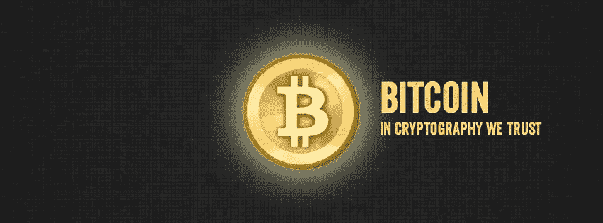
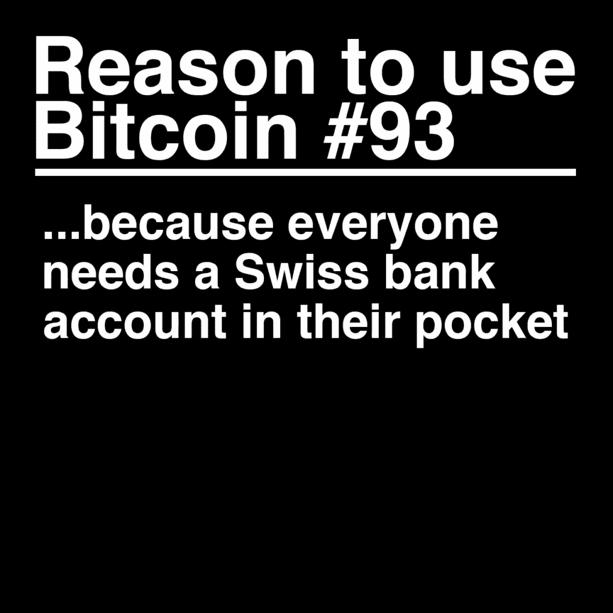
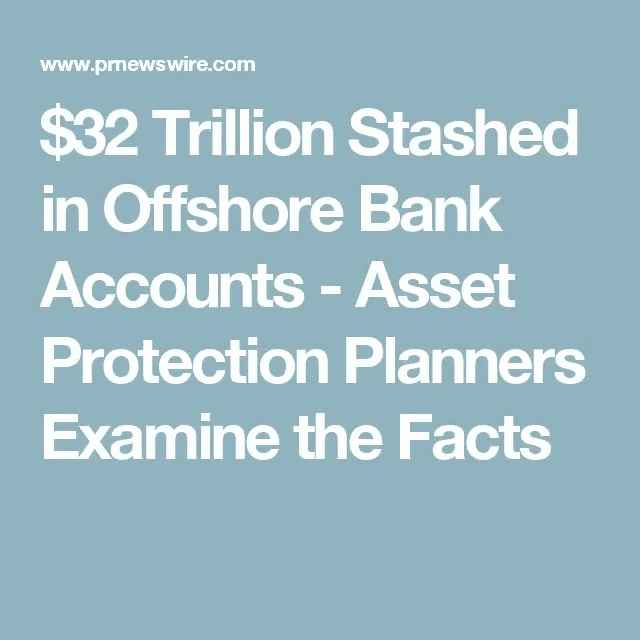
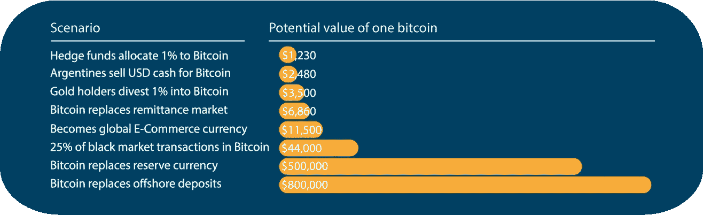

# 比特币取代离岸银行业务

> 原文：<https://medium.com/hackernoon/bitcoin-replacing-offshore-banking-5dc1e4571450>

几十年来，富有的个人、企业和机构一直享受着将巨额财富隐藏在避税天堂以避免高税率的奢侈，特别是在瑞士。自从 1934 年银行保密法被写入瑞士宪法以来，瑞士已经拥有了世界上三分之一的隐藏财富。然而，到 2017 年 12 月 31 日，这种逃避税务员的能力将不复存在。**为什么？**国际社会已迫使瑞士加入经济合作发展组织(OECD)的自动信息交换计划，该计划旨在确保相关机构了解离岸账户。瑞士从 2018 年开始参与这一计划，这被视为结束避税的重大突破，因为**数万亿美元现在将被参与该计划**的其他国家所知。这将在市场上产生巨大的缺口和需求，因为瑞士银行账户持有人**争相寻找一种安全、有效和秘密储存价值的方式**。正是因为这三个因素以及我在下面强调的其他因素，到今天为止，**比特币是人们可以要求的最好的替代价值储存手段**。

# **开户:**

要开立瑞士银行账户，交易对手需要大量文件。开户需要您的身份、职业、财富来源以及银行要求的任何其他类型的验证。有了比特币，用户可以即时创建账户。比特币钱包使用随机创建公钥和私钥的软件，这些公钥和私钥可以以数字方式存储在纸上、网上或用你选择的短语存储。本质上，可以创建无限的密钥对，而无需任何类型的批准。

# 财务隐私:

从明年年初开始，瑞士银行账户持有人将不再享有将资金保密的特权。瑞士银行现在必须应要求向其他金融机构和当局传送账户持有人的信息。对于比特币来说，用户可以随心所欲地让自己的资金变得私有。由于比特币地址只是一串数字和字符，用户能够存储他们的资金，而与他们的实际身份或 IP 地址无关。

# 资金安全:

在一定程度上，银行持有的资金通常由机构进行损失保险。比特币用户的安全只有自己可以依靠。用户负责保护他们的私钥，这使他们能够控制自己的比特币。然而，我们开始看到一些交易所和在线钱包为他们的客户提供保险。

# 政府没收:

政府可以没收任何银行的资产，无论是现金存款还是保险箱中的贵重物品。政府甚至可以决定你的资金是银行救助所需要的。对于比特币用户来说，只要他们的私钥得到保护，他们的资金就无法被任何人查封。然而，如果比特币用户在交易所转移或存储他们的比特币，第三方可以破坏存储在那里的比特币。

# 交易速度:

对瑞士银行来说，账户持有人不得不担心缓慢和未知的交易时间，因为转账的目的地和时间决定了资金到达的速度。有了比特币，交易通过互联网变得便利。比特币交易即时发送，10 分钟到 2 小时内确认。

# 交易费用:

对瑞士银行来说，费用很容易达到两位数的百分比。根据目的地和金额的不同，您的交易费用最高可达交易总额的 30%。汇款支付将代表这一门槛的高端，而银行间转账通常是免费的。对于比特币，用户在交易中附加一小笔矿工费，这将有助于促进转账。比特币交易的费用取决于比特币网络的繁忙程度和发送的数据量。然而，它将总是大大低于任何金融机构。

# 易于转移:

对于瑞士银行账户持有人来说，他们可以去银行分行发起转账，也可以通过手机或网上银行进行转账。对于比特币用户来说，他们需要的只是一个互联网连接和一个兼容的设备来启动转账。

# 2018 年——比特币之年:

如今，比特币的交易价格约为 1.7 万美元，平均交易量为 2，460，983，124 美元。另据估计，全球 75 亿人口中，只有 1500 万人拥有或使用比特币。为了帮助正确看待这些数字，苹果股票有 50 亿美元的流通股(不可能知道每个个人股东的确切数量，因为许多机构持有苹果股票作为其金融衍生品)，平均交易量为 28，806，898 美元。苹果市值 8860 亿美元，比特币市值 2840 亿美元，这意味着比特币被显著低估！！人们需要明白，像各种点对点平台一样，比特币的价值来自用户增长和效用。

2018 年无疑将是比特币之年。随着数万亿美元暴露在瑞士的离岸银行账户中，即使这些资金中有 1%在比特币中找到了难民，我们也应该看到比特币的价值大幅上升。

