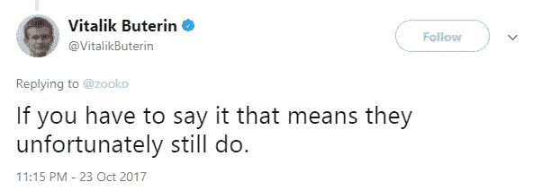
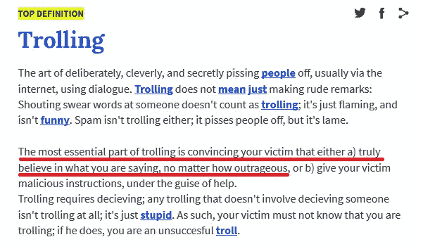
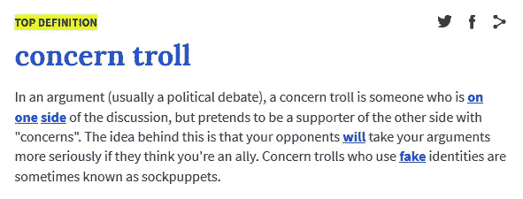
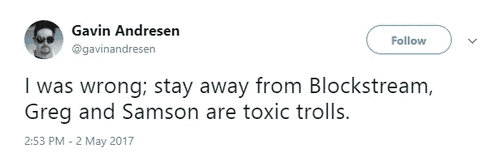
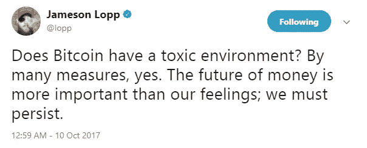
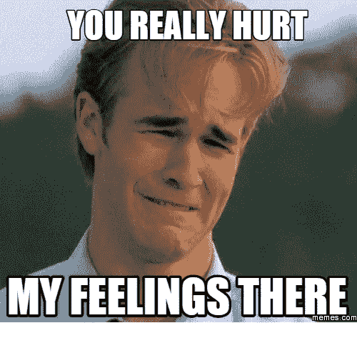
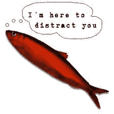
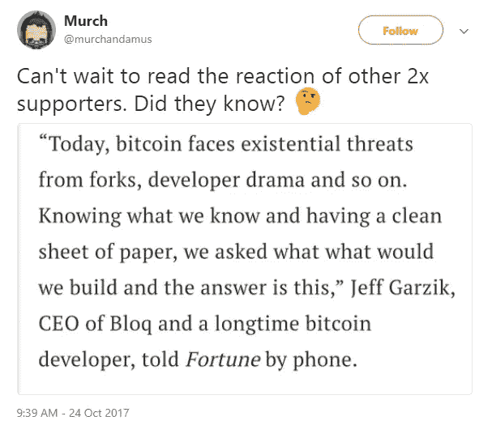
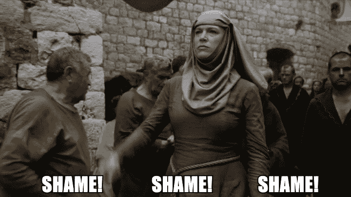

# 比特币钓鱼的问题和毒性

> 原文：<https://medium.com/hackernoon/bitcoin-trolling-matters-and-toxicity-11ef078ef5fc>

前天，当我像 crypto 里的任何正常人一样在床上查看 Twitter 时，我读到了 Zooko 的以下推文:

我不同意这种说法，遗憾的是，他们同意。我已经在考虑写一些关于这个的东西了，所以谢谢 Zooko 给了我动力和灵感。第二天早上醒来，我看到维塔利科回复了佐科，这是我第二次同意维塔利科的观点(第一次:称克雷格·赖特为骗子)。

# 到底什么是钓鱼？

问 10 个人，你会得到 10 个不同的答案，所以最好还是用城市字典的定义。

我认为理解这一点很重要。似乎我们现在处在这样一个点上，当人们不同意彼此的观点时，他们只是把对方称为巨魔，这就结束了。

这很容易做到，做一个声明，把不同意你的人称为“巨魔”，声称占据道德制高点，并说别人在戏弄你是多么的可悲，这清楚地表明你是对的，甚至没有提供任何关于你自己声明的真实证据。(从现在起，这将被称为“哭巨魔”的基础上现有的“哭狼”)

# 熊猫，你是巨魔

去年我被骂了很多次。很多时候，这是不同意我的人的“言论”,我不是。其他时候，人们声称我运营着 20 多个 Twitter 账户。我没有，我只有一个帐户，我甚至删除了我自己的帐户，在加密之前是用我的真实姓名，因为我只有 40 个追随者，显然更多的人关心熊猫的想法。

> 事实上，最糟糕的一次是某个有一定声誉的人给我在一个项目中帮助的所有人发消息，称我是“crypto 中最毒的人(或者巨魔不记得了)”，同时试图说服那些人解雇我，尽管我甚至不是员工或承包商。([有点像罗杰对萨姆森·莫的尝试](https://np.reddit.com/r/btc/comments/5cuxwz/updated_version_with_company_endorcements_of_the/d9zvi6d/)，但这次不是罗杰)

也许那些叫我巨魔的人是在戏弄我(试图让我做出反应)，我认为这实际上更多的是因为知道他们错了，只是哭着说巨魔。

我个人实际上在 Twitter 或聊天中尝试做的是用我的智慧让人们发笑和思考。我注意到这是试图教育人们让他们思考某些情况和陈述的最有效的方法。

# 毒性:简单的借口

This was after Greg and Samson called him out because of Gavin supporting fraud faketoshi

我认为詹姆森在这条推文中描述得最好:

就像“巨魔”一样，很容易以说别人有毒为借口，不照照镜子，花点时间想想为什么人们在说/做“有毒”的事情。我们在这里不是在研究宠物项目，我们是在研究货币的未来，来自四面八方的攻击试图摧毁比特币项目。

我喜欢拿它和现在的孩子做运动做比较。当我年轻的时候，你有一个赢家和一个输家。你必须赢才能成为赢家，现在每个人都有一个参与奖杯，每个人都是“赢家”，只是不要伤害任何人的感情。

这是一个价值 900-1000 亿美元的项目，如果某事是愚蠢或危险的，那就称之为愚蠢或危险。那不是有毒的，那是诚实，如果你不能处理诚实，那是你的问题。不是说对方不尊重你，是说你需要反思自己说过的话或者做过的事。

这里的问题是，有些人太自我了，以至于他们不能接受批评，我们应该围坐在篝火旁唱歌吗？还是对那个人让步，不让他难过？什么更重要？人的感情还是改变和塑造世界？

# 结论:

巨魔和毒性大多是一个红鲱鱼。这是一个在没有提供任何证据的情况下做出古怪声明的借口，因为当你被叫出来时，你只是尖叫“巨魔！”“有毒！”而忽略实际的举证要求。

从我个人的经验和知识来看，的确有巨魔，甚至在 Reddit 和 Twitter 上也有付费的巨魔，但他们并不在某一群人声称的“一边”。推卸责任是真实的。

回到 Zooko 最初的推文，这些“真正的”巨魔和关注巨魔确实很重要，它们提供了开始指责每个人都是巨魔和有毒的借口。它允许某些团体和人在不承担任何真正责任或提供任何真正确凿证据的情况下逃脱谎言和错误信息。

**编辑*** 所以我昨天写了这篇文章，但是昨天听说了杰夫·加济克的公告之后就没有贴了。这个编辑上面的内容我不想改。但是我觉得应该加一部分关于毒性的。

[Source article](https://www.bloomberg.com/news/articles/2017-10-24/bitcoin-pioneer-says-new-coin-to-work-on-multiple-blockchains)

因此，BTC1 的首席(也是唯一的)开发者(他实际上根本没有做任何工作)，他正在准备 2X fork，并一直在积极创建开发者戏剧，现在创建一个硬币来“解决”这些问题，同时推出他自己的 ICO。(你可能还想查看一下[顾问页面](https://www.metronome.io/#team-content)

这就是毒性。

