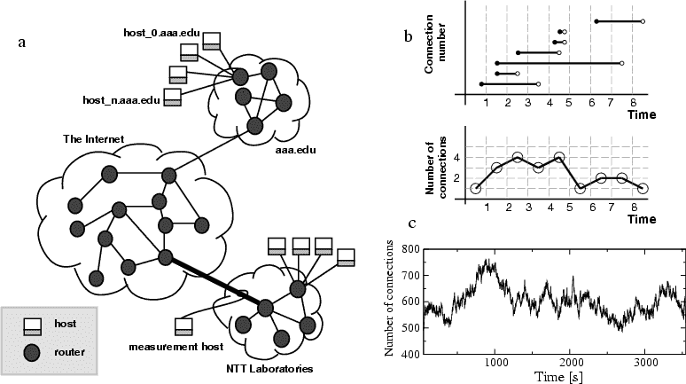
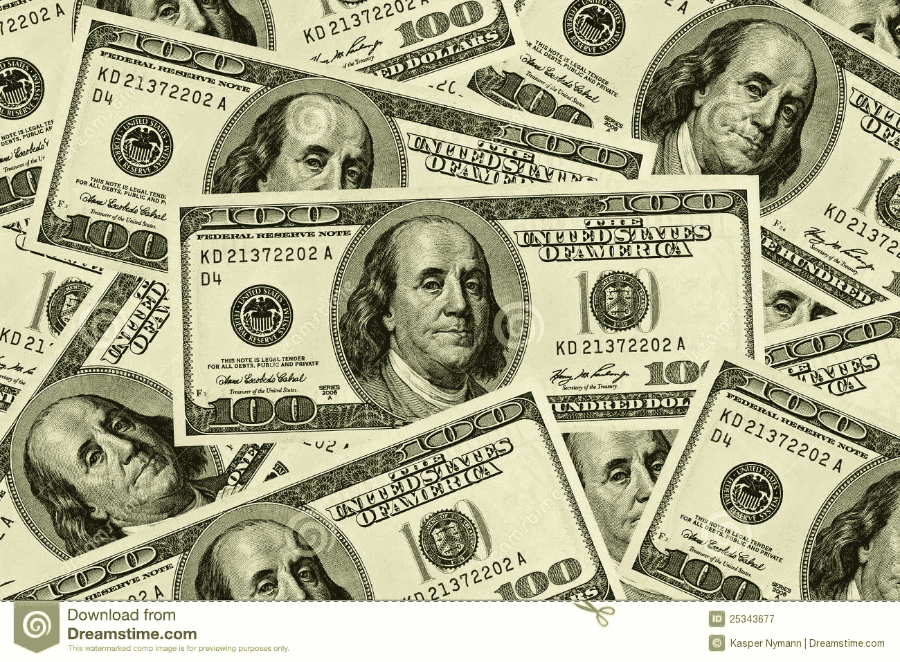

# 比特币:“你没有参照系”

> 原文：<https://medium.com/hackernoon/bitcoin-you-have-no-frame-of-reference-380519ede630>

## 以每枚 6000 美元的价格计算，流通中的比特币只有 1600 多万枚，目前比特币的总市值为 1000 亿美元。很多吗？就像电影《大勒保斯基》(The Big Lebowski)中的唐尼一样，比特币需要一个参照系。

取决于你何时开始观察或拥有比特币，你会发现它的价值上涨了 5 倍、20 倍或超过 100 倍。这听起来令人震惊。但如果它承诺成为一种新的价值储存手段、一种新的银行业务方式、一种新的货币、一种新的价值转移系统等等，那么 1000 亿美元听起来只是冰山一角。我没有对比特币的价值进行任何技术性的尝试，我的方法是引用世界金融现象的价值，并提出这样一个问题:“如果比特币准备发挥其任何潜力，与现有价值相比，它的稳态价值是多少？”

## **数字黄金之类的**

目前全球储备中的黄金价值约为 8.5 万亿美元。如果它是任何一种“价值储存”或“数字黄金”，那么比特币的价值可能达到 1.5 万亿美元，相当于 9 万美元的象征性价格，这听起来并不合理。

## **它就像互联网，但为了钱**

阐述比特币效用的另一种方式是参照互联网，因此有了“价值互联网”(Internet of Value，简称 IoV)的绰号。“互联网”值多少钱？如果我们现在所知的互联网底层协议是一家上市公司，我们可以购买其股票，那么这家公司的市值会是多少？一种方法是合计上市“互联网”或互联网依赖公司的股权价值。从脸书(市值 5100 亿美元)和谷歌(市值 6900 亿美元)等明显的公司开始，然后转向几乎所有现在至少有一部分价值来自互联网连接的公司。数字各不相同，但保守估计，互联网给世界带来的总价值超过 20 万亿美元。如果比特币只达到这一潜力的 10%，那么它的价值将达到 2 万亿美元或 12 万美元的现金价格。

## **老派的本杰明**

比特币会挑战美元的储备货币地位吗？根据美联储的最新数据，目前现金、活期和储蓄银行账户中有超过 12 万亿美元(这被称为 M2 货币标准)。其中大约 1.5 万亿美元是硬币和纸币。但全球所有货币的现金总量，但以美元表示，约为 30 万亿美元。同样，认为像比特币这样没有汇款国的货币可能达到 1 万亿美元的价值听起来并不疯狂，在这种情况下，我们的估值会略低，接近 6 万美元。

## **这就像你自己的私人银行**

银行？全球排名前 25 位的银行价值超过 2.5 万亿美元。这些银行仅在支付交易业务上的年收入就高达 2 万亿美元。卡和交易支付公司呢？仅 Visa、MasterCard、Amex 和 Paypal 加在一起就价值近 5000 亿美元。加上金融服务业的其他部分，从保险到资产管理再到汇款，你很快就会发现金融服务业的总市值约为 25 万亿美元。如果比特币创新只窃取了一小部分盈利能力，那么不难想象这些新金融科技公司的技术价值会是多少？2 万亿美元？现在，我们的估值回升至 12 万美元

我可以利用许多其他背景来说明比特币的适用性和价值——房地产、法律、医疗记录和任何点对点的东西。事实上，以上还不包括这些行业和资产类别在未来几年的[未来](https://hackernoon.com/tagged/future)增长。此外，比特币将获得的价值不是零和游戏——它不仅会从现有现象中窃取价值，还会在以前不存在的地方创造价值。

## **是的，嗯，那只是，像你的意见，男人**

这是一种非常不科学的方法来猜测比特币的价值在未来几年可能会走向何方，事实上，谁会留下比特币真的会成为将所有这些机会货币化的首选密码。但是社会需要这种分散的点对点加密技术，就像它需要银行、金钱、黄金，当然还有互联网一样。

【免责声明:本文不构成投资建议、价格预测或投资建议。读者的投资决定对作者没有追索权。]