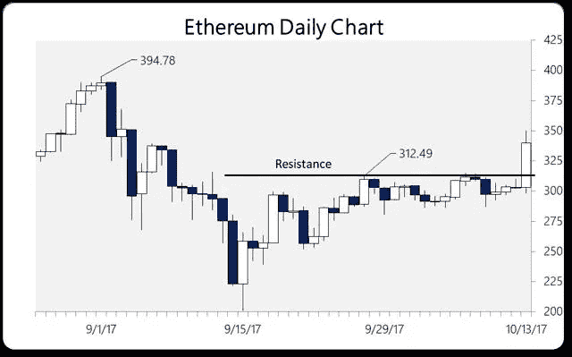
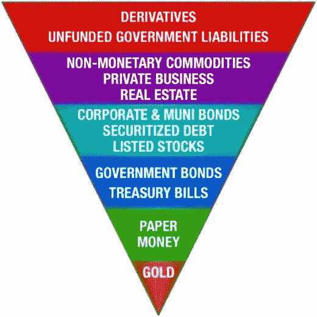

# 与以太坊带我们去的地方相比，比特币的大动作算不了什么

> 原文：<https://medium.com/hackernoon/bitcoins-big-move-is-nothing-compared-to-where-ethereum-is-taking-us-d4e23b9a9ce6>

周五，比特币突破了之前接近 5000 美元的高点，似乎没有任何阻力。这种数字货币花了几天时间突破这一限制，直到一些小新闻带来了一大批买家。

有趣的是，看着加密市场的其余大部分没有和比特币一起做出反应。在过去的反弹中，比特币的成功是水涨船高，与此不同的是，昨日市场继续抛售许多前景光明的比特币/代币。

实际上，我们看到流动性从像 [NEO](https://neo.org/) 、 [Waves](https://wavesplatform.com/) 、 [Monero](https://getmonero.org/) 和 [STEEM](https://steem.io/) 这样的硬币中流出，回到三大货币比特币、莱特币和以太币中。这使得论点相当清楚，这些硬币中的一些远远领先于他们自己。

他们是三巨头获利的接受者。由于税收的不确定性，流入加密领域的大部分资金都不会再流出。这是今年首次发行硬币市场爆发的部分原因。

所有这些利润都不能带回“现实世界”，以免这些新诞生的“秘密百万富翁”被课以巨额资本利得税，尤其是在美国。

国税局将比特币归类为“财产”，因此按照资本利得税率征税。如果你的成本基础几乎为零，如果你认为比特币的调整是暂时的，那么拿出这笔钱购买任何大于抵押贷款或汽车付款的东西就没有什么意义。

因此，将这些新资本用于资助新项目，作为一种避税手段，是有道理的。“被低估”硬币的账面利润也是如此。不需要太多的旋转就能把这些硬币提高 5 到 10 倍。

但是，一旦比特币清除了下一个技术障碍，这些利润就可以从这些“替代硬币”中滚回比特币，以追逐这一势头。

这就是周五发生的事情。

# 以太坊的硬叉子恐惧

Ethereum’s Big Technical Breakout on Friday 10/13

另一方面，以太坊在接下来的几天里跌破了 312 美元的技术重要水平(见图表),原因是担心其即将升级为区块链(被称为拜占庭帝国)的动荡。

拜占庭是以太坊区块链的一个重大升级，从根本上提高了交易吞吐量。与去年 8 月导致比特币现金诞生的比特币分叉之争不同，矿商财团对比特币的争夺并不激烈。

但是，距离拜占庭的实施只有几天了，对矿工起义和以太坊区块链分裂的担忧正在消退。正因为如此，以太坊昨晚终于突破了 311 美元的阻力，目前交易于 330 美元上方，目标是 400 美元的历史高点。

随着比特币价格飙升如此之快，未来几天可能会出现另一轮替代硬币，包括以太坊。如果拜占庭的网络升级如预期的那样顺利进行，它可能会在未来几周内将以太坊带到历史高点。

为什么？因为我们仍然在盯着比特币区块链的另一个潜在分支，因为矿工们继续拒绝采用“隔离证人”协议，以及将区块规模扩大一倍。这被称为“seg wit 2x ”, 11 月 1 日是观看的日子。

# 至关重要的区别

拜占庭以太坊开始扩展其架构，以处理其价格目前控制的交易量。在过去的一年里，它已经看到了巨大的投资。未来还有很多技术工作要做，我不打算用细节来烦你。

对于外行人来说，要明白以太坊这样的密码更类似于应用平台，API，而不是比特币和莱特币这样的黄金( [GLD](https://seekingalpha.com/symbol/GLD) )或白银( [SLV](https://seekingalpha.com/symbol/SLV) )的数字类似物。

正因为如此，它们的价值更多地来自于建立在它们之上的应用，而不是任何形式的交换媒介。该功能，即其价值的符号化，是运行分布式应用程序的平台性能的度量。

这就是为什么我觉得它们作为投资工具比比特币更有吸引力。他们感觉更像股票，而不是外汇。将比特币作为外汇对进行分析非常有意义。在加密世界里，比特币就像美元([、UUP](https://seekingalpha.com/symbol/UUP) )，其他一切都以此为标准。

它是加密世界的储备货币。因此，它位于埃克斯特金字塔的底部。

The New Exter’s Pyramid: Sub Bitcoin in for Gold and Ethereum in for Paper Money

但是，以太坊和类似的硬币有着本质的不同。它们有可能改变我们在互联网上交换价值的方式。因此，投资者在将疯狂的波动性视为又一个泡沫之前，需要意识到这一点。

# 以太还是现实？

这种波动性是数十亿美元在短时间内流入市场的结果。短期效应是泡沫状的。但是，除了投机狂热之外，还有一种改变我们处理资金和投资方式的真实愿望。

加密货币市场目前的市值为 1740 亿美元，这证明了人们开始建设这个新世界的愿望。并不是所有像以太坊这样的‘平台币’都会成功。作为一名投资者，我看待它们的方式和看待任何低价股一样，是一种真诚的风险，我只把我愿意输掉的钱放在桌面上。

但是，随着当前真实世界资本的涌入，他们错误投资暴露的那一天还很遥远。人们仍然相信特斯拉( [TSLA](https://seekingalpha.com/symbol/TSLA) )的故事，即使该公司从未达到其生产或成本目标。在接下来的几年里，同样的事情将会存在于密码领域。

一如既往，市场会区分真假。目前，以太坊是真正的交易。

*本文原载于* [*求阿尔法*](https://seekingalpha.com/article/4113517-bitcoin-makes-new-highs-ethereum-real-opportunity)*……作者做了一些小的修改。*