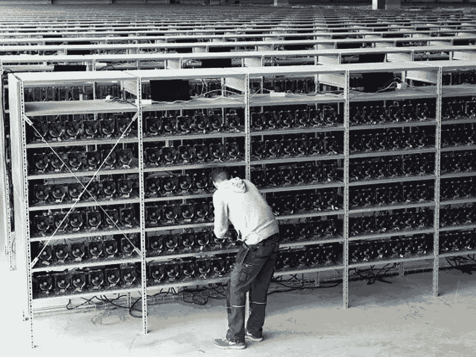
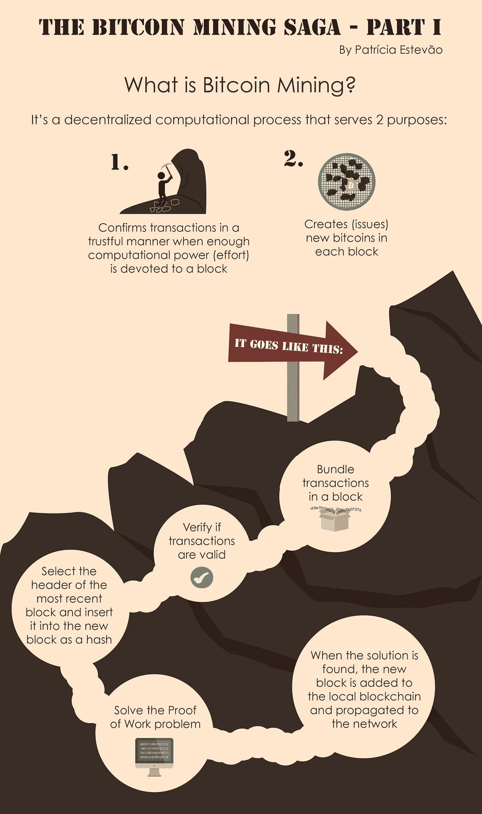
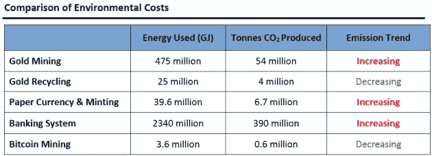

# 比特币的能耗被夸大了吗？

> 原文：<https://medium.com/hackernoon/bitcoins-energy-consumption-overblown-31a4eded91f3>

主流媒体 LOVES 羞于指责比特币矿业比丹麦使用更多的能源，但与普遍观点相反的是，它仍不到美国总能源使用量的 1%。媒体、银行高管和信息错误的个人喜欢利用任何机会传播对比特币的任何类型的恐惧、不确定性和怀疑。这太可怕了，太不负责任了。Blockchain 技术/比特币是自互联网创建以来最具创新性的发明，由于不正确信息的传播，对这一技术的理解一直令人费解。大多数人不明白，我们正目睹着眼前最不可思议的现象，在文明世界里，我们第一次看到了国家和金钱的分离。请记住，如果创新和改变很容易，它就会悄悄地发生。我计划向你们展示的不仅仅是媒体对比特币能源使用的错误看法，还有其他被广泛接受的做法比比特币消耗更多的能源。

# **比特币挖掘的总体设计:**

首先，比特币挖掘只是交易被验证并添加到公共分类账(被称为区块链)的过程。矿工或计算机因验证和保护网络而获得比特币奖励。挖掘过程包括将事务编译成块，并试图解决一个难题。解决难题的参与者或计算机首先将下一个积木放在区块链上，并索要他们的比特币或积木奖励。这里有一个重要部分，大宗奖励大约每 4 年减半，目前的大宗奖励是 12.5 比特币。这种不断减少的区块奖励将持续到所有 2100 万比特币发行。

这里是第二个重要部分，开采每个区块的难度，或解决每个区块所需的能量，都可以调整。采矿难度会自我调整，目的是保持区块发现率不变，因此如果有更多的计算能力专门用于采矿，难度会向上调整，使采矿更困难。反之亦然。

**大宗奖励减半的重要性:**

重要的是要意识到，比特币矿商经营的业务成本高昂，每月的管理费用也很高。如此简单的经济理论告诉我们，矿业公司只会继续经营，只要他们发现它有利可图。当比特币协议获得一半的大宗报酬，而比特币的价格保持不变时，理论上，你应该预计有一半的矿商会停止运营。然而，由于比特币的价格一直在稳步上涨，矿商仍然认为采矿活动是有利可图的。

**采矿难度调整的重要性:**

重要的是要认识到，无论在比特币区块链上部署多少能量，挖掘难度都会相应调整，以便每 10 分钟只产生一个区块。因此，如果难度增加到无利可图的程度，矿工们就会停止开采。

本质上，比特币协议旨在随着时间的推移降低能耗。例如，2009 年用于挖掘比特币的 CPU 比目前的 ASICs 多消耗 100 万倍的能量。这些比特币矿工将继续寻找更有效的运营方式，并利用他们可以获得的更廉价的能源，如水电站和可再生能源。

# **透视比特币的能源使用:**

目前，据估计，比特币采矿每年消耗约 9 万亿瓦时。请记住，这是来自几个不同调查的粗略估计。然而，非常明显的是，美国的数据中心、黄金开采和全球菲亚特生产都比比特币消耗更多的能源。

以下是各种任务的年能耗列表:

1.  比特币采矿——9 万亿瓦时
2.  全球法定货币产量— 11 万亿瓦时
3.  在美国运营数据中心— 16 万亿瓦时
4.  黄金开采— 130 太拉瓦时

很快就清楚了，比特币开采使用过多能源的说法完全被夸大了。此外，这些数字还不包括用于运营银行金库、安全系统、装甲车运输的大量能源，甚至不包括运营一家银行分行所需的基本能源。

# 历史上的例子:

2006 年，美国能源部猛烈抨击和媒体羞辱谷歌的数据中心，因为其消耗的电力足以运行美国 20 万个家庭。美国能源部继续声称，谷歌的能源使用量将每五年翻一番。然而，与他们的说法相反，时间证明谷歌的耗电量变平了。谷歌为此贡献了更好的冷却系统和电源管理，从而提高了它们的效率。

# 总结:

读完这篇文章后，可以有把握地说，对比特币能耗的担忧是过虑了。同样重要的是，要意识到这些矿商正在将电能转化为对全球经济更有用的东西。