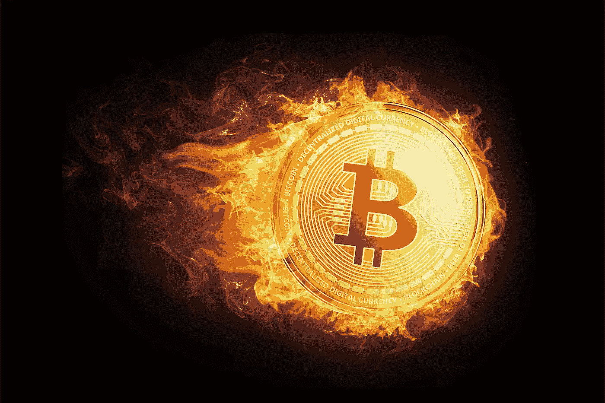
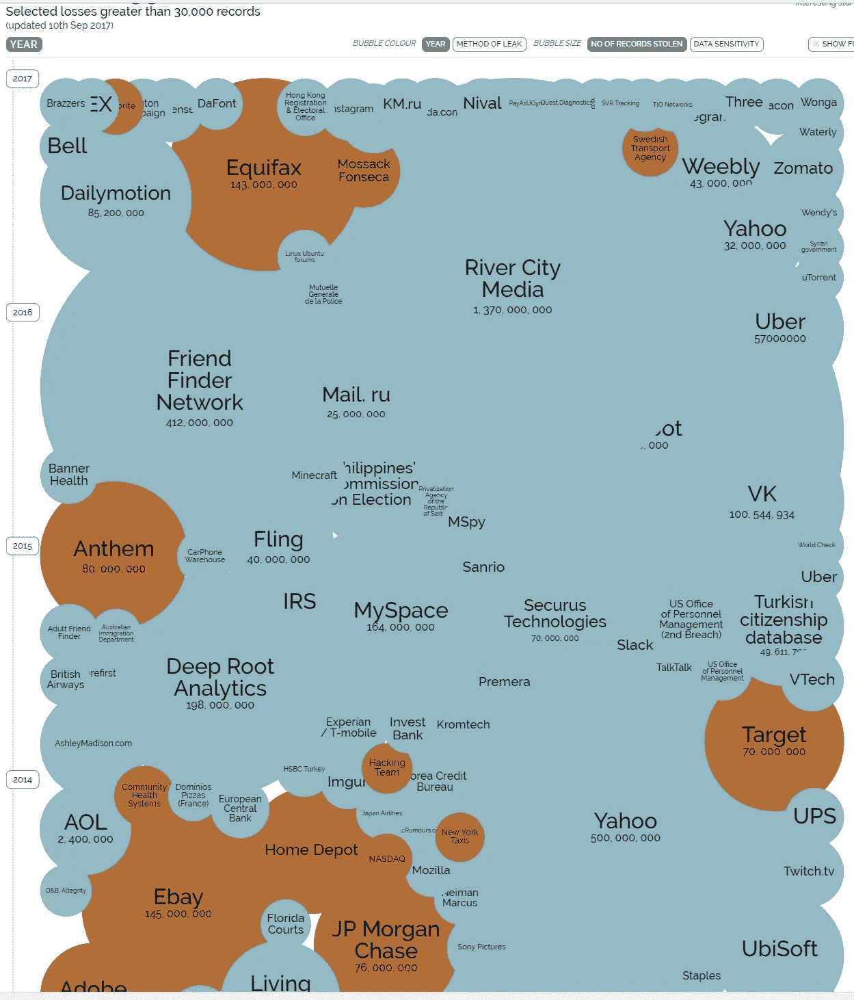
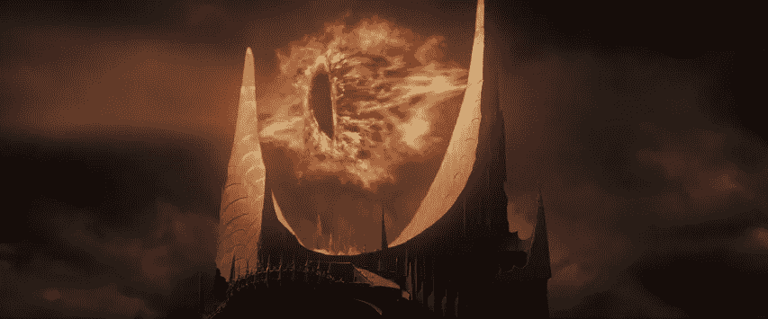
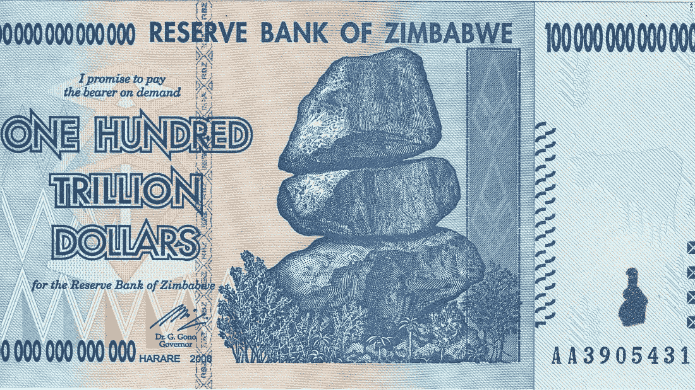
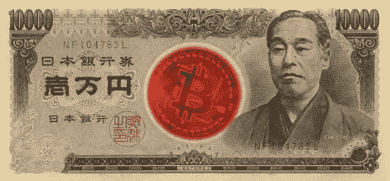
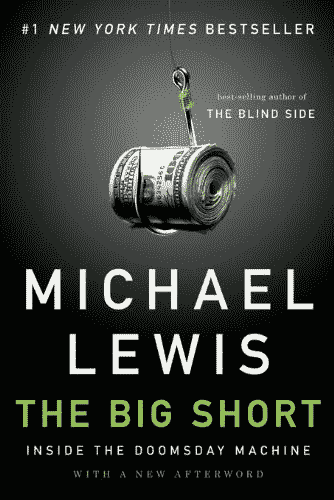
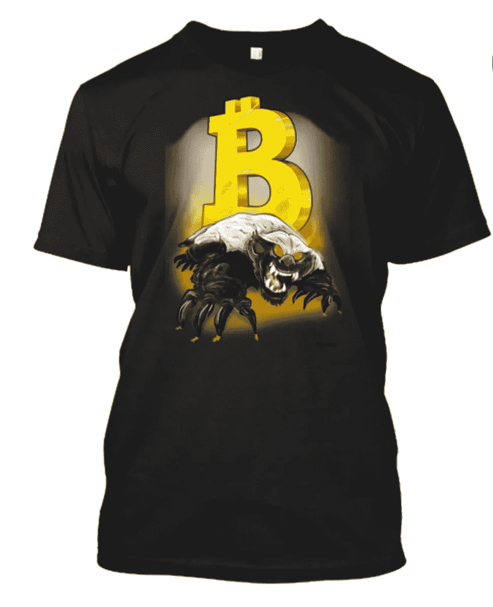

# 比特币的最终老大

> 原文：<https://medium.com/hackernoon/bitcoins-final-boss-22e2a52f9c7d>

“比特币应该被取缔。”

这是 T2 经济学家 Joseph Stiglitz 上周在 T4 接受彭博采访时的不祥之言。

他不是第一个说这话的人，也肯定不会是最后一个。

Live interview with another old elite who hates Bitcoin, Joseph Stiglitz.

在短暂的生命周期中，比特币克服了所有困难，成功生存了下来。一直磨到 Mt Gox 的 [**崩溃。它比那些一次又一次宣称它已经死亡的批评家和怀疑者活得更久。它瞒过了一家**交易所和****](https://www.wired.com/2014/03/bitcoin-exchange/) **[**ICO 禁止来自中国**](https://hackernoon.com/the-empire-strikes-back-with-a-coordinated-war-on-crypto-bdd84fd2f854) 。它没有遭遇重大的安全漏洞，尽管它在一眨眼的时间里在世界各地转移了数十亿美元，但几乎没有任何一家大公司或政府的网站可以宣称这一点。**

当你想到有多少大公司遭受黑客攻击，从 Equifax 到索尼到苹果再到 JP 摩根(他的首席执行官可笑地称比特币是一个骗局，而他甚至不能保护自己的系统)，以及理应安全的政府网站，从美国国家安全局到国防部到军队，比特币令人难以置信的安全性几乎令人难以置信。

**但比特币最大的战役还在后面。**

政府和银行。

投资大师 Naval Ravikant 称政府和旧世界银行精英为“最终老板”。

有一段时间，当权者只是嘲笑这种微不足道的货币。但是他们不再笑了。随着比特币越涨越高，索伦之眼转向。

Eye of Sauron in The Lord of the Rings.

如果你认为中央权力不能对密码造成重大损害，请三思。他们掌握着最终的权力:

暴力黑客。

那是杀死你或把你关进监狱的权力。

早在 2017 年 10 月，前美联储主席本·伯南克说“最终政府[将采取任何必要的行动来阻止比特币](https://news.bitcoin.com/bernanke-eventually-governments-will-take-any-action-they-need-to-prevent-bitcoin/)”

他没开玩笑。唯一的问题是，cryptos 的分布式设计能否经受住即将到来的攻击？只有时间能证明一切。

但是，控制分散化货币引擎的努力已经开始。

Classic cold war Russian propaganda.

[工作证明](https://www.khanacademy.org/economics-finance-domain/core-finance/money-and-banking/bitcoin/v/bitcoin-proof-of-work)挖矿是比特币系统最大的瓶颈。它导致了专用芯片的高度集中。矿工处理世界各地的交易，铸造新硬币。虽然中国迄今为止一直在打击像吴这样的大矿商，但俄国已经为这次袭击做好了准备。

通过强迫矿工登记，他们可以跟踪他们并向他们征税，如果有必要，还可以没收他们的矿并把所有的硬币据为己有。在战争时期，这正是他们要做的，通过派遣带枪的人来夺取矿山。很难找到几千名蚂蚁矿工，并把他们转移到其他地方。因为它们产生的电流很大，所以很容易被发现。

替代的共识协议可以阻止这种攻击，如[利害关系证明](https://blockgeeks.com/guides/proof-of-work-vs-proof-of-stake/)。但是还需要做更多的工作，需要用一枚大硬币来证明利害关系。[其他共识协议将在未来几年发展](https://hackernoon.com/what-will-bitcoin-look-like-in-twenty-years-7e75481a798c)，这些协议不会消耗太多能量，但仍能证明工作以正确的方式完成，没有人作弊。

但现在是在和时间赛跑。

[国会正寻求扩大其反洗钱法的范围，将隐藏你拥有的任何钱包或密码与](https://cointelegraph.com/news/us-senate-moves-to-criminalize-non-disclosure-of-cryptocurrency-ownership)[参议院 S.1241 号法案](https://hackernoon.com/50-shades-of-grey-what-bitcoiners-should-know-about-s-1241-fd6c0d7f296d)一起定为犯罪。

无论出于何种原因，在跨境时隐藏数字钱包和加密货币都是非法的。所以只要申报就好了，对吧？你是个守法的好公民。**你交你的税** [**包括你的加密税**](https://cointracking.info/) **。你没什么好隐瞒的。**

除了边境管制，没有正当理由，人们有权从你这里偷走它。

换句话说，他们可以拿走钱，只是因为他们喜欢，他们甚至不必告诉你为什么。

如果这听起来像是合法的抢劫，那是因为这确实是合法的抢劫。

美国公民自由联盟记录了数以千计的普通公民被剥夺毕生积蓄的案例。这叫做 [**民事资产没收**](http://ij.org/report/policing-for-profit/) 。如果你认为只有自由倾向的组织认为这是一个问题，请三思。最保守的传统基金会有一页专门讨论这种做法日益增长的问题。

这是少有的左派和右派都同意的问题之一。当司法部长杰夫·赛辛斯试图取消奥巴马时代对资产没收的限制时，他立即遭到了两党的强烈反对。

那么，为什么我们仍然有国家支持的盗窃？

贪婪。

在预算下降的时候，这些钱大多被用来充实执法部门的腰包。[据《华盛顿邮报》报道](https://www.washingtonpost.com/news/wonk/wp/2015/11/23/cops-took-more-stuff-from-people-than-burglars-did-last-year/?utm_term=.c0e0952af178)2014 年，本该保护我们的人从美国人那里偷走了更多的钱，超过 50 亿美元，超过了美国所有窃贼的总和，而这些窃贼只成功地偷走了微不足道的 35 亿美元。

新的参议院法律造成了一个令人讨厌的困境，首先撞上了民事资产没收的墙。如果你没有告诉边境特工你携带了 10，000 美元或更多的密码[，你可能会在监狱里呆上 10 年。如果你告诉他们，他们可以通过无限期扣留你并要求你的密码，甚至不指控你犯罪，来夺走你的权利。](https://www.congress.gov/bill/115th-congress/senate-bill/1241/text?format=txt)

**它是一个活生生的、会呼吸的** [**军规——22**](http://amzn.to/2AsuJQ9)**。**

这些是健康的民主国家不会做的事情，但失败、有缺陷、基础设施和制度崩溃的民主国家却可以不受惩罚地做这些事情。这就是为什么美国在民主指数排名中跌出榜首，落入“有缺陷的民主国家”的行列。

开国元勋们在坟墓里打滚。

他们绝不会允许这样的法律不受检查地通过。他们会把它和导致与英国开战的不可容忍的行为混在一起。开国元勋们想不惜一切代价保护你的私有财产。对他们来说，财产是神圣的。如果没有充分的理由，政府是不会接受的。这就是第四修正案的全部内容，也是他们创建它的原因。

> 人民的人身、房屋、文件和财产安全不受无理搜查和扣押的权利不得侵犯，除非有正当理由，并经宣誓或证实，特别说明要搜查的地方和要扣押的人或物，否则不得发出搜查令。

不要误解我。开国元勋们不希望罪犯和恐怖分子保有他们的利润，我当然也不希望。但是他们想要正当程序、法治、证据和定罪(T2)。他们不想让我们变成香蕉共和国，任意搜查和扣押，还有[腐败的警察像墨西哥警察一样在交通站敲诈游客的现金](https://news.vice.com/article/mexicos-efforts-to-tackle-police-corruption-are-failing)。

他们这样做是因为他们生活在一个专制的国家。他们完全知道这意味着什么。英国政府可能会强迫你在你的房子里安置一名士兵，并为其买单。他们有时在秘密法庭指控人们，称之为没有上诉可能的星际法庭。宪法是专门为制止这些滥用而设计的，但是今天它们正在泛滥，因为现在活着的人除了自由社会之外从未生活过，并且不知道不生活在自由社会意味着什么。

他们可能想研究民主指数垫底国家的历史，因为糟糕的法律是一个滑坡，几乎可以在一夜之间将一个国家滑到名单的底部。

看看委内瑞拉，他们从繁荣的民主走向彻底的崩溃。看看津巴布韦吧，它经历了疯狂的恶性通货膨胀，或者看看中非任何一个残酷的政权，比如卢旺达。卢旺达不仅仅在 1994 年遭受了种族灭绝，他们已经遭受了一百年的种族灭绝，一个被驱逐的组织重新掌权，并再次对另一方进行报复。

这些法律只是开始。接下来会有更多。

然而所有的希望都是*而不是*失去的。

一些国家，如日本和瑞士，已经采取了开明的加密方法。

The enlightened approach.

他们认为 cryptos 是一项改变游戏规则的技术，将比世界历史上任何其他技术创造更多的财富和繁荣。聪明的国家正张开双臂拥抱它。

其他国家应该向这些聪明的国家学习。

但是不太开明的政权对密码持悲观态度，尤其是那些不惜一切代价崇拜权力和控制的政权。越南已经禁止了加密。[印尼也做了同样的事情](https://news.bitcoin.com/indonesia-media-urge-bitcoiners-to-cash-in-ahead-of-coming-crypto-ban/?utm_source=Indonesian%20Media%20Urge%20Bitcoiners&utm_medium=telegram&utm_campaign=Telegram%20Channel)，尽管[他们的钱基本上一文不值](http://www.xe.com/currencyconverter/convert/?Amount=1&From=USD&To=IDR)而且大部分印尼人完全没有银行账户。

从长远来看，这些努力都不会奏效。

密码的分散性质使它们很难被完全消灭，但中央权力可以在短期内对它们造成严重损害，并给普通人带来很多痛苦和折磨，同时完全无法阻止坏人。

密码不会消失。每天都有越来越多的传统势力加入这个秘密团体。芝加哥商业交易所集团将在几周后开始交易比特币期货。CBOE 抢在他们前面，于 10 日开始交易。流入他们的资金越多，他们就越有动力去保护他们。

世界范围的禁令永远不会发生。在当今分裂的社会中，世界上所有国家就任何事情达成一致的可能性几乎为零。一些国家会反对禁令，只是为了刁难他们的对手，或者因为他们认为这是规避全球制裁的一种方式。这意味着总会有节点在世界的某个地方运行来处理事务。

随着新威胁的出现，加密技术也在不断变化。匿名技术越来越受欢迎，像 [**Zcash**](https://z.cash/) 和 [**Monero**](https://getmonero.org/) 这样专注于隐私的硬币引领潮流。如果政府逼得太紧，他们只会越来越难更好地控制其用于非法目的。

更好的办法是公开拥抱他们，把他们带进光里。让他们成为主流。让人[在亚马逊上买小猫](https://www.cryptokitties.co/)和士力架和书！

[Crypto Kitties](http://mashable.com/2017/12/04/how-to-play-cryptokitties/#be1LbBKr3sqo)!

加密货币是令人难以置信的弹性，改变世界的技术。它们不同于任何其他已经存在的资产类别。对于所有试图将它们归类为数字黄金的怀疑者来说，他们真的错过了机会。

它们是可编程的钱。

你不能在一份每月支付的智能合同中设定一美元来进行自我托管。但是你可以用以太坊做到。

[Too often it’s been psychopaths who’ve run the world](http://amzn.to/2jTobjP).

它们也是一条通往自我主权和控制你所赚的钱的道路。逃离战乱国家的难民可以简单地删除他们的钱包，[记住它的特殊短语，一旦他们到达一个安全的避风港](https://talk.peercoin.net/t/mf-paper-wallet-tutorial-video/2982/63)重新创建它。无情的政权再也不会在最贫穷的人逃离精神病怪物的战斗时，掠夺他们所拥有的一切。

Cryptos 能够并将让世界变得更好。

但是要到达那里，他们将不得不面对最后的老板**，一个无情的老板，他会做任何事情来保持对货币供应的控制。永远不要忘记金钱就是力量。没有人会不战而降。**

****

**Bowser, the final boss in Super Mario Brothers.**

**对加密的战争就像一场黑暗的风暴。**

**政府会用老调重弹来推销它，作为阻止罪犯和恐怖分子的一种方式。**

**但这从来都不是真的。**

**这是关于控制。**

**这是关于他们是否能仅仅因为喜欢就拿走你的钱。**

****

**The people who cheated the system thrived.**

**密码有中央权力害怕。当你失去房子时，所有从债务抵押债券中受益的人都逃脱了他们的罪行。他们不仅逍遥法外，你还帮他们脱困。你给了那些最大的罪犯退休福利，他们现在住在更大的公寓里，还在笑。**

**当然，总是那些短视和邪恶的人试图阻止新技术，以确保他们不惜一切代价保持自己的地位。**

**只是这次不行了。**

**反对区块链的国家将会发现，它会反过来打击他们，并严厉惩罚他们，而世界其他地区则呼啸而过。他们不会在新的沙盒里玩了。他们将看着其他经济体把他们甩在身后，用全新的金融技术武装他们，让当前金融科技的蜗牛速度变得一文不值。**

**那些掠夺世界财富的人和那些在人民挨饿的时候破坏经济、住在宫殿里的独裁者将会付出可怕的代价。**

**世界不会错过他们中的任何一个。**

**###########################################**

## **限时在这里购买您的 [Money Badger 衬衫。当金钱獾接管世界时，没有什么能阻止他(甚至是大银行家)！](https://teespring.com/money-badger)**

****

**The [ultimate Bitcoin t-shirt](https://teespring.com/money-badger)! Grab one for your crypto loving friends for Christmas.**

**###########################################**

## **如果你喜欢我的作品，你可以考虑访问[我的主页](https://www.patreon.com/danjeffries)，因为我正试图拯救世界，我无法独自完成。**

**############################################**

****

***简单介绍一下我:我是一名作家、工程师和连续创业者。在过去的二十年中，我涉及了从 Linux 到虚拟化和容器的广泛技术。***

***看看我的第一部小说，* [***【蝎子游戏】***](http://amzn.to/2A6I54g) *，一部令人神魂颠倒的遥远未来的黑色小说，*被读者称为“神经癌的第一次严峻竞争”和“黑色侦探遇上约翰尼助记术”**

**如果你想了解我提供的最新最好的信息，请随时加入我的读者群。**

**############################################**

## **你也可以加入我的私人脸书小组，纳诺庞克后人类刺客小组，在这里我们讨论所有的科技、科幻、幻想等等。**

**############################################**

****关于我的一些最独家的故事和这个星球上最好的效用硬币研究，请查看** [**战略硬币**](http://strategiccoin.com/category/news/) **！****

**############################################**

## **最后，如果你和我一样热爱加密空间，那就来吧，加入 [DecStack，这是一个虚拟的加密货币和分散应用项目](http://decstack.com/)的合作场所，在这里你可以和来自多个项目的杰出人物交流。永远完全免费。只是进来和社交，一起工作，分享代码和想法。通过反馈让你的想法更好。寻找新朋友。见见你的新家人。**

**############################################**

**一如既往，感谢阅读。**