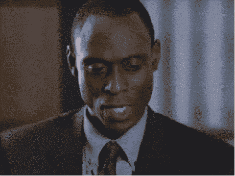

# 黑帽 UX 在 Lastminute.com 活得好好的

> 原文：<https://medium.com/hackernoon/black-hat-ux-alive-well-at-lastminute-com-a6f6cc8343>

**1。**在 Skyscanner 上愉快地搜索航班

**2。**决定选择 Lastminute.com 的报价，因为知名品牌让人觉得值得信赖。

**3。**通过结账流程

**4。**选择‘否’可选择保险

**5。**点击大粉色按钮继续

**6。**弹出如下提示:

**7。**扫描标题瞬间想辞退(def 不要这个保险)。直观地点击带有单词' [Continue](https://hackernoon.com/tagged/continue) '的大粉色按钮(到目前为止，所有下一步/继续按钮也是大粉色的)。

**8。**意识到大粉色按钮实际上是“添加保险”，甚至在这个阴险肮脏的设计-戏法已经从视野中消失之前。

像所有迄今为止的“继续”按钮一样使用一个按钮，加上光滑的文案，省略了明确的“是，请”或“不，谢谢”类型的信息，使这很容易出错。甚至每个选项的位置都会让你在阅读上面那段可疑的长而令人不快的文字之前，伸手去拿那个大大的粉红色的行动号召，并让那个软弱无力的“不要添加”链接最难被发现。

9。认为没问题，将删除预确认屏幕上的保险，毕竟，它说我们只是要‘继续’而不是‘确认’对吗…

10。错了。进入“谢谢你的购买”确认屏幕，其中包括令人愤怒的 40 种多余的保险。

11。向这个弹出式广告的设计者以及 Lastminute.com 的所有人发出充满仇恨的咒骂

12。踏上艰苦的旅程去获得退款，平心而论，这是毫无争议的。

13。告诉办公室的每一个人。

**14。写博客，让互联网充满更多不请自来的充满仇恨的废话。**

15。意识到生命太短暂。

16。停止写博文。\